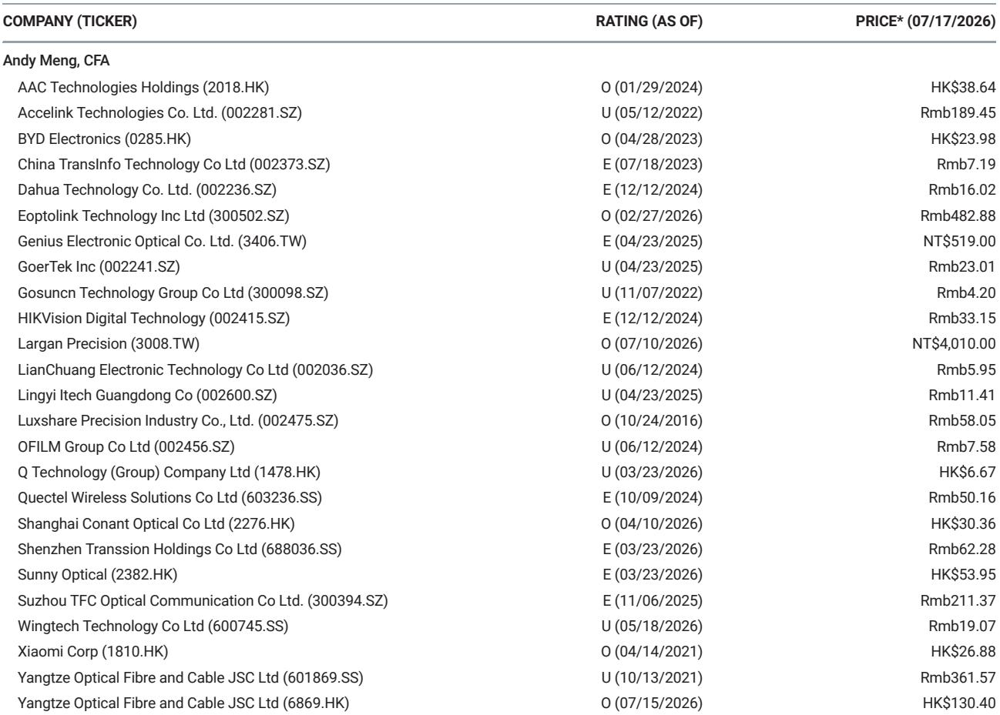
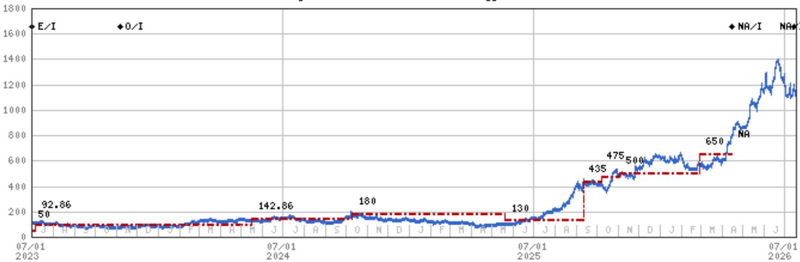
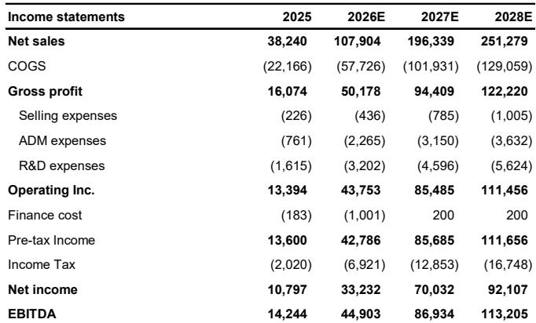

# MS：中际旭创上调预测

这份MS研报的核心判断，不是中际旭创某个季度超预期，而是整个AI光模块产业的需求曲线正在被重新定义。报告将2027年AI光模块行业出货量预测从7100万只大幅上调至1.41亿只，2028年从8000万只上调至1.5亿只。这意味着行业总市场规模预计从2025年的180亿美元增长到2028年的1020亿美元，三年扩张超过4倍。驱动这一轮上调的，不是某个单一客户加单，而是三种网络架构——scale-out、scale-up、scale-across——同时放量带来的叠加效应。

## 1. 1.6T的放量节奏是预测上调的核心变量

报告对2027和2028年的预测大幅上调，主要源于对1.6T光模块需求的更乐观判断。从收入结构看，中际旭创的1.6T产品收入预计从2025年的63亿元跃升至2026年的576亿元，占比从17%升至53%，到2027年进一步达到1281亿元、占比65%。这意味着1.6T将从2026年起成为公司相对主力产品，而800G则在2025年见顶后逐步退居次位。报告认为，1.6T的加速采用与三种网络架构的广泛部署直接相关——超大规模集群的scale-out、节点内互联的scale-up、以及跨数据中心互联的scale-across，三者共同拉动了对高速光模块的需求。

> **KC评论：** 这里容易被忽略的是，1.6T的放量不是简单的“速率升级”，而是网络架构从集中式向分布式演进的必然结果。三种架构同时扩张，意味着光模块的用量密度在提升，而不仅仅是单价的提升。

## 2. 中际旭创的竞争优势体现在三个时间维度

报告认为，中际旭创的核心壁垒不是某款产品领先，而是“time-to-market、time-to-volume、time-to-cost”三个维度的系统性能力。作为800G和1.6T商业化的先行者，公司与全球云服务商的长期合作关系、联合研发深度以及差异化新产品导入能力，使其在良率爬坡和成本下降速度上持续领先同行。报告进一步指出，这种能力有望延续到下一代3.2T产品。此外，近封装光学和光路交换等新技术，可能成为2027年之后的新增长动力，而中际旭创在这些领域也已布局。

## 3. 盈利预测的大幅上修反映的是行业逻辑变化

报告将2026年和2027年的净利润预测分别上调33%和180%，对应2026-2028年收入复合增长率53%、盈利复合增长率66%。这一调整的幅度远超季度业绩超预期的幅度——1Q26净利润57亿元，比报告原预测高出31%。真正驱动预测上修的，是行业需求曲线本身的抬升，而非单季度波动。报告同时上调了毛利率预测0.9-3.1个百分点，反映高端产品占比提升带来的结构性改善。

## 4. 观察提示中值得关注的三个维度

报告列出了三项主要不确定性：共封装光学颠覆的时间与程度、竞争强度与客户多元化、地缘政治与供应链波动。其中，CPO的潜在影响是市场长期关注的焦点。报告认为，近封装光学的成功可能缓解市场对CPO颠覆的担忧——这意味着技术路线本身仍在演进，而非单一方向。竞争方面，随着1.6T市场放量，其他厂商的追赶速度将是一个需要持续跟踪的变量。

这份报告的核心价值不在于给出了更高的数字，而在于揭示了需求结构的变化——当三种网络架构同时扩张时，光模块行业的增长逻辑从“跟随算力研究”转向“支撑算力架构本身”。对于关注AI基础设施的读者来说，这是一个值得重新审视的框架。

For informational purposes only. Portions may be generated,translated,summarized,or edited with AI assistance based on source materials and may contain omissions or errors. Please verify independently. This is not investment,legal,tax,accounting,or other professional advice.

For informational purposes only. Portions may be generated,translated,summarized,or edited with AI assistance based on source materials and may contain omissions or errors. Please verify independently. This is not investment,legal,tax,accounting,or other professional advice.

