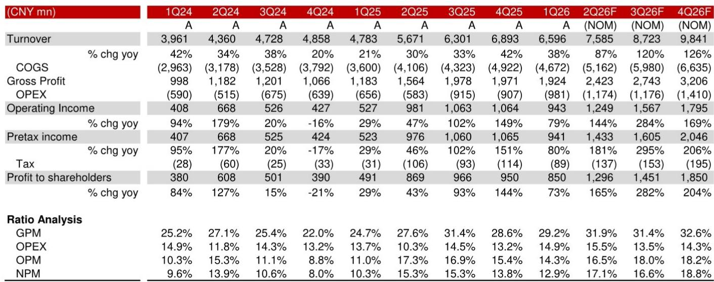
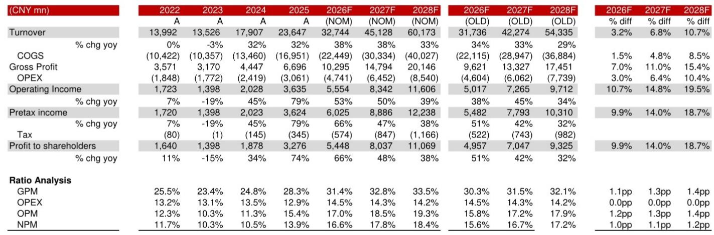
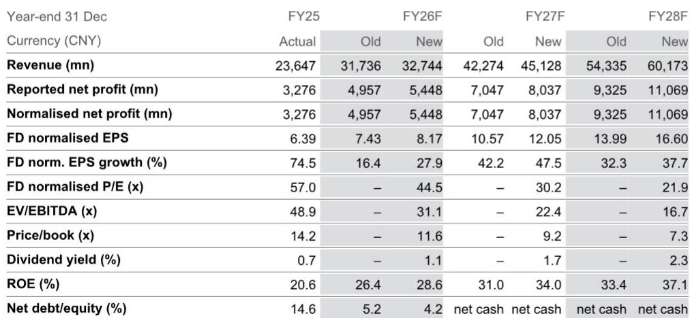

# The AI Infrastructure Supply Chain Is Shifting From GPU Assembly to Advanced Substrates, and Shennan Circuits Is Positioned at the Center of That Transition

On July 14, 2026, Shennan Circuits (SCC) issued a profit alert for the first half of the year that rewrote the earnings trajectory for China's printed circuit board (PCB) and IC substrate sector. Net profit for 1H26 was guided at CNY 2.1 billion to 2.3 billion, representing a 54% to 69% year-over-year increase. The second quarter alone is expected to deliver CNY 1.25 billion to 1.45 billion in net profit, a 44% to 67% increase from the prior year and a 47% to 71% sequential jump from Q1. This is not a cyclical uptick. It is a structural acceleration driven by three simultaneous demand waves: AI server PCB, high-speed optical transceiver upgrades, and memory-driven IC substrate loading.

The critical insight for observers is that SCC's performance is no longer tied to broad electronics demand or smartphone replacement cycles. The company has become a direct beneficiary of China's domestic AI infrastructure buildout, a theme that is only now entering its most capital-intensive phase. The report projects a 43% earnings CAGR from FY26 to FY28. The valuation multiple has been raised to 43x FY27 EPS, reflecting not just higher earnings but a reassessment of the quality and durability of those earnings.

What makes this moment different from prior PCB upcycles is the product mix shift. SCC is not merely selling more boards; it is selling more of the highest-value boards into the fastest-growing end markets. The gross margin trajectory tells the story: from 28.3% in FY25 to a projected 33.5% by FY28. That is a 520-basis-point expansion driven entirely by the composition of revenue, not by volume alone. The argument of this article is that SCC's product mix upgrade, particularly into ABF substrate and high-end optical transceiver PCB, creates a durable competitive moat that most peers cannot replicate, and that the market has not fully priced in the multi-year revenue compounding from the Wuxi capacity expansion.

## Three End-Market Vectors Are Converging to Drive a 40% PCB Revenue CAGR Through FY28

The PCB segment is the largest contributor to SCC's revenue, accounting for an estimated 69% of total revenue by FY28. The report forecasts a 40% revenue CAGR for this segment from FY26 to FY28. That is not a single-product story. It is the simultaneous acceleration of three distinct demand vectors, each with its own growth driver and each reinforcing the others.

The first vector is optical transceivers. SCC is a key supplier to domestic optical module customers, and the industry is in the early stages of a major upgrade cycle from 800G to 1.6T transceivers in 2026 and 2027. These higher-speed modules require more layers, tighter tolerances, and better signal integrity from the PCB substrate. SCC's established relationship with domestic transceiver manufacturers gives it an incumbency advantage that new entrants cannot easily replicate. The upgrade cycle alone could sustain elevated demand for 18 to 24 months.

The second vector is AI servers. China's accelerated AI investment cycle is driving demand for high-layer-count, high-reliability PCBs that can handle the power and thermal demands of GPU clusters. SCC has demonstrated strong execution in this segment, and its capacity allocation is increasingly tilted toward server-class products. The constraint here is not demand but capacity, which is why the Wuxi project is strategically critical.

The third vector is network switches. As data centers upgrade to higher-speed switching fabrics, the PCB requirements become more stringent. SCC's ability to serve all three segments simultaneously creates a diversification benefit that reduces revenue volatility. When one segment faces a temporary pause, the others can compensate. More importantly, the technical skills required to serve one segment transfer directly to the others, creating a learning curve advantage that compounds over time.

The so-what for observers is that PCB revenue growth at this rate is not extrapolable from historical trends. It requires both end-market expansion and market share gains. SCC is achieving both because its product positioning aligns with the most demanding customers in the fastest-growing segments.

## BT Substrate Demand Is Solid but Pricing Dynamics Are Shifting, While ABF Substrate Represents the Longest-Duration Growth Option

The IC substrate segment is smaller than PCB in revenue contribution, projected at 19% of total revenue by FY28, but it carries outsized strategic importance. This segment is expected to deliver a 38% revenue CAGR over FY26 to FY28, and within it, the distinction between BT substrate and ABF substrate matters enormously.

BT substrate is the established business. Demand from memory customers remains solid, and utilization rates have improved, driving margin expansion. Management has indicated that there is potential room to raise prices in response to upstream material cost increases. This is a positive signal because it suggests that SCC has sufficient pricing power to pass through input cost inflation without sacrificing volume. However, the report also notes that pricing pressure exists in the BT substrate market. The competitive dynamics are such that sustained price increases are unlikely. The margin improvement in BT substrate will come primarily from mix and utilization, not from repricing.

ABF substrate is the higher-stakes opportunity. SCC can currently produce 20-plus layer ABF substrates, and management has stated that the company is on track to narrow its loss margin in this segment. The losses are a function of early-stage production, low yields, and high depreciation. As volumes scale and yields improve, the segment should transition from a drag on overall profitability to a contributor. The report's revenue revisions for the IC substrate segment imply that this transition is already underway.

The strategic significance of ABF substrate extends beyond SCC's financials. In China, the domestic supply of advanced ABF substrates is extremely limited. Most of the supply comes from Japanese, Korean, and Taiwanese manufacturers. SCC's ability to produce 20-plus layer products positions it as a domestic alternative for Chinese AI chip and memory customers who face supply chain security considerations. This is not a near-term revenue driver; it is a multi-year structural growth option that becomes more valuable as China's domestic semiconductor ecosystem matures.

## The Capacity Calculus: Wuxi Investment Transforms a Constraint Into a Competitive Advantage

SCC faces a constraint that is common among high-end PCB manufacturers: capacity is limited, and building new capacity requires significant capital and time. Management began a new project in Wuxi earlier this year, targeting an investment of CNY 4.6 billion. This is not an incremental expansion. It is a strategic bet that the demand surge for high-end PCB is structural, not cyclical.

The report's revenue forecasts imply that this capacity will be absorbed quickly. Revenue is projected to grow from CNY 23.6 billion in FY25 to CNY 60.2 billion in FY28, a compound annual growth rate of approximately 36%. That kind of growth cannot be achieved without capacity expansion. The Wuxi project is the enabler.

The capital expenditure profile supports this interpretation. Capex was CNY 3.8 billion in FY25 and is projected at CNY 3.5 billion in FY26, declining to CNY 2.9 billion by FY28. The front-loaded spending pattern suggests that the Wuxi facility will come online during FY26 and FY27, with the bulk of the revenue contribution occurring in FY27 and FY28. Free cash flow turns significantly positive in FY26, reaching CNY 3.3 billion, and grows to CNY 9.3 billion by FY28. The net debt position shifts to net cash by FY27.

The so-what is that SCC is entering a phase where the capital intensity of growth declines even as revenue accelerates. This is the hallmark of a company that has completed its capacity buildout and is now harvesting the returns. For observers, the transition from negative to positive free cash flow, combined with a declining net debt-to-equity ratio, reduces the risk profile of the company. The stock is not just an earnings growth story; it is also a balance sheet improvement story.

## A Decision Framework for Evaluating SCC's Risk-Reward Profile

The report identifies three primary downside risks: delay in AI infrastructure investment, further US sanctions on Chinese telecom value chain companies, and intensified competition in the domestic PCB market. These risks are real, but they can be assessed systematically using a decision framework that weighs probability against impact.

The first risk, delay in AI infrastructure investment, is the most consequential. If China's AI buildout slows, the demand for AI server PCB and high-speed switch PCB would decline. However, the probability of a broad slowdown is low given the policy priority that the Chinese government has placed on AI and semiconductor self-sufficiency. A more likely scenario is a temporary pause in specific projects, which would affect timing but not the overall trajectory. SCC's diversified exposure across optical transceivers, servers, and switches provides a buffer against any single vertical's slowdown.

The second risk, US sanctions, is binary and difficult to predict. Further restrictions on Chinese telecom equipment companies could disrupt SCC's customer relationships in the telecom segment. However, SCC's revenue mix is shifting toward AI and data center applications, which are less exposed to telecom-specific sanctions. The company's growing domestic customer base in AI chips and memory also reduces its dependence on export-oriented demand. The risk is real but partially hedged by the ongoing revenue mix shift.

The third risk, intensified competition, is the most manageable. The high-end PCB and IC substrate markets require significant capital investment, technical expertise, and customer qualification cycles that can take years. New entrants face high barriers to entry. Existing competitors may add capacity, but the demand growth is sufficient to absorb that capacity without triggering price wars. The report's gross margin projections imply that pricing remains rational.

The framework for decision-making is straightforward. If an observer believes that China's AI infrastructure buildout will continue at its current pace or accelerate, SCC offers a high-conviction exposure to the most value-dense part of the supply chain. If an observer is concerned about sanctions or policy risk, the position should be sized accordingly, but the fundamental thesis does not depend on a benign policy environment. It depends on demand for advanced substrates, which is driven by technology cycles that are largely independent of trade policy.

The earnings CAGR of 43% through FY28, the transition to net cash, and the gross margin expansion from 28.3% to 33.5% all point in the same direction: SCC is not just riding a wave; it is building a structural advantage that will persist even after the current investment cycle matures. The stock trades at 30x FY27 EPS, which is a discount to the implied CAGR. That is the arithmetic of the opportunity.

*For informational purposes only. Portions may be generated, translated, summarized, or edited with AI assistance based on source materials and may contain omissions or errors. Please verify independently. This is not professional advice.*

For informational purposes only. Portions may be generated, translated, summarized, or edited with AI assistance based on source materials and may contain omissions or errors. Please verify independently. This is not professional advice.

