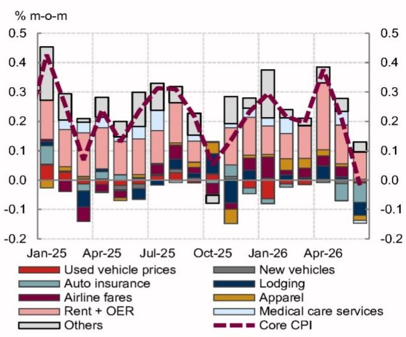
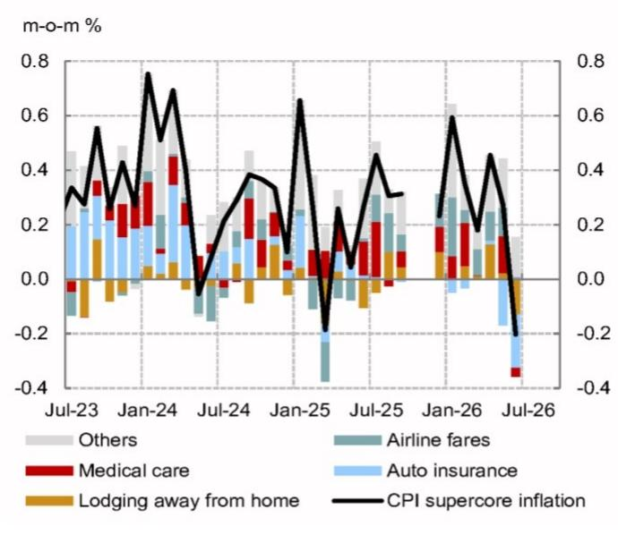
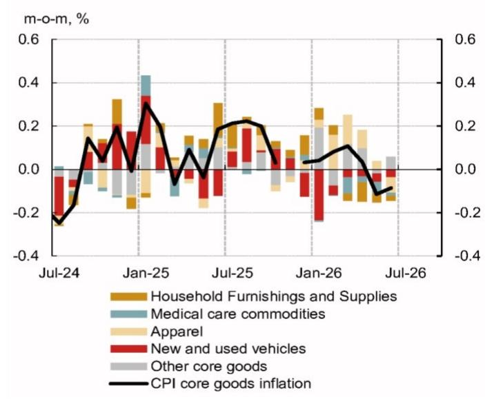
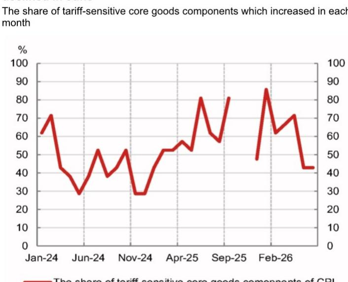
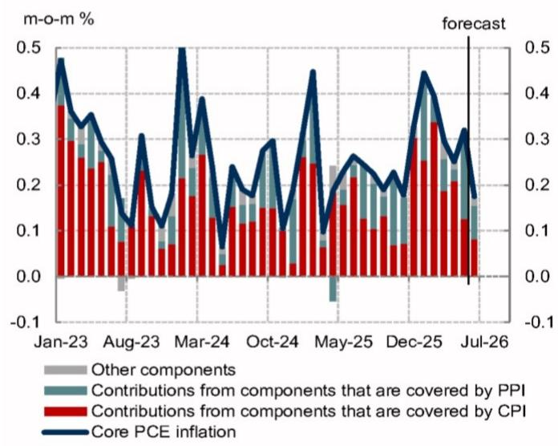
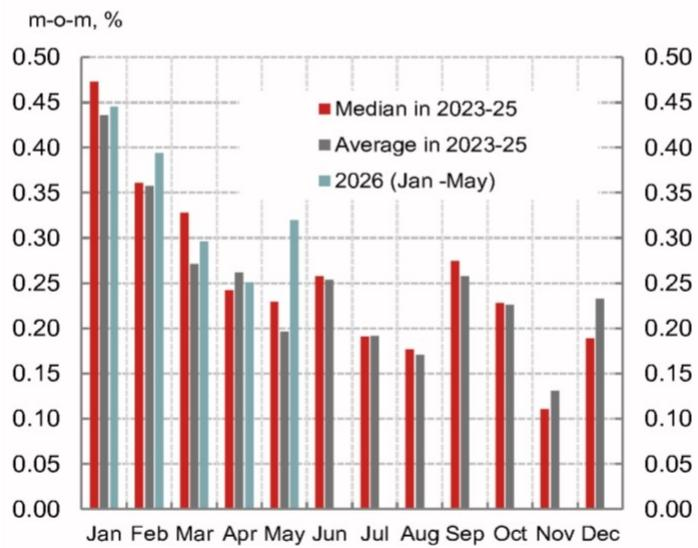

## 近期宏观环境观察：通胀数据与政策动向

- 近期通胀数据整体低于预期。我们下调了对6月核心PCE的月度环比预估，从此前的0.271%调整至0.175%。我们维持核心PCE已见顶并在下半年逐步回落的判断。

- 本周官员发言观点不一，但多数重申了短期内维持利率不变的立场。主席在国会听证中关注人工智能对价格的长期影响，态度偏宽松。而部分鹰派官员则继续主张适度收紧。

## 研究分析师

北美宏观研究团队

Aichi Amemiya - NSI
aichi.amemiya@NOM.com
+1 212 667 9347

Jeremy Schwartz - NSI
jeremy.schwartz@NOM.com
+1 212 667 9637

Ruchir Sharma - NSI
ruchir.sharma@NOM.com
+1 212 667 9186

- 经济增长保持韧性，零售数据显示消费稳健，尽管面临外部因素影响，三个月平均实际零售额仍升至2025年4月以来最高水平。

6月CPI和PPI数据显示核心PCE明显放缓

总体来看，通胀数据低于预期。我们将6月核心PCE月度环比预测从此前的0.271%下调至0.175%，折合年率约为2%。

图1：6月核心CPI通胀低于预期 月度核心CPI通胀分解  
  
注：对于2025年10月不可用的CPI分项，我们假设基于调查的分项未经季节性调整无通胀，但进行了季节性调整。

图2：6月超级核心CPI通胀大幅下降 月度超级核心CPI通胀分解  
  
来源：BLS, Haver, NOM

6月核心CPI环比下降0.017%（NOM预测：0.215%；市场共识：0.2%），为2020年5月以来首次月度下降（图1）。下行意外主要集中在服务业，超级核心通胀自2025年3月以来首次转负（图2）。汽车保险、住宿和机票等波动较大的分项明显走弱，表明临时因素放大了放缓幅度。酒店价格下降可能反映了此前世界杯相关需求提振后的回调。

尽管半导体短缺，消费电子价格压力仍然可控。家电、鞋类等受关税影响较大的分项价格下降（图4），医疗保健商品价格连续第六个月下降。

图3：核心CPI商品通胀如预期保持负值 月度核心CPI商品通胀分解  
  
来源：BLS, Haver, NOM

图4：6月超过一半的关税敏感CPI分项下降  
  
关税敏感核心商品CPI分项月度上涨比例  
注：该图显示了21个最受关税影响的CPI分项（如新车、行李箱、家电、鞋类、服装和乐器）中每月上涨的比例。  
来源：BLS, Haver, NOM

PPI数据表现不一。金融服务通胀低于预期，而医疗保健和运输服务则强于预期。总体而言，对我们核心PCE预测的净影响有限。

展望未来，我们预计关税效应减弱和季节性因素将使核心PCE通胀保持逐步下行的路径（图5和图6）。我们维持年底核心PCE同比通胀率在当前方法下放缓至3.2%的预期（计划中的方法调整可能进一步将其降至约3.0%）。月度核心PCE环比0.2%的读数将表明在实现政策目标方面取得进一步进展，并应降低短期内调整利率的可能性。

图5：6月核心PCE通胀可能大幅放缓至月度环比0.175% 按数据来源分解的月度核心PCE通胀  
  
来源：BLS, BEA, Haver, NOM

图6：下半年月度核心PCE通胀往往受到负向季节性因素影响 过去三年月度核心PCE通胀中位数和均值 vs. 2026年  
  
来源：BEA, Haver, NOM

## 官员发言存在分歧但指向短期按兵不动

本周官员的评论表明，多数决策者对短期内维持利率不变感到满意。

主席在首次国会听证中未就短期政策前景发表评论，但其发言凸显了偏宽松的倾向。他重申人工智能中期内应具有抑制通胀的作用，并认为相关资本支出只会产生一次性价格冲击。他继续强调对供给侧扩张及其对通胀影响的乐观看法。主席还表示不再依赖截尾均值通胀指标，并建议数据工作组将考虑包括私营部门价格数据在内的替代指标。

主席重申了缩减资产负债表的偏好，并继续暗示这可能导致更宽松的利率政策。他认为官员应关注货币总量，并指出货币供应指标可能有助于识别2021年的通胀风险。主席进一步表示，资产负债表决策应作为委员会政策事项，并“提前充分”沟通，而非作为委托给纽约联储的技术职能。

其他官员，如纽约联储主席、理事和副主席，似乎对观望态度感到满意。在6月CPI报告发布前，一位理事对通胀风险持谨慎态度，并表示政策决策应基于即将公布的通胀数据。我们认为6月CPI和PPI报告可能使其在7月会议上保持按兵不动。多数中间派官员似乎对维持现状感到满意，因为他们预计未来将出现逐步的通胀回落。

相比之下，几位官员仍持鹰派立场。达拉斯联储主席认为人工智能相关需求“已经存在”并增加了通胀压力。堪萨斯城联储主席表示其“关注点仍在通胀，以制定正确的政策方向”，而克利夫兰联储主席则认为政策目标之间不存在冲突，并认为可能需要进一步行动来抑制通胀。

关于工作组的未来工作，官员发言显示委员会内部存在一些分歧。一位理事提议对点阵图进行一些修改，但认为中位数点阵图是讨论政策立场的有用基准。另一位主席认为发布经济展望是良好的沟通实践。此外，有官员呼吁将食品分项纳入核心通胀，而主席则表示数据来源工作组将讨论如何衡量通胀趋势。

## 增长数据保持积极

增长数据继续指向经济活动具有韧性。6月零售销售环比增长0.2%，前几个月数据上修。剔除汽油后，支出保持稳健，根据我们对零售平减指数的估算，实际零售销售环比增长1.3%，使三个月均值升至2025年4月以来较强水平。

7月褐皮书描绘了类似图景，消费者支出保持韧性。值得注意的是，与之前报告相比，提及高低收入家庭分化的次数减少。总体而言，数据表明尽管面临外部因素影响，消费仍保持稳健。我们将第二季度GDP跟踪预测从上周的2.3%上修至2.9%（季调年化）。我们对面向国内私人购买者的实际最终销售的预测为3.4%，高于此前的2.9%。

## 数据预览

## 未来一周展望

我们预计6月新屋销售速度将上升，而调查数据可能指向7月活动稳健。

失业金申请（周四）：本周初请和续请失业金人数均下降。总体而言，申请数据近期呈下降趋势并保持低位，表明裁员较少，劳动力市场具有韧性。

标普PMI（周五）：7月标普制造业PMI初值可能回升。迄今发布的地区调查显示制造业活动继续以稳健步伐扩张，需求指标有所改善。价格指数可能仍处高位。

标普服务业PMI初值可能保持在扩张区间。纽约联储7月服务业调查指向活动反弹。我们预计就业指数将回到扩张区间，与其他调查一致。

新屋销售（周五）：我们预计6月新屋销售速度将从5月的58万套小幅上升至60万套。新屋销售在过去两个月大幅下降，可能受到外部因素相关不确定性和抵押贷款利率上升的影响。我们预计部分负面影响将在6月逆转。

图7：7月20日当周经济指标预测

<table><tr><td colspan="2">7月20日 周一</td><td>单位</td><td>周期</td><td>前值2</td><td>前值1</td><td>最新</td><td>NOM</td><td>共识</td></tr><tr><td></td><td>无重要指标发布</td><td></td><td></td><td></td><td></td><td></td><td></td><td></td></tr><tr><td colspan="2">7月21日 周二</td><td></td><td></td><td></td><td></td><td></td><td></td><td></td></tr><tr><td></td><td>无重要指标发布</td><td></td><td></td><td></td><td></td><td></td><td></td><td></td></tr><tr><td colspan="2">7月22日 周三</td><td></td><td></td><td></td><td></td><td></td><td></td><td></td></tr><tr><td>7:00</td><td>抵押贷款申请</td><td>% 周环比</td><td>5月22日</td><td>-4.4</td><td>1.7</td><td>-2.3</td><td>不适用</td><td>不适用</td></tr><tr><td>13:00</td><td>20年期国债拍卖</td><td>$十亿</td><td></td><td></td><td></td><td></td><td>13</td><td></td></tr><tr><td colspan="2">7月23日 周四</td><td></td><td></td><td></td><td></td><td></td><td></td><td></td></tr><tr><td>8:30</td><td>初请失业金人数</td><td>千人</td><td>7月18日</td><td>217</td><td>216</td><td>208</td><td>不适用</td><td>不适用</td></tr><tr><td>8:30</td><td>续请失业金人数</td><td>千人</td><td>7月11日</td><td>1806</td><td>1821</td><td>1805</td><td>不适用</td><td>不适用</td></tr><tr><td>13:00</td><td>10年期TIPS拍卖</td><td>$十亿</td><td></td><td></td><td></td><td></td><td>21</td><td></td></tr><tr><td colspan="2">7月24日 周五</td><td></td><td></td><td></td><td></td><td></td><td></td><td></td></tr><tr><td>9:45</td><td>标普制造业PMI</td><td>指数</td><td>7月-初值</td><td>54.5</td><td>55.1</td><td>53.9</td><td>不适用</td><td>不适用</td></tr><tr><td>9:45</td><td>标普服务业PMI</td><td>指数</td><td>7月-初值</td><td>51.0</td><td>50.7</td><td>51.2</td><td>不适用</td><td>不适用</td></tr><tr><td>10:00</td><td>新屋销售</td><td>千套 季调年化</td><td>6月</td><td>664</td><td>626</td><td>580</td><td>600</td><td>600</td></tr><tr><td>10:00</td><td>新屋销售</td><td>% 月环比</td><td>6月</td><td>5.4</td><td>-5.7</td><td>-7.3</td><td>3.4</td><td>不适用</td></tr></table>

注：美国东部夏令时间。所有NOM预测均为众数预测。  
来源：Haver, Bloomberg, NOM

## 美国宏观展望

我们预计政策将无限期保持不变（风险偏向于上调），原因是价格压力持续、劳动力市场稳定以及政治压力减弱。

经济活动：近期增长保持强劲，得益于关税不确定性缓解、财政刺激措施以及宽松金融环境下政策调整的滞后影响。企业投资似乎正在向人工智能以外的领域扩展。尽管外部因素导致能源价格上涨，但消费仍保持韧性，部分原因是退税增加和工资收入强劲增长。非农就业数据波动，但一系列指标指向劳动力市场稳定和初步的重新加速迹象。虽然近期失业率下降是由于一次性因素，但我们预计失业率最终将在年底小幅降至4.1%。由于能源商品在家庭支出中的占比小以及国内能源生产，美国经济相对不受外部因素导致的原油价格冲击影响。

通胀：核心通胀仍远高于2%的目标，风险似乎偏向上行。我们预测2026年第四季度核心PCE同比通胀率为3.3%，但计划中的方法调整可能使其降低约20个基点至3.1%。工资增长正在放缓，关税相关的价格压力正在减弱，但人工智能相关需求强劲和供应短缺可能推高商品通胀。总体而言，我们预计核心PCE通胀将在未来几个月内因油价下降、季节性因素和工资增长放缓而见顶。我们预计租金通胀将继续逐步放缓。

政策：我们预计政策将无限期保持不变。主席可能仍有动力放松政策，但近期通胀读数偏高和鹰派发言表明他可能无法说服多数人支持下调。此外，他可能会鼓励委员会维持利率不变，直到最近宣布的工作组就数据和政策的不同方面提出建议。虽然短期内上调似乎不太可能，但政策制定者对通胀压力的初步迹象反应迟缓，增加了最终可能“落后于曲线”并需要快速上调以重建信誉的风险。风险平衡倾向于收紧。在关税方面，更广泛的豁免、较低的关税税率以及对可负担性的关注表明贸易政策进一步升级有限。我们预计中期选举前不会通过另一项和解方案带来实质性经济刺激。

风险：地缘政治风险的进一步升级可能导致金融状况收紧和财政前景恶化。对委员会成员增加的政治压力可能削弱政策信誉并引发市场剧烈反应。人工智能泡沫破裂可能导致资产估值大幅修正和企业投资减少。持续的存储芯片短缺和外部因素导致的供应链中断可能引发第二轮效应。

图8：美国：预测详情

<table><tr><td>%</td><td></td><td>1Q25</td><td>2Q25</td><td>3Q25</td><td>4Q25</td><td>1Q26</td><td>2Q26</td><td>3Q26</td><td>4Q26</td><td>1Q27</td><td>2Q27</td><td>3Q27</td><td>4Q27</td><td>2025</td><td>2026</td><td>2027</td><td>2025</td><td>2026</td><td>2027</td></tr><tr><td></td><td colspan="19">季环比</td></tr><tr><td rowspan="2">实际GDP</td><td>(%, 年化)</td><td>-0.6</td><td>3.8</td><td>4.4</td><td>0.5</td><td>2.1</td><td>2.7</td><td>2.1</td><td>1.9</td><td>1.9</td><td>1.9</td><td>1.6</td><td>1.6</td><td>2.1</td><td>2.3</td><td>1.9</td><td>2.0</td><td>2.2</td><td>1.8</td></tr><tr><td>(%)</td><td>-0.2</td><td>0.9</td><td>1.1</td><td>0.1</td><td>0.5</td><td>0.7</td><td>0.5</td><td>0.5</td><td>0.5</td><td>0.5</td><td>0.4</td><td>0.4</td><td></td><td></td><td></td><td></td><td></td><td></td></tr><tr><td>个人消费</td><td>(%, 年化)</td><td>0.6</td><td>2.5</td><td>3.5</td><td>1.9</td><td>0.5</td><td>1.7</td><td>1.9</td><td>1.8</td><td>1.7</td><td>1.7</td><td>1.5</td><td>1.5</td><td>2.6</td><td>1.7</td><td>1.7</td><td>2.1</td><td>1.5</td><td>1.8</td></tr><tr><td>非住宅固定投资</td><td>(%, 年化)</td><td>9.5</td><td>7.3</td><td>3.2</td><td>2.4</td><td>10.6</td><td>9.9</td><td>4.5</td><td>3.6</td><td>3.4</td><td>3.1</td><td>2.5</td><td>2.5</td><td>4.1</td><td>6.5</td><td>3.7</td><td>5.6</td><td>7.1</td><td>5.3</td></tr><tr><td>住宅固定投资</td><td>(%, 年化)</td><td>-1.0</td><td>-5.1</td><td>-7.1</td><td>-1.7</td><td>-7.8</td><td>2.5</td><td>3.2</td><td>3.0</td><td>2.8</td><td>2.8</td><td>2.5</td><td>2.5</td><td>-2.2</td><td>-2.5</td><td>2.8</td><td>-3.8</td><td>0.1</td><td>2.9</td></tr><tr><td>政府支出</td><td>(%, 年化)</td><td>-1.0</td><td>-0.1</td><td>2.2</td><td>-5.6</td><td>4.4</td><td>3.2</td><td>0.9</td><td>0.9</td><td>0.9</td><td>0.9</td><td>0.9</td><td>0.9</td><td>1.1</td><td>1.0</td><td>1.1</td><td>-1.2</td><td>2.4</td><td>1.5</td></tr><tr><td>出口</td><td>(%, 年化)</td><td>0.2</td><td>-1.8</td><td>9.6</td><td>-3.2</td><td>10.9</td><td>6.3</td><td>2.3</td><td>2.3</td><td>2.3</td><td>2.3</td><td>2.2</td><td>2.1</td><td>1.6</td><td>4.7</td><td>2.5</td><td>1.1</td><td>5.4</td><td>3.3</td></tr><tr><td>进口</td><td>(%, 年化)</td><td>38.0</td><td>-29.3</td><td>-4.4</td><td>-1.0</td><td>11.8</td><td>15.2</td><td>3.5</td><td>3.3</td><td>2.8</td><td>2.5</td><td>2.3</td><td>2.0</td><td>2.7</td><td>3.2</td><td>3.5</td><td>-1.9</td><td>8.3</td><td>6.1</td></tr><tr><td colspan="20">对GDP的贡献：</td></tr><tr><td>最终销售</td><td>(百分点, 年化)</td><td>-3.2</td><td>7.3</td><td>4.5</td><td>0.3</td><td>1.9</td><td>1.9</td><td>2.0</td><td>1.8</td><td>1.8</td><td>1.8</td><td>1.6</td><td>1.6</td><td>2.2</td><td>2.3</td><td>1.8</td><td>2.1</td><td>1.9</td><td>1.7</td></tr><tr><td>净贸易</td><td>(百分点, 年化)</td><td>-4.7</td><td>4.8</td><td>1.6</td><td>-0.2</td><td>-0.4</td><td>-1.3</td><td>-0.2</td><td>-0.2</td><td>-0.1</td><td>-0.1</td><td>-0.1</td><td>0.0</td><td>-0.2</td><td>0.1</td><td>-0.2</td><td>0.4</td><td>-0.5</td><td>-0.1</td></tr><tr><td>库存</td><td>(百分点, 年化)</td><td>2.6</td><td>-3.4</td><td>-0.1</td><td>0.1</td><td>0.2</td><td>0.8</td><td>0.2</td><td>0.1</td><td>0.1</td><td>0.1</td><td>0.1</td><td>0.0</td><td>-0.1</td><td>0.0</td><td>0.2</td><td>-0.1</td><td>0.3</td><td>0.1</td></tr><tr><td></td><td colspan="19">按说明</td></tr><tr><td>失业率</td><td>(%)</td><td>4.1</td><td>4.2</td><td>4.3</td><td>4.5</td><td>4.3</td><td>4.3</td><td>4.2</td><td>4.1</td><td>4.0</td><td>3.9</td><td>3.9</td><td>3.9</td><td>4.3</td><td>4.2</td><td>3.9</td><td></td><td></td><td></td></tr><tr><td>非农就业</td><td>(千人)</td><td>20</td><td>34</td><td>23</td><td>-39</td><td>73</td><td>111</td><td>90</td><td>120</td><td>100</td><td>90</td><td>90</td><td>90</td><td>10</td><td>99</td><td>90</td><td></td><td></td><td></td></tr><tr><td>新屋开工</td><td>(千套, 年化)</td><td>1397</td><td>1356</td><td>1347</td><td>1323</td><td>1418</td><td>1347</td><td>1430</td><td>1420</td><td>1400</td><td>1390</td><td>1390</td><td>1380</td><td>1356</td><td>1404</td><td>1390</td><td></td><td></td><td></td></tr><tr><td>消费者价格</td><td>(%, 同比)</td><td>2.7</td><td>2.5</td><td>2.9</td><td>2.7</td><td>2.7</td><td>3.8</td><td>3.3</td><td>3.4</td><td>2.9</td><td>1.8</td><td>2.0</td><td>2.0</td><td>2.7</td><td>3.3</td><td>2.2</td><td></td><td></td><td></td></tr><tr><td>核心CPI</td><td>(%, 同比)</td><td>3.1</td><td>2.8</td><td>3.1</td><td>2.7</td><td>2.5</td><td>2.7</td><td>2.4</td><td>2.6</td><td>2.6</td><td>2.4</td><td>2.5</td><td>2.4</td><td>2.9</td><td>2.6</td><td>2.5</td><td></td><td></td><td></td></tr><tr><td>PCE平减指数</td><td>(%, 同比)</td><td>2.6</td><td>2.4</td><td>2.7</td><td>2.8</td><td>3.1</td><td>3.9</td><td>3.7</td><td>3.5</td><td>3.0</td><td>2.1</td><td>2.2</td><td>2.1</td><td>2.6</td><td>3.5</td><td>2.4</td><td></td><td></td><td></td></tr><tr><td>核心PCE</td><td>(%, 同比)</td><td>2.8</td><td>2.7</td><td>2.9</td><td>2.9</td><td>3.1</td><td>3.4</td><td>3.3</td><td>3.2</td><td>2.8</td><td>2.6</td><td>2.5</td><td>2.4</td><td>2.8</td><td>3.3</td><td>2.6</td><td></td><td></td><td></td></tr><tr><td>联邦预算</td><td>(% GDP)</td><td></td><td></td><td></td><td></td><td></td><td></td><td></td><td></td><td></td><td></td><td></td><td></td><td>-5.8</td><td>-6.4</td><td>-6.4</td><td></td><td></td><td></td></tr><tr><td>经常账户余额</td><td>(% GDP)</td><td></td><td></td><td></td><td></td><td></td><td></td><td></td><td></td><td></td><td></td><td></td><td></td><td>-3.7</td><td>-3.4</td><td>-3.2</td><td></td><td></td><td></td></tr><tr><td>美联储证券组合</td><td>($万亿)</td><td>6.32</td><td>6.24</td><td>6.19</td><td>6.15</td><td>6.27</td><td>6.34</td><td>6.42</td><td>6.48</td><td>6.54</td><td>6.60</td><td>6.66</td><td>6.72</td><td>6.15</td><td>6.48</td><td>6.72</td><td></td><td></td><td></td></tr><tr><td>联邦基金利率目标中值</td><td>(%)</td><td>4.375</td><td>4.375</td><td>4.125</td><td>3.625</td><td>3.625</td><td>3.625</td><td>3.625</td><td>3.625</td><td>3.625</td><td>3.625</td><td>3.625</td><td>3.625</td><td>3.625</td><td>3.625</td><td>3.625</td><td></td><td></td><td></td></tr><tr><td>2年期国债回报表现</td><td>(%)</td><td>3.89</td><td>3.72</td><td>3.60</td><td>3.47</td><td>3.79</td><td>4.14</td><td>4.15</td><td>4.10</td><td>4.10</td><td>4.05</td><td>4.00</td><td>3.95</td><td>3.47</td><td>4.10</td><td>3.95</td><td></td><td></td><td></td></tr><tr><td>5年期国债回报表现</td><td>(%)</td><td>3.96</td><td>3.79</td><td>3.74</td><td>3.73</td><td>3.92</td><td>4.19</td><td>4.30</td><td>4.25</td><td>4.25</td><td>4.25</td><td>4.20</td><td>4.20</td><td>3.73</td><td>4.25</td><td>4.20</td><td></td><td></td><td></td></tr><tr><td>10年期国债回报表现</td><td>(%)</td><td>4.23</td><td>4.24</td><td>4.16</td><td>4.18</td><td>4.30</td><td>4.44</td><td>4.60</td><td>4.60</td><td>4.60</td><td>4.60</td><td>4.55</td><td>4.50</td><td>4.18</td><td>4.60</td><td>4.50</td><td></td><td></td><td></td></tr></table>

注：失业率为季度平均值，占劳动力百分比。非农就业为期间平均月度变化。通胀指标和日历年度GDP为同比百分比变化。美联储证券组合为期末值。年度利率预测为期末值。新屋开工为期间平均值。粗体数字为实际值。表格反映截至2026年7月17日的数据。所有NOM预测均为众数预测。  
来源：BEA, BLS, Census Bureau, FRB, Haver, NOM

## 本周回顾

图9：每周数据追踪及其分解  
  
注：我们通过主成分分析估计一个潜在因子，该因子对涵盖工业和消费领域的13个美国日度和周度指标的总方差贡献最大（即第一主成分）。我们将该因子校准为追踪实际GDP的四个季度变化。  
来源：AAR, Baker Hughes, DOL, EIA, EEI, MBA, PolicyUncertainty, Redbook Research, SF Fed, Haver Analytics, NOM

经济洞察 - 美国：评估人工智能对劳动力市场的影响

首要洞察 - 美国：6月PPI数据暗示核心PCE通胀读数温和

经济洞察 - 美国：月度通胀监测

图10：经济数据日历

<table><tr><td></td><td>7月20日 周一</td><td>7月21日 周二</td><td>7月22日 周三</td><td>7月23日 周四</td><td>7月24日 周五</td></tr><tr><td rowspan="2">北美</td><td>美国无重要指标发布</td><td>美国无重要指标发布</td><td>美国无重要指标发布</td><td>美国初请失业金 (7月18日)千人 208, 不适用, 不适用</td><td>美国标普制造业PMI (7月-初值)指数 53.9, 不适用, 不适用</td></tr><tr><td>加拿大核心CPI-截尾 (6月)% 同比 2.0, 不适用, 不适用</td><td></td><td></td><td></td><td>美国标普服务业PMI (7月-初值)指数 51.2, 不适用, 不适用美国新屋销售 (6月)% 月环比 -7.3, 3.4, 不适用</td></tr><tr><td>欧洲 (除英国)</td><td>欧元区建筑产出 (5月)% 月环比 0.6, 不适用, 不适用德国生产者价格 (6月)% 月环比 0.3, 不适用, 不适用</td><td>欧央行银行贷款调查德国ZEW预期 (7月)指数 10.5, 0.5, 不适用德国ZEW现状 (7月)指数 -81.0, -81.0, 不适用</td><td></td><td>欧央行存款利率% 2.25, 2.25, 不适用欧元区消费者信心 (7月-初值)指数 -17.7, -17.4, 不适用法国INSEE商业信心 (7月)指数 94.0, 94.0, 不适用</td><td>欧元区PMI综合 (7月-初值)指数 50.0, 48.4, 不适用德国PMI综合 (7月-初值)指数 49.5, 48.5, 不适用法国PMI综合 (7月-初值)指数 47.2, 46.5, 不适用欧央行CES 3年通胀预期 (6月)% 同比 2.9, 不适用, 不适用德国消费者信心 (8月)指数 -29.2, 不适用, 不适用</td></tr><tr><td>英国</td><td>Rightmove房价 (7
