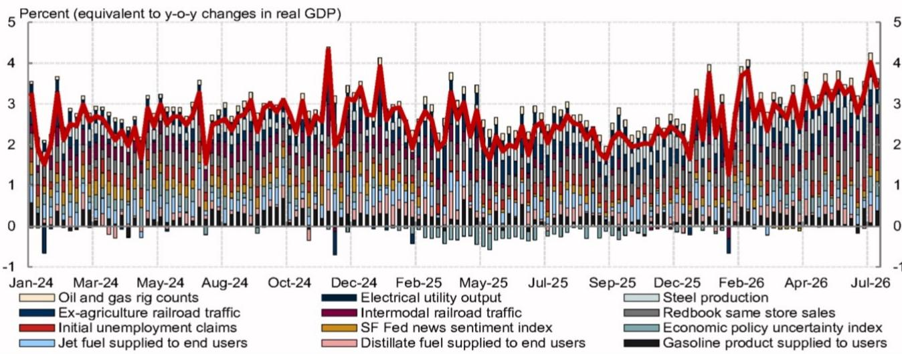
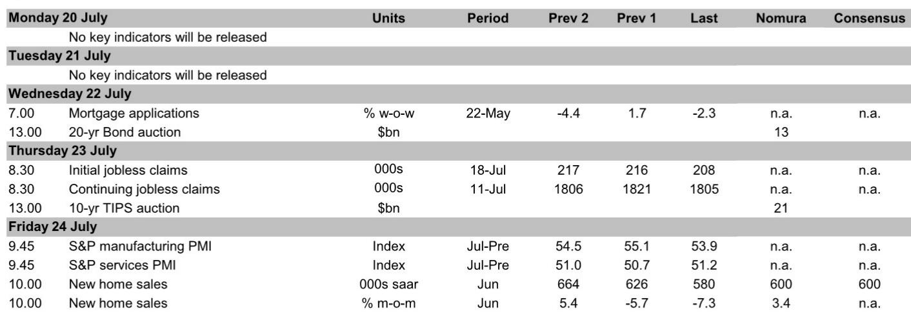
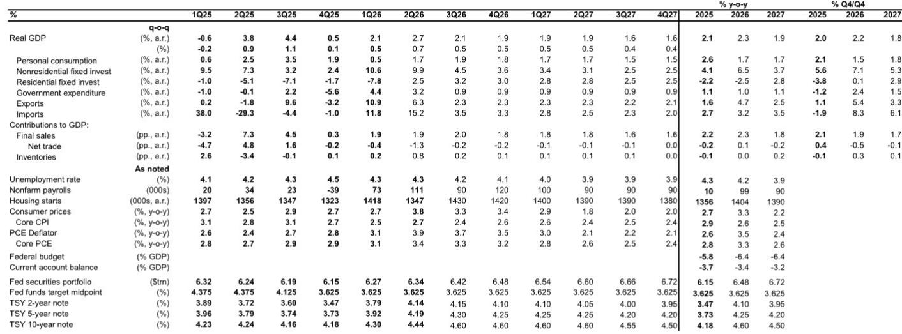

# 通胀降温与增长韧性并存，美联储进入观望模式——但风险平衡仍偏向收紧

美联储正进入一个较长的政策观望期，并非因为通胀已被战胜，而是因为当前数据呈现出相互矛盾的图景，使得鹰派和鸽派都难以占据上风。6月核心PCE通胀月率预计仅为0.175%，较CPI和PPI数据公布前经济学家预期的0.271%大幅下降。这是一年多来的最低月度读数，折合年率约为2%。然而与此同时，实际零售销售飙升至2025年4月以来较强的三个月均值，GDP跟踪预估上调至2.9%，劳动力市场也几乎没有出现裂痕。经济并未迫切要求更宽松的政策，而通胀虽然降温，仍远高于目标。这正是导致无限期观望的成因。

这一时刻的战略意义在于，美联储内部的辩论已不再是短期内是否降息或加息。而是关于一个更重大的问题：央行衡量和解读通胀的框架本身是否正在过时。沃什主席在其首次汉弗莱-霍金斯听证会上表示，将减少对截尾均值通胀指标的依赖，转向包括私营部门价格指数在内的替代数据来源。与此同时，洛根和施密德等鹰派地区联储主席认为，人工智能驱动的需求已经在增加通胀压力。美联储不仅是在等待数据，它正在重新协商哪些数据才是重要的。

对研究者和企业战略制定者的启示是明确的：不要预期今年会降息，也不要认为6月通胀数据走软标志着持续通缩趋势的开始。未来路径是围绕美联储反应函数的高度不确定性，利率风险仍偏向上行。

## 6月通胀数据确实走弱，但部分受波动性类别驱动，这些因素不会重复

6月核心CPI环比下降0.017%，为2020年5月以来首次月度下降，并大幅低于市场预期的0.2%涨幅。超级核心通胀自2025年3月以来首次转为负值。这些并非微不足道的变化，它们将在美联储7月会议中占据重要位置。但下降的构成比整体数字更重要。

下行意外集中在本身波动较大且受一次性因素扭曲的服务类别。汽车保险、外出住宿和机票价格均大幅走弱。酒店价格尤其可能反映了世界杯相关需求推高此前月份价格后的回调。这些并非结构性通缩信号，而是月度波动较大的类别中的均值回归。报告本身也承认“暂时性因素放大了疲软”。单月负值的超级核心通胀并不能确立趋势，尤其是当潜在驱动因素是事件驱动型时。

在商品方面，情况更为一致但仍不明朗。核心商品通胀如预期保持负值，家电和鞋类等关税敏感型商品价格下跌。6月，21个最关税敏感的CPI成分中有超过一半出现下跌。这表明关税上调向消费者价格的传导可能正在见顶甚至逆转，至少目前如此。但医疗保健商品连续第六个月下跌，这一模式早于当前关税制度，反映了医疗保健定价中独立的结构性因素。

总体结论是，6月通胀数据为美联储继续观望提供了掩护，但并未提供降息的理由。月度核心PCE预估为0.175%，与向2%目标进一步迈进一致，但按当前方法，年底核心PCE同比仍预计为3.2%，若应用计划中的方法变更，则约为3.0%。这仍比目标高出100个基点。一个月的疲软数据无法弥合这一差距。

## 美联储内部分歧现在关乎衡量标准，而不仅仅是政策立场

近期美联储官员讲话中最具揭示性的发展，并非鹰派与鸽派在短期利率路径上的分歧，而是关于通胀应如何衡量以及哪些数据应驱动政策决策的新兴分歧。

沃什主席的证词在语气上偏鸽派，在内容上具有战略性。他重申了其观点，即人工智能在中长期内是通缩性的，且人工智能相关资本支出仅产生一次性价格冲击。更重要的是，他不再依赖截尾均值通胀指标（该指标在前任领导下是首选指标），并建议美联储的数据工作组将考虑替代指标，包括私营部门价格数据。这是一个重大的方法论转向。如果美联储转向更广泛或更灵活的核心通胀定义，可能会降低“进展”的门槛，并可能为未来更宽松的政策打开大门。

但沃什也暗示倾向于更小的资产负债表，他认为这可能为更宽松的利率政策创造条件。这是一个微妙但重要的联系：通过更积极地缩减资产负债表，美联储可以创造降息空间，而不会显得在通胀问题上让步。这是为了获得选择权，而非承诺宽松。

另一方面，达拉斯联储主席洛根直接反驳，认为人工智能相关需求“已经存在”并增加了通胀压力。这不是一个理论辩论。如果洛根是正确的，那么人工智能基础设施的资本支出热潮就不是一次性的价格冲击，而是一个持续的需求侧驱动因素，将使商品通胀保持高位。堪萨斯城联储主席施密德更进一步，呼吁将食品成分纳入核心通胀，这将从机制上提高衡量的通胀率，并使宣布胜利更加困难。克利夫兰联储主席哈马克则直言不讳地表示，可能需要进一步行动来遏制通胀。

联邦公开市场委员会不仅在加息还是观望上存在分歧。它在通胀是什么以及如何衡量通胀上存在分歧。这是一个更深层次、更重大的分歧，需要数月而非数周才能解决。

## 增长韧性削弱了预防性宽松的理由

增长方面不支持降息。6月实际零售销售环比增长1.3%，使三个月均值升至2025年4月以来较强水平。7月褐皮书证实消费者支出保持韧性，与以往报告相比，提及高收入与低收入家庭之间分化的次数明显减少。伊朗冲突并未显著影响消费，部分原因是美国经济对原油价格冲击相对不敏感，因为能源商品在家庭支出中占比小，且国内能源产量强劲。

GDP跟踪预估已大幅上调。第二季度预估目前为季调年率2.9%，高于上周的2.3%。对国内私人购买者的实际最终销售（衡量潜在需求的更清洁指标）跟踪值为3.4%。这些数字并不迫切需要货币刺激。如果有什么的话，它们表明经济运行在潜在水平之上，这正是倾向于随时间推移产生通胀上行压力的条件。

劳动力市场进一步强化了这一图景。初请和续请失业金人数呈下降趋势并保持低位，表明裁员很少。非农就业人数虽有波动，但一系列指标指向稳定和初步的重新加速迹象。失业率预计到年底将小幅降至4.1%。劳动力市场趋紧、消费强劲与通胀高于目标的组合，在历史上并非降息的前兆。

## 在无限期观望模式下的定位决策框架

对于投资组合管理者和企业首席财务官而言，关键问题并非美联储是否会在9月或11月降息。而是如何在一个美联储无限期观望、风险偏向收紧、而基础经济数据仍相互矛盾的制度中进行定位。

首先，久期定位应反映这样一个事实：即使增长放缓，美联储的宽松空间也有限。核心PCE通胀率仍远高于目标，联邦公开市场委员会的鹰派将抵制任何预防性降息。长期债券为美联储若因通胀重新加速而被迫加息的风险提供的补偿有限。风险平衡倾向于维持观望或短久期立场。

其次，股票行业配置应青睐具有定价权和国内收入敞口的公司。消费韧性，加上关税相关价格压力的缓解，支持那些无需依赖美联储宽松政策就能维持利润率的面向消费者的行业。相比之下，对利率高度敏感的行业，如房地产和利率敏感型金融股，则面临抵押贷款利率上升和美联储资产负债表策略不确定性的双重逆风。

第三，货币和商品定位应考虑美国增长超过大多数发达经济体，而美联储仍处于观望状态。这种组合通常对美元有利，尤其是如果伊朗冲突使能源价格保持高位，并强化美国作为净能源生产国的贸易条件优势。由此产生的美元走强本身将起到收紧机制的作用，减少美联储采取行动的必要性。

第四，最重要的战略对冲并非针对降息或加息。而是针对美联储衡量框架的制度性转变。如果美联储转向显示更低读数的替代通胀指标，市场将计入更高的降息概率，这可能引发利率反弹和向利率敏感型行业的轮动。相反，如果鹰派成功将核心通胀定义扩大到包括食品或其他成分，市场将重新定价为更紧缩的政策。衡量标准的不确定性本身就是波动性的来源，定位应通过避免对利率路径的集中押注来考虑这一点。

## 最值得关注的风险：美联储落后于曲线

最令人担忧的情景并非美联储过早降息或过晚加息。而是美联储内部关于衡量标准和数据来源的辩论使其陷入不作为，而通胀在表面之下重新加速。报告明确指出了这一风险：“虽然近期加息似乎不太可能，但美联储对通胀压力的初步迹象反应犹豫，增加了其最终可能‘落后于曲线’并需要迅速加息以重建信誉的风险。”

这是最值得关注的尾部风险。6月通胀数据疲软，但由波动性类别驱动。工资、服务业通胀和人工智能相关需求压力的潜在趋势仍不确定。如果未来几个月核心通胀反弹，美联储将面临艰难选择：迅速采取行动加息（这将冲击已消化长期观望预期的市场），或延迟行动并冒失去信誉的风险。任何一种结果都具有破坏性。

正如报告所述，风险平衡“偏向于收紧”。这是战略规划中最重要的一句话。无限期观望模式并非稳定均衡。这是一个可能向任一方向打破的暂停。审慎的做法是为下一次行动是加息而非降息的可能性做好准备，并据此进行定位。

*仅供参考。部分内容可能基于源材料通过人工智能辅助生成、翻译、总结或编辑，可能包含遗漏或错误。请独立核实。这不构成投资、法律、税务、会计或其他专业建议。*

仅供参考。部分内容可能基于源材料通过人工智能辅助生成、翻译、总结或编辑，可能包含遗漏或错误。请独立核实。这不构成投资、法律、税务、会计或其他专业建议。

