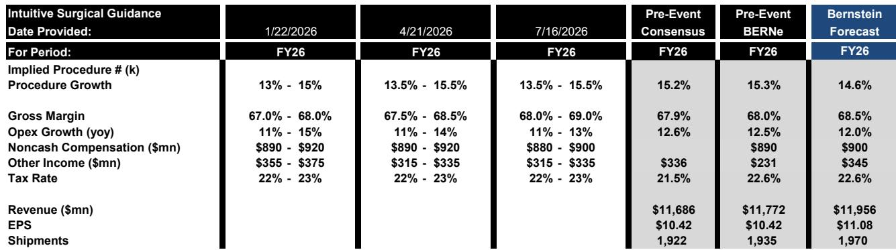
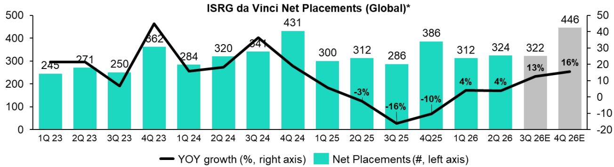
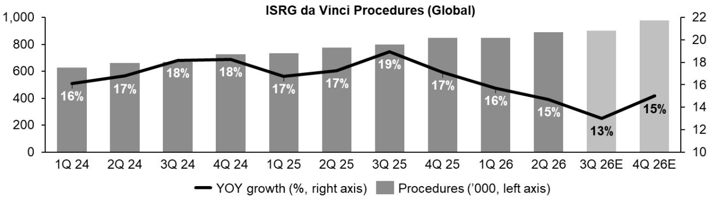

# 市场对直觉外科美国手术量增速放缓的反应或过度

直觉外科在2026年第二季度交出了一份稳健的财务报告，营收增长19%至28.9亿美元，超出市场预期2.5%；每股收益增长28%至2.80美元，超出预期近12%。然而，公司股价在盘后交易中下跌约11%。这种紧张关系并非源于疲软业绩与强劲预期之间的落差，而是单一指标与其他所有指标之间的分歧。美国达芬奇手术量增速从上一季度的13.5%放缓至11.5%，低于市场预期170个基点，管理层将全年指引区间13.5%-15.5%的中值作为参考。这一实际上的指引下调，叠加两天前HCA发布报告引发的对医院使用率的担忧，触发了超预期的抛售。

市场正在将暂时的、政策驱动的逆风与结构性增长天花板混为一谈。增速放缓是事实，但原因比数字本身更重要。直觉外科将环比200个基点的放缓主要归因于ACA计划参保人数下降，原因是增强型保费补贴到期。这是需求端的提前释放与回调，而非市场饱和的信号。其余部分归因于“大数定律”，这一表述历史上曾引发读者对市场渗透率上限的担忧。但直觉外科自身的手术量数据、创新管线以及总可及市场模型表明，美国市场的机会依然深厚且持久。

读者现在面临一个选择：接受增速放缓是优质增长终结的开始这一叙事，或者认识到当前低于400美元的入场点提供了一个难得的机会，可以以多年来未曾出现的估值水平，拥有一个持续创新的成长故事。

## 200个基点的放缓由ACA参保人数驱动，而非市场饱和

本季度最重要的解读问题是，美国手术量增速放缓是结构性的还是周期性的。证据明确指向后者。直觉外科管理层明确表示，主要驱动因素是ACA增强型保费补贴到期，导致参保人数减少，部分患者推迟非紧急手术。三个具体手术类别导致了放缓：良性子宫切除术、部分疝气修复术和部分胆囊切除术——这些手术的症状较轻，临床上是可推迟的。

这种模式与需求冲击一致，而非渗透率上限。减重手术在本季度因GLP-1药物使用增加而出现高个位数下降，但并非环比放缓的主要因素，因为该类别上一季度已下降10%。放缓的手术恰恰是对保险覆盖范围和自付费用变化最敏感的类别。管理层在后续沟通中指出，被推迟的病情通常会进展并最终需要治疗，他们预计这些病例会回归。这不是猜测——这是美国医疗体系此前覆盖中断事件中观察到的模式。

关于“大数定律”的评论，虽然让读者感到不安，但管理层将其定位为次要因素，而非主要解释。在后续对话中，团队强调他们无意让这一表述主导叙事。两年累计的手术量增长趋势讲述了一个更稳定的故事：美国达芬奇手术量从第一季度到第二季度的两年累计增速仅从26.4%放缓至25.8%，远不如环比200个基点的标题数字那样剧烈。

## 美国总可及市场依然广阔，直觉外科正在积极拓展

认为直觉外科在美国市场空间有限的担忧，并未得到公司自身市场模型工作或本季度手术量增长数据的支持。管理层指出了至少五个仍处于早期或中期渗透阶段的增长方向。

第二季度，非工作时间手术量增长26%，直觉外科继续与医院合作，在非高峰时段利用现有系统容量。这是一个轻资本的增长驱动因素，无需额外投放即可提高系统利用率。良性妇科手术——包括骶骨固定术、子宫内膜异位症手术、卵巢切除术和肌瘤切除术——在美国第二季度增长19%，公司正在投入额外的临床资源支持这一类别。高增长的良性普外科手术，如前肠、胃切除术和HPB手术，第二季度合计增长16%。

除了这些已确立的类别，直觉外科还强调了几个可能在未来几年加速发展的早期机会：门诊手术中心渗透、心脏手术应用以及保留乳头乳房切除术。公司还指出，正在开发其他尚未准备好讨论的手术机会。每一个都代表着独立于当前核心手术基础的多年增长跑道。

装机基础动态也很重要。美国达芬奇平均使用率在第二季度增长3%，部分原因是使用率更高的达芬奇5系统占比增加。随着装机基础向能力更强的平台转变，即使手术量增速放缓，单次手术收入也可能增加。这就是直觉外科在第一季度引入的“创新驱动收入增长”概念：手术量是一个杠杆，但单次手术价值正成为另一个杠杆。

## 国际手术量增长加速，收入基础多元化

在美国手术量放缓的同时，国际达芬奇手术量在第二季度增长20%，印度、意大利、中国台湾和英国表现尤为强劲。中国和日本的增长略高于全球平均水平，但两个市场都面临各自独特的挑战。

中国市场因招标活动减少、国内机器人竞争加剧以及政策驱动的定价压力而仍具挑战性。然而，直觉外科正在推进SP和达芬奇5的绿色通道审批流程，这将为中国客户带来差异化能力。日本市场此前因资本投放减少而影响手术量，但6月1日生效的新支持政策包括额外手术的报销以及提高使用率项目的经济激励。管理层对这些举措的初步反应表示乐观。

印度也在本季度获得了达芬奇5的批准，打开了一个庞大且渗透率不足的市场。国际机会并非安慰奖——它是一个重要的增长引擎，在全球手术量和收入中的占比正在上升。随着国际采用加速，公司对单一市场政策动态的依赖度降低。

## 创新管线持久，覆盖多个增长周期

直觉外科维持高于市场增长的能力，取决于其保持产品和手术创新引擎运转的能力。2026年第二季度的证据表明，这一引擎在多个时间周期内都在高效运转。

短期内，达芬奇5、Ion、SP和XiR正在推动采用和系统投放。公司本季度出货468套达芬奇系统，超出预期5.4%。向使用率更高的达芬奇5系统转变正在提高平均使用率，并支持服务收入增长21%。My Intuitive+，公司的数字平台，正在增加单次手术价值并深化医院参与度。

中期内，直觉外科正在开发达芬奇5用户界面更新、成像升级和扩展使用器械，这些将增强现有系统的能力。这些软件驱动的改进可以延长装机基础的使用寿命，同时在不需新资本投放的情况下产生增量收入。

长期来看，公司已提交了针对胃肠道手术的新型柔性内窥镜系统的510(k)申请。这代表着向新手术类别的潜在扩展，可能打开一个巨大的额外可及市场。胃肠道内窥镜市场规模庞大、分散，目前由传统柔性内窥镜平台主导。如果直觉外科能将机器人精度带入这一领域，机会集将显著超出当前手术核心。

## 评估当前入场点的决策框架

对于在目前低于400美元的价格评估直觉外科的读者来说，决策归结为三个可以通过可观察数据而非叙事猜测来回答的问题。

首先，美国手术量增速放缓是结构性的还是周期性的？来自手术量数据、管理层评论和两年累计趋势的证据支持周期性解释，由ACA参保人数动态驱动。放缓的手术是可推迟且对保险敏感的。潜在的疾病负担没有改变。此前覆盖中断事件的历史模式是，被推迟的病例会回归。

其次，公司是否有足够的增长杠杆来抵消ACA逆风？答案是肯定的，涉及多个维度：非工作时间手术、良性妇科、良性普外科、ASC扩张、心脏手术、国际市场以及创新驱动的单次手术收入。没有单一杠杆需要具有变革性；组合创造了韧性。

第三，当前估值相对于增长轨迹是否合理？在明显回落后约360美元的价格下，前瞻市盈率将接近市场整体水平，而公司每股收益增长约20%，且盈利预期在本季度后上调了4%。即使由于第三季度是全年最难的比较期，市盈率在短期内进一步压缩，业务的基本盈利力量仍在持续累积。

市场正在定价这样一种情景：美国手术量增长继续放缓至个位数，国际增长令人失望，创新管线未能带来增量价值。2026年第二季度的证据不支持这一情景。它支持的是，一个暂时性政策逆风叠加在一个基本面强劲的业务上，该业务仍处于数十年手术采用周期的早期到中期阶段。

*仅供参考。部分内容可能基于源材料通过AI辅助生成、翻译、总结或编辑，可能存在遗漏或错误。请独立核实。本文不构成专业建议。*

仅供参考。部分内容可能基于源材料通过AI辅助生成、翻译、总结或编辑，可能存在遗漏或错误。请独立核实。本文不构成专业建议。

