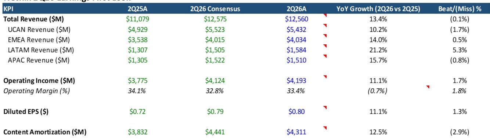
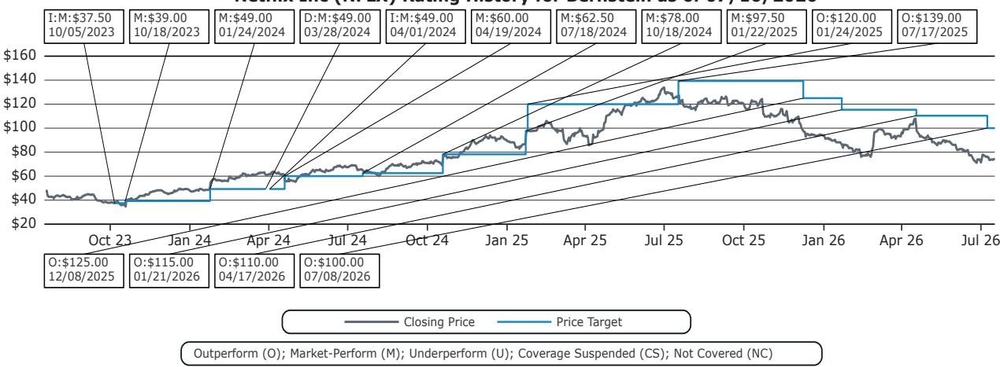

# Bernstein：Netflix 2Q26指引持平引发更多关注

Netflix在2Q26财报后盘后下跌约9%，对应2027年预期市盈率已低于18倍。这份来自Bernstein的报告核心判断是：当前市场定价并未充分反映Netflix的中长期潜力，但短期内也缺乏明显的正面催化剂。报告没有给出“观点偏积极”或“观点偏谨慎”的简单结论，而是拆解了市场为何在数字达标后仍然有所反应——以及公司正在如何应对。

2Q26的营收、EBIT和EPS基本符合预期，但UCAN（美国加拿大）区域营收略低于预期。内容摊销低于预期，贡献了小幅的盈利超预期。真正让市场关注的，是管理层对全年指引的“维持”姿态。

## 1. 营收指引虽未下调，但隐含增速已从区间上沿滑向中枢

Netflix维持了全年14%的营收增长指引，但报告指出，按固定汇率计算的营收增长预期已从此前的11%-13%区间收窄至12%左右。Bernstein认为，这可能反映了1H26的订阅用户增长情况，并引发了一个更根本的问题：增长是否正在以比预期更快的速度节奏变化。

> **KC评论：** 营收指引没有下调，但“区间收窄”本身就是一个信号。市场通常将管理层维持指引解读为保守，但在缺乏新催化剂的情况下，读者更倾向于将其解读为谨慎。这张图表的细节在于，指引的“不变”并不等于前景的“不变”。

## 2. 利润率指引的“不变”比营收指引更引人关注

Netflix重申了全年31.5%的营业利润率目标。报告认为，在1H26已经完成的情况下，管理层对下半年的内容支出节奏和广告收入轨迹应有较好的可见度。如果前景乐观，上调利润率指引是合理的。但管理层选择了重申，这让读者在“保守”和“谨慎”之间更倾向于后者。

报告还特别提到，2Q26的内容摊销增速为12.5%，高于全年10%的指引，管理层预计下半年增速会节奏变化。这一点需要后续数据验证。

## 3. 减少参与度披露的时机，加剧了信息真空

Netflix宣布将“What We Watched”报告从半年一次改为每年一次。管理层解释，观看时长与营收之间并非线性关系——例如，直播内容占内容预算的5%，但仅占观看时长的1%，却能不成比例地驱动新用户获取。动画内容则相反，占预算5%，占观看时长8%，但两者对业务的贡献价值相近。

报告认可这一逻辑，但指出，在不再披露订阅用户数据之后，减少参与度披露的时机选择并不利于改善读者情绪。市场将更依赖第三方数据，而由此产生的“噪音”短期内不会消失。

## 4. 公司正在通过内容形态扩张来应对增长问题

Bernstein认为，Netflix并非被动等待。公司正在积极拓展新的内容格式和品类，包括中短视频、线性节目和竖屏内容，以加深用户参与度并支撑长期增长。视频播客的早期表现令人鼓舞——其观看时间集中在白天和移动端，这被认为是增量参与度的信号。

报告还提到，Netflix正在多个国家测试针对新用户的免费试用，并可能在广告变现改善且不蚕食付费订阅的前提下，未来推出免费的广告支持层级。这些动作表明，公司正在从“订阅用户增长”转向“参与度与变现效率”的复合增长逻辑。

---

而在于它清晰地展示了：Netflix当前面临的不是基本面出现变化，而是增长叙事从“高增速”切换为“高质量”过程中的市场定价重构。对于关注流媒体行业竞争格局的读者而言，Netflix在内容形态和变现模式上的实验，可能比季度数字本身更具观察价值。

For informational purposes only. Portions may be generated,translated,summarized,or edited with AI assistance based on source materials and may contain omissions or errors. Please verify independently. This is not investment,legal,tax,accounting,or other professional advice.

For informational purposes only. Portions may be generated,translated,summarized,or edited with AI assistance based on source materials and may contain omissions or errors. Please verify independently. This is not investment,legal,tax,accounting,or other professional advice.

