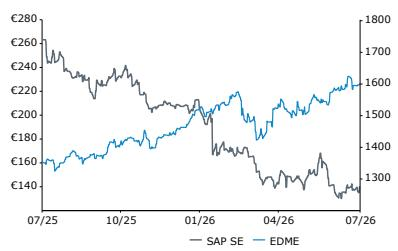
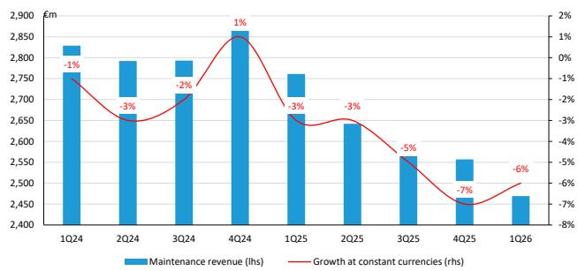
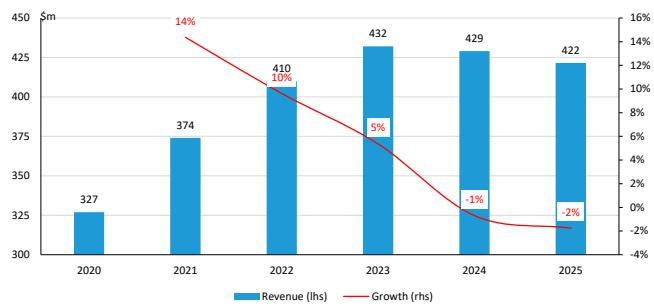

# SAP: From migration deadlines to migration economics

SAP's maintenance moat is weakening, but its installed base remains highly defensible. Building on our report two days ago, SAP: The end of deadline-driven migration, which argued the European Commission ruling shifts bargaining power toward customers, we extend the analysis to assess the implications for maintenance economics and monetization. Our key conclusion is that customer maintenance optionality - not revenue substitution - is the real risk. While bargaining power shifts incrementally toward customers, we maintain a constructive view, as long-term value creation should depend more on cloud, AI and ecosystem monetization than on maintenance lock-in.

Customer leverage matters more than third-party support. At roughly \$1bn at most, the addressable revenue pool for third-party support providers remains small compared with SAP's €10.5bn maintenance business. The greater risk is increased customer negotiating power on maintenance, cloud pricing, migration incentives and contract terms.

The ruling creates multiple migration pathways. Rather than a linear ECC-to-S/4 transition driven by deadlines, customers now have more strategic options, including delayed migration, hybrid support models and selective use of third-party support. Migration timing and economics become more important than migration volumes.

Migration economics are becoming the key investor debate. Greater flexibility is likely to influence pricing dynamics through higher discounts, stronger incentives and lower maintenance pricing, even if migration demand remains intact.

## Investment Implications

We maintain a constructive view. The ruling weakens SAP's contractual leverage but not its competitive position. ERP complexity, switching costs, AI, BTP and the broader SAP ecosystem should support continued conversion of the installed base into higher-value cloud solutions.

<table><tr><td>Adjusted EPS</td><td>F25A</td><td>F26E</td><td>F27E</td></tr><tr><td>SAP:GR (EUR)</td><td>6.10</td><td>7.54</td><td>9.02</td></tr></table>

Source: Bloomberg, Bernstein estimates and analysis.

<table><tr><td>Financials</td><td>F25A</td><td>F26E</td><td>F27E</td><td>CAGR</td></tr><tr><td>Revenues (M)</td><td>36,800</td><td>40,638</td><td>46,491</td><td>12.4%</td></tr><tr><td>Operating Earnings (M)</td><td>--</td><td>--</td><td>--</td><td>--</td></tr><tr><td>Net Earnings (M)</td><td>--</td><td>--</td><td>--</td><td>--</td></tr><tr><td>Revenue/Share</td><td>--</td><td>--</td><td>--</td><td>--</td></tr><tr><td>Operating Margin (%)</td><td>--</td><td>--</td><td>--</td><td>--</td></tr><tr><td>Net Income Margin (%)</td><td>19.5</td><td>21.2</td><td>21.4</td><td>--</td></tr><tr><td>EPS Growth (%)</td><td>36.0</td><td>23.5</td><td>19.6</td><td>--</td></tr></table>

<table><tr><td>Close Date</td><td>16 Jul 2026</td></tr><tr><td>SAP.GR Close Price (EUR)</td><td>140.70</td></tr><tr><td>Price Target (EUR)</td><td>276.00</td></tr><tr><td>Upside/(Downside)</td><td>96%</td></tr><tr><td>52-Week Range</td><td>267.10/130.62</td></tr><tr><td>EDME</td><td>1,598.24</td></tr><tr><td>FYE</td><td>Dec</td></tr><tr><td>Div Yield</td><td>1.8%</td></tr><tr><td>Market Cap (EUR) (M)</td><td>172,851</td></tr><tr><td>EV (EUR) (M)</td><td>171,173</td></tr></table>

<table><tr><td>Performance</td><td>YTD</td><td>1M</td><td>6M</td><td>12M</td></tr><tr><td>Absolute (%)</td><td>(32.5)</td><td>(1.0)</td><td>(30.2)</td><td>(46.5)</td></tr><tr><td>EDME (%)</td><td>8.7</td><td>0.7</td><td>4.7</td><td>18.0</td></tr><tr><td>Relative (%)</td><td>(41.2)</td><td>(1.8)</td><td>(34.9)</td><td>(64.5)</td></tr></table>

Source: Bloomberg, Bernstein estimates and analysis.  
Price Performance, 1YR

<table><tr><td>Valuation Metrics</td><td>F25A</td><td>F26E</td><td>F27E</td></tr><tr><td>Adjusted P/E (x)</td><td>23.1</td><td>18.7</td><td>15.6</td></tr><tr><td>PEG Adjusted (x)</td><td>0.6</td><td>0.8</td><td>0.8</td></tr><tr><td>EV/Sales (x)</td><td>4.7</td><td>4.2</td><td>3.7</td></tr><tr><td>PEG Reported (x)</td><td>0.6</td><td>0.8</td><td>0.8</td></tr><tr><td>EV/EBIT (x)</td><td>16.2</td><td>14.0</td><td>12.0</td></tr><tr><td>Div Yield (%)</td><td>1.7</td><td>2.0</td><td>2.0</td></tr></table>

## Table Of Contents

Investment summary....2   
From migration deadlines to customer choice....4   
The European Commission ruling changes the balance of power....5   
The real threat is customer maintenance optionality, not third-party support....7   
Five strategic paths for SAP customers....9   
Why SAP's installed base remains defensible....13   
How SAP can preserve its economic moat....15   
The new investor debate: Monetization, not migration....17   
From migration volume to migration economics....20

## DETAILS

## INVESTMENT SUMMARY

SAP's maintenance moat is becoming more contestable, but its installed base remains highly defensible. Following the European Commission's ruling on SAP's maintenance practices, we revisit a debate that has largely focused on migration volumes and third-party support disruption. Our key conclusion is that investors are asking the wrong question. The primary risk is not maintenance revenue displacement, but increased customer optionality and negotiating leverage. While the ruling incrementally shifts bargaining power toward customers, we maintain a constructive view, as SAP's long-term value creation should depend more on cloud, AI, and ecosystem monetization than on maintenance lock-in.

The real risk is pricing power, not revenue substitution. Investors often focus on whether third-party support providers can materially erode SAP's maintenance revenues. We believe the direct revenue opportunity remains modest relative to SAP's c. €10.5bn maintenance base. However, the presence of credible alternatives strengthens customers' hand in negotiations short-term, not only on maintenance renewals but also on cloud pricing, migration incentives, and contractual flexibility. The debate should therefore move from revenue disruption to pricing power.

SAP still controls when they end-of-life their software. While customers could shift maintenance temporarily, SAP decides when they will cease to support and upgrade the older versions of their software. This means that while a customer could temporarily shift ECC support to a third-party provider, once SAP ceases to support ECC the customer has the decision of using software that will no longer be upgraded or enhanced by the developer. This means that the software will age out relatively quickly unless the customer - or the customer in conjunction with third-party supports - takes on the responsibility for upgrading and enhancing the software which can be an expensive venture and places the customer at risk of missing legal or regulatory requirements and more exposed if accounting or business issues arise. We would argue that while customers may move short term the pending end-of-life is a major overhang and business risk that has not disappeared with this agreement.

Customers also assume competitive risks related to not leveraging AI. The other problem that customers who decide to switch to third-party support is that they lose the option of leveraging SAP's AI - the customer must instead develop those AI functionalities themselves which are likely going to be more expensive both initially and to support.

SAP's installed base remains resilient. The ruling lowers barriers to alternative support models but does not reduce ERP complexity, switching costs, customization dependence, regulatory requirements, or reliance on SAP's roadmap. Industry feedback points to coexistence rather than wholesale maintenance abandonment. SAP also retains important defenses through AI, Business Data Cloud, BTP, licensing expertise, and its broader application ecosystem.

The ruling creates multiple migration paths. The market has generally assumed a linear transition from ECC to S/4 driven by support deadlines. We see a broader set of strategic options, including immediate migration, negotiated migration, hybrid support arrangements, prolonged ECC usage, and eventual ERP replacement (which has a very low probability). Importantly, the ruling changes the timing and economics of modernization decisions rather than the underlying need to modernize. Investors should focus less on whether customers migrate and more on when they migrate and under what terms.

Migration economics matter more than migration volumes. Greater customer maintenance flexibility is unlikely to change SAP's long-term migration opportunity, but it could influence monetization through higher discounts (to expedite a customer's migration vs delaying longer and using third-party support temporarily), stronger incentives, and lower maintenance pricing. Given maintenance gross margins exceed 90%, even modest attrition could have an out-sized impact on earnings, shifting the debate from migration volumes to profit capture.

Investment conclusion. The ruling weakens SAP's contractual leverage, not its strategic position. The key question is no longer how many customers migrate, but how much value SAP captures from the transition. We believe SAP remains well positioned to convert its installed base into higher-value cloud relationships, supporting our constructive view despite greater customer optionality.

## FROM MIGRATION DEADLINES TO CUSTOMER CHOICE

The European Commission's recent ruling on SAP's maintenance practices has fundamentally changed the economics of SAP's installed base. In our previous report, SAP: The end of deadline-driven migration, we argued that the ruling incrementally shifts some bargaining power toward customers by allowing greater flexibility around support termination, landscape segmentation, and third-party support adoption. The debate is no longer whether customers will migrate to S/4, but when they migrate, under what commercial terms, and how much economic value SAP ultimately captures from the transition.

EXHIBIT 1: SAP ERP support deadline by software version

<table><tr><td>ERP software version</td><td>Mainstream maintenance (EoM)</td><td>Extended maintenance (EoE)</td><td>Default CSM on-premises</td><td>SAP Private Cloud offering S/4: SAP SafekeeperECC: SAP ERP private</td></tr><tr><td>ECC 6 EHP 0-5</td><td>2027</td><td>2027</td><td>2028</td><td>Not eligible</td></tr><tr><td>ECC 6 EHP 6-8</td><td>2027</td><td>2030</td><td>2031</td><td>SAP ERP, private edition, transition option 2033</td></tr><tr><td>S/4 Finance 1503 &amp; 1605</td><td>2025</td><td>NA</td><td>2026</td><td>2029</td></tr><tr><td>S/4 1709</td><td>2022</td><td>2025</td><td>2026</td><td>2027</td></tr><tr><td>S/4 1809</td><td>2023</td><td>2025</td><td>2026</td><td>2027</td></tr><tr><td>S/4 1909</td><td>2024</td><td>2025</td><td>2026</td><td>2027</td></tr><tr><td>S/4 2020</td><td>2025</td><td>NA</td><td>2026</td><td>2027</td></tr><tr><td>S/4 2021</td><td>2026</td><td>NA</td><td>2027</td><td>2028</td></tr><tr><td>S/4 2022</td><td>2027</td><td>NA</td><td>2028</td><td>2029</td></tr><tr><td>S/4 2023</td><td>2030</td><td>NA</td><td>2031</td><td>2032</td></tr></table>

CSM: Customer-specific maintenance  
Source: SAP, Gartner Group, Bernstein analysis

We believe the next phase of this debate is increasingly centered on SAP's maintenance revenues. Maintenance has historically been one of SAP's most attractive businesses: highly recurring, highly profitable (gross margin $>90\%$ ), and strategically important because it reinforced the migration path from ECC toward S/4 and cloud offerings. SAP generated €10.5bn of support revenue in 2025, representing one of the largest maintenance revenue streams across enterprise software.

At first glance, the threat from third-party support appears limited. Based on our estimates, SAP-related third-party support revenues for on-premises ERP solutions such as ECC may total approximately \$1bn at best. Roughly half of this opportunity is likely already captured by specialist third-party support providers such as Rimini Street, Spinnaker Support, Support Revolution and Origina, while the remaining half is likely serviced through large IT services providers such as TCS, Infosys, Cognizant, Accenture and Capgemini. Relative to SAP's €10.5bn maintenance revenue base, this does not suggest a material displacement threat to SAP's overall revenue model.

However, we believe this interpretation misses the more important implication. The significance of third-party support is not the absolute size of the market. Rather, it is the optionality that it creates for customers. Historically, customers faced meaningful barriers to leaving SAP support, including reinstatement fees, back-maintenance obligations and the difficulty of applying different support models across different parts of their SAP estate. The Commission's ruling materially lowers those barriers and transforms third-party support from a niche cost-optimization strategy into a credible negotiating tool. But it does not remove the legal, regulatory or business risks associated with not receiving constant upgrades and enhances.

As a result, customers now have a broader range of options than simply migrating to S/4 according to SAP's preferred timeline. They can selectively apply third-party support across their landscape, potentially combine SAP support and third-party providers, extend the life of stable ECC environments, optimize maintenance spending, negotiate improved migration incentives, or delay modernization until technical debt and business readiness improve. Industry feedback reinforces this view, positioning third-party support not only as a substitute for SAP maintenance but also as a provisional, supplemental, or contingent mechanism that allows customers to modernize at their own pace.

The key question is therefore not how much revenue third-party providers can capture from SAP. We think that the more important question is how customer behavior changes when maintenance is no longer an all-or-nothing decision. In this note, we examine the range of strategic paths available to SAP customers following the ruling, assesses which customer segments are most likely to adopt each option, evaluates the potential implications for SAP's maintenance economics, and analyzes the actions SAP can take to mitigate these risks and preserve long-term value creation.

## THE EUROPEAN COMMISSION RULING CHANGES THE BALANCE OF POWER

Historically, SAP maintenance was more than a support contract. It functioned as a strategic mechanism that reinforced customer dependence on the SAP ecosystem and increased the likelihood of an eventual migration to S/4. The value of maintenance was therefore not limited to incident resolution or software updates; it also helped secure SAP's future product adoption.

The recent European Commission ruling weakens this mechanism. While the decision does not fundamentally alter SAP's product strategy or customer relationships overnight, it reduces SAP's ability to use maintenance policies as a lever to influence long-term customer decisions. As a result, maintenance becomes less of a pathway that naturally leads customers toward S/4 and more of a service element that must compete on its own merits. It does not remove the incentives relating to constant product enhancements that using SAP rather than third parties.

## WHY THIS MATTERS

The key implication is not that customers will suddenly abandon SAP support, in our view. Most SAP environments remain mission-critical, and the switching costs associated with ERP systems remain substantial. Rather, the ruling incrementally changes the balance of power between SAP and its customers.

Historically, organizations considering third-party support faced significant barriers. Reinstatement fees, back-maintenance payments, and restrictions on partial support arrangements increased both the financial and operational risks of leaving SAP maintenance. As a result, many customers remained within the SAP support framework even when they were dissatisfied with support costs or uncertain about their migration plans.

The ruling reduces several of these frictions. Customers now have greater flexibility to evaluate alternative support models without necessarily making an irreversible commitment. The cost of experimentation declines, and support decisions become more reversible.

For investors, we believe this distinction is important. The debate is not about immediate maintenance revenue losses. The more significant issue is that maintenance becomes less effective as a forcing function that nudges customers toward SAP's preferred roadmap. SAP will increasingly need to justify the economic and technological benefits of remaining within its ecosystem rather than relying on contractual constraints that limit customer choice.

In other words, customer retention becomes more dependent on value creation and incrementally less dependent on switching friction.

## A STRUCTURAL SHIFT IN CUSTOMER NEGOTIATING POWER

The ruling also changes how customers approach support procurement. Previously, support decisions were often made at the enterprise level. Organizations typically maintained a single relationship with SAP support across their entire SAP landscape because deviating from this model created complexity and additional costs. This gave SAP significant negotiating leverage.

Customers now have greater freedom to adopt a more selective approach.

Large enterprises can increasingly evaluate different support models for different portions of their SAP estate. Core systems that require close alignment with SAP's innovation roadmap may remain under SAP support, while more mature or stable environments may be considered for alternative support arrangements. The result is a more granular, portfolio-based approach to support management.

This flexibility alters the negotiating dynamic. Customers no longer face a binary choice between remaining fully under SAP maintenance and exiting SAP support entirely. Instead, they gain the ability to evaluate support options system by system and contract by contract.

## MAINTENANCE BECOMES A TACTICAL DECISION

We believe one of the most important consequences of the ruling is that support choices become more tactical and reversible (at least until SAP ends-of-life the version of the software the customer is using). Under the previous framework, moving to third-party support was often perceived as a one-way decision. The potential costs and administrative complexity associated with returning to SAP support created a strong deterrent against experimentation.

As these re-entry barriers decline, organizations gain more flexibility to reassess support arrangements over time. Companies can potentially use third-party support during specific phases of their ERP lifecycle and later reconsider their options as business needs evolve. Note that once SAP ends-of-life the customer's current version of the software the economics and complexity of migration could change / become expensive.

This changes the nature of the decision. Support is no longer necessarily a permanent strategic commitment. Instead, it increasingly becomes a tactical procurement choice that can be adjusted as circumstances change.

## IMPLICATIONS FOR SAP

Taken together, these changes do not suggest a near-term exodus from SAP maintenance. ERP systems remain highly embedded, and customers still depend on SAP for innovation, compliance updates, and future roadmap alignment.

However, the ruling does reduce SAP's structural leverage.

Customers gain additional bargaining power because they have more credible alternatives and face lower switching frictions. Even when they ultimately remain with SAP support, the mere existence of a viable alternative strengthens their negotiating position.

As a result, maintenance evolves from a mechanism that helped lock customers into SAP's future roadmap into a negotiation tool that customers can actively use to secure better pricing, contractual terms, or migration conditions.

The broader investment implication is therefore subtle but meaningful: SAP's ability to influence customer behavior through purely the maintenance contracts weakens, while customer leverage in commercial negotiations increases. Future migrations to S/4 are likely to depend increasingly on the attractiveness of SAP's value proposition rather than on the costs associated with leaving the maintenance framework. That said, once end-of-life occurs the company has taken on all the responsibility and legal / regulatory risks associated with using a manufacturer's no longer supported ERP solution. For some this will be acceptable, but for most this risk is not worth the rewards. Note that to an extent this option has always existed.

## THE REAL THREAT IS CUSTOMER MAINTENANCE OPTIONALITY, NOT THIRD-PARTY SUPPORT

We believe that the central risk to SAP is not Rimini Street, Spinnaker, Support Revolution, Origina, or any other third-party support provider in isolation. The real risk is the growing maintenance optionality available to customers.

Investors often frame the discussion around whether third-party providers can meaningfully erode SAP's maintenance revenue base. This may be the wrong question, in our view. The more important issue is that customers now have credible alternatives to SAP's traditional support model. Even if only a limited number of customers ultimately switch providers, the mere existence of those alternatives incrementally changes the balance of power in customer negotiations.

In other words, the threat is not the size of the third-party support market itself. The threat is the leverage that the existence of that market creates.

EXHIBIT 2: SAP: Maintenance revenue  
  
Source: SAP (FY to end-December), Bernstein analysis

EXHIBIT 3: Rimini Street: total revenue  
  
Source: Rimini Street (FY to end-December), Bernstein analysis

## WHY THIS MATTERS

The investment debate frequently focuses on specialist vendors. This naturally leads investors to assess the potential revenue that these companies could capture from SAP.

However, even under our relatively optimistic scenarios, the addressable SAP-related third-party support market appears small compared with SAP's maintenance business. Based on our estimates, third-party support revenues linked to SAP customers may ultimately reach approximately \$1bn (a good portion of which is already with third parties), versus SAP's maintenance revenue base of roughly €10.5bn.

Viewed purely as a revenue substitution issue, the direct impact therefore appears limited. Third-party support providers are unlikely to replace a substantial portion of SAP's maintenance revenues.

The more significant consequence is indirect rather than direct.

As customers gain access to credible alternatives, they improve their bargaining position when dealing with SAP. The value created by third-party support providers may therefore extend well beyond the revenues those providers generate themselves.

## THE SHIFT FROM REVENUE RISK TO PRICING POWER RISK

Historically, customers had limited alternatives once they became deeply embedded in SAP environments. The combination of technical complexity, mission-critical processes, and high switching costs often left customers with few realistic options. The average lifecycle of a SAP ERP system is more than 20 years.

The emergence of a viable third-party support ecosystem changes this dynamic.

Customers can now use alternative support offerings as leverage when negotiating:

\- Migration incentives and transition support.

• Cloud subscription pricing.

\- Maintenance fee increases.

\- Contract duration and flexibility.

\- Implementation and transformation support.

Importantly, customers do not need to leave SAP for this leverage to have economic value. A customer that remains entirely within the SAP ecosystem may still be able to secure better commercial terms simply because an alternative exists.

This distinction is critical, in our view. The economic impact on SAP could exceed the additional revenues ultimately captured by third-party support vendors themselves. A relatively small third-party support market can still influence pricing discussions across a much larger installed base.

## WHY INVESTORS SHOULD FOCUS ON OPTIONALITY

From an investor perspective, the key question is therefore not whether third-party support providers can become large businesses. Rather, the question is whether they can become sufficiently credible alternatives to influence customer behavior.

A customer only needs an option - not necessarily an intention - to switch.

If customers can credibly demonstrate that they have alternatives, SAP may face greater pressure to offer concessions, discounts, migration incentives, or more flexible contractual arrangements. The resulting effect would be felt through pricing power and commercial negotiations rather than through a large-scale loss of maintenance customers.

This shifts the debate away from market-share transfer and toward competitive dynamics within the installed base.

## INVESTMENT IMPLICATIONS

The long-term investment risk is therefore not that third-party support providers replace SAP maintenance at scale. The available market opportunity appears too small for that outcome to be the primary concern, in our view.

The more relevant risk is that these providers increase customer choice and strengthen customer negotiating power. As optionality rises, SAP may retain its customers while generating incrementally lower economic value from each relationship than would otherwise have been possible.

For investors, this transforms the discussion from a revenue-disruption story into a pricing-power story. The ultimate significance of third-party support may not be measured by the revenues it captures, but by the negotiating leverage it creates across SAP's broader customer base.

## FIVE STRATEGIC PATHS FOR SAP CUSTOMERS

The European Commission ruling fundamentally changes the range of options available to SAP ECC customers. The market narrative has largely assumed a relatively linear journey from ECC to S/4, with customers progressively migrating as SAP's support deadlines approached. The ruling challenges this assumption by improving the legal and commercial foundations of third-party support service (TPSS), thereby expanding the set of viable strategic choices available to customers (Exhibit 4).

Importantly, the ruling does not alter the underlying technical realities of ERP modernization. Customers must still decide how and when to address aging ERP environments, customizations, integrations, and digital transformation requirements. What changes is that organizations now have greater flexibility over the timing, economics, and execution of those decisions.

As a result, we believe investors should think about the SAP installed base as following multiple potential pathways rather than a single migration trajectory. These pathways vary significantly in their implications for SAP's migration velocity, pricing power, maintenance revenues, and long-term customer retention.

EXHIBIT 4: Options for continuing SAP ECC support  
  
Source: Gartner Group (March 2026)

## PATH 1: IMMEDIATE MIGRATION TO S/4

## Customer profile

This path is most likely to be followed by customers with relatively low technical debt, manageable customization levels, and a clearly defined business case for S/4. These organizations typically view ERP modernization as a strategic priority and are already investing heavily in broader digital transformation initiatives.

## Why customers choose this path

For these customers, the European Commission ruling changes little. While third-party support may become more attractive from a legal and economic perspective, it does not materially alter the strategic rationale behind migration.

The primary drivers remain access to SAP's latest innovation roadmap, embedded AI capabilities, cloud-native functionality, enhanced analytics, and the opportunity to simplify operating models. For organizations seeking to modernize processes and accelerate business transformation, these benefits often outweigh potential savings from remaining on ECC.

In other words, the ruling affects support economics but does not necessarily change the attractiveness of SAP's cloud ERP proposition.

## Investor implications

This cohort presents the lowest risk to SAP. Migration proceeds broadly as expected, and SAP continues converting maintenance revenues into cloud subscriptions. While the ruling may slightly strengthen customers' negotiating positions, it is unlikely to materially change migration behavior for this group.

## PATH 2: USE THE RULING TO NEGOTIATE BETTER MIGRATION TERMS

## Customer profile

These customers intend to migrate to S/4 but seek better commercial terms before committing to large-scale transformation projects. Their objective is not to remain on ECC indefinitely, but rather to improve the economics of the migration journey.

## Why customers choose this path

This is likely to be the largest customer cohort, in our opinion, out of our roughly estimated 17.5k ECC clients yet to be migrated to S/4.

Many organizations have already accepted that an eventual move to S/4 is necessary. However, they now possess a stronger alternative option than previously assumed. The availability of a more credible TPSS (third-party support service) route gives customers additional leverage in negotiations with SAP.

As a result, customers may seek lower migration costs, increased incentives, maintenance discounts, contractual flexibility, free capabilities / usage or seats, or stronger pricing protections. The ruling effectively improves their bargaining position by reducing the urgency that historically favored SAP in commercial discussions.

The key point is that these customers are not rejecting migration. Rather, they are attempting to improve the economic terms under which migration occurs.

## Investor implications

For SAP, we believe this scenario may represent a greater risk than outright TPSS adoption.

If customers ultimately migrate but do so under more favorable commercial conditions, SAP may preserve migration volumes while experiencing influence on pricing, discount levels, or contract economics. Consequently, investors should focus not only on migration rates but also on the potential implications for average contract value and long-term profitability.

## PATH 3: CUSTOMER-SPECIFIC MAINTENANCE (CSM) COMBINED WITH THIRD-PARTY SUPPORT SERVICE (TPSS)

## Customer profile

This path is most relevant for organizations operating large, highly customized ECC environments where migration remains technically challenging or operationally risky. These customers often face substantial application complexity and require additional preparation before undertaking a major ERP transformation.

## Why customers choose this path

This pathway represents one of the most important strategic implications highlighted in our discussions with SAP customers and consulting companies.

Historically, third-party support has often been viewed as a substitute for SAP maintenance. However, industry consulting firms increasingly frames Customer-Specific Maintenance (CSM) combined with TPSS as a mechanism for buying time while simultaneously preparing for future modernization.

Under this approach, customers use alternative support arrangements to reduce cost pressures and operational risk while gradually addressing technical debt, rationalizing customizations, and developing a longer-term transformation strategy.

Viewed through this lens, TPSS becomes less of an endpoint and more of a transition tool (Exhibit 5). It serves as an assurance mechanism that enables customers to defer difficult migration decisions without losing support coverage.

## Investor implications

This scenario primarily delays migration rather than preventing it.

For SAP, we believe the risk lies in slower migration velocity and revenue conversion, rather than permanent customer loss. Revenue timing may shift, but a meaningful proportion of these organizations could ultimately move to S/4 once their environments have been sufficiently simplified.

EXHIBIT 5: Various support routes for SAP on-premises ERP by TPSS role, tech debt, and approach to risk

<table><tr><td>TPSS Assurance Role</td><td>Cost saving</td><td>Cost cautious</td><td>Risk cautious</td><td>Risk adverse</td><td>Max assurance</td></tr><tr><td>Junction 1</td><td>T1</td><td>A1</td><td>A1</td><td>A1</td><td>A1</td></tr><tr><td>Junction 2</td><td>-</td><td>B1</td><td>B1 + T2</td><td>A1</td><td>A1 + T2</td></tr><tr><td>Junction 3</td><td>-</td><td>T3</td><td>B1 + T2</td><td>B1 + T2</td><td>B1 + T2</td></tr><tr><td>Substitute</td><td>√</td><td>√</td><td>×</td><td>×</td><td>×</td></tr><tr><td>Provisional</td><td>√</td><td>√</td><td>√</td><td>√</td><td>×</td></tr><tr><td>Supplement</td><td>×</td><td>×</td><td>√</td><td>√</td><td>√</td></tr><tr><td>Contingent</td><td>×</td><td>×</td><td>√</td><td>√</td><td>√</td></tr><tr><td rowspan="3">Navigation</td><td rowspan="3">T1</td><td rowspan="3">B1</td><td rowspan="3">T3</td><td rowspan="3">T2</td><td rowspan="3">T2</td></tr><tr></tr><tr></tr><tr><td>Route profile</td><td>Reduce support costsContinued use of ECC indefinitelyExit SAP relationship</td><td>Avoid support premiumsPrepare for multi-party RACIManage SAP relationship</td><td>Avoid support premiumsEnact multi-party RACIRetain SAP relationship</td><td>Reduce disruption to operationsPrepare for multi-party RACIRetain SAP relationship</td><td>Prioritize lowest risk over costEstablish multi-assuranceRetain SAP relationship</td></tr></table>

Source: Gartner Group (June 2026)

## PATH 4: SIGNIFICANT EXTENSION OF ECC USAGE

## Customer profile

These customers operate relatively stable ERP environments and struggle to establish a compelling business case for S/4 migration. They often face significant customization complexity, integration challenges, or organizational fatigue following previous transformation programs.

## Why customers choose this path

For many organizations, the perceived benefits of migration remain uncertain relative to the cost, complexity, and disruption involved.

Common concerns include extensive custom development, deeply embedded integrations, unclear return on investment, and limited business demand for new ERP capabilities. The European Commission ruling potentially strengthens the feasibility of maintaining ECC environments for longer periods through alternative support arrangements.

Importantly, we estimate that a substantial number of SAP customers may still rely on ECC environments by 2030. This could represent approximately 9-10k customers vs 18.5k at end-1Q26, based on our current projection (Exhibit 7). While the exact migration timing will vary by customer, this observation suggests that delayed modernization remains a realistic outcome for a meaningful portion of the installed base.

## Investor implications

This represents, in our view, the most notable scenario for SAP's migration velocity.

Customers remain within the SAP ecosystem, but migration timelines extend materially. The result is slower conversion of the ECC installed base into higher-value cloud contracts and a potential reduction in near- and medium-term migration-related revenue expectations.

## PATH 5: LONG-TERM EXIT FROM SAP

## Customer profile

This group consists of organizations pursuing a broader ERP replacement strategy or customers that have become strategically dissatisfied with their SAP environment. Rather than viewing S/4 as the next step, they are evaluating alternative ERP platforms altogether.

## Why customers choose this path

For these customers, TPSS may function as a bridge to a complete ERP replacement. The availability of extended support options reduces time pressure and allows organizations to evaluate alternative vendors without immediately committing to SAP's migration roadmap.

That said, replacing SAP remains an exceptionally complex, expensive and time-consuming undertaking. Large SAP deployments are typically characterized by extensive process integration, deep business customization, and significant organizational dependence. These factors create substantial switching costs and implementation risks.

As discussed earlier in this report, SAP's competitive moat is primarily derived from application complexity, embedded business processes, and customer-specific customizations (which are far more limited with competitive solutions) rather than from maintenance contracts alone. The European Commission ruling may weaken one component of the SAP commercial model, but it does not materially reduce the underlying complexity of ERP replacement.

## Investor implications

We believe this represents the most significant scenario for SAP because it ultimately results in customer attrition rather than migration.

However, it is also likely to be the smallest cohort. Moving from SAP to an entirely new ERP platform is typically far more disruptive, expensive, and risky than switching maintenance providers. Consequently, while the ruling may increase customer optionality, it does not automatically translate into large-scale ERP replacement activity.

## KEY INVESTOR TAKEAWAYS

The most important conclusion from the European Commission ruling is not that customers will abandon SAP, but that customer behavior is likely to become more heterogeneous. The ruling introduces additional strategic options between immediate migration and outright exit.

As a result, we think that the primary risk for SAP may not be a collapse in migration demand, but rather a combination of slower migration velocity and increased customer negotiating leverage. Investors should therefore focus less on whether customers migrate and more on when they migrate and under what commercial terms. The ruling expands customer choice, but it does not eliminate the fundamental barriers to ERP replacement that underpin SAP's competitive position.

## WHY SAP'S INSTALLED BASE REMAINS DEFENSIBLE

The European Commission ruling expands customer flexibility and strengthens their ability to select third-party support providers. However, it does not eliminate the fundamental trade-offs associated with reducing or terminating a direct relationship with SAP. While
