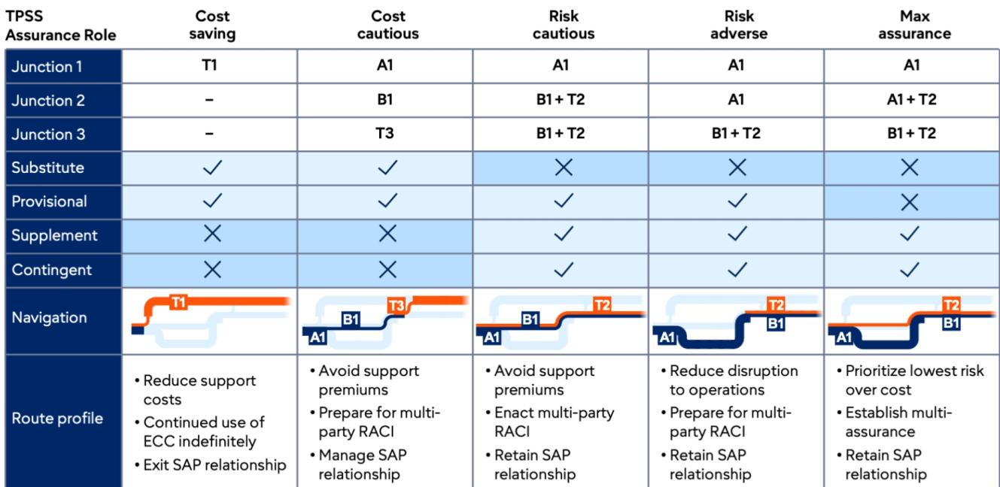
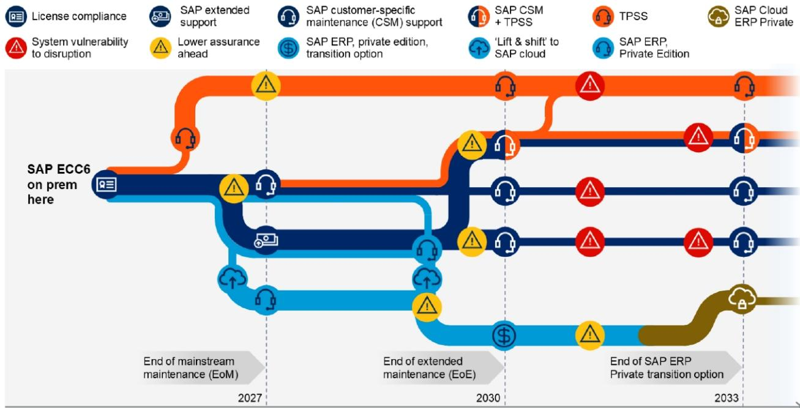
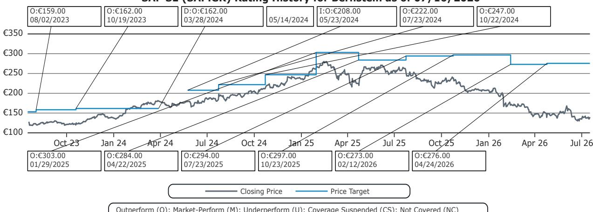

# SAP的维护护城河正在弱化，但其安装基础仍具有高度防御性

欧盟委员会对SAP维护实践的裁决从根本上改变了该公司安装基础的经济模式，但主要风险并非大多数分析师所认为的那样。来自第三方支持提供商的直接威胁仍然有限：在约10亿美元的可寻址收入中，整个SAP本地ERP的第三方支持市场相对于SAP 105亿欧元的维护业务而言规模较小。其中约一半的机会已被Rimini Street和Spinnaker Support等专业提供商占据，其余部分则由TCS、Infosys和Accenture等大型IT服务公司提供服务。这并不表明SAP整体收入模式面临实质性的替代威胁。

真正的风险不是收入替代，而是客户的选择权。该裁决将第三方支持从一种小众的成本优化策略转变为一种可信的谈判工具。此前，客户在离开SAP支持时面临重大障碍——包括恢复费用、回溯维护义务以及在其SAP资产的不同部分应用不同支持模式的困难——现在他们有更大的灵活性来评估替代方案。实验成本降低，支持决策变得更加可逆。因此，讨论应从客户是否会迁移到S/4转向他们何时迁移以及在何种商业条款下迁移。

这一转变之所以重要，是因为维护在历史上不仅仅是一份支持合同。它作为一种战略机制，强化了客户对SAP生态系统的依赖，并增加了最终迁移到S/4的可能性。该裁决削弱了这一机制，降低了SAP利用维护政策作为杠杆来影响客户长期决策的能力。维护不再是一条自然引导客户走向S/4的路径，而更像是一个必须凭自身价值竞争的服务要素。客户保留更多地依赖于价值创造，而较少依赖于转换摩擦。

我们维持对SAP的观察观点。该裁决削弱的是合同杠杆，而非竞争地位。ERP的复杂性、转换成本、定制化依赖、监管要求以及对SAP路线图的依赖仍然存在。SAP还通过AI、Business Data Cloud、BTP及其更广泛的应用生态系统保留了重要的防御能力。关键问题不再是有多少客户会迁移，而是SAP能从这一转型中获取多少价值。

## 欧盟委员会裁决改变了权力平衡，而非竞争格局

委员会的裁决不会在一夜之间从根本上改变SAP的产品战略或客户关系。然而，它降低了SAP利用维护政策作为推动客户走向其首选路线图的强制功能的能力。历史上，考虑第三方支持的组织面临重大障碍，这些障碍增加了离开SAP支持的财务和运营风险。恢复费用、回溯维护付款以及对部分支持安排的限制意味着，即使客户对支持成本不满意或对其迁移计划不确定，许多客户仍留在SAP支持框架内。

该裁决减少了其中一些摩擦。客户现在有更大的灵活性来评估替代支持模式，而不必做出不可逆转的承诺。实验成本降低，支持决策变得更加可逆。这并非关乎即时的维护收入损失。更重要的问题是，维护作为引导客户走向SAP首选产品路线的机制，其有效性正在降低。

该裁决还改变了客户处理支持采购的方式。此前，支持决策通常在企业层面做出，组织通常在其整个SAP环境中与SAP支持保持单一关系。偏离这一模式会产生复杂性和额外成本，使SAP拥有显著的谈判杠杆。客户现在有更大的自由采取更具选择性的方法。

大型企业可以越来越多地为其SAP资产的不同部分评估不同的支持模式。需要与SAP创新路线图紧密对齐的核心系统可能仍由SAP支持，而更成熟或稳定的环境则可以考虑替代支持安排。其结果是形成一种更精细、基于组合的支持管理方法。这种灵活性改变了谈判动态，因为客户不再面临完全留在SAP支持内或完全离开的二元选择。

对观察者而言，这意味着SAP的维护收入流在边际上变得更具竞争性，即使短期内相对收入影响仍然有限。更重要的结构性变化是，SAP在维护方面的定价能力——以及潜在的云迁移合同——比历史上更受到竞争替代方案的约束。

## 客户维护选择权，而非第三方支持，才是对SAP定价能力的真正威胁

第三方支持的重要性不在于市场的相对规模，而在于它为客户创造的选择权。随着裁决降低了替代支持模式的障碍，客户现在拥有比简单按照SAP首选时间表迁移到S/4更广泛的选择。

行业反馈表明，客户正在考虑至少五种不同的战略路径。第一种是立即迁移到S/4，这仍然是那些与SAP路线图高度一致、定制化需求高或战略上依赖SAP创新管道的客户的默认路径。第二种是协商迁移，客户利用第三方支持的威胁，在承诺迁移到S/4之前，从SAP那里争取更优的商业条款、更高的折扣或更强的迁移激励。第三种路径涉及混合支持安排，客户对核心系统应用SAP支持，同时对稳定或非关键环境使用第三方提供商。第四种是延长ECC使用，客户通过第三方支持延长稳定ECC环境的寿命，接受老化软件的风险以换取延迟资本支出。第五种路径——最终ERP替换——鉴于核心ERP系统的复杂性和相关转换成本，其概率非常低。

从这些选择范围中得出的最重要见解是，该裁决改变了现代化决策的时间和经济学，而非现代化的根本需求。客户仍然面临一个基本现实：ECC最终将达到生命周期终点。SAP控制着何时停止支持和升级其软件的旧版本。虽然客户可以暂时将ECC支持转移到第三方提供商，但一旦SAP停止支持ECC，客户就面临使用不再由开发商升级或增强的软件的决定。除非客户——或客户与第三方支持提供商合作——自行承担升级和增强软件的责任，否则该软件将相对较快地老化。这可能是一项昂贵的冒险，并使客户面临错过法律或监管要求的风险，以及在出现会计或业务问题时变得更加脆弱。

决定转向第三方支持的客户也失去了利用SAP AI能力的选择。他们必须自行开发这些AI功能，这可能在初始阶段和支持阶段都更加昂贵。这种与未利用AI相关的竞争风险是一个重要的考量因素，并未因委员会的裁决而消失。

净效果是，虽然客户在短期内拥有更多选择，但ECC即将到来的生命周期终点仍然是一个重大的悬置问题和业务风险。该裁决提供了喘息空间，而非逃避现代化需求的出路。对观察者而言，关键问题是这一喘息空间如何影响SAP从最终迁移中获取价值的能力。

## 迁移经济学比迁移数量更重要

更大的客户维护灵活性不太可能改变SAP的长期迁移机会，但它可能通过几个渠道对货币化造成压力。最直接的影响是维护定价本身。随着可信替代方案的出现，客户有更大的杠杆来协商更低的维护费用，特别是对于稳定且需要有限支持的环境。鉴于维护毛利率超过90%，即使是适度的客户流失或折扣也可能对收益产生不成比例的影响。

第二个渠道是通过迁移激励。SAP可能需要提供更强的财务激励——包括S/4许可证的更高折扣、更有利的云过渡条款或额外的服务积分——以鼓励客户按照SAP的首选时间表迁移，而不是延迟并临时使用第三方支持。这些激励措施减少了每个迁移客户的净收入获取。

第三个渠道是通过云定价。该裁决不仅赋予客户在维护方面的更大谈判杠杆，也适用于云合同。考虑RISE with SAP或其他云产品的客户现在可以将第三方支持作为云定价不具吸引力时的可行替代方案。这限制了SAP提高云价格或施加不利条款的能力，即使该公司正在寻求推动云采用。

第四个渠道是通过迁移速度。选择延迟迁移的客户延长了他们支付较低维护费用（通过第三方支持或通过协商的SAP折扣）的时期。这延迟了SAP期望通过将维护客户转化为更高价值的云关系而获得的收入提升。

对观察者而言，关键区别在于迁移数量和迁移经济学。最终迁移到S/4的客户数量可能基本保持不变。变化的是他们迁移的价格、迁移的时间以及SAP从每个客户那里获取的收入流的净现值。讨论应从“有多少客户会迁移”转向“SAP将从每次迁移中获取多少价值”。

## 评估SAP客户迁移路径的决策框架

评估委员会裁决影响的观察者应应用一个结构化的框架，考虑三个维度：客户细分、迁移时间和价值获取。

第一个维度是客户细分。并非所有客户都同样可能行使他们的新选择权。对SAP创新路线图有高度战略依赖的客户——包括那些大量投资于SAP AI能力、商业技术平台或行业特定解决方案的客户——有强烈的动机留在SAP生态系统内。即使有选择，这些客户也不太可能转向第三方支持，因为错过SAP创新管道的成本超过了维护节省。

拥有稳定、成熟且需要有限支持的ECC环境的客户最有可能考虑第三方支持。这些客户从维护成本优化中获益最多，从减少对SAP创新管道访问中损失最少。然而，即使是这些客户也面临ECC生命周期终点的悬置问题，这限制了第三方支持作为可行选择的持续时间。

具有高定制化需求或复杂监管义务的客户面临最高的转换成本。这些客户不太可能完全离开SAP支持，但他们可能利用第三方支持的威胁来协商更好的维护或迁移合同条款。

第二个维度是迁移时间。该裁决创造了一系列时间选择，而非现在或永远不迁移的二元选择。技术上准备好且有预算的客户可以选择立即迁移，更早地获得S/4和云能力的好处。尚未准备好的客户——由于技术债务、定制化复杂性或预算限制——现在可以延迟迁移而无需面对硬性截止日期，使用第三方支持作为桥梁。这延长了迁移窗口，并延迟了SAP期望从转型中获得的收入提升。

第三个维度是价值获取。对于每个客户细分和时间情景，观察者应评估SAP能够获取客户生命周期价值的多少。在协商条款下早期迁移的客户可能比在标准条款下后期迁移的客户产生更低的每客户收入。使用第三方支持作为桥梁的客户最终可能会迁移，但他们收入流的净现值较低，因为他们在桥梁期间支付了较低的维护费用。

应用这一框架表明，对SAP财务模型最显著的风险并非大规模放弃SAP支持，而是整个安装基础定价能力的逐渐侵蚀。该裁决使SAP的维护收入流在边际上更具竞争性，即使短期内相对收入影响仍然有限。

## SAP的安装基础通过生态系统锁定和创新溢价仍具有防御性

尽管客户可用的选择权增加，但几个结构性因素支持SAP维持其安装基础并将其转化为更高价值云关系的能力。其中最重要的是ERP系统的复杂性和与之相关的转换成本。核心ERP系统深深嵌入企业运营、财务、供应链和法规遵从。替换或迁移这些系统涉及重大风险、成本和中断。即使支持安排方面有更大的灵活性，ERP转换成本的基本经济学并未改变。

第二个因素是SAP的创新管道，特别是在AI领域。SAP在生成式AI、嵌入式分析和智能自动化方面的投资创造了一个超越维护的价值主张。留在SAP生态系统内的客户可以获得集成到其核心业务流程中的AI能力。转向第三方支持的客户失去了这种访问权限，必须自行开发AI功能，这在初始阶段和支持阶段都可能更加昂贵。这为考虑第三方支持的客户创造了有意义的竞争风险。

第三个因素是SAP的商业技术平台和应用生态系统。BTP为扩展和集成SAP应用提供了一个平台，更广泛的SAP生态系统包括数千个合作伙伴和独立软件供应商。离开SAP支持的客户面临失去与此生态系统兼容性的风险，这可能导致运营效率低下，并限制他们利用第三方创新的能力。

第四个因素是监管和合规环境。许多SAP客户在受监管的行业运营，其中软件升级和合规认证至关重要。第三方支持提供商可能无法提供与SAP相同水平的监管覆盖或合规保证。这为考虑替代支持模式的客户创造了额外风险。

第五个因素是ECC即将到来的生命周期终点。虽然该裁决在短期内给客户提供了更大的灵活性，但现代化的根本需求并未改变。SAP控制着何时停止支持其软件的旧版本。延迟迁移的客户面临运行不受支持软件的风险，这会产生运营、安全和合规方面的暴露。这一悬置问题限制了第三方支持作为可行选择的持续时间，并最终推动客户走向迁移。

这些因素表明，安装基础仍然具有防御性，即使维护护城河变得更具竞争性。该裁决改变了SAP与其客户之间关系的条款，但它并未消除SAP数十年来在企业软件主导地位中建立的结构性优势。

## 观察者讨论从迁移数量转向利润获取

欧盟委员会对SAP维护实践的裁决并未改变SAP业务的基本轨迹。该公司仍然处于有利地位，能够将其安装基础转化为更高价值的云关系，这得益于其创新管道、生态系统和转换成本。然而，该裁决确实改变了这种转化的经济学。关键的观察者讨论应从迁移数量转向利润获取。

关键问题不再是客户是否会迁移到S/4。问题是SAP从每个迁移客户那里获取多少价值。该裁决赋予客户更大的杠杆来协商更好的条款、延迟迁移和优化维护支出。这些因素降低了SAP从安装基础中获取的收入流的净现值，即使迁移客户的数量保持不变。

观察者应关注几个指标来评估这一转变的影响。第一个是维护收入保留率，这将表明客户是否正在行使他们的新选择权以减少维护支出。第二个是云合同条款，包括折扣水平和合同期限，这将揭示SAP是否正在提供更强的激励来推动迁移。第三个是迁移时间，这将显示裁决是否正在延长迁移窗口并延迟收入确认。

第四个指标是客户满意度和净推荐值，这将表明裁决是否正在影响客户关系和忠诚度。第五个是第三方支持采用率，这将显示客户是否真的在转向替代提供商，还是仅仅将转换威胁作为谈判工具。

我们认为SAP仍然处于有利地位，能够驾驭这一转型。该公司的竞争地位得到了未改变的结构性因素的支持：ERP复杂性、转换成本、监管要求以及来自AI和生态系统集成的创新溢价。该裁决削弱了SAP的合同杠杆，而非其战略地位。长期价值创造应更多地依赖于云、AI和生态系统货币化，而非维护锁定。

维护护城河正在变得更具竞争性，但安装基础仍然具有高度防御性。关注错误讨论——第三方支持收入替代而非客户选择权和定价能力——的观察者，可能会错过SAP业务模式中更重要的结构性转变。讨论应从迁移截止日期转向迁移经济学，从收入替代转向利润获取。

*仅供参考。部分内容可能基于源材料通过AI辅助生成、翻译、总结或编辑，可能存在遗漏或错误。请独立核实。这不构成专业建议。*

仅供参考。部分内容可能基于源材料通过AI辅助生成、翻译、总结或编辑，可能存在遗漏或错误。请独立核实。这不构成专业建议。

