# U.S. Multi Industry & Electrical Equipment

# Data Center Cooling and Power: Equipment Content Estimates by Architecture

Varun Govindaraj
+1 917 344 8543
varun.govindaraj@bernsteinsg.com

Chad Dillard
+1 917 344 8469
chad.dillard@bernsteinsg.com

Alasdair Leslie
+44 20 7762 4952
alasdair.leslie@bernsteinsg.com

Miguel Marques, CFA
+1 917 344 8432
miguel.marques@bernsteinsg.com

Om Kela
+44 20 7550 2192
om.kela@bernsteinsg.com

## Specialist Sales

Steve Song
+1 917 344 8401
steve.song@bernsteinsg.com

As AI infrastructure scales, observers increasingly need to understand which suppliers are positioned to capture the spend associated with next-generation data centers (on a \$M/MW basis). In this note, we share our estimates of cooling and power content for key pieces of equipment. To validate our numbers, we combined primary and secondary research, including discussions with experts, reviews of company websites and product catalogs, and detailed component-level mapping across cooling and power systems.

Data Center Cooling Equipment: The rapid increase in AI rack densities is forcing a transition away from traditional air-cooled architectures towards direct liquid cooling. In an air-cooled data center, heat generated by servers is removed through a combination of rear-door heat exchangers (RDHx), computer room air handlers (CRAHs), chillers and heat-rejection equipment (dry coolers or cooling towers). In a liquid-cooled architecture, heat is removed much closer to the chip through cold plates, manifolds and coolant distribution units (CDUs), substantially improving cooling efficiency for high-density AI workloads. While chillers remain the central engine of the cooling plant in both architectures, the equipment mix changes meaningfully as liquid cooling adoption increases. Value shifts away from CRAHs and RDHx (used only for residual heat in liquid-cooled systems) towards CDUs, cold plates and liquid distribution infrastructure.

We estimate total cooling content increases from approximately \$1.1-1.5M/MW in air-cooled deployments to \$1.3-1.8M/MW in liquid-cooled deployments.

Data Center Power Distribution Equipment. The conventional data center power architecture relies on an AC-based electrical chain consisting of switchgears, transformers, ATS, UPS systems and PDUs. However, as AI clusters become larger and more power intensive, operators are increasingly evaluating higher-voltage DC architectures that reduce conversion losses and improve electrical efficiency. The industry's likely path forward involves a gradual transition from traditional AC to hybrid 800VDC architectures before potentially moving toward fully native 800VDC systems over the longer term. The transition reshapes the equipment stack rather than eliminating infrastructure requirements altogether. Hybrid 800VDC architectures introduce new categories such as rectifiers, busways and BESS while eliminating traditional UPS and AC distribution systems. Native 800VDC architectures represent a far more fundamental redesign that could ultimately incorporate solid-state transformers and a largely DC-based distribution network.

Despite the changing equipment mix, we estimate total power content remains substantial across architectures at approximately \$1.8-2.5M/MW for traditional AC, \$1.7-2.5M/MW (excluding rectifier) for hybrid 800VDC and \$1.4-2.1M/MW (excluding solid-state transformer) for native 800VDC architectures. We have seen material dispersion around estimates for the rectifier / SST and do not yet feel comfortable taking a point of view on them given the technology continues to evolve.

## BERNSTEIN TICKER TABLE

<table><tr><td rowspan="2">Ticker</td><td rowspan="2">Rating</td><td colspan="3">16 Jul 2026</td><td rowspan="2">TTMRel.</td><td colspan="4">Adjusted EPS</td><td colspan="3">Adjusted P/E (x)</td></tr><tr><td>Cur</td><td>Closing Price</td><td>Price Target</td><td>Cur</td><td>2025A</td><td>2026E</td><td>2027E</td><td>2025A</td><td>2026E</td><td>2027E</td></tr><tr><td>VRT (Vertiv)</td><td>O</td><td>USD</td><td>294.11</td><td>416.00</td><td>114.3%</td><td>USD</td><td>4.20</td><td>6.52</td><td>9.21</td><td>70.1</td><td>45.1</td><td>31.9</td></tr><tr><td>NVT (nVent)</td><td>O</td><td>USD</td><td>153.65</td><td>220.00</td><td>86.0%</td><td>USD</td><td>3.34</td><td>4.84</td><td>6.26</td><td>45.9</td><td>31.8</td><td>24.5</td></tr><tr><td>TT (Trane)</td><td>O</td><td>USD</td><td>475.00</td><td>555.00</td><td>(11.6)%</td><td>USD</td><td>13.06</td><td>14.98</td><td>17.82</td><td>36.4</td><td>31.7</td><td>26.7</td></tr><tr><td>JCI (Johnson Controls)</td><td>O</td><td>USD</td><td>141.26</td><td>173.00</td><td>11.4%</td><td>USD</td><td>3.78</td><td>4.97</td><td>5.93</td><td>37.4</td><td>28.4</td><td>23.8</td></tr><tr><td>CARR (Carrier)</td><td>M</td><td>USD</td><td>69.34</td><td>75.00</td><td>(28.4)%</td><td>USD</td><td>2.57</td><td>2.79</td><td>3.20</td><td>26.9</td><td>24.9</td><td>21.7</td></tr><tr><td>SU.FP (Schneider)</td><td>O</td><td>EUR</td><td>264.35</td><td>310.00</td><td>0.8%</td><td>EUR</td><td>8.43</td><td>10.22</td><td>11.95</td><td>31.4</td><td>25.9</td><td>22.1</td></tr><tr><td>SIE.GR (Siemens)</td><td>O</td><td>EUR</td><td>269.30</td><td>300.00</td><td>5.0%</td><td>EUR</td><td>12.23</td><td>10.73</td><td>10.83</td><td>26.6</td><td>23.9</td><td>23.5</td></tr><tr><td>LR.FP (Legrand)</td><td>O</td><td>EUR</td><td>137.70</td><td>170.00</td><td>5.4%</td><td>EUR</td><td>5.22</td><td>6.01</td><td>6.80</td><td>26.4</td><td>22.9</td><td>20.3</td></tr><tr><td>ABBN.SW (ABB)</td><td>M</td><td>CHF</td><td>78.26</td><td>70.00</td><td>47.1%</td><td>USD</td><td>2.56</td><td>2.93</td><td>3.23</td><td>37.9</td><td>33.0</td><td>30.0</td></tr><tr><td>ETN (Eaton)</td><td>O</td><td>USD</td><td>396.27</td><td>534.00</td><td>(11.1)%</td><td>USD</td><td>12.07</td><td>13.45</td><td>16.37</td><td>32.8</td><td>29.5</td><td>24.2</td></tr><tr><td>SPX</td><td></td><td></td><td>7,533.77</td><td></td><td></td><td></td><td></td><td></td><td></td><td></td><td></td><td></td></tr><tr><td>EDME</td><td></td><td></td><td>1,598.24</td><td></td><td></td><td></td><td></td><td></td><td></td><td></td><td></td><td></td></tr></table>

O - Outperform, M - Market-Perform, U - Underperform, NR - Not Rated, CS - Coverage Suspended

SIE.GR estimate is Reported EPS Organic Sales Growth (%) EBITA (M);

Source: Bloomberg, Bernstein estimates and analysis.

## INVESTMENT IMPLICATIONS

US Multi-Industrials: We rate VRT (PT \$416), NVT (PT \$220), TT (PT \$555) and JCI (PT \$173) Outperform. We are rate CARR (PT \$75) Market-Perform.

European Capital Goods: We rate Schneider (PT €310), Siemens (€300), and Legrand (€170) Outperform, and rate ABB (CHF70) Market-Perform.

US Machinery & Electrical Equipment: We rate Eaton (PT \$534) Outperform.

EXHIBIT 1: Total cooling content opportunity by architecture (\$M/MW)

<table><tr><td colspan="2">Component</td><td>Air cooled</td><td>Liquid cooled</td></tr><tr><td rowspan="7">Cooling</td><td> $Chillers^1$ </td><td>~0.45 – 0.55</td><td>~0.45 – 0.55</td></tr><tr><td> $CRAH^2$ </td><td>~0.20 – 0.30</td><td>~0.04 – 0.05</td></tr><tr><td> $RDHx^2$ </td><td>~0.15 – 0.25</td><td>~0.04 – 0.05</td></tr><tr><td> $CDU^3$ </td><td>NA</td><td>~0.30 – 0.40</td></tr><tr><td>Cold plates</td><td>NA</td><td>~0.20 – 0.25</td></tr><tr><td>Manifolds</td><td>NA</td><td>~0.05 – 0.10</td></tr><tr><td>DCIM software</td><td>~0.05 – 0.10</td><td>~0.05 – 0.10</td></tr><tr><td colspan="2">Ancillaries (incl. refrigerant)</td><td>~0.10</td><td>~0.10</td></tr><tr><td colspan="2">Redundancy allowance $^4$ </td><td>~0.14 – 0.20</td><td>~0.12 – 0.16</td></tr><tr><td colspan="2">Total Opportunity ($M / MW)</td><td>~1.1 – 1.5</td><td>~1.3 – 1.8</td></tr></table>

1. Fully loaded cost including chiller, installation labor, pipes, pumping, heat rejection equipment (dry coolers and cooling towers) 2. For air-cooled: assuming required at 50% of gross unit value as residual heat consumption is split 50/50 among CRAH and RDHx; For liquid-cooled: assuming ancillary heat capture split 50/50 among CRAH and RDHx 3. All-in costs for pure-play liquid-to-liquid CDUs including filtration, integration, labor and installation 4. For air-cooled – 15%; For liquid-cooled – 10%

EXHIBIT 2: Total power content opportunity by architecture (\$M/MW)

<table><tr><td colspan="2">Component</td><td>Traditional AC</td><td>Hybrid 800VDC</td><td>Native 800VDC</td></tr><tr><td rowspan="13">Power</td><td>MV switchgear</td><td>~0.15 – 0.20</td><td>~0.15 – 0.20</td><td>~0.15 – 0.20</td></tr><tr><td>Step-down transformer</td><td>~0.15 – 0.20</td><td>~0.15 – 0.20</td><td>NA</td></tr><tr><td>LV AC / DC switchgear</td><td>~0.15 – 0.20</td><td>~0.15 – 0.20</td><td>NA</td></tr><tr><td>ATS</td><td>~0.10 – 0.15</td><td>~0.10 – 0.15</td><td>~0.10 – 0.15</td></tr><tr><td>UPS</td><td>~0.40 – 0.50</td><td>NA</td><td>NA</td></tr><tr><td>PDU (AC) / Busway (DC)</td><td>~0.20 – 0.30</td><td>~0.20 – 0.30</td><td>~0.20 – 0.30</td></tr><tr><td>Bulk rectifier</td><td>NA</td><td>Unclear</td><td>NA</td></tr><tr><td>BBU $^{1}$ </td><td>NA</td><td>~0.10 – 0.15</td><td>NA</td></tr><tr><td>BESS $^{1}$ </td><td>NA</td><td>~0.10 – 0.15</td><td>~0.20 – 0.30</td></tr><tr><td>VRM</td><td>NA</td><td>~0.10 – 0.20</td><td>~0.10 – 0.20</td></tr><tr><td>Solid-state transformer</td><td>NA</td><td>NA</td><td>Unclear</td></tr><tr><td>Diesel generator</td><td>~0.60 – 0.80</td><td>~0.60 – 0.80</td><td>~0.60 – 0.80</td></tr><tr><td>DCIM software</td><td>~0.05 – 0.10</td><td>~0.05 – 0.10</td><td>~0.05 – 0.10</td></tr><tr><td colspan="2">Total Opportunity ($M / MW)</td><td>~1.8 – 2.5</td><td>~1.7 – 2.5</td><td>~1.4 – 2.1</td></tr></table>

1. BESS assumed at $50\%$ capacity in hybrid 800VDC given the BBU; BBU is not required in native 800VDC and is replaced by a larger BESS given that AC to DC conversion happens way upstream

## COOLING EQUIPMENT IN DATA CENTERS

There are two primary architectures for data center cooling, we explain them (and the components used in them) below in greater detail.

Air-Cooled Architecture: Heat is expelled from the servers as hot exhaust air and is partially captured by Rear-door Heat Exchangers (RDHx) mounted on the back of the server racks. The resulting warm/hot air enters the hot aisle, where it is cooled by conditioned air supplied from Computer Room Air Handlers (CRAHs) located within the data hall. Heat absorbed by the CRAHs is transferred into the facility chilled-water loop and routed to the chiller plant, which serves as the central cooling engine of the facility. The chiller then transfers the heat to the external heat-rejection equipment (dry coolers or cooling towers), where it is ultimately discharged into the ambient environment.

Liquid-Cooled Architecture: Heat is removed directly from GPUs (and CPUs) through cold plates mounted on processors. Coolant is distributed through Coolant Distribution Units (CDU) and rack-level manifolds that interface between the facility water system and chip-level coolant loops. The majority of thermal energy is removed through the liquid path, substantially increasing cooling efficiency at high compute densities. Nevertheless, residual heat remains within the room and is typically cooled through a combination of CRAHs and rear-door heat exchangers. The facility ultimately rejects heat through chillers, dry coolers and cooling towers (similar to a traditional air-cooled data center).

## Components used in the data center cooling ecosystem

1. Chiller: The chiller serves as the central cooling engine of the facility and generates chilled water used throughout the cooling system. It removes heat from warm return water and transfers that heat to a heat rejection system (typically a dry cooler or cooling tower) before the cooling cycle repeats.

2. Computer Room Air Handler (CRAH): CRAH units distribute cool air to server rows and provide residual heat management in both air-cooled and liquid-cooled environments. The blown air takes away the hot heat from the servers (in air-cooled systems) and residual heat (in liquid-cooled environments).

3. Dry Cooler: Dry coolers are outdoor heat rejection systems that use fans to discharge heat into the ambient environment. They provide a water-efficient means of removing heat from the facility. Can be used along with chillers or independently.

4. Cooling Tower: Cooling towers transfer heat from facility water into the atmosphere through evaporation. They are commonly utilized in larger-scale chilled-water installations requiring significant heat rejection capacity.

5. Cold Plate: Mounted directly on GPUs (and CPUs), cold plates extract heat through direct contact with the processor package. The heat is transferred immediately into a circulating coolant stream (inside cold plate microchannels), which is then routed back into the liquid cooling loop.

6. Manifolds: Manifolds distribute coolant from the CDU to individual cold plates within a rack and collect heated coolant upon return. They act as the rack-level plumbing backbone of direct liquid cooling systems.

7. Coolant Distribution Unit (CDU): The CDU serves as the interface between facility water and the secondary liquid cooling loop serving the processors. CDU controls coolant pressure, flow rates, temperature and system protection across the liquid cooling loop.

8. Rear Door Heat Exchanger (RDHx): RDHx systems are installed at the rear of racks and utilize liquid-to-air coils to absorb heat from server exhaust. They provide supplemental cooling and residual heat removal in particularly high-density environments.

9. Data Center Infrastructure Management (DCIM) Software: DCIM software monitors and optimizes the performance of cooling assets throughout the facility. The platform provides operational visibility, alarms, analytics, capacity and performance management for the entire ecosystem.

Basis our analysis, we estimate the total cooling equipment content opportunity at \$1.1-1.5M/MW for air-cooled data centers, and \$1.3 - 1.8M/MW for liquid-cooled data centers.

EXHIBIT 3: Different cooling architectures for data centers  
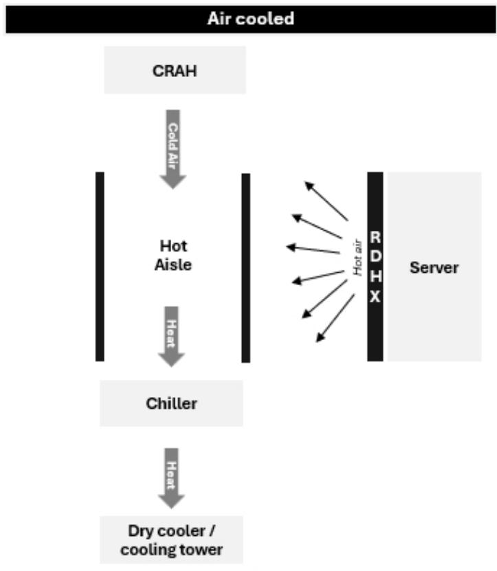  
Heat dumped externally outside facility

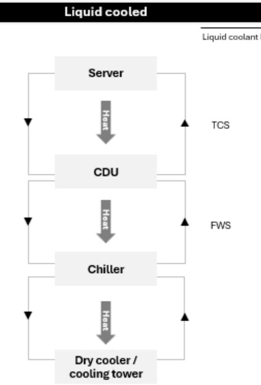  
Heat dumped externally outside facility  
Source: Bernstein Analysis

EXHIBIT 4: Components needed for cooling in data centers (1/2)

<table><tr><td rowspan="2">Component</td><td rowspan="2" colspan="2">Description</td><td rowspan="2">Value ($M/MW)</td><td colspan="2">Requirement in architecture</td></tr><tr><td>Air-cooled</td><td>Liquid-cooled</td></tr><tr><td>Chiller1</td><td>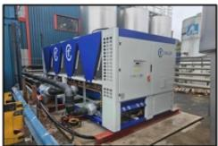</td><td>“Central engine” of the cooling plant, responsible for cooling water to inject into TCS and rejecting heat from warm liquid to the FWS</td><td>~0.45 – 0.55</td><td>✓</td><td>✓</td></tr><tr><td>Dry cooler</td><td>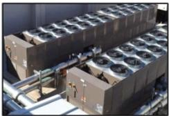</td><td>“Heat fans” to blow hot air outside of the facility</td><td>~0.10 – 0.20</td><td>✓</td><td>✓</td></tr><tr><td>Cooling tower</td><td>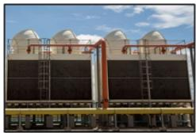</td><td>“Heat rejection equipment” sitting outside the facility to transfer heat from facility water system to environment</td><td>~0.10 – 0.20</td><td>✓</td><td>✓</td></tr><tr><td>Computer room air handler (CRAH)2</td><td>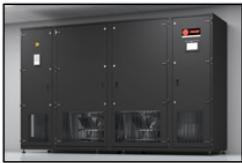</td><td>Data-hall-level air handler that cools residual hot air over chilled-water coils</td><td>~0.40 – 0.60</td><td>✓</td><td>✓</td></tr></table>

1. Fully loaded cost including chiller, installation labor, pipes, pumping, heat rejection equipment (dry coolers and cooling towers) 2. While gross unit price is shown, we have taken residual heat assumptions while calculating overall content cost for both air-cooled and liquid-cooled

Source: Bernstein Analysis, Expert Interviews

## EXHIBIT 5: Components needed for cooling in data centers (2/2)

<table><tr><td rowspan="2">Component</td><td rowspan="2" colspan="2">Description</td><td rowspan="2">Value ($M/MW)</td><td colspan="2">Requirement in architecture</td></tr><tr><td>Air-cooled</td><td>Liquid-cooled</td></tr><tr><td>Rear door heat exchanger (RDHx)1</td><td>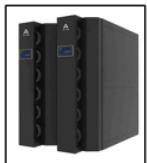</td><td>Server rack-level liquid-to-air coil that rejects heat exhaust from the back of the rack</td><td>~0.30 – 0.50</td><td>√</td><td>√</td></tr><tr><td>Coolant distribution unit (CDU)2</td><td>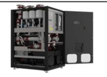</td><td>&quot;Gateway&quot; between facility water and chip-level liquid cooling loop; controls coolant flow, pressure and temperature to liquid-cooled racks</td><td>~0.30 – 0.40</td><td>×</td><td>√</td></tr><tr><td>Cold plates</td><td>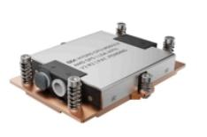</td><td>&quot;Metal plates&quot; mounted on GPUs / CPUs, responsible for pulling heat directly from chip into the liquid loop</td><td>~0.20 – 0.25</td><td>×</td><td>√</td></tr><tr><td>Manifolds</td><td>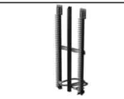</td><td>Rack plumbing that distributes coolant from CDU to each cold plate and returns the warm liquid</td><td>~0.05 – 0.10</td><td>×</td><td>√</td></tr><tr><td>Data center infrastructure management (DCIM) software</td><td>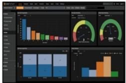</td><td>Monitoring and control software that tracks the entire ecosystem</td><td>~0.05 – 0.10</td><td>√</td><td>√</td></tr></table>

1. While gross unit price is shown, we have taken residual heat assumptions while calculating overall content cost for both air-cooled and liquid-cooled 2. All-in costs for pure-play liquid-to-liquid CDUs including filtration, integration, labor and installation  
Source: Bernstein Analysis, Expert Interviews

EXHIBIT 6: Total cooling content opportunity by architecture (\$M/MW)  
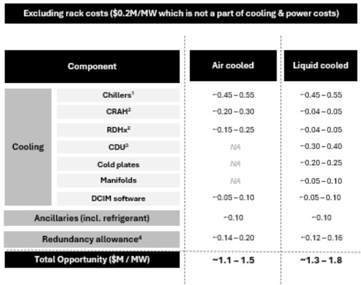  
1. Fully loaded cost including chiller, installation labor, pipes, pumping, heat rejection equipment (city coolers and cooling towers) 2. For air-cooled: assuming required at $50\%$ of gross unit value as residual heat consumption is split 50/50 among CRAH and RDHx; For liquid-cooled: assuming ancillary heat capture split 50/50 among CRAH and RDHx 3. All-in costs for pure-play liquid-to-liquid CDUs including filtration, integration, labor and installation 4. For air-cooled - $15\%$ ; For liquid-cooled - $10\%$

## Source: Bernstein Analysis, Expert Interviews

## POWER ARCHITECTURE IN DATA CENTERS

Data centers currently are powered by AC current from the utility grid. As we move to higher rack densities, hyperscaler deployments are gradually moving towards 800VDC power distribution architectures. The move is not sudden, and will happen through a hybrid setup (using a combination of certain optimized equipment into a “sidecar” first) which we call “Hybrid 800VDC”, before moving to a full-scale 800VDC stack, which we call “Native 800VDC”. We explain these three approaches (and the components used in them) below in greater detail.

Traditional AC architecture: Utility power enters through medium-voltage (MV) switchgear before being stepped down and distributed through low-voltage (LV) switchgear, Automatic Transfer Switch (ATS) systems, Uninterrupted Power Supply (UPS) units and Power Distribution Units (PDUs). Multiple AC-to-DC and DC-to-AC conversions occur throughout the architecture (inside the UPS) before power ultimately reaches the server-level voltage regulators feeding the actual processors. While highly proven and reliable, this topology becomes increasingly inefficient as rack densities increase because of cumulative conversion losses.

Hybrid 800VDC architecture: The most practical near-term pathway towards higher-voltage DC distribution. Power enters the facility through MV switchgear and is stepped down through conventional step-down transformers before being converted from AC to 800VDC using centralized rectifiers. This approach features a box called a “sidecar” - which consolidates the LV switchgear (applicable for DC systems), rectifier (for AC to DC conversion) and the immediate power backup - battery backup unit (BBU). The DC power is then distributed throughout the data hall via busways (similar to PDUs, but optimized for functioning on DC power), while existing AC infrastructure and backup architectures remain largely intact. Power is ultimately converted down to the lower voltages required by processors through voltage regulator modules (VRMs) located at the server level. By eliminating intermediate AC-to-DC and DC-to-AC conversion stages, the architecture improves electrical efficiency while allowing operators to leverage much of their existing facility infrastructure. In our view, hybrid 800VDC should be viewed as an evolutionary step that enables higher-density AI deployments without requiring a complete redesign of the data center electrical stack.

Native 800VDC architecture: Native 800VDC represents the potential long-term end state solution for AI data center power distribution. Rather than relying on traditional AC distribution within the facility, power is converted to high-voltage DC much closer to the utility entrance and distributed throughout the data center as 800VDC. In its ultimate form, a solid-state transformer (SST) would combine voltage conversion, power conditioning and backup functionality into a single piece of equipment, eliminating several legacy components such as UPS systems, conventional transformers and portions of the low-voltage distribution stack. DC power is carried to the racks through busways, where VRMs perform the final conversion required by GPUs (and CPUs). While the architecture offers the potential for the highest efficiency and lowest conversion losses, several enabling technologies (particularly the solid-state transformers) remain at an early stage of commercialization. As a result, we view native 800VDC as a longer-term endpoint for the industry rather than an immediate deployment model.

## Components used in the data center power distribution ecosystem

1. Medium-voltage (MV) switchgear: MV switchgear acts as the primary control and protection layer for utility power entering the facility. It enables fault isolation, switching operations and safe distribution of electrical power.

2. Step-down transformer: Transformers reduce medium-voltage utility power to usable distribution voltages within the data center. They provide the bridge between utility infrastructure and facility electrical equipment.

3. Low-voltage (LV) switchgear: LV switchgear distributes low-voltage electrical power while maintaining protection against faults and overloads. It forms the main distribution layer downstream of transformers. It acts as the “secondary failsafe” (after MV switchgear) that protects the system from utility power fluctuations and short-circuits.

4. Automatic Transfer Switch (ATS): Monitors incoming utility power and rapidly switches loads to backup sources (diesel generator / UPS for AC / BESS for DC) during power outages. They are critical to maintaining uninterrupted operations.

5. Uninterrupted Power Supply (UPS): A key component of traditional AC architectures, UPS provide instantaneous ride-through power during grid disturbances. They protect sensitive IT equipment while backup generation systems start and synchronize. This is done by first converting the incoming AC power into DC to charge an embedded battery. This DC power is then converted back into AC to enable flow through to the rest of the system.

6. Power Distribution Unit (PDU): Rack-level distribution component in AC architectures, PDUs distribute electrical power throughout data halls and individual server racks. They provide localized power management and protection functions.

7. Busway: Rack-level distribution component in AC architectures, busways distribute high-current electrical power through overhead pathways within data halls. They provide a scalable means of delivering power to AI racks.

8. Bulk rectifier: Converts 480VAC to 800VDC for hybrid 800VDC architectures. It eliminates downstream conversion stages and improves efficiency. Given the early stages of development and commercialization, we could not find credible cost estimates for data center-rated bulk rectifiers.

9. Battery Backup Unit (BBU): A key component of Hybrid 800VDC setups, BBU is the primary power backup of the system providing ride-through capability within seconds and power-quality support.

10. Battery Energy Storage System (BESS): A key component of both hybrid and native 800VDC setups, BESS serve as the secondary power backup, providing ride-through capability, backup power and power-quality support. They become increasingly important in emerging DC-power architectures.

11. Voltage Regulator Module (VRM): Perform the final voltage conversion from high-voltage DC to low-voltage DC (consumable by GPUs and CPUs) before power reaches processors. They deliver the low-voltage, high-current power required and consumable by GPUs and CPUs.

12. Solid-State Transformer (SST): The primary component of Native 800VDC architectures, SSTs potentially combine voltage conversion, power conditioning and backup functionality into a one-stop solution. The technology remains nascent but could become an important enabler of native 800VDC systems. Given the early stages of development and commercialization, we could not find credible cost estimates for SSTs.

13. Diesel generator: Responsible for providing extended-duration backup power during utility outages. They remain the dominant source of standby power for mission-critical facilities, a key insurance policy in case power breaks down for a

Immediate enabler of 800VDC

Inside a "sidecar"

Inside the server

longer period.

14. Data Center Infrastructure Management (DCIM) Software: DCIM software monitors and optimizes the performance of power assets throughout the facility. The platform provides operational visibility, alarms, analytics, capacity and performance management for the entire ecosystem.

Basis our analysis, we estimate the total power equipment content opportunity at \$1.8-2.5M/MW for traditional AC powered data centers, \$1.7-2.5M/MW (excluding bulk rectifier) for Hybrid 800VDC powered data centers, and \$1.4-2.1M/MW (excluding solid-state transformer) for Native 800VDC powered data centers.

EXHIBIT 7: There are a spectrum of locations for AC to DC conversion in a data center facility

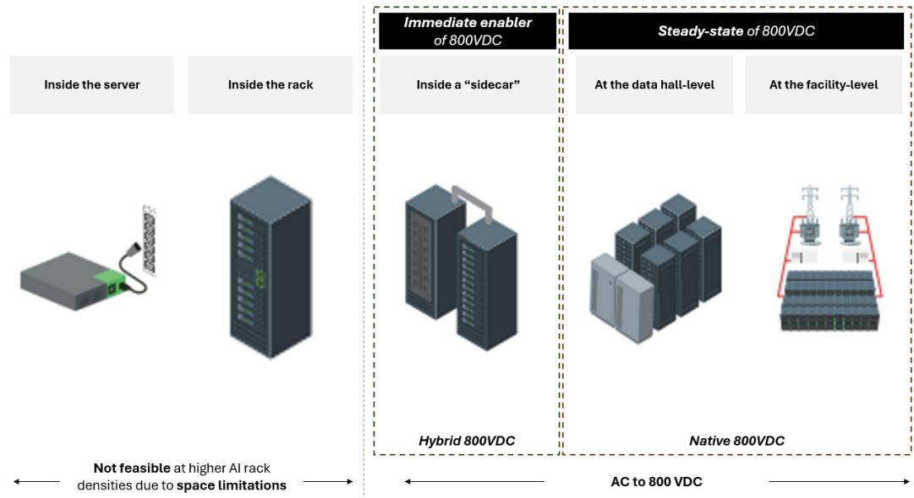  
Not feasible at higher Al rack densities due to space limitations  
Source: Bernstein Analysis, Expert Interviews

EXHIBIT 8: Different power supply architectures for data centers  
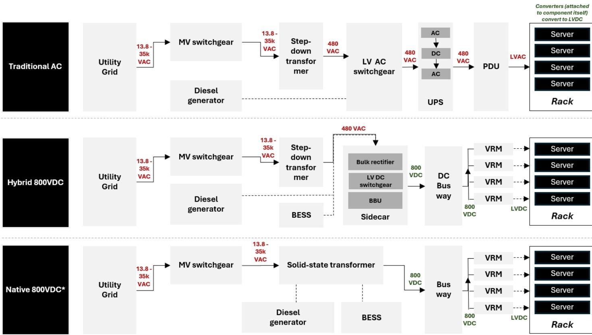  
\* We expect the transition from Hybrid 800VDC to Native 800VDC to be one in stages - with the sidecar eventually getting replaced by a solid-state transformer (including solid-state breakers for switchgear protection integrated into the SST) or a medium-voltage combined transformer-rectifier unit in the steady state

Source: Bernstein Analysis, Expert Interviews

EXHIBIT 9: Components needed for supplying power to data centers (1/3)

<table><tr><td rowspan="2">
