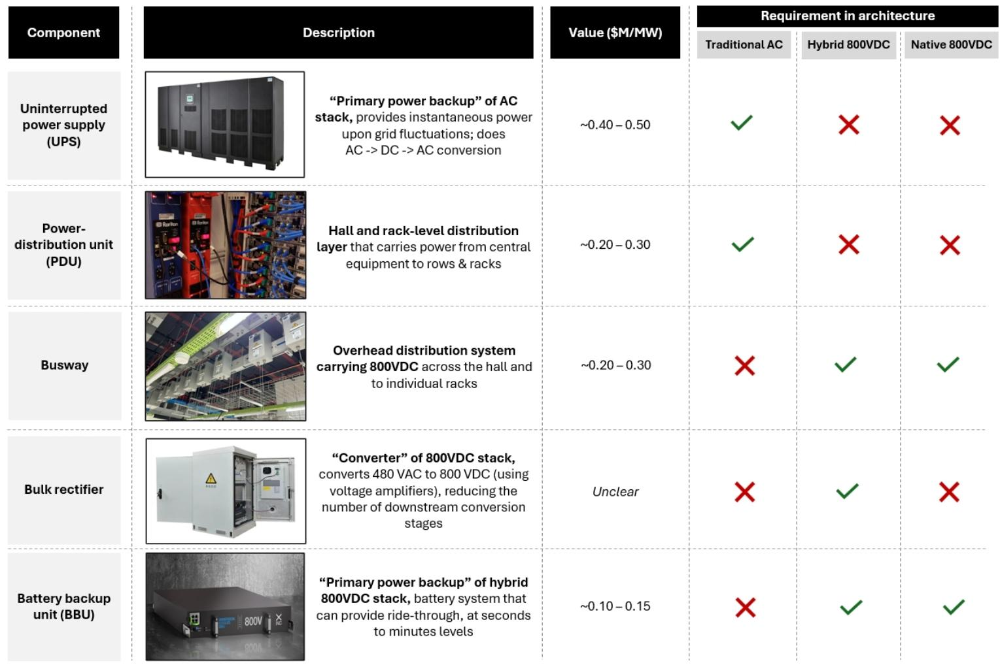
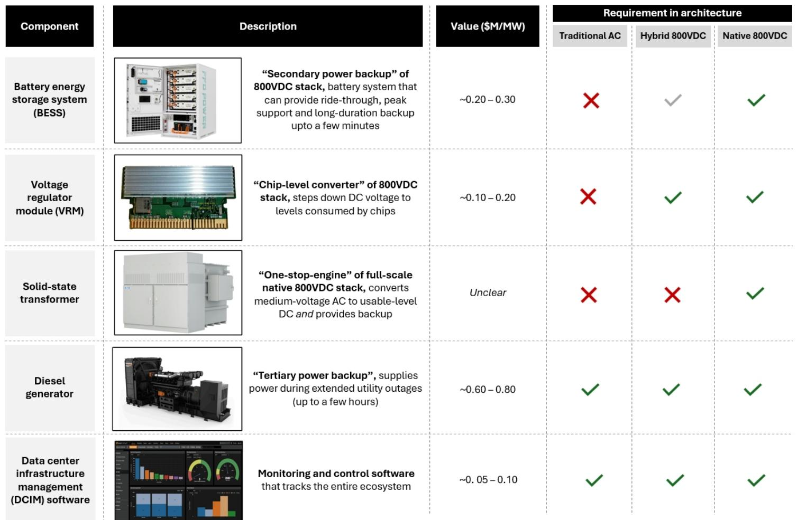
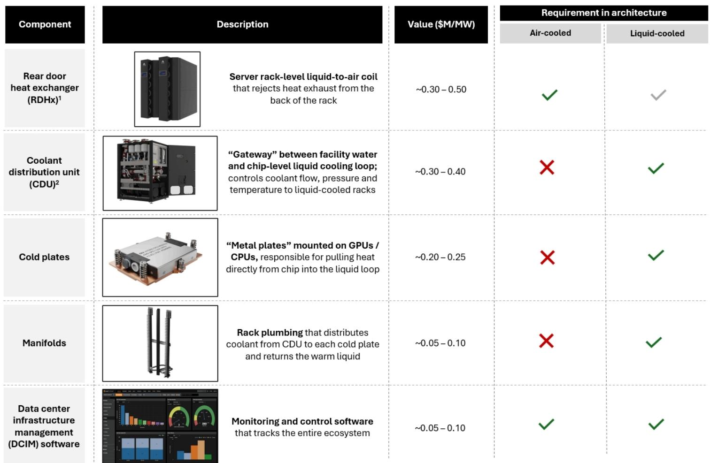

# 数据中心冷却与供电内容正在转变，而非缩减——随着AI基础设施的规模化

数据中心基础设施供应商的市场定位由单一指标决定：每兆瓦的美元价值。某全球研究机构的报告估计，根据架构不同，冷却设备总价值范围为每兆瓦110万至180万美元，而配电设备价值范围为每兆瓦140万至250万美元。这些范围并非微不足道，也并非一成不变。从风冷到液冷架构的转变，以及从传统交流电到直流配电的转变，正在重塑哪些设备类别能够获得价值，而每兆瓦的总可寻址内容基本保持稳定。

将数据中心基础设施视为单一增长故事的研究者，可能会错过赢家与输家之间的关键分化。冷却系统正在经历结构性转变：价值正从机房空气处理机柜和后门热交换器，转向冷却液分配单元、冷板和歧管。配电系统面临更为复杂的转变，因为混合型和原生800伏直流架构在引入整流器、电池储能系统和固态变压器的同时，淘汰了传统的UPS系统。在这些转变过程中，每兆瓦的总美元价值并未崩溃，但其构成发生了变化，这直接决定了哪些公司能够受益。

这一分析的时间节点具有紧迫性。AI机架密度正在快速增加，迫使运营商以两年前几乎无人预料的速度采用液冷。与此同时，随着集群规模超过100兆瓦，更高电压直流架构的电气效率优势已变得不可忽视。理解每种架构下的具体设备内容，已不再是边缘性的分析工作。它是评估哪些供应商有望实现收入增长、哪些供应商在其核心产品线面临过时风险的前提条件。

## 从风冷到液冷的转变将价值转向芯片级热管理设备，而非远离冷却基础设施

传统的风冷数据中心依赖于一条成熟的热管理链条。热量以排热空气的形式离开服务器，部分被安装在机架背面的后门热交换器捕获，然后由机房空气处理机柜处理，这些机柜将经过调节的空气吹过冷水盘管。冷水机组作为核心引擎，将热量传递给干式冷却器或冷却塔，最终排放到周围环境中。在这种架构中，最大的设备成本组件是冷水机组（约每兆瓦45万至55万美元）、机房空气处理机柜（每兆瓦20万至30万美元）和后门热交换器系统（每兆瓦15万至25万美元）。

液冷架构从根本上改变了这种设备组合。直接安装在GPU和CPU上的冷板在芯片层面提取热量，将其转移到循环冷却液流中。冷却液分配单元作为设施水与芯片级液体回路之间的接口，控制压力、流速和温度。歧管将冷却液从冷却液分配单元分配到每个机架内的各个冷板。其结果是，大部分热能通过液体路径被移除，从而在AI工作负载所需的高计算密度下显著提高了冷却效率。

这一转变的美元影响是清晰的。在液冷部署中，机房空气处理机柜的价值从每兆瓦20万至30万美元下降到仅4万至5万美元，降幅约为80%。同样，后门热交换器系统的价值从每兆瓦15万至25万美元下降到4万至5万美元。这些减少并非通过设备淘汰来抵消；它们被新的类别所取代。冷却液分配单元的价值增加了每兆瓦30万至40万美元，冷板增加了每兆瓦20万至25万美元，歧管增加了每兆瓦5万至10万美元。冷水机组作为核心冷却引擎，保持在每兆瓦45万至55万美元，基本不变。

净效果是，总冷却内容从风冷部署中的约每兆瓦110万至150万美元，增加到液冷部署中的约每兆瓦130万至180万美元。这并不是一个随着液冷采用率提高而冷却变得不那么重要的故事。这是一个价值从空气处理设备重新分配到芯片级热管理的故事。在冷却液分配单元、冷板和歧管方面拥有强势地位的公司，正在从一个略大的蛋糕中获取更大的份额。收入主要依赖机房空气处理机柜和后门热交换器销售的公司，则面临结构性挑战，因为现有装机基础正在转变。

## 配电内容在所有架构中仍然可观，但设备组合经历了根本性重新设计，创造了新类别并淘汰了其他类别

数据中心传统的交流配电架构包括中压开关设备、降压变压器、低压交流开关设备、自动转换开关、UPS系统和配电单元。最大的单一成本组件是柴油发电机（每兆瓦60万至80万美元），其次是UPS系统（每兆瓦40万至50万美元）。该架构的总配电价值范围为每兆瓦180万至250万美元。

行业正在评估两种替代架构，以解决传统交流配电的电气效率限制。混合型800伏直流架构引入了大容量整流器、母线槽、电池储能系统、电池备份单元和电压调节模块，同时淘汰了传统的UPS系统和交流配电设备。原生800伏直流架构代表了一种更根本的重新设计，最终可能整合固态变压器和主要基于直流的配电网络，进一步淘汰降压变压器和低压开关设备。

这些架构的总配电价值估算具有启发性。混合型800伏直流架构为每兆瓦170万至250万美元（不包括大容量整流器，研究报告指出该组件的估算存在较大差异，鉴于技术仍在演进，未给出具体观点）。原生800伏直流架构范围为每兆瓦140万至210万美元（不包括固态变压器，同样反映了对该组件最终成本和采用时间表的不确定性）。

关键洞察是，在两种直流架构下，总配电价值并未崩溃。柴油发电机在所有三种架构中均保持在每兆瓦60万至80万美元，因为备用电源需求与配电电压无关。中压开关设备和自动转换开关也得以保留。被淘汰的设备被新类别所取代。在混合型800伏直流架构中，电池储能系统增加了每兆瓦10万至15万美元，电池备份单元增加了每兆瓦10万至15万美元，电压调节模块增加了每兆瓦10万至20万美元。在原生800伏直流架构中，电池储能系统的价值增加到每兆瓦20万至30万美元，反映了随着交直流转换向上游移动，电池备份单元被淘汰。

对研究者的启示是，配电转型不会减少该领域的相对收入机会，但会改变哪些公司能够获得这些收入。传统UPS系统的供应商面临最直接的替代风险。电池储能系统、母线槽和电压调节模块的供应商则有望受益。围绕整流器和固态变压器经济性的不确定性意味着，直流架构中的最终价值分配仍是一个开放性问题，但方向是明确的。

## 设备内容估算为评估供应商在冷却和配电转型中的风险敞口提供了决策框架

研究者可以利用每兆瓦美元价值的估算，构建一个系统性的框架，以评估哪些公司有望从每次架构转型中受益。该框架需要三个输入：每种架构下每个设备类别的每兆瓦估算内容、研究时间范围内每种架构的预期采用率，以及每个供应商在相关设备类别中的具体收入敞口。

对于冷却设备，该框架强调，从风冷到液冷的转型创造了每兆瓦约20万至30万美元的净正面内容机会，但该内容的分布高度不均。冷水机组供应商在很大程度上不受转型影响，因为两种架构都需要冷水机组。机房空气处理机柜和后门热交换器系统的供应商面临负面敞口，内容分别减少了每兆瓦16万至25万美元和11万至20万美元。冷却液分配单元、冷板和歧管供应商则获得了增量内容，合计增加了每兆瓦55万至75万美元。

对于配电设备，该框架揭示，从传统交流电到混合型800伏直流的转型将总内容维持在一个相似范围内，但UPS系统的淘汰为这些供应商减少了每兆瓦40万至50万美元的可寻址市场。电池储能系统、电池备份单元和电压调节模块等新类别增加了每兆瓦30万至50万美元，但这些价值分布在不同的公司。原生800伏直流架构对传统配电设备供应商提出了更具挑战性的前景，相对于传统交流电，总内容减少了每兆瓦40万美元（原文如此，疑为笔误），甚至还未考虑固态变压器不确定的经济性。

该框架还阐明，柴油发电机类别是所有架构中最稳定的组件，始终代表每兆瓦60万至80万美元的内容。这种稳定性反映了无论主电源如何分配，备用电源都是基本需求。在柴油发电机方面拥有强势地位的供应商，拥有一个不受架构转型影响的结构性收入底线。

一个重要提示是，研究报告明确指出，混合型800伏直流架构中的整流器和原生800伏直流架构中的固态变压器的估算存在较大差异。这些组件的技术仍在演进，报告未对其最终成本给出观点。研究者应对任何依赖这些类别的分析应用更宽的置信区间。

## 冷却与配电转型相互依存，创造了跨架构动态，放大了对某些设备类别的影响

将冷却和配电视为独立的分析领域将是一个错误。液冷转型和直流配电转型正在同时发生，由同一根本驱动力推动：AI集群日益增长的功率密度。更高的机架密度每平方英尺产生更多热量，使液冷成为必要。更高的集群功率水平使直流配电带来的电气效率提升更有价值。这两种转型相互强化。

这种相互依存对处于冷却和配电交叉点的设备类别具有特定影响。冷却液分配单元需要电力来运行泵和控制系统。冷板需要依赖于稳定电力供应的精确热管理。在直流架构下，冷却和配电系统的集成变得更加复杂，可能创造对结合了热管理和配电的集成解决方案的需求。

研究报告并未明确建模这些跨架构动态，但二阶影响是清晰的。能够提供集成冷却和配电解决方案的公司，可能相对于组件级供应商获得溢价。专门从事仅在一种架构中需要的设备的公司，面临二元采用风险。例如，收入完全依赖机房空气处理机柜的供应商，同时面临冷却转型和配电转型的负面敞口，因为液冷数据中心需要的机房空气处理机柜更少，而直流架构并未改变这一要求。

两种转型的综合效应是，风险回报状况最有利的设备类别是那些在最多架构中都需要且每兆瓦内容最高的类别。冷水机组、柴油发电机和中压开关设备符合这一标准。冷却液分配单元和冷板符合在增长最快的架构中需要的标准，但在风冷部署中不需要。UPS系统和机房空气处理机柜面临最负面的综合敞口。

## 每兆瓦总可寻址内容是评估供应商收入增长的必要但不充分指标

每兆瓦美元价值的估算为衡量可寻址市场提供了有用的基线，但它们并未捕捉到将决定单个供应商实际收入结果的几个因素。第一个因素是架构采用的速度。研究报告提供了每种架构下的内容估算，但并未预测数据中心运营商从风冷到液冷或从交流电到直流电转型的时间表。供应商的实际收入影响取决于采用速度，这受到AI芯片功率密度趋势、运营商接受新架构的意愿以及监管要求等因素的影响。

第二个因素是定价动态。报告中的估算是基于当前设备成本，这些成本可能随着生产规模扩大、技术成熟和竞争加剧而变化。例如，冷却液分配单元的定价可能随着产量增加和更多供应商进入市场而下降。冷板定价可能受到不同冷却液化学成分或制造工艺采用的影响。这些定价动态对每兆瓦总内容的净影响是不确定的。

第三个因素是现有装机基础效应。数据中心运营商不会在每次架构转型时都建造全新的设施。他们改造现有设施、逐步扩大容量并维护遗留设备。供应商的收入机会不仅包括新建项目，还包括升级、更换和现有设备的维护。风冷数据中心的现有装机基础将在未来数年继续为机房空气处理机柜、后门热交换器系统和传统UPS设备创造需求，即使新建项目正转向液冷和直流电。

第四个因素是地域差异。数据中心建设集中在具有不同监管环境、气候条件和劳动力成本的特定区域。冷却设备要求在温带和热带气候之间有所不同。配电架构可能受到当地电网特性和公用事业法规的影响。每兆瓦美元价值的估算代表了全球平均值，可能并非在所有市场都统一适用。

研究者应将内容估算作为供应商分析的起点，而非确定的收入预测。该框架在与公司特定分析（如市场份额、产品定位、客户关系和制造规模）结合时最有价值。在多个架构的多个高内容类别中拥有强势地位的公司，拥有最具韧性的收入状况。对面临替代风险的单一类别有集中敞口的公司，则需要更仔细的审视。

*仅供参考。部分内容可能基于源材料通过AI辅助生成、翻译、总结或编辑，可能存在遗漏或错误。请独立核实。本文不构成研究、法律、税务、会计或其他专业建议。*

仅供参考。部分内容可能基于源材料通过AI辅助生成、翻译、总结或编辑，可能存在遗漏或错误。请独立核实。本文不构成研究、法律、税务、会计或其他专业建议。

