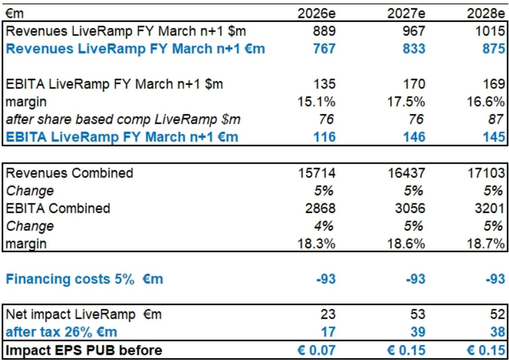
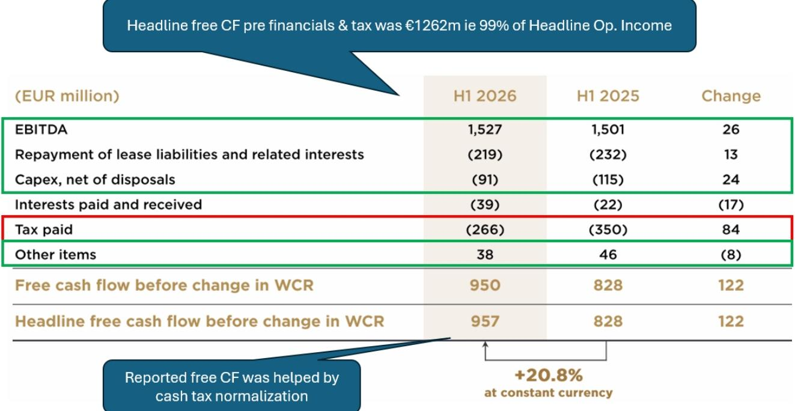
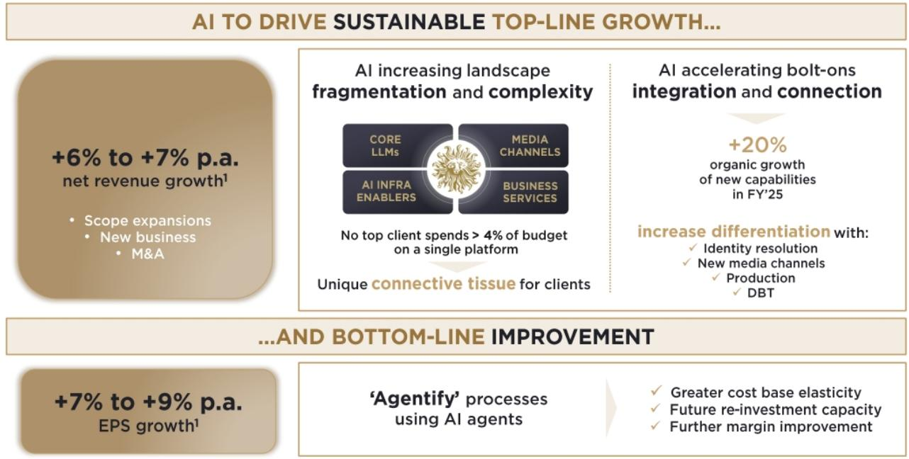

# Publicis Has Broken the Agency Growth Mold — And the Market Has Not Yet Priced the Multi-Year Visibility

The most striking signal from Publicis Groupe's 1H26 results is not the 4.8% organic growth beat against consensus, nor the 10 basis point margin improvement. It is the forward visibility the company has created into 2027 — a structural rarity in an industry where clients typically commit budgets quarter by quarter. CEO Arthur Sadoun disclosed that 1H26 account wins will contribute approximately 200 basis points of revenue on a full-year basis, with only 50 basis points recognized in 2026 and the remaining 150 basis points flowing into 2027. That pattern, which mirrors the consistent organic growth contributions Publicis has delivered from 2024 through 2026, provides a degree of revenue predictability that no major agency holding company has historically offered.

This forward visibility matters because it addresses the single most persistent concern about advertising agencies: that their revenue streams are inherently volatile, client relationships are fragile, and competitive moats are shallow. Publicis is demonstrating that a well-structured combination of data assets, technology integration, and client retention can produce a compounding effect — what Jim Collins calls a flywheel — that generates both continuity and the reinvestment capacity to extend the advantage. The share price has stabilized at an 11x P/E on 2026 estimates, a level that implies the market has partially discounted AI-related disruption risk. But the growth differential versus peers and the visibility into 2027 suggest that this valuation does not yet reflect the full compounding potential.

---

## The Agency Sector Has Decoupled from the "AI Losers" Basket Because Derating Has Reached a Floor, Not Because the AI Debate Is Resolved

Publicis shares are slightly positive year-to-date and have risen more than 25% from the mid-February 2026 lows. The broader agency group, excluding WPP, has been broadly flat over the same period. This performance stands in stark contrast to other business models frequently grouped with agencies in the "AI disruption" narrative — notably the consulting and IT services firms Capgemini and Accenture, as well as professional publishers — all of which have continued to derate. The divergence is not driven by a resolution of the AI debate. That debate remains unsettled, and the structural questions about how generative AI will reshape service-based business models are as open as ever.

What has changed is the valuation adjustment. The agencies' price-to-earnings multiples have reset into a high-single-digit to 10x range on 2026 estimates, implying free cash flow yields in the low teens. Those are precisely the valuation levels at which Accenture and Capgemini now trade. The market appears to have concluded that, at these multiples, the AI risk is adequately priced — not that the risk has disappeared. Publicis trades at a premium to this range, at approximately 11x 2026 estimated earnings. That premium is justified by the expected organic growth differential. Consensus estimates show Publicis growing organic revenue at 4.7% in 2026, 4.4% in 2027, and 4.2% in 2028. The average of its agency peers, by contrast, is expected to grow at roughly 0.1% in 2026 and 1.3% in 2027. Accenture, the closest non-agency comparator, is expected to grow at 2.1% and 1.9% over the same periods.

The implication is clear. Publicis is not merely benefiting from a sector-wide valuation floor. It is earning a valuation premium through demonstrated growth superiority. The question for observers is whether that premium should expand further as the forward visibility into 2027 becomes more widely recognized.

---

## Organic Growth of 4.8% Conceals a Core Business Growing Above 6%, With Sapient as the Sole Drag

Second-quarter organic growth of 4.8% came in slightly above the consensus estimate of 4.7% and the company's own indicated range of 4% to 5%. This marks the continuation of a consistent pattern: Publicis has beaten quarterly organic growth expectations by an average of 60 basis points over the past eight quarters, with a range of 10 to 130 basis points. The beat was achieved against sequentially stronger comparable bases, which adds to its credibility.

The headline number, however, understates the strength of the core advertising and media businesses. Sapient, Publicis's digital transformation and consulting unit, posted a mid-single-digit revenue decline in the quarter. The unit has been negatively affected by delayed client projects, a dynamic that other consulting firms have also cited. Sapient now represents approximately 13% of total group revenue, down from 14% in the prior year. Its negative contribution to organic growth was roughly 70 basis points in the quarter. Excluding Sapient, the rest of Publicis's business grew organic revenue at more than 6% in the second quarter and at 6.0% in the first half of 2026.

The Middle East and Africa region, which accounts for only 3% of group revenue, was another headwind. The disruption from regional conflicts intensified from the first quarter to the second, with organic growth declining 8.3% in Q2 compared with a 5.1% decline in Q1. This created an approximately 30 basis point drag on consolidated organic growth. North America and Europe, the two largest regions, both delivered mid-single-digit organic growth — 5.4% and 5.0% respectively — with no signs of deceleration.

The category mix also shifted in the first half of 2026. In fiscal 2025, the top growth categories were technology, healthcare, and automotive. In the first half of 2026, food and beverage and financial services emerged as the leading contributors. This diversification reduces reliance on any single sector and suggests that Publicis's client acquisition and retention capabilities are broadly based rather than concentrated in a few high-growth verticals.

---

## Margin Expansion Remains on Track Because Revenue Growth Funds Reinvestment, Not Because Costs Are Being Cut

The first-half headline operating margin came in at 17.5%, a 10-basis-point improvement from 17.4% in the same period of 2025. The margin bridge reveals a more nuanced picture. Personnel costs as a percentage of net revenue declined significantly, from 66.7% to 65.6%. This improvement was partially offset by an increase in other operating expenses, which rose from 11.4% to 12.1% of net revenue. The company explicitly cited AI-related investments as a driver of the increase in other operating expenses.

This pattern is strategically important. Publicis is not achieving margin expansion through aggressive cost-cutting or headcount reduction. It is reinvesting a portion of its revenue growth into the capabilities — data, technology, and talent — that sustain the flywheel. The personnel cost reduction reflects productivity gains and a shift in the mix of skills, not a reduction in the overall workforce. The increase in other operating expenses reflects deliberate investment in AI tools, data infrastructure, and platform development.

The full-year margin outlook remains consistent with the 18.2% headline operating margin achieved in fiscal 2025 and the 18.4% and 18.6% levels estimated for fiscal 2026 and 2027 respectively. These are not aggressive margin targets. They imply modest incremental improvement, which is achievable given the revenue growth trajectory and the operating leverage inherent in the agency model. The risk to margins is not that costs will spiral, but that revenue growth could decelerate if the account win pipeline slows or if Sapient's challenges persist. The forward visibility into 2027 reduces that risk meaningfully.

---

## A Decision Framework for Observers: The Flywheel Logic Creates Three Distinct Sources of Return

For those evaluating Publicis, the flywheel framework provides a structured way to assess the case. The concept, as articulated by Jim Collins, describes a self-reinforcing cycle where each component strengthens the others. In Publicis's case, the flywheel operates through three linked mechanisms.

First, account wins and strong client retention generate mid-single-digit organic growth. Publicis has maintained an organic growth gap of approximately 4 to 6 percentage points versus the average of its agency peers for the past eight quarters. This gap is not a short-term phenomenon. It reflects structural advantages in data and identity capabilities, which were strengthened by the LiveRamp acquisition announced in May 2026, and in the integration of creative, media, and technology services. The company's ability to retain clients without going through competitive reviews — "not being up for review in the first place" — is a qualitative advantage that does not appear in financial statements but has a direct impact on revenue stability.

Second, mid-single-digit revenue growth funds reinvestment in talent and technology. The 110-basis-point reduction in personnel costs as a percentage of revenue in the first half of 2026 was not achieved by cutting headcount. It was achieved by improving productivity and shifting the skill mix toward higher-value capabilities. The increase in other operating expenses, including AI investments, represents the reinvestment of a portion of those savings. This reinvestment cycle is what prevents the flywheel from slowing down.

Third, the combination of moderate revenue growth, margin expansion, and a dividend yield above 4% produces total shareholder returns in the mid-single-digit to high-single-digit range on a constant-currency basis. The current valuation of 11x 2026 estimated earnings implies a free cash flow yield of approximately 9% to 10%. If the market re-rates Publicis toward the 12x to 13x range as the forward visibility becomes more widely appreciated, multiple expansion would add a further component.

The key risk to this framework is that the flywheel could decelerate if the account win pipeline dries up, if Sapient's challenges deepen, or if AI disruption accelerates to the point where clients begin to internalize services that agencies currently provide. The first two risks are partially mitigated by the forward visibility into 2027. The third risk is real but appears to be already priced into the current valuation, given that the sector's P/E multiples have reset to levels that imply significant disruption. Publicis's ability to reinvest in AI capabilities — and to frame itself as "AI compatible" rather than an "AI loser" — provides a strategic response to the disruption narrative that the share price has not yet fully rewarded.

---

## The Competitive Gap Is Widening, and Publicis Is the Only Agency with a Visible Multi-Year Growth Trajectory

The organic growth comparison with peers is stark. Over the past eight quarters, Publicis has outperformed the average of its agency peers by 4 to 6 percentage points. In the second quarter of 2026, the gap was 4.7 percentage points. The peer average, excluding Publicis, was approximately 0.1% organic growth. Omnicom grew at 3.5%, Havas at 2.5%, and WPP declined by 5.8%. The gap between the best-performing agency (Publicis) and the worst-performing (WPP) reached 10.6 percentage points in the quarter.

This divergence is not cyclical. It reflects structural differences in client relationships, service offerings, and data capabilities. WPP's underperformance is company-specific, driven by lagging organic growth and a balance sheet that magnifies the impact of valuation changes. Omnicom and Havas are performing adequately but are not generating the same momentum. Publicis is the only major agency holding company that has consistently grown organic revenue above 4% for the past three years, and the only one that can point to a visible pipeline of revenue contribution extending into 2027.

The implication for observers is that Publicis should not be evaluated as a generic agency stock. The sector has been derated to a range where all agencies trade at similar multiples, but the underlying earnings trajectories are diverging. Publicis's premium valuation is justified by a growth differential that is likely to persist, given the account win pipeline and the retention track record. If the market begins to differentiate more sharply between agencies based on growth quality and visibility, Publicis could re-rate further. The current valuation does not yet reflect the compounding effect that a multi-year growth trajectory, combined with reinvestment capacity, can produce over time.

*For informational purposes only. Portions may be generated, translated, summarized, or edited with AI assistance based on source materials and may contain omissions or errors. Please verify independently. This is not professional advice.*

For informational purposes only. Portions may be generated, translated, summarized, or edited with AI assistance based on source materials and may contain omissions or errors. Please verify independently. This is not professional advice.

