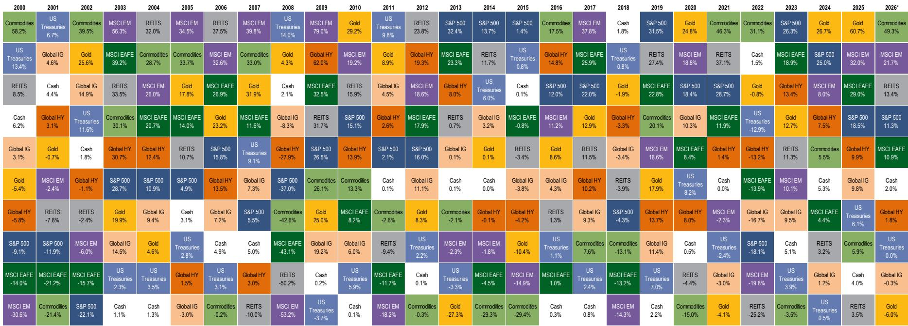
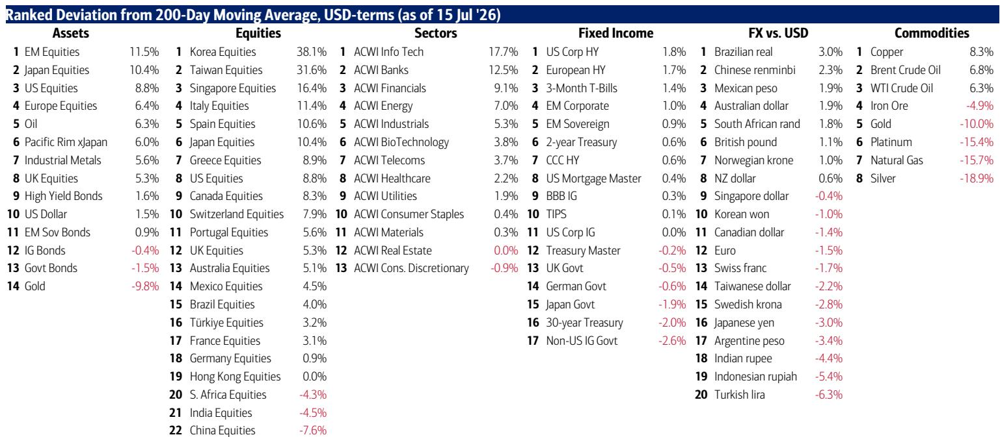
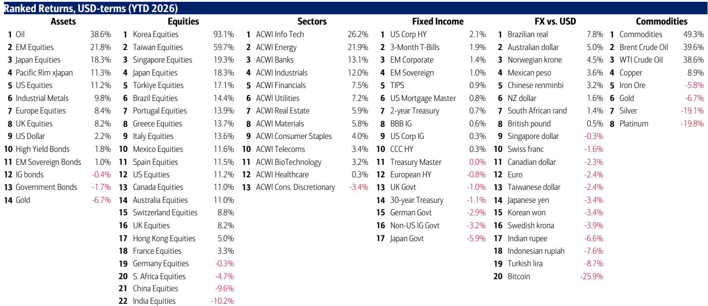

# 市场共识的拥挤程度：当前环境下值得关注的信号

BofA牛熊指标已升至9.6，进入极端看涨区域，并触发了报告所称的“信号”。这不是一个简单的数据点。它提示我们，当前市场头寸共识已变得高度一致，市场的主要风险不再是负面因素的出现，而是所有想买入的人都已经买入。周度资金流数据证实了这种拥挤程度：558亿美元流入股票，200亿美元流入债券，而高达1196亿美元从现金中流出——这是自2026年4月以来最大的现金流出。市场参与者不仅仅是乐观，他们以历史上往往预示转折的速度投入了资金。

当前环境的核心矛盾在于，这种极端头寸建立在一系列相当脆弱的假设之上。7月全球基金经理调查显示，54%的读者现在相信全球经济将出现“不衰退”情景——这种宏观繁荣叙事自2022年2月（上一次大幅回调之前）以来从未如此受欢迎。高达83%的人预计美联储在11月中期选举前不会加息。61%的人认为，到2026年底前，没有一家超大规模企业会削减AI资本支出。这三个信念——不衰退、不加息、不削减资本支出——构成了当前看涨案例的知识基础。然而，每一个信念都容易受到数据、基本面或简单均值回归的影响。

报告的分析框架并非预测即将崩溃。它是一个战略论点，即在此水平上增加风险资产的回报风险比不佳，更明智的夏季策略是从拥挤的交易中撤退，或轮换到共识已放弃的资产。支持这一观点的证据分布在资金流、估值、基金经理调查数据以及半导体和银行板块的具体技术信号中。论点并非牛市结束，而是头寸已成为一种自我限制机制。

## 半导体和科技基金创纪录的资金流入已形成头寸陷阱，而非买入机会

当前市场最显著的矛盾在于科技和半导体板块的价格走势与资金流之间。费城半导体指数已从其峰值下跌20%。杠杆SOXL产品下跌55%。这是一个显著的价格回落。然而，头寸并未相应减少。事实上，报告显示，单周有23亿美元流入八只最大的半导体ETF，使年初至今的总流入达到460亿美元，占这些基金总资产基础的31%。过去三周，创纪录的488亿美元流入科技基金。

这种模式在分析上是危险的。通常，高贝塔指数下跌20%会引发资金流出，因为动量交易者投降，风险管理者减少敞口。资金流入在下跌过程中加速的事实意味着，边际买家不是对价格敏感的价值读者，而是追逐动量的资金流，无论估值如何都在机械地增加头寸。费城半导体指数目前仅比其200日移动平均线高出33%，低于6月3日的76%——报告指出，这一水平仅在2000年3月科技泡沫顶峰时被超越。头寸尚未适应价格现实。当回调发生时，如果过度拥挤没有减少，风险不是回调结束，而是它仅仅是第一阶段。第二阶段通常会在资金流停止时到来，机械买家变成机械卖家。

这对组合策略的影响是明确的。在此次下跌中不应增加半导体和科技敞口。资金流表明，下跌已被现已完全投入的读者吸收，几乎没有剩余资金用于持续复苏。报告的分析框架指向MAGS指数作为关键战术信号：跌破65美元将预示更广泛的市场撤退，这将损害周期性板块；而升至70美元以上将是最好的重新加载信号。在该水平被收复之前，科技重仓组合进一步下行的风险较高。

## “不衰退”共识已将银行股推至历史高位，使其成为拥挤宏观乐观情绪中最脆弱的表现

报告对全球银行股进行了有力的横截面分析，揭示了“不衰退”叙事被定价的程度。美国银行股处于历史高位。日本银行股处于1996年11月以来的最高水平。英国银行股处于2007年12月以来的最高水平。欧洲银行股处于2008年6月以来的最高水平。除美国外，这些基准指数中的每一个仍远低于其相对历史峰值——日本银行股仍比1996年高点低49%，欧洲银行股比2008年高点低39%——但轨迹是明确的。共识已为持续繁荣定位，银行股是该押注最纯粹的表达。

这里的逆向逻辑很简单，但在实时中常被忽视。当整个市场都为繁荣定位时，最好的交易不是加入繁荣，而是关注那些如果繁荣未能实现将受益的资产。报告确定了“3D”——久期（10年期政府债券）、防御性（必需品和Mag7垄断企业）和高股息回报表现股票——作为逆向轮换。这不是对经济的看跌判断。这是认识到失望的风险是不对称的。如果“不衰退”情景被证明是正确的，银行股从当前水平的上行空间有限，因为乐观情绪已被嵌入。如果情景失败——如果增长放缓，或通胀迫使美联储做出反应，或AI资本支出被削减——银行股的下行空间很大，因为每个人都持有它们。

强化这一谨慎态度的具体数据点是BofA私人客户的行为，他们管理着4.6万亿美元资产。他们的股票配置为65.8%，而现金配置已降至创纪录低点9.6%。这些客户并未减少风险。他们在增加股票，包括市政债券和防御性板块ETF，但他们也在卖出材料、低波动性和能源ETF。私人客户行为反映了机构共识：完全投入，对冲最小。这不是信心的迹象。这是自满的迹象。

## AI资本支出论点是三个共识信念中最脆弱的，债券市场已在发出警告信号

当前看涨案例的第三个支柱——即到2026年底前没有超大规模企业会削减AI资本支出——得到了61%的受访基金经理的支持。然而，报告的数据表明，这一资本支出的财务基础正在恶化。超大规模企业的资本支出预计将在2026年跃升87%至7690亿美元，但自由现金流预计将在2027年转为负值。资金压力在债券市场中可见：甲骨文的5年期CDS已从2025年9月的59个基点扩大至目前的87个基点，美国IG科技利差正回升至其高点。

报告强调了一个关键的市场信号：近期“做多MAGS，做空SOX”的表现暗示，资本支出削减可能即将到来。这不是预测。这是对相对价格走势的观察。Mag7大型股的表现一直优于半导体股，这与如果AI建设加速时人们所期望的相反。当基础设施提供者跑输基础设施消费者时，通常意味着市场正在贴现支出放缓。

报告认为，最大的意外将是资本支出削减未能推动Mag7升至71美元以上的新高。如果Mag7在资本支出削减后未能突破，这将表明支出减少对增长和资产价格的负面影响大于对Mag7自身利润率的正面影响。这种情况将引发对银行、经纪商和工业股的做空——这些周期性板块从AI繁荣叙事中受益最多。对于组合构建而言，这意味着Mag7并非科技股中的避风港。它们是金丝雀。如果它们无法在好消息中上涨，整个板块都是脆弱的。

## 应对极端头寸的决策框架：轮换向久期、防御性和股息回报表现，而非重新加载风险

报告的分析结构直接转化为机构读者的实用决策框架。该框架建立在三个条件分支上，每个分支都与特定的共识信念及其潜在失败点相关联。

首先，如果“不衰退”共识是错误的，正确的对冲是持有久期、防御性和股息回报表现。预期宏观繁荣的54%读者已涌入周期性板块，尤其是银行股。逆向交易是关注10年期政府债券、必需品和高股息股票。这不是衰退押注。这是押注经济将比极端乐观情绪所暗示的更慢，这将导致回报表现下降和防御性板块重新定价。

其次，如果“不加息”共识是错误的，正确的对冲是持有美元。报告指出，美国CPI趋势预计到2026年底为3.9%，而原油库存处于45年来的最低点——仅43天供应量——霍尔木兹海峡仍是一个地缘政治风险。市场对年底油价定价为每桶71美元，低于86美元，这与供应数据似乎不一致。11月前意外加息可能会加强美元并施压风险资产，尤其是新兴市场。

第三，如果“不削减AI资本支出”共识是错误的，正确的对冲是做空半导体和周期性板块，同时保持对Mag7和软件的多头敞口。报告关于超大规模企业自由现金流和不断上升的信用利差的数据表明，融资环境正在收紧。资本支出削减对整个半导体生态系统将是负面的，但最初可能对Mag7利润率是正面的。需要关注的关键信号是MAGS指数：高于70美元是重新加载信号；低于65美元预示更广泛的撤退。

该框架不需要看跌的宏观观点。它需要承认当前头寸是不可持续的。BofA牛熊指标在9.6水平在过去一直是一个可靠的信号。科技股创纪录的资金流入和私人客户创纪录的低现金配置表明，边际买家已被耗尽。最审慎的策略不是预测催化剂，而是为轮换做准备。久期、防御性和美元是拥挤交易平仓时受益的资产。周期性板块、银行股和半导体股是遭受损失的资产。

论点并非牛市结束。而是夏季月份可能以均值回归为特征，而非趋势延续。最佳策略是从最拥挤的交易中撤退，并轮换到共识已放弃的资产。这是资金流、调查和头寸数据都支持的战略洞察。

*仅供参考。部分内容可能基于源材料通过AI辅助生成、翻译、总结或编辑，可能存在遗漏或错误。请独立核实。这不构成投资、法律、税务、会计或其他专业建议。*

仅供参考。部分内容可能基于源材料通过AI辅助生成、翻译、总结或编辑，可能存在遗漏或错误。请独立核实。这不构成投资、法律、税务、会计或其他专业建议。

