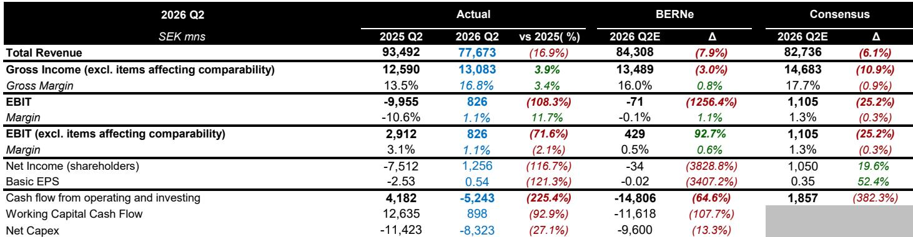
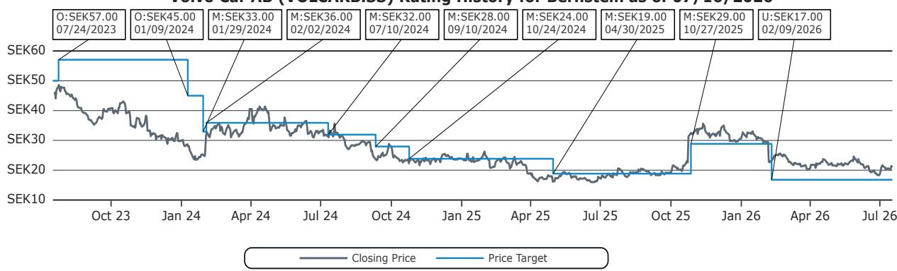

# Volvo Car 第二季度表现观察：结构性挑战与下半年展望

Volvo Car AB 公布了2026年第二季度业绩，毛利较市场预期低11%，息税前利润低25%，毛利率为16.8%，而市场预期为17.7%。公司自由现金流为负52亿瑞典克朗，而市场预期为正19亿瑞典克朗。管理层继续预测下半年销售将“显著增强”，并实现全年自由现金流盈亏平衡，但他们的指引与本季度运营现实之间的差距正在扩大。

这些数据揭示的问题远不止一个季度的疲软。收入同比下降17%至777亿瑞典克朗，低于市场预期6%。全球零售销量下降6%，其中中国市场下降37%，这一降幅无法被美国或欧洲的任何复苏故事所抵消。公司的息税前利润为8.26亿瑞典克朗，虽然为正，但依赖于大幅降低的研发支出才得以高于分析师的盈亏平衡预测。剔除这一成本时间因素，基础盈利状况比表面数据更差。

这不仅仅是周期性低谷。Volvo Car正面临毛利率的结构性压缩，由三个因素驱动，这些因素不会在下半年逆转：销量向低利润车型转移导致的销售组合恶化、欧洲持续的价格压力，以及排放信用额度带来的9亿瑞典克朗同比利好消失。公司对下半年的乐观情绪依赖于新车型发布和库存消化，但这两者都无法解决核心的盈利能力问题。

## 中国市场下滑并非暂时性逆风，而是欧洲和美国无法填补的结构性收入缺口

Volvo Car第二季度中国零售销量同比下降37%，这一恶化速度使得全球6%的降幅看起来几乎可以接受。这并非新情况。公司在收盘前简报中已就中国市场的艰难发出警告，但业绩不及预期的幅度表明，问题比需求放缓更为根本。中国消费者正从高端内燃机和轻度混合动力车型转向本土纯电动车型，而Volvo Car在中国的产品线正处在这一转型的中间位置。

数据是残酷的。中国在Volvo Car的批发销量中占很大比重，并在其高利润销售中占据不成比例的份额。该市场37%的下降意味着需要从其他地方弥补巨大的收入基础。美国增长9%，欧洲持平，但这些地区加起来无法以同等利润率吸收失去的中国销量。美国的复苏虽然令人鼓舞，5月和6月均有增长，但基数较低，且面临自身的价格压力。欧洲的价格压力依然严峻，并非利润率扩张的来源。

对观察者而言，结论是明确的。任何依赖下半年中国销量复苏来填补收入缺口的观点，都得不到数据支持。该公司在中国的轨迹是一个多季度、甚至多年的结构性调整事件，而非季节性波动。

## 毛利率压缩由组合和定价驱动，而非仅仅是成本通胀，并将持续至下半年

毛利率低于市场预期90个基点，是报告中最具揭示性的数据。16.8%的毛利率高于去年同期的13.5%，但这种比较具有误导性。2025年第二季度的数据受到一次性项目的压制，包括一笔33亿瑞典克朗的销售，这抬高了上年基数。按正常化基础计算，环比和同比趋势均在恶化。

公司将息税前利润下降归因于“较不利的销售组合和定价、较弱的批发销量、负面的折旧和摊销影响，以及排放信用额度收入减少”。这是一个密集的列表，但组合和定价因素对前瞻展望最为重要。较不利的销售组合意味着Volvo Car正在销售更多低利润车型，而高配置、高利润的盈利车型则减少。这不是一个可以通过效率措施解决的成本问题，而是一个产品和需求问题。

排放信用额度收入从2025年第二季度的17亿瑞典克朗降至本季度的8亿瑞典克朗，减少了9亿瑞典克朗的高利润收入，直接影响息税前利润。这一项目本身具有波动性，取决于监管动态和竞争对手的合规策略。公司不能将其视为可靠的盈利支撑。

分析师在季度前的模型假设毛利率为16.0%，已低于市场预期。16.8%的实际结果高于该内部估计，但这仅仅是因为研发支出低于模型假设。毛利率本身与悲观情景一致，并非改善迹象。

## 自由现金流消耗削弱了全年盈亏平衡目标的可信度

自由现金流为负52亿瑞典克朗，比市场预期的正19亿瑞典克朗低71亿瑞典克朗。这不是一个小幅偏差。这是近四分之三欧元的波动，令人质疑公司实现全年自由现金流大致盈亏平衡这一既定目标的能力。

管理层的解释指向库存积累，这些库存将在下半年随着新车型发布而消化。分析师自己的模型曾预测大量营运资本流出，因此Volvo Car报告小幅营运资本流入的事实表明，现金消耗来自运营表现，而非库存融资。净资本支出为83亿瑞典克朗，同比下降27%，但相对于公司的盈利能力仍处于高位。

要实现全年盈亏平衡，Volvo Car需要在下半年产生约50亿瑞典克朗的自由现金流，假设上半年没有进一步恶化。这需要运营现金生成能力的显著改善，而不仅仅是营运资本正常化。公司自身关于下半年后期“强劲正”自由现金流的指引是理想化的，而非基于证据。

对于一家以2026年预期收益8.5倍和2027年预期收益2.8倍交易的公司而言，现金流轨迹是更相关的估值指标。这些倍数假设了第二季度现金流数据所矛盾的复苏。

## 评估Volvo Car下半年复苏前景的决策框架

评估下半年叙事的观察者应关注四个具体变量，这些变量将决定公司的指引是否可实现，或者是否不可避免地需要进一步下调。

首先，每月监测中国零售销量趋势。37%的下降并非会自动逆转的基数效应。如果第三季度中国销量仍下降超过20%，全年销量指引将面临风险。其次，按季度跟踪剔除排放信用额度后的毛利率。剔除这一波动项目后的基础利润率，如果组合和定价压力正在缓解，应显示环比改善。第三，将下半年自由现金流与上半年52亿瑞典克朗的消耗进行比较。公司需要在下半年产生至少50亿瑞典克朗才能实现盈亏平衡。任何现金生成低于25亿瑞典克朗的季度，都会使全年目标变得不可能。第四，关注营运资本项目。如果库存继续积累而非消化，下半年的现金流论点将崩溃。

9月在斯德哥尔摩举行的资本市场日将是重新设定预期的关键事件。公司有机会就这四个变量提供详细的指引。如果没有，市场将假设最坏情况。

## 产品周期与利润率复苏处于不同时间线，市场正在定价错误的一条

Volvo Car的估值表明，观察者正在透过当前的疲软看向2027年的复苏，届时公司预计每股收益为7.61瑞典克朗。以该估计的2.8倍计算，该报价看似便宜。但从当前盈利能力到该预测的路径并非线性，第二季度结果表明起点低于共识模型假设。

公司将在下半年推出新车型，并计划举办资本市场日，这两者都可能成为积极催化剂。然而，新车型发布通常会因发布成本、学习曲线低效率以及需要折扣清理旧库存而最初压低利润率。公司预期的下半年利润率改善，在汽车周期中是不寻常的，因为新产品引入通常对盈利能力构成短期拖累。

更可能的情况是，下半年从非常低的上半年基数显示出适度的环比改善，但不足以达到全年共识或自由现金流目标。真正的复苏（如果出现）将在2027年到来，届时新车型已上量，中国逆风可能已稳定。但这一时间线使该报价面临长期盈利失望和现金流压力的风险。

以8%的加权平均资本成本计算，意味着当前21.15瑞典克朗有显著下行空间。第二季度结果使该目标看起来更现实，而非更不现实。该公司的债券以3.5%的到期回报表现交易，这已经反映了比股权市场定价更高的风险溢价。

该报价的张力在于，估值折现了2027年的复苏，而运营轨迹仍在恶化。在公司证明其能够在正常季度稳定毛利率并产生正自由现金流之前，举证责任在于管理层，而非悲观者。

*仅供参考。部分内容可能基于源材料通过AI辅助生成、翻译、总结或编辑，可能存在遗漏或错误。请独立核实。本文不构成专业建议。*

仅供参考。部分内容可能基于源材料通过AI辅助生成、翻译、总结或编辑，可能存在遗漏或错误。请独立核实。本文不构成专业建议。

