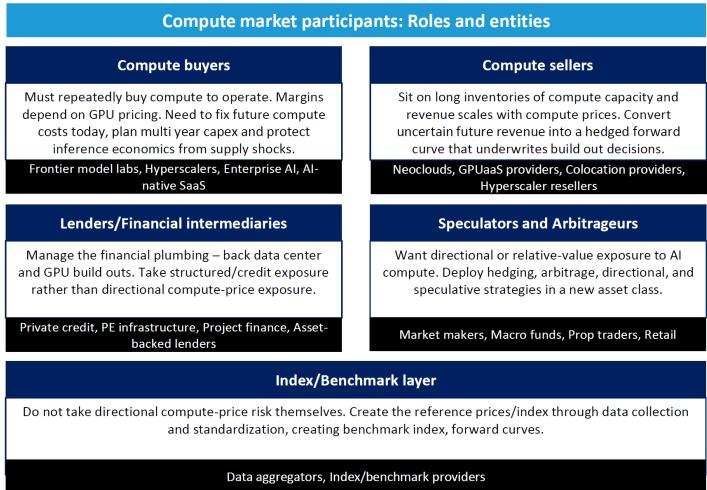
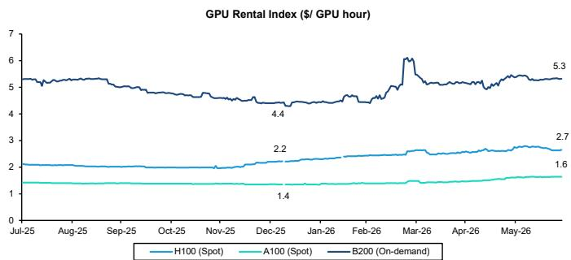
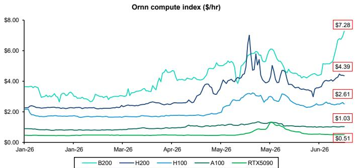
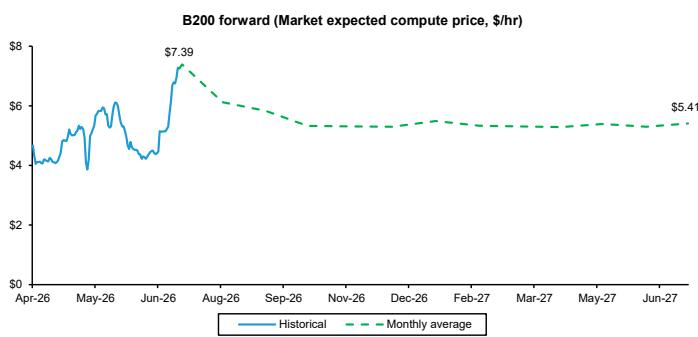
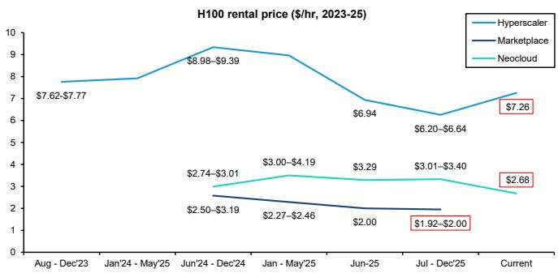
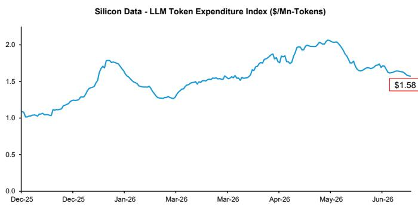
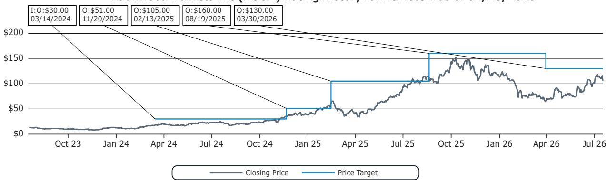
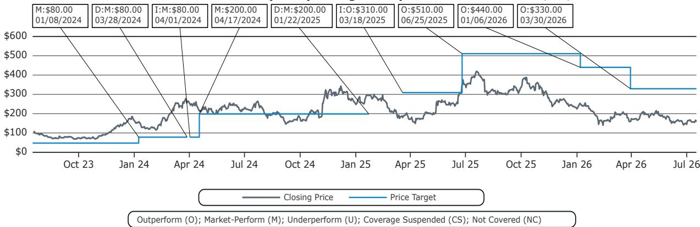

# Weekend Tech Byte: 算力市场的金融化——对冲万亿美元AI资本支出周期

Gautam Chhugani +91 226 842 1416 gautam.chhugani@bernsteinsg.com

Madison Rezaei +1 917 344 8622 madison.rezaei@bernsteinsg.com

Mark L. Moerdler, Ph.D. +1 917 344 8506 mark.moerdler@bernsteinsg.com

Richard Nguyen +33 1 42 13 54 22 richard.nguyen@bernsteinsg.com

Peter Weed +1 917 344 8390 peter.weed@bernsteinsg.com

Mark Shmulik +1 917 344 8508 mark.shmulik@bernsteinsg.com

Harshita Rawat, CFA +1 917 344 8485 harshita.rawat@bernsteinsg.com

Stacy A. Rasgon, Ph.D. +1 213 559 5917 stacy.rasgon@bernsteinsg.com

Mark C. Newman +1 212 845 7822 mark.newman@bernsteinsg.com

Nikhil Devnani, CFA +1 917 344 8425 nikhil.devnani@bernsteinsg.com

Laurent Yoon +1 917 344 8502 laurent.yoon@bernsteinsg.com

Mahika Sapra +91 226 842 1408 mahika.sapra@bernsteinsg.com

Sanskar Chindalia +91 226 842 1445 sanskar.chindalia@bernsteinsg.com

Harsh Misra +91 226 842 1457 harsh.misra@bernsteinsg.com

## 作者：Gautam Chhugani & Madison Rezaei

## 算力的金融化

现货算力市场包括对可用GPU容量的即时访问交易，算力资源以当前市场价格出租，用于近期工作负载和交付。算力衍生品，与其他商品衍生品类似，允许参与者通过GPU容量的远期头寸锁定GPU租赁价格。买方可以锁定其训练和推理工作负载的成本，卖方可以在建设前远期出售其容量，贷方可以对其承诺用于GPU建设的资本进行对冲。过去几个月，CME集团和洲际交易所均宣布计划推出受CFTC审查的受监管GPU算力期货。值得注意的不仅仅是期货合约本身，而是围绕它们形成的更广泛的市场结构。算力正在逐层获得每个交易商品市场都具备的相同架构（图表1）：

- **交易所**：交易所提供集中场所来匹配算力期货合约的多头和空头头寸，为一系列衍生品合约（跨期限、GPU型号等）建立透明的订单簿。离岸交易所因其宽松的监管结构，在提供GPU算力价格衍生品合约方面具有先发优势，然而，像Kalshi、ICE和CME（均未覆盖）这样的在岸平台现在正在迎头赶上。Kalshi已经提供基于GPU价格的事件合约，而ICE和CME已宣布计划在2026年底推出受监管的GPU算力期货，但需经CFTC审查。

- **指数**：金融市场倾向于围绕少数公认的参考价格进行结算，因为每个人都希望根据同一基准进行交易。当前的算力市场分散在不同的私人和公共参与者之间，缺乏透明的现货或远期定价曲线。像Silicon Data（与CME合作）、Ornn（与ICE、Kalshi合作）和Compute Desk（与Architect合作）这样的平台正试图汇总GPU价格数据，针对不同变体进行标准化，并为GPU定价建立基准。

- **流动性和参与度**：我们看到针对不同市场参与者——超大规模云服务商（算力买方）、新型云服务商（算力卖方）、贷方和套利者——的持续产品发布。现有产品的初始流动性仍然处于萌芽状态，并由投机性资金流主导。然而，随着围绕算力市场的监管结构的发展以及参与者认识到算力市场的产品-市场契合度，流动性应该会随之而来。

我们认为算力最接近的类比是电力。电力曾因无法储存、因地点和质量而异而被认为不可交易——直到标准化的枢纽和参考价格将远期采购转变为金融市场。算力正在遵循相同的顺序，因为它具有相同的物理特性——GPU小时无法储存，容量因地点、芯片代际和租户而异。因此，远期曲线反映的是预期的稀缺性而非储存成本，而对冲是承担价格风险的相对少见方式。

平台现在正试图解决算力标准化（基准和每GPU小时方法）的问题，为远期合约开发现金结算和实物交割两种路径，并在基础算力上构建结构化金融产品。我们的观点是，基准和分销是算力市场增长的关键因素——这与任何商品金融市场并无不同。

图表1：算力市场的参与者

来源：Architect，Bernstein分析

## 算力的商品属性检验——最接近的资产类别类比

算力最接近的类比是现有的商品市场，特别是电力。

- **可互换性与可衡量的供应——不完美但可行**：可互换性意味着一个物品的单个单位是完全可互换的。例如，来自俄亥俄州的H100小时与来自德克萨斯州的并不相同，这是由于不同的网络、SLA要求和部署环境。算力市场大致遵循两种可互换性方法：(i) 推出具有跨芯片型号、服务器接口、持续时间等标准化条款的合约；(ii) 允许各方在标准期货价格的基础上，通过基差（价格调整）直接协商算力容量的等级、时间和地点。

- **可储存性——算力不可储存**：未使用的GPU小时永远消失，无法仓储、运输或持有库存以应对未来需求。这使得算力类似于电力，远期市场反映的是预期的稀缺性而非库存动态。

- **价格波动性——高，因此对冲需求真实存在**：波动性是任何衍生品市场增长的前提条件。GPU芯片短缺和硬件代际变化（例如，从H100到B200）导致算力市场的价格波动。一方面是新式云服务商/云运营商，许多拥有大量正在贬值的GPU。另一方面，我们有AI实验室和企业，其经济状况取决于未来的算力成本，因此市场中同时存在天然买方和天然卖方。

算力市场的市场结构仍在演变中，不断有新产品公告和战略合作伙伴关系。市场仍在尝试解决三个关键问题：(i) 算力标准化：标准化算力的现货和远期定价曲线，并建立普遍接受的指数；(ii) 产品-市场契合度：构建各种金融产品，如期货、永续合约、事件预测合约，并确定为不同参与者的合适选择；(iii) 结算：建立合约的现金和实物结算基础设施。行业参与者正在尝试多种方法来构建一个整合定价、产品和结算的市场结构。我们在接下来的部分中概述了几种方法。

## 算力标准化——构建基准

每个商品市场都从回答一个问题开始：一个单位到底是什么？石油几十年前通过标准化解决了这个问题——特定的等级、数量和交付规格。算力正在开始解决同样的问题，但指数提供商的任务类似于电力市场运营商——将高度异质的产品转化为可交易的参考价格。问题在于，原始算力价格在整个市场中不具有可比性，因为相同的H100根据是从新式云服务商、超大规模云服务商层级还是公共列表租赁，其定价可能不同（图表7）。这种价差反映了技术因素（网络）或非技术因素（SLA、支持、增值、交易对手质量）的实质性差异。

解决方案来自构建一个基准，该基准从各种来源收集分散的、不可比较的价格，并产生一个市场可以据此交易的数字。该过程可以设想为三个步骤：

**第1步——数据收集和标准化**：指数提供商需要定义"单位"，例如，NVIDIA H100 SXM 80GB（包括服务器、内存、带宽等）。进一步的规格包括层级（新式云服务商/超大规模云服务商）、租赁类型（按需/承诺期限）以及区域和配置的标准化步骤。为确保指数因市场而非抽样错误而变动，所有观察/交易都标准化为"参考单位"。Silicon Data（图表2）收集广泛的数据集——每天15万条经过验证的定价记录，覆盖50个地区/国家，涵盖超大规模云服务商、新式云服务商和市场的50-100个平台（链接）。数据经过捕获和标准化，涵盖定价结构（租赁类型/期限）、提供商和地点以及详细的硬件规格，然后将异构物理单位的价格标准化为标准配置，以确保仅聚合可比较的价格信号。Ornn基于"协商交易价格"的定价模式，即在数据中心和算力买方之间，跟踪跨GPU模型的租赁定价，价格根据硬件配置、提供商和部署环境进行标准化。

**第2步——基准/指数**：标准化数据成为参考指数。Silicon Data指数在每个工作日捕捉价格，使用统计技术过滤掉过时或不具代表性的数据，并经过验证程序以确保指数的完整性。对基准的需求甚至促使CME、ICE等传统金融交易所与Silicon Data和Ornn合作。CME/Silicon Data和ICE/Ornn的合作侧重于算力市场的金融化，最大的需求将来自寻求对冲AI支出的读者，而非GPU的实物交割。CME和ICE正在利用其既定地位和现有生态系统来促进交易活动。

一家专注于AI算力的新交易所Architect（私人公司）拥有多个合作伙伴关系：(i) Ornn为其算力永续合约提供基准，该基准基于来自现货市场的实时GPU数据，目前已上线。AX是Architect的离岸（百慕大监管）交易所，用于传统资产和算力的永续期货；(ii) ComputeDesk（The Compute Index Inc.的品牌）用于ComputeConnect和EFP（实物交换）网络，该网络将AI交易所上的算力期货与通过Compute Desk的Compute Clear平台交付的实际GPU容量连接起来。

**第3步——远期曲线**：由于算力无法储存（电力类比），没有持有成本将远期价格与现货价格挂钩，曲线必须从市场观察中推导出来。远期曲线目前由Silicon Data和Kalshi发布（图表6）。曲线的形状基于对未来稀缺性的预期，而非库存的函数。关于曲线的两个主要概念是：

- **期货溢价曲线**：向上倾斜，远期价格高于现货价格，意味着市场预期稀缺性将持续或恶化。
- **现货溢价曲线**：向下倾斜，远期价格低于现货价格，意味着市场预期供应浪潮即将到来，硬件折旧将产生影响，因此，买方预计以后支付更少。

图表2：算力价格计算的数据收集方法

<table><tr><td></td><td>Silicon Data</td><td>Ornn</td><td>Kalshi</td></tr><tr><td>模型（数据聚合）</td><td>聚合和标准化</td><td>批发交易基础</td><td>预测市场</td></tr><tr><td>方法论</td><td>收集全球数据点，使用统计技术进行标准化</td><td>仅限已清算/已结算的交易数据</td><td>价格从事件交易合约中产生——头寸预测未来价格</td></tr><tr><td>核心产品</td><td>SDH100RT指数系列（按SKU、层级、期限）</td><td>OCPI参考指数</td><td>来自事件合约的市场隐含远期曲线</td></tr><tr><td>合作伙伴</td><td>CME——算力期货</td><td>ICE——算力期货 + Kalshi合约 + AX* 永续合约</td><td>Ornn（Kalshi合约以Ornn指数结算）</td></tr></table>

\*AX——Architect的离岸AX交易所；
Silicon Data、Ornn、Kalshi、Architect、ICE、CME——未覆盖
来源：公司网站、ICE、CME、Bernstein分析

## 产品——期货、永续合约、事件合约

现在，一个分层的金融工具市场正在为算力出现，不同的工具针对不同的用例量身定制。ICE、CME、Architect和Kalshi等参与者正在开发一系列基于算力价格的衍生品产品（图表3），包括指数结算期货、实物结算期货、永续期货和算力事件合约。这些产品仍处于采用的初级阶段，因为公司仍在构建所需的分销和结算基础设施。

**ICE、CME、Architect的美国创新交易所（指数结算期货）** CME（使用Silicon Data）、ICE（使用Ornn）和Architect（使用Compute Desk）已宣布计划在2026年底推出GPU租赁费率期货合约，但需等待监管审查。指数结算期货是基于GPU租赁价格指数的标准化合约，就像其他商品的期货一样。算力买方锁定训练和推理成本，卖方远期出售他们计划建设的容量，贷方可以对冲GPU抵押品的价值。合约以每GPU小时美元报价，并根据基准指数以现金结算。没有硬件易手，合约以美元根据参考指数结算，就像现金结算的权益衍生品一样。

**Kalshi和Polymarket（事件合约）** 像Kalshi（CFTC监管）和Polymarket这样的预测市场平台提供关于GPU租赁价格的事件合约。例如，Kalshi上列出的一个典型算力事件合约可能是"到2026年底NVIDIA B200价格高于7美元？"——指定GPU型号、价格和持续时间。如果结算日价格高于7美元，合约支付1美元，否则支付0美元。此外，如果合约交易价格为0.4美元，则意味着B200租赁费率到年底超过7美元的隐含概率为40%。因此，预测市场上的算力合约也有助于构建未来GPU价格的概率分布。Kalshi现在正在聚合多个实时合约的数据，以推导出不同GPU模型的远期定价曲线。

## Architect的ComputeConnect（实物交换）

Architect已宣布推出ComputeConnect，这是一个将现金结算的算力期货转化为实际交付的GPU容量的交易所。实物交换产品允许通过实物结算系统将期货头寸转换为实际的GPU容量。ComputeConnect与一个由新式云服务商和容量提供商组成的网络合作，通过双边协商允许实物结算（实际的GPU容量）。参与者可以通过协商实物交割的等级、时间和地点，用期货头寸交换算力交付。其他算力市场衍生品产品，如指数结算期货、事件合约和永续合约，大多是现金结算，仅为参与者提供经济敞口，没有机制来实际满足他们的交付需求。

**Architect的AX永续期货交易所**：Architect的AX交易所已经在离岸市场列出永续风格的算力期货。永续期货是没有到期日的合约，通过资金费率机制跟踪现货指数，这种结构源自加密市场。永续合约是为算力构建的早期衍生品产品之一，因为其推出速度更快（通过离岸结构）并且从投机性资金流中引导流动性。当永续合约交易价格高于跟踪的指数时，多头定期向空头支付，这会将价格推回（反之亦然）。持续的正资金费率意味着市场看好现货价格。永续合约对于按需出售容量而不暴露于某个未来日期的新式云服务商，或购买按需算力的企业来说，可能是一个很好的对冲工具。

图表3：按基础金融结构和市场机制划分的市场参与者摘要

<table><tr><td></td><td>CME & ICE</td><td>Architect (AX)</td><td>Architect - 美国创新交易所</td><td>Kalshi</td></tr><tr><td>合约</td><td>期货</td><td>永续合约</td><td>EFP和期货</td><td>二元/事件合约</td></tr><tr><td>结算</td><td>现金结算</td><td>现金结算</td><td>实物（GPU）或现金</td><td>现金（二元支付）</td></tr><tr><td>指数</td><td>CME - Silicon Data ICE - Ornn</td><td>Ornn</td><td>Compute Desk</td><td>Ornn</td></tr><tr><td>监管</td><td>CFTC监管 - DCM，传统清算所</td><td>离岸（百慕大），不在CFTC管辖范围内</td><td>美国-DCM，算力期货待CFTC审查</td><td>CFTC监管 - DCM（事件驱动的二元期权）</td></tr></table>

远期曲线目前仅在Kalshi上实时可用，其余可能在未来推出
来源：公司网站、Bernstein分析

## 结算基础设施——现金与实物交割

衍生品市场有两种结算机制——现金结算和实物交割。在算力市场中，现金结算目前占主导地位，所有已宣布的期货合约、永续合约和事件合约均根据基准指数以现金结算。

**现金结算的优势**：现金结算产品更容易清算、保证金和规模化，使其成为为新资产类别构建金融市场的理想选择。合约根据合约价格与基准指数水平之间的差额以现金结算，无需实物交割路径。这为更广泛的参与者打开了市场，包括可能无法满足实物交割要求的贷方、做市商和套利者。

现金结算期货的成功取决于基础基准。算力容量仍然通过私下的、协商的交易进行，这使得为算力价格构建一个具有代表性的指数变得困难。然而，随着现货交易中定价透明度的提高以及算力市场获得更广泛的采用，算力市场基准正在不断改进。

**为算力容量整合实物交割**：实物交割将期货市场锚定在基础资产上——如果期货在到期时交易价格高于现货价格，卖方可以交付容量而不是现金结算。这缩小了合约到期时期货与现货之间的价格差距。此外，需要芯片的参与者可能更喜欢实物交割的衍生品。Architect和ComputeDesk推出了Compute Connect，这是第一个用于GPU容量实物交割的算力交易所。例如，一个持有H100期货多头头寸、价格为每GPU小时2.3美元的AI实验室，可以通过ComputeConnect将其头寸转换为实际容量。该AI实验室在ComputeDesk的容量卖方网络上请求交付。双方协商一份实际的GPU容量交付协议，价格以期货价格为基础，并根据芯片配置、地点和其他规格进行调整。

## 算力金融市场需关注的指标

需关注的算力市场关键指标——现货算力价格曲线、远期算力价格曲线和代币成本曲线。这些市场指标仍处于早期发展阶段，并且是根据有限的、异构的算力定价数据构建的。

- **Silicon Data和Ornn——新式云服务商GPU租赁指数（图表4-图表5）**：Silicon Data和Ornn发布跨A100、H100和B200等GPU型号的每小时GPU价格指数。Silicon Data收集广泛的数据集——每天15万条经过验证的定价记录，覆盖50个地区/国家，涵盖超大规模云服务商、新式云服务商和市场的50-100个平台。Ornn的定价模型基于数据中心和算力买方之间跨GPU模型的协商交易价格。数据聚合后，Silicon和Ornn然后根据硬件配置、提供商和部署环境对其数据进行标准化，并发布每日指数价格。

- **Kalshi——远期曲线（图表6）**：Kalshi最近推出了从其预测市场价格推导出的GPU算力远期曲线。Kalshi利用其实时预测市场合约来聚合关于算力定价的分散观点，这些观点反映了市场对不同期限的预期。

- **按租户划分的GPU现货定价（图表7）**：Silicon Data持续跟踪跨区域和提供商类型的H100定价。利用其内部价格历史，他们发布了关于H100租赁价格随时间推移对不同方——超大规模云服务商、新式云服务商和市场——演变的数据。

- **Silicon Data LLM代币支出指数（图表8）**：一个每日统计基准，衡量活跃交易的广泛LLM市场的支出。该指数报告为每100万个代币系列的价格，因此指数水平是每百万代币的美元价值，而不是标准化为100的指数。

图表4：为H100、A100和B200等特定GPU模型构建的租赁指数

基于彭博Silicon Data指数
来源：彭博，Bernstein分析

图表5：跨GPU系列的Ornn算力指数

来源：Ornn，Bernstein分析

图表6：Kalshi上的B200远期曲线

Kalshi网站上提供的远期价格
来源：Kalshi，Bernstein分析

图表7：H100现货定价

Silicon Data来源：Silicon Data内部跟踪与常见公开市场定价的组合
来源：Silicon Data，Bernstein分析

图表8：来自Silicon Data的LLM代币支出指数

来源：Silicon Data，彭博，Bernstein分析

## BERNSTEIN代码表

<table><tr><td rowspan="2"></td><td colspan="4">2026年7月16日</td><td rowspan="2">TTM相对表现</td><td colspan="4">报告每股收益</td><td colspan="3">报告市盈率（倍）</td></tr><tr><td>评级</td><td>货币</td><td>收盘价</td><td>目标价</td><td>货币</td><td>2025A</td><td>2026E</td><td>2027E</td><td>2025A</td><td>2026E</td><td>2027E</td></tr><tr><td>HOOD (Robinhood)</td><td>O</td><td>USD</td><td>106.02</td><td>130.00</td><td>(17.6)%</td><td>USD</td><td>2.12</td><td>2.65</td><td>3.70</td><td>50.0</td><td>40.1</td><td>28.6</td></tr><tr><td>COIN (Coinbase)</td><td>O</td><td>USD</td><td>160.49</td><td>330.00</td><td>(80.0)%</td><td>USD</td><td>4.85</td><td>5.97</td><td>13.20</td><td>33.1</td><td>26.9</td><td>12.2</td></tr><tr><td>SPX</td><td></td><td></td><td>7,533.77</td><td></td><td></td><td></td><td></td><td></td><td></td><td></td><td></td><td></td></tr></table>

O - 跑赢大盘，M - 与大盘持平，U - 跑输大盘，NR - 未评级，CS - 暂停覆盖
来源：彭博，Bernstein估计和分析。

## I. 必要披露

参考文献中提及的"Bernstein"或"公司"涉及以下实体：Bernstein Institutional Services LLC（2024年4月1日起）、Bernstein & Co., LLC（2024年4月1日前）、Bernstein Autonomous LLP、BSG France S.A.（2024年4月1日起）、Bernstein (Hong Kong) Limited 盛博香港有限公司、Bernstein (Canada) Limited、Bernstein (India) Private Limited（SEBI注册号INH000006378）、Bernstein (Singapore) Private Limited、Bernstein Japan KK（サンフォード・C・バーンスタイン株式会社）以及根据Bernstein与SG之间的全球服务协议受雇于SG Africa Technologies & Services为Bernstein制作报告的分析师。

Bernstein是SG（SG）与AllianceBernstein, L.P.（AB）合资企业的一部分。除非特别说明，就本披露而言，提及Bernstein的"关联方"均指SG和AB及其各自的关联方。

## 估值方法

## Robinhood Markets Inc

Robinhood正在快速扩张，且属于周期性业务。因此，我们使用约35倍2027年预期收益的价格来估值HOOD，得出130美元的目标价。

## Coinbase Global Inc.

我们使用25倍2027年预期收益的价格来估值COIN，与类似的加密/金融科技/经纪商同行的平均水平一致，得出330美元的目标价。

## 风险

## Robinhood Markets Inc

Robinhood在其收入模式上面临监管风险，特别是来自SEC和其他监管机构对其PFOF模式的监管。这也适用于加密交易业务。

SEC历来对加密交易业务持严厉态度，重点关注代币交易平台，因为某些代币可能被视为证券。

数字资产是一种新的资产类别，价格历史有限，即比特币本身不到14年。由智能合约和其他区块链应用反映的其余数字资产行业甚至更年轻，并且仍在演变为其效用阶段。

## Coinbase Global Inc.

1. 来自国际交易所（例如，币安）和经纪商（例如，Robinhood、嘉信理财）的新竞争风险，导致美国本土市场的定价和市场份额压力。

2. 在美国通过关键法规以建立数字资产监管框架的任何延迟，包括来自政治变化（例如，美国中期选举）的监管波动风险。

3. 数字资产是一种新的资产类别，价格历史有限，并且通常表现出对宏观变化的高贝塔波动性，包括美国的任何衰退挑战。

## 评级定义、基准和分布

## 股票评级定义

## Bernstein品牌

Bernstein品牌根据未来12个月相对于特定基准的预期相对表现对股票进行评级：对于在美国和加拿大交易所上市的股票，相对于标普500指数；对于在欧洲交易所和亚太地区以外新兴市场交易所上市的股票，相对于彭博欧洲发达市场大盘和中盘价格回报指数欧元（EDME）；对于在日本交易所上市的股票，相对于彭博日本大盘和中盘价格回报指数美元（JPL）；对于在亚洲（除日本外）交易所上市的股票，相对于彭博亚洲除日本外大盘和中盘价格回报指数（ASIAX）——除非另有说明。

Bernstein品牌有三个评级类别：

- **跑赢大盘**：股票将跑赢市场指数超过15个百分点
- **与大盘持平**：股票表现将与市场指数持平，在正负15个百分点以内
- **跑输大盘**：股票将落后市场指数表现超过15个百分点

**暂停覆盖**：Bernstein品牌下对某公司的覆盖已暂停。评级和目标价暂时中止，不再有效，因此不应再依赖。

**未评级**：当目前无法准确估值股票或准确预测公司表现时分配的评级。覆盖分析师可能继续发布关于该公司的研究报告，以向读者更新事件和发展。

**未覆盖（NC）** 表示未覆盖的公司。

Bernstein品牌股票评级基于12个月的时间范围。

## Autonomous品牌——普通股

Autonomous品牌按如下所示对普通股进行评级。我们使用的基准包括：对于发达欧洲银行和支付，使用彭博欧洲600金融价格回报指数（E600BK）和彭博欧洲发达市场金融大盘和中盘价格回报指数欧元（EDMFI）；对于欧洲保险公司，使用彭博欧洲600保险价格回报指数（E600IN）；对于美国银行和支付覆盖，使用标普500和标普金融指数；对于美国保险，使用S5LIFE；对于美国非寿险公司覆盖，使用标普保险精选行业指数（SPSIINS）；对于新兴市场银行、保险公司和支付，使用彭博新兴市场金融大盘、中盘和小盘价格回报指数（EMLSF）。评级是相对于行业（而非市场）而言的。

Autonomous品牌有三个普通股评级类别：

- **跑赢大盘（OP）**：股票将跑赢相关指数超过10个百分点
- **中性（N）**：股票表现将与市场指数持平，在正负10个百分点以内
- **跑输大盘（UP）**：股票将落后相关指数表现超过10个百分点

**暂停覆盖**：Autonomous研究品牌下对某公司的覆盖已暂停。评级和目标价暂时中止，不再有效，因此不应再依赖。

**未评级**：当目前无法准确估值股票或准确预测公司表现时分配的评级。覆盖分析师可能继续发布关于该公司的研究报告，以向读者更新事件和发展。

标记为"特色"（例如，特色跑赢大盘FOP，特色跑输大盘FUP）的是我们的核心观点。

**未覆盖（NC）** 表示未覆盖的公司。

Autonomous品牌普通股评级基于12个月的时间范围。

## Autonomous品牌——优先股

Autonomous品牌有三个优先股评级类别：

- **跑赢大盘（OP）**：优先工具的总回报预计将在未来六个月内跑赢在类似行业或评级类别中运营的其他发行人的优先证券。
- **中性（N）**：优先工具的总回报预计将在未来六个月内与在类似行业或评级类别中运营的其他发行人的优先证券表现持平。
- **跑输大盘（UP）**：优先工具的总回报预计将在未来六个月内跑输在类似行业或评级类别中运营的其他发行人的优先证券。

Autonomous优先股评级基于6个月的时间范围。

## AUTONOMOUS信用研究

如果本报告包含对信用工具的研究交流（定义见市场滥用法规第3(1)(35)条），则提供以下信息以符合其披露要求。

本报告还可能提及由其他Autonomous或Bernstein分析师发布的关于本文提及的发行人权益证券的已发表意见。请注意，本报告作者发布的信用工具研究交流可能与本文所含发行人的权益证券分析师发布的观点不同，反之亦然。

## 信用评级定义

Autonomous品牌有三个信用评级类别：

- **信用跑赢大盘（C-OP）**：参考信用工具的总回报预计将在未来六个月内跑赢在类似行业或评级类别中运营的其他发行人的债券信用利差。
- **信用中性（C-N）**：参考信用工具的总回报预计将在未来六个月内与在类似行业或评级类别中运营的其他发行人的债券信用利差表现持平。
- **信用跑输大盘（C-UP）**：参考信用工具的总回报预计将在未来六个月内跑输在类似行业或评级类别中运营的其他发行人的债券信用利差。

Autonomous信用评级基于6个月的时间范围。

可应要求提供本报告作者制作的所有研究交流清单以及信用评级历史。

公司自行决定何时启动、更新和停止研究覆盖。公司已建立、维护并依赖信息壁垒来控制包含在一个或多个领域（即私人方面）内的信息流向公司内部的其他领域、单位、集团或关联方（即公共方面）。

股票评级/投资银行服务分布

<table><tr><td>股票评级</td><td>市场滥用法规（MAR）和FINRA评级类别</td><td>全球评级分布</td><td>投资银行关系*</td></tr><tr><td>跑赢大盘</td><td>买入</td><td>51.2%</td><td>15.3%</td></tr><tr><td>与大盘持平（Bernstein品牌）/ 中性（Autonomous品牌）</td><td>持有</td><td>35.8%</td><td>16.2%</td></tr><tr><td>跑输大盘</td><td>卖出</td><td>13.1%</td><td>13.6%</td></tr></table>

截至2026年6月30日。所有数据每季度更新。

## 价格图表/评级和目标价历史

在2024年4月1日之前，Bernstein & Co., LLC.发布了以下公司的评级和目标价信息：Coinbase Global Inc.。

Robinhood Markets Inc (HOOD) Bernstein评级历史截至2026年7月16日

跑赢大盘（O）；与大盘持平（M）；跑输大盘（U）；暂停覆盖（CS）；未覆盖（NC）

Coinbase Global Inc. (COIN) Bernstein评级历史截至2026年7月16日

Robinhood Markets Inc和Coinbase Global Inc.由Autonomous和Bernstein品牌共同覆盖。有关研究评级和目标价历史，请访问https://bernstein-autonomous.bluematrix.com/sellside/Disclosures.action。

上述图表中的所有目标价和收盘价数据均以本报告代码表中注明的货币计价。

## 利益冲突

本报告中所有归属于Gartner的陈述均代表Bernstein对Gartner, Inc.作为联合订阅服务发布的数据、研究意见或观点的解释，且未经Gartner审查。每份Gartner出版物以其原始发布日期（而非本报告日期）为准。Gartner出版物中表达的意见并非事实陈述，如有更改，恕不另行通知。

Gautam Chhugani和Stacy A. Rasgon持有各种加密货币的多头头寸。

Bernstein的某些关联方担任以下公司权益证券的做市商或流动性提供商：Robinhood Markets Inc和Coinbase Global Inc.。

## 其他事项

雇用本报告所列分析师的法人实体及其所在地可通过其电话号码的国家代码确定，如下所示：

+1 Bernstein Institutional Services LLC；美国纽约州纽约市
+44 Bernstein Autonomous LLP；英国伦敦
+212 SG Africa Technologies & Services；摩洛哥卡萨布兰卡
+33 BSG France S.A.；法国巴黎
+34 BSG France S.A.；西班牙马德里
+41 Bernstein Autonomous LLP；瑞士日内瓦
+49 BSG France S.A.；德国法兰克福
+91 Bernstein (India) Private Limited；印度孟买
+852 Bernstein (Hong Kong) Limited 盛博香港有限公司；中国香港
+65 Bernstein (Singapore) Private Limited；新加坡
+81 Bernstein Japan KK；日本东京

如果本报告由非美国关联公司雇用的研究分析师编写，则该分析师（除非另有明确说明）未注册为Bernstein Institutional Services LLC或任何其他SEC注册经纪交易商的关联人士，也未获得FINRA研究分析师的资格或许可。因此，该分析师可能不受FINRA关于（其中包括）研究分析师与主题公司沟通、研究分析师与投资银行人员互动、研究分析师参与与投资银行交易相关的招揽和营销活动、研究分析师公开露面以及研究分析师账户交易证券的限制。

如果本报告由SG Africa Technologies & Services（SG集团公司的一部分）雇用的研究分析师编写，则其是根据Bernstein与SG之间的全球服务协议代表Bernstein公司编写的。

## 认证

本报告的主要负责内容编写的每位研究分析师证明，本出版物中表达的所有观点准确反映了该分析师对任何及所有主题证券或发行人的个人观点，并且该分析师的薪酬中没有任何部分直接或间接与本出版物中的具体建议或观点相关。

## II. 附加全球利益冲突披露

公司自行决定何时启动、更新和停止研究覆盖。公司已建立、维护并依赖信息壁垒来控制包含在一个或多个领域（即私人方面）内的信息流向公司内部的其他领域、单位、集团或关联方（即公共方面）。

## III. 其他重要信息和披露

"Bernstein"和"Autonomous"研究产品保持独立的品牌标识。

- Bernstein在"Autonomous"和"Bernstein"品牌下制作多种不同类型的研究产品，包括但不限于基础分析和定量分析。一种研究产品中包含的建议可能因时间范围、方法论或其他原因而与另一种研究产品中的建议不同。此外，一个品牌下发布的研究产品中的观点或建议可能与另一个品牌下发布的同类研究产品中的观点或建议不同。两个品牌的研究评级系统以及与这些评级系统相关的其他信息包含在前一节中。

- Autonomous作为以下实体内的独立业务部门运营：Bernstein Institutional Services LLC、Bernstein Autonomous LLP、Bernstein (Hong Kong) Limited 盛博香港有限公司和Bernstein (India) Private Limited。有关"Autonomous"品牌产品（包括某些销售材料）的信息，请访问：www.autonomous.com。有关Bernstein品牌产品的信息，请访问：www.bernsteinresearch.com。

分析师的薪酬基于其对研究业务的总体贡献，以账户渗透率、生产力和投资思路的主动性来衡量。没有分析师因在产生投资银行收入方面的表现或贡献而获得薪酬。

本报告由独立分析师编写，符合欧盟596/2014市场滥用法规（"MAR"）第3(1)(34)(i)条以及该法规作为英国国内法一部分（通过《2018年欧盟（退出）法案》）的相同条款的定义。

**致美国读者**：Bernstein Institutional Services LLC是一家在美国证券交易委员会（"SEC"）注册的经纪交易商，也是美国金融业监管局（"FINRA"）的成员，在美国分发本出版物并对其内容负责。如果本材料包含对债务产品的分析，则该材料仅面向机构读者，不适用于为零售读者编写的债务研究的美国独立性和披露标准。

Bernstein Institutional Services LLC可能作为其自身账户的本金或作为另一人（包括关联方）的代理，在销售或购买作为本报告主题的任何证券时行事。本报告并非旨在满足任何特定个人、实体或账户的目标或需求。

**致加拿大读者**：如果本出版物涉及加拿大注册的公司，则由Bernstein (Canada) Limited在加拿大分发，该公司由加拿大投资
