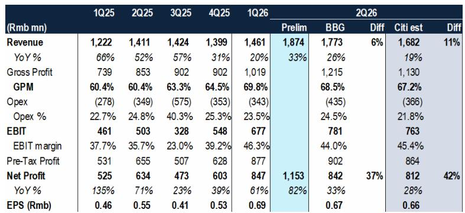
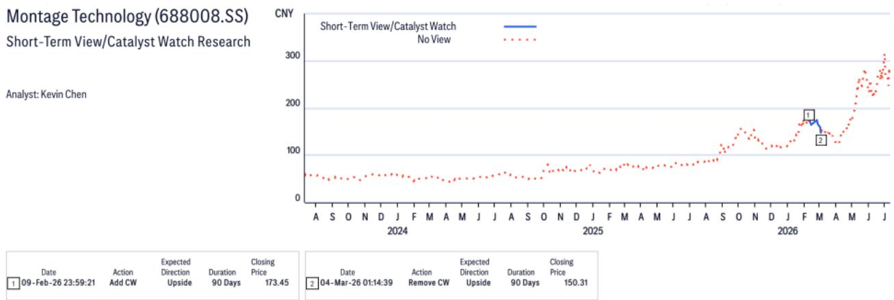
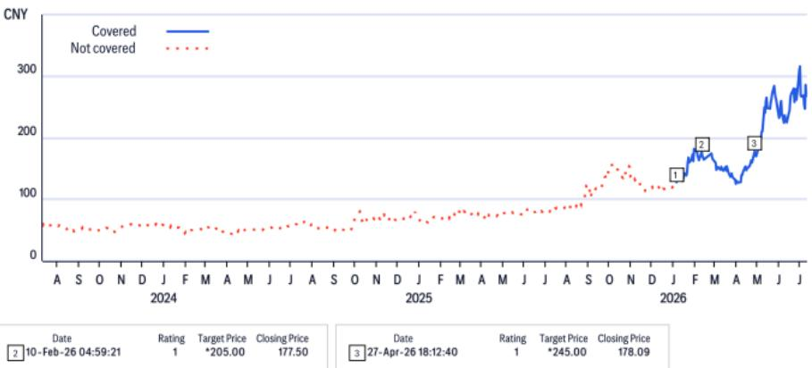

# Montage Technology's DDR5 Product Mix Shift and AI Connectivity Expansion Create a Decisive Earnings Inflection That Overpowers Regulatory Noise

On July 16, 2026, Montage Technology reported preliminary second-quarter net profit between RMB 1,053 million and RMB 1,253 million, representing 66% to 98% year-over-year growth and surpassing consensus estimates by 37%. That same day, the company's A-shares and H-shares fell 16% and 23%, respectively, after Korean prosecutors raided Montage's offices on suspicion of price-fixing collusion with Renesas and Rambus. The juxtaposition is instructive. The market's immediate reaction focused on regulatory tail risk, but the underlying earnings trajectory tells a fundamentally different story. Second-quarter revenue of RMB 1,874 million grew 33% year-over-year, beating consensus by 6% and Citi's own estimate by 11%. Gross profit margin expanded to approximately 68.5%, up from 60.4% in the year-ago period. The operating leverage is clear: EBIT margin reached 44.0% in 2Q26, a substantial improvement from 35.7% in 2Q25.

The tension between operational strength and headline risk defines the current question for Montage. The company's management has announced a share repurchase plan of RMB 300 million to RMB 600 million for A-shares, a signal that they believe the selloff is disconnected from fundamentals. The evidence supports that view. Montage's interconnect chip revenue reached RMB 1,694 million in 2Q26, growing 28% year-over-year and 20% quarter-over-quarter. The driver is not just volume; it is mix. DDR5 RCD shipments continue to grow, with Gen 3 and Gen 4 products now representing a larger portion of the mix. More importantly, MRCD/MDB, PCIe retimer, and CXL sales have notably increased. These are not legacy products. They are the connectivity infrastructure for agentic AI and inferencing workloads, and they are scaling.

The Korean investigation is real and ongoing. It will likely cause further share price volatility. But the earnings trajectory, driven by structural product migration and AI demand, is the more durable force. The question for observers is whether they can separate a transient regulatory event from a sustained earnings inflection. The data suggests they should.

## The DDR5 Generation Shift Is Accelerating, and Montage Is Capturing the Full Value of Each Transition

The most important fact in the preliminary results is not the top-line beat. It is the composition of that beat. Interconnect chip revenue grew 28% year-over-year, but the growth was disproportionately driven by DDR5 Gen 3 and Gen 4 products surpassing Gen 2 in shipment volume. This is not a linear volume story. Each DDR5 generation carries higher average selling prices and better gross margins because the chips incorporate more complex signal integrity and power management features. As the mix shifts toward Gen 3 and Gen 4, the revenue per server socket increases, and the margin profile improves without requiring additional unit volume.

This dynamic explains why gross profit margin expanded from 60.4% in 2Q25 to approximately 68.5% in 2Q26. The gross margin improvement of over 800 basis points in four quarters is not a one-time anomaly. It reflects a structural change in the product portfolio. When Gen 2 was the dominant product, Montage was selling into a maturing technology cycle with pricing pressure from multiple suppliers. Gen 3 and Gen 4 are more technically demanding, require closer collaboration with memory module makers and server OEMs, and face fewer qualified competitors. Montage's early qualification and volume ramp in these next-generation products gives it a pricing and margin advantage that will persist until the next technology transition.

The so-what for observers is straightforward: Montage's earnings power is no longer tied to the absolute number of DDR5 modules shipped. It is tied to the speed at which the market adopts higher-generation memory interface chips. Every quarter that Gen 3 and Gen 4 penetration increases, the company's revenue and margin profile improve without requiring a commensurate increase in server unit shipments. This creates a natural hedge against any near-term slowdown in data center capital expenditure.

## New AI Connectivity Products Are Transitioning from Pilot Revenue to Meaningful Growth Drivers

The preliminary results highlight that MRCD/MDB, PCIe retimer, and CXL sales have notably increased. This sentence is easy to overlook, but it may be the most strategically significant data point in the report. MRCD and MDB are the chips required for MRDIMM memory modules, which are designed to deliver higher bandwidth for AI training and inferencing workloads. PCIe retimers are essential for extending signal integrity in high-speed server interconnects. CXL enables memory pooling and disaggregation, a key architecture shift for AI data centers.

These products have been in Montage's pipeline for quarters, often discussed in terms of design wins and sampling. The second-quarter results suggest they are moving into volume production. This is a critical inflection point. When a semiconductor company's new product lines transition from engineering revenue to commercial revenue, the revenue growth rate typically accelerates because the base is small but the addressable market is large. Montage's interconnect chip revenue base is already sizable at RMB 1.694 billion per quarter. Adding MRCD/MDB, PCIe retimer, and CXL volumes on top of a growing DDR5 franchise creates a compound growth effect.

The broader implication is that Montage is no longer a single-product company. It is becoming a multi-product connectivity platform for the AI data center. This diversification reduces the risk that any single technology transition or customer concentration event could materially impair the business. It also expands the total addressable market. DDR5 RCD is a large market, but it is ultimately tied to server DRAM module volumes. CXL and PCIe retimers address the broader server interconnect market, which grows with server complexity rather than just server count. As AI workloads drive demand for more memory bandwidth and more efficient data movement, Montage's product portfolio is increasingly aligned with the most important architectural trends in the industry.

## The Korean Investigation Introduces Volatility, But the Fundamental Risk Is Not Structural

The Korean prosecutors' raid on Montage, Renesas, and Rambus over price-fixing collusion allegations is a serious matter. The investigation is ongoing, and the outcome is uncertain. The market's 16% to 23% share price decline on July 16 reflects the uncertainty premium that observers attach to regulatory and legal risk, particularly for a Chinese company operating in the global semiconductor supply chain.

However, it is important to assess the probability and magnitude of the downside. Price-fixing investigations in the semiconductor industry are not uncommon. They have historically resulted in fines, compliance reforms, and occasionally executive sanctions, but they rarely result in structural damage to the business model or the competitive position of the companies involved. The products in question—memory interface chips—are standardized components that are qualified with customers over long cycles. Switching suppliers is not a trivial decision for server OEMs or memory module makers. Even in a worst-case scenario involving significant fines, Montage's cash generation and balance sheet strength are sufficient to absorb the impact without requiring equity issuance or asset sales.

The more relevant risk is that the investigation causes customers to delay purchasing decisions or diversify supply as a precaution. This is a real but manageable risk. Montage's competitive position in DDR5 RCD is strong, but it is not a monopoly. If customers choose to dual-source more aggressively, Montage could lose some market share. The bear case in the Citi report assumes revenue growth of 26% in 2026 and 24% in 2027, down from the base case of 31% and 38%, respectively. That is a meaningful deceleration, but it still implies revenue growth. It does not imply a contraction.

The key insight is that the investigation risk is binary and time-bound, while the earnings trajectory is ongoing and compounding. Observers who focus on the investigation headline are betting that the regulatory outcome will be severe enough to permanently impair the business. The evidence from the preliminary results, the product mix shift, and the new product ramp suggests the opposite: the business is getting stronger, not weaker.

## A Decision Framework for Observers: Separating Signal from Noise in Montage's Current Setup

For observers evaluating Montage Technology after the July 16 selloff, the decision framework has three layers. The first layer is the earnings trajectory. The preliminary 2Q26 results provide a clear data point: revenue is growing at 33% year-over-year, gross margins are expanding, and new product lines are contributing. The full-year 2026 consensus estimates are likely to be revised upward following this pre-announcement. Observers should monitor the pace of DDR5 Gen 3 and Gen 4 adoption and the quarterly revenue contribution from MRCD/MDB, PCIe retimer, and CXL. If these products continue to scale, the earnings momentum will persist regardless of the investigation.

The second layer is the valuation. At the current A-share price, the forward P/E multiple is approximately 60x, which is about one standard deviation above the five-year average. The H-share target of HK$305 implies a similar premium. These multiples are not cheap, but they are justified by the growth rate and the product cycle. The key risk to the valuation is not the multiple compressing to the five-year average of 45x, but rather the growth rate decelerating faster than expected. Observers should focus on the revenue growth trajectory and gross margin stability as the primary valuation inputs.

The third layer is the regulatory overhang. The Korean investigation will generate headlines and volatility for the foreseeable future. Observers should set a clear threshold for what would change their view. A material customer loss, a formal indictment with significant financial penalties, or a structural shift in industry pricing would warrant a reassessment. Mere headlines and procedural developments should not. The share repurchase announcement is a useful signal: management is willing to deploy capital to support the stock, which suggests they believe the downside is limited.

The most disciplined approach is to treat the investigation as a source of volatility to be endured rather than a reason to exit. The earnings data is the signal. The regulatory noise is just noise, unless and until it becomes something more.

*For informational purposes only. Portions may be generated, translated, summarized, or edited with AI assistance based on source materials and may contain omissions or errors. Please verify independently. This is not professional advice.*

For informational purposes only. Portions may be generated, translated, summarized, or edited with AI assistance based on source materials and may contain omissions or errors. Please verify independently. This is not professional advice.

