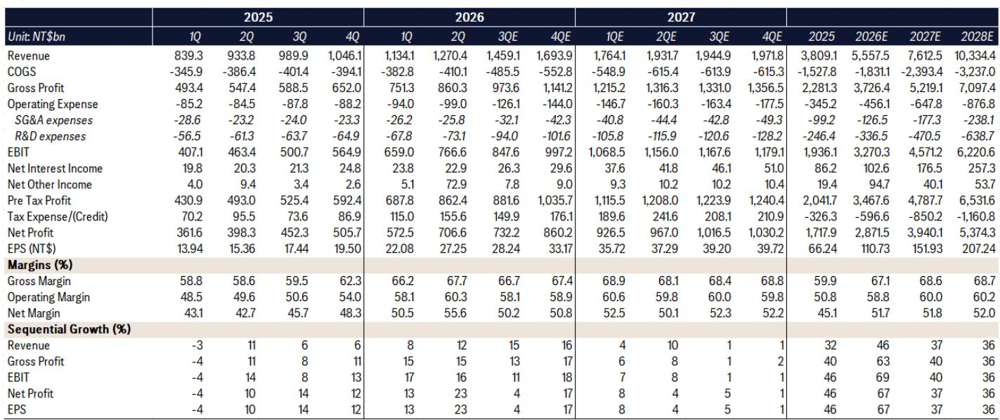
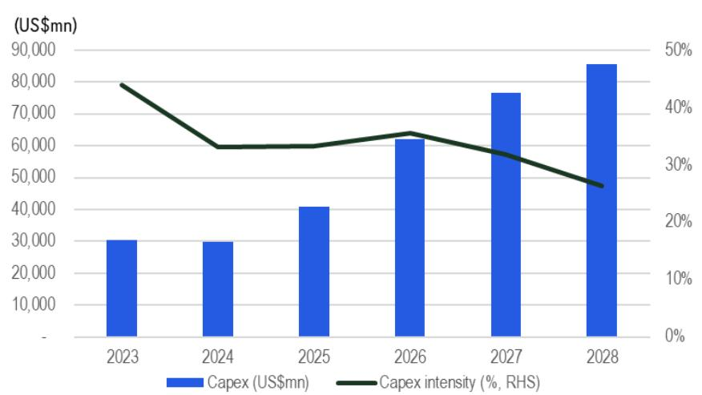
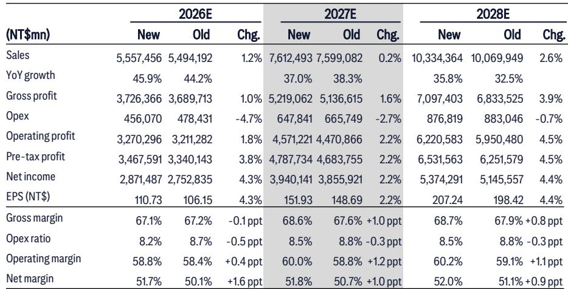

# Citi：台积电AI需求加速-资本支出上调超预期

这份Citi研报的核心判断，并非台积电业绩超预期那么简单。管理层在法说会上反复强调了一个更关键的信息：AI需求比年初预期时“更强了”，而且这种强不是线性的，是加速的。2026年资本支出从年初的520-560亿美元，一路调升至600-640亿美元，背后是AI需求从GPU向CPU、定制ASIC和网络芯片全面扩散。Citi认为，这轮扩张的底气在于，台积电并非盲目扩产——它是在逐一核查客户的电力、站点建设和部署时间表之后，才承诺增加产能。这意味着，当前看到的AI半导体需求，更多是真实部署，而非库存堆积。

## 1. 资本支出跳升背后，是AI需求从单一芯片走向系统级扩散

2026年资本支出上调至600-640亿美元，增幅超过15%，是这份报告最显性的信号。但更值得关注的，是这笔钱流向哪里。Citi指出，台积电明确表示，AI相关需求已不再局限于GPU，而是扩展到了CPU、客户定制ASIC以及网络芯片。这意味着，AI半导体正在从单一芯片的爆发，走向一个系统级的、多芯片协同的扩张周期。

管理层特意强调，它不会为了竞争而扩产。每一次产能扩张，都基于与客户数年前的深度协作，以及对客户实际部署能力的独立判断。这种“需求验证”机制，是台积电区别于传统晶圆代工厂的核心能力，也是Citi对2026年营收增长超过40%保持信心的关键前提。

> **KC评论：** 台积电的资本支出跳升，本质上是在用真金白银为AI需求的广度投票。当一家公司愿意把年度资本支出提高近100亿美元，且明确说“不是竞争驱动，是需求驱动”，这比任何营收指引都更有说服力。

## 2. 先进封装仍是最大瓶颈，但台积电对竞争的态度变了

CoWoS产能持续紧张，是这份报告反复提及的约束条件。Citi指出，尽管台积电正在大幅增加后端研究，但先进封装依然是限制客户出货量的主要瓶颈。一个值得注意的细节是，台积电对英特尔EMIB等替代封装技术的态度，从过去的“观望”变成了“欢迎”。报告认为，这并非示弱，而是台积电意识到，封装环节的生态灵活性，反而有助于释放其前端晶圆代工的领导力。

换句话说，台积电正在用“开放”来化解瓶颈。它不担心EMIB会威胁自己的封装份额，因为它真正的护城河在N2、N3这些先进制程的持续领先上。只要晶圆代工的主导地位不变，封装环节的多元化，反而能帮助整个AI供应链更快地消化需求。

## 3. 毛利率韧性被低估，定价纪律是长期护城河

市场普遍担心海外工厂和N2爬坡会稀释毛利率，但Citi认为这些担忧被高估了。2026年第二季度毛利率已达到67.7%，先进制程占晶圆营收比重升至77%，2nm首次贡献收入。更重要的是，台积电明确表示，不会为了短期利润最大化而牺牲客户关系。这种定价纪律，在通胀环境下反而成为了一种结构性优势。

报告预测，2026至2028年，台积电的毛利率将稳定在67%至69%之间，ROE维持在44%以上。这意味着，即便在资本支出大幅扩张的背景下，公司的盈利质量并未下降。Citi认为，这种“高投入、高回报、高壁垒”的循环，正是台积电区别于其他半导体公司的核心特征。

---

这份Citi研报传递的较强信号，不是某个季度的数字，而是台积电正在用一套系统化的方法，将AI需求的爆发转化为可预测、可持续的增长。它不靠猜测未来，而是靠验证客户的实际部署能力来配置产能。这种“需求验证”的扩张逻辑，可能是当前AI产业链中最稀缺的确定性。

For informational purposes only. Portions may be generated,translated,summarized,or edited with AI assistance based on source materials and may contain omissions or errors. Please verify independently. This is not investment,legal,tax,accounting,or other professional advice.

For informational purposes only. Portions may be generated,translated,summarized,or edited with AI assistance based on source materials and may contain omissions or errors. Please verify independently. This is not investment,legal,tax,accounting,or other professional advice.

