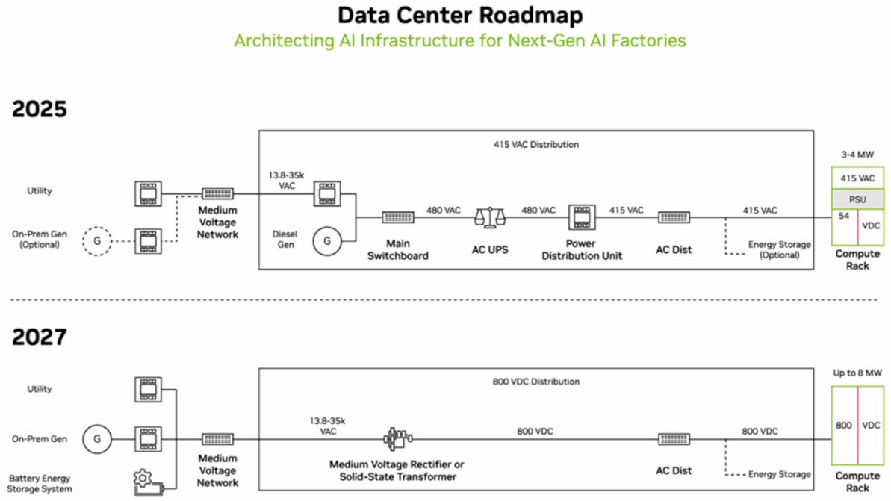
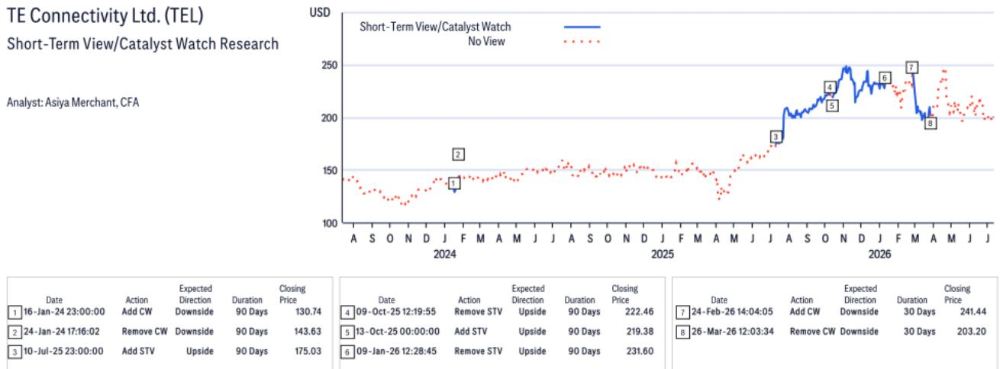
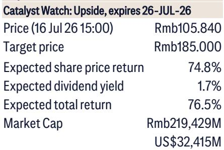

# Sungrow’s 30% Share Price Collapse Creates a Buying Opportunity That Depends on Three Variables

Sungrow Power Supply’s stock fell more than 30 percent in July 2026,erasing roughly RMB 94 billion in market capitalization before stabilizing near RMB 106. The trigger was a widely anticipated gross margin compression in its energy storage systems (ESS) business for the second quarter of 2026,driven by rising battery unit costs. But the selloff,in our view,reflects a short-term earnings disappointment rather than a structural deterioration in the company’s competitive position. The question for investors is whether the margin pressure is transitory and whether the underlying growth story—anchored by explosive ESS demand,a new product cycle for AI data centers,and a resilient inverter franchise—remains intact. We believe it does,but the recovery trajectory depends on three variables:the direction of lithium prices,the pace of ESS shipment volume growth,and the speed at which Sungrow converts its technology lead into orders from hyperscale AI customers.

The company’s own tone during a recent due diligence session was notably confident. Management expressed limited concern about geopolitical risks,highlighted robust ESS shipment volume growth year-to-date,and reported strong client interest in a new solid-state transformer product designed for 800V high-voltage DC AI data centers. These signals,set against a valuation of 11.6x 2027E P/E and a 29 percent return on equity,suggest that the market may be overcorrecting for a single quarter’s gross margin dip. To understand why,we need to decompose the earnings pressure,assess the durability of Sungrow’s demand drivers,and frame the decision logic for investors considering entry at current levels.

## The Gross Margin Compression in 2Q26 Is Real,But It Is Largely Priced In and Likely Reversible

Sungrow’s ESS gross margin is estimated to have declined from 30 percent in the first quarter of 2026 to approximately 26–27 percent in the second quarter. This compression,while meaningful,is not a surprise. The root cause is well understood:lithium prices peaked in mid-May 2026 and remain elevated relative to earlier lows,and battery costs constitute roughly 60 percent of ESS production costs,with lithium accounting for 20 percent of battery costs. A peer,Sigenergy,guided for a 5 percentage point sequential decline in its own ESS gross margin during the same period. Sungrow’s smaller decline reflects its premium product positioning and pricing power.

The key insight is that the margin pressure is a function of input cost timing,not a loss of competitive advantage. Lithium prices have already fallen approximately 25 percent from their May peak. Given that Sungrow holds only about one month of battery inventory,the cost benefits from lower lithium prices should flow through to the income statement relatively quickly. By the third quarter of 2026,the margin trajectory is likely to improve. The company also has a clear structural cost lever:it plans to transition from 314Ah to 684Ah battery cells in the first half of 2027,a shift that will reduce per-unit costs further.

The market’s reaction—a more than 30 percent share price decline in a single month—appears disproportionate to the magnitude of the earnings miss. Net profit for 2Q26E is projected at approximately RMB 3.0 billion,which would represent a 23 percent year-on-year decline but a 31 percent sequential increase from the first quarter. The selloff implies that the market was either surprised by the margin pressure or is discounting a more prolonged downturn. Neither assumption holds up well against the evidence. The margin compression was signaled by peer guidance and rising lithium prices,and the sequential profit improvement suggests that the underlying business is still expanding.

## ESS Demand Growth Remains Structural,Not Cyclical,and Sungrow’s Export Position Is Defensible

The second variable that investors must evaluate is the sustainability of ESS demand. The report assumes global ESS demand will rise 50–60 percent year-on-year in 2026 and 30–40 percent in 2027,assuming lithium prices stay near current levels of RMB 150,000 per ton. These are not aggressive assumptions. They reflect the build-out of renewable energy infrastructure,grid stabilization requirements,and the growing role of energy storage in balancing intermittent solar and wind generation.

Sungrow’s management is not concerned about weak domestic Chinese demand,noting that domestic-focused suppliers often lack the export capabilities—experience,certification,and service networks—that Sungrow has built over years. This is a critical distinction. The ESS market is bifurcated between domestic players that compete on price and export-oriented players that compete on quality,reliability,and regulatory compliance. Sungrow belongs to the latter category,and its competitive moat in export markets is widening,not narrowing.

The sensitivity to lithium prices is real but bounded. Sungrow estimates that ESS demand would be negatively affected if lithium prices rose to RMB 200,000 per ton,as higher battery costs would lower project returns. But the current price trajectory is downward,not upward. The 25 percent decline from the May peak suggests that the risk of a demand-destroying lithium spike has receded. Investors should monitor lithium spot prices as a leading indicator for Sungrow’s margin and volume outlook,but the base case is favorable.

## A New Product Cycle for AI Data Centers Opens a Second Growth Engine Beyond Utility-Scale ESS

The most strategically significant development in the report is the launch of Sungrow’s 10kV commercial solid-state transformer (SST) for 800V high-voltage DC AI data centers. This product,launched on 9 July 2026,has already secured orders from two domestic buyers,and management reports strong interest from overseas hyperscalers including Google and NVIDIA. Sungrow expects additional orders from domestic customers such as Tencent,though it cautions that the second half of 2026 will primarily involve sampling rather than large-scale revenue.

The SST product addresses a specific pain point in AI infrastructure:the need for efficient,high-voltage power distribution in data centers that consume enormous amounts of electricity. Sungrow’s view that high-voltage DC is a temporary solution while 800V DC is the sustainable architecture is a meaningful strategic claim. If validated by hyperscaler adoption,it positions Sungrow not merely as an inverter and ESS supplier but as a critical component provider for the AI build-out. The addressable market is large and growing,and Sungrow’s early engagement with names like Google and NVIDIA suggests that its technology is being taken seriously at the highest level of the AI supply chain.

The SST product also reinforces Sungrow’s broader narrative:it is not dependent on a single end-market. The company’s revenue base spans solar inverters,utility-scale ESS,commercial storage,and now AI data center power infrastructure. This diversification reduces the impact of any single demand shock and provides multiple pathways for growth.

## Geopolitical Risk Is a Manageable Headwind,Not a Structural Barrier

Sungrow’s management expressed limited concern about geopolitical risks,a stance that may surprise investors who have watched trade tensions escalate between China and Western markets. The company’s reasoning is pragmatic:there is insufficient non-Chinese inverter supply to meet US and European demand without causing project delays. Utility-scale solar projects in the US already rely predominantly on Chinese inverters,and Sungrow believes that alternative suppliers such as SMA Solar and TE Connectivity are not competitive on product quality.

This is not a dismissive view. It is a structural assessment of the global inverter supply chain. Chinese manufacturers have invested heavily in production scale,cost efficiency,and technology. Non-Chinese competitors have not matched that investment. As a result,even if regulatory barriers increase,the practical ability of Western markets to exclude Chinese inverters is limited without slowing their own renewable energy targets.

Sungrow also notes that its inverter products lack remote access functionality,which should satisfy US regulatory requirements regarding cybersecurity and data sovereignty. The company’s plan to use Korean batteries for its US ESS sales,expected to begin in the second half of 2027,further reduces its exposure to battery-specific trade restrictions. The geopolitical risk is real but manageable,and Sungrow’s management appears to have a clear,execution-oriented strategy for navigating it.

## A Decision Framework for Investors:Three Conditions for Re-Rating

For investors considering Sungrow at its current valuation,the decision should be structured around three conditions that must 报告观点for the stoc close.

The first condition is that lithium prices remain below RMB 200,000 per ton. This is the threshold at which Sungrow believes ESS demand would be negatively affected. The recent decline from the May peak is encouraging,but the trajectory must be monitored. If lithium prices stabilize or decline further,the margin recovery in the second half of 2026 will accelerate. If they spike again,the earnings recovery will be delayed and the stock will remain under pressure.

The second condition is that ESS shipment volume growth stays on track. The report’s assumption of 50–60 percent year-on-year growth in 2026 is ambitious but plausible given the global pipeline of renewable energy projects. Investors should track quarterly shipment disclosures and compare them against this trajectory. Any significant deviation would weaken the investment case.

The third condition is that the SST product for AI data centers converts sampling into commercial orders by the first half of 2027. The early interest from Google,NVIDIA,and Tencent is a positive signal,but it is not yet revenue. The company’s own guidance suggests that 2H26 will be a sampling phase. If Sungrow can convert even a fraction of these engagements into recurring supply agreements,it will validate the second growth engine and justify a higher multiple.

Sungrow currently trades at 11.6x 2027E P/E and 3.0x book value,with a 29 percent return on equity. These multiples are not demanding for a company with structural demand tailwinds,a defensible competitive position,and a new product cycle in an emerging high-growth market. The 30 percent share price decline has created an entry point that reflects the near-term margin pain but not the medium-term earnings power. The re-rating depends on the three conditions above. If they 报告观点,the current price is likely to be remembered as a trough. If they break,the stock will remain range-bound until the next catalyst emerges.

*For informational purposes only. Portions may be generated,translated,summarized,or edited with AI assistance based on source materials and may contain omissions or errors. Please verify independently. This is not investment,legal,tax,accounting,or other professional advice.*

For informational purposes only. Portions may be generated,translated,summarized,or edited with AI assistance based on source materials and may contain omissions or errors. Please verify independently. This is not investment,legal,tax,accounting,or other professional advice.
