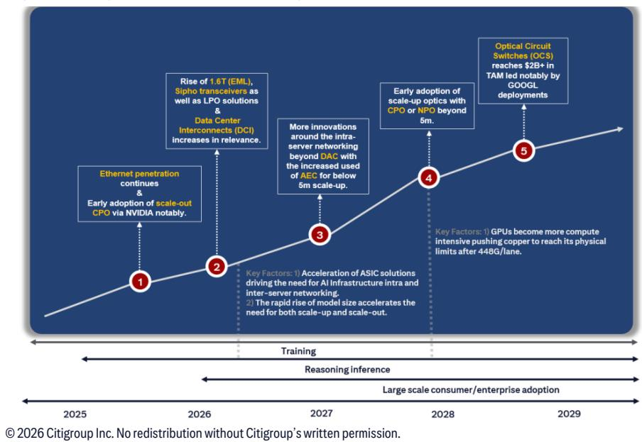
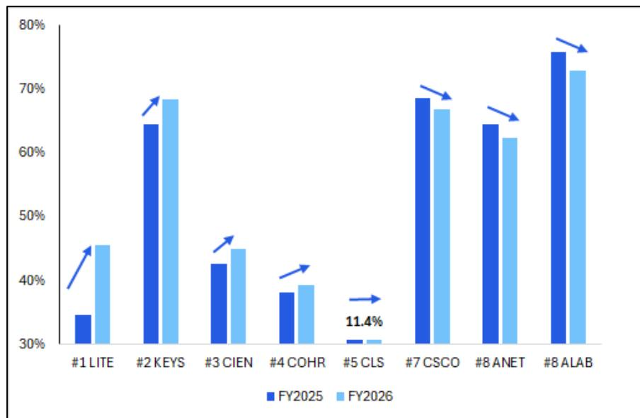
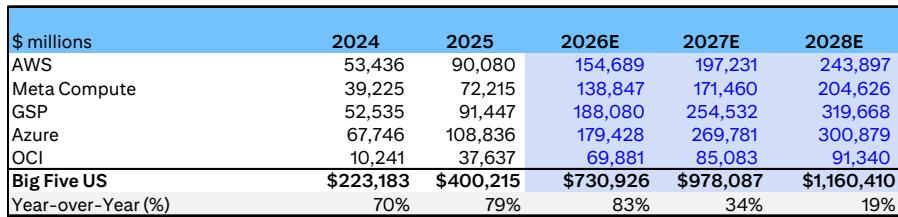

# Citi：美国通信设备2Q26预览-参与者关注供应约束

Citi在最新一期通信设备行业前瞻报告中，将核心矛盾从“AI算力需求是否持续”转向“供应瓶颈能否跟上”。报告认为，当前网络设备市场的关键变量不是需求端，而是硅片、激光器和光学元件的供给约束。这一判断直接影响了Citi对相关公司的排序逻辑。

报告上调了美国五大云厂商2026年数据中心资本支出预期，较4月预测高出16%。Citi分析师目前预计，2026年五大云厂商合计数据中心资本支出将超过7300亿美元，同比增长超过80%；2027年增速虽节奏变化至30%以上，但相对规模仍接近9800亿美元。一个值得注意的变化是，在即将发布的二季度财报前，有四家云厂商的2026年资本支出增速预计将高于2025年，而一季度时这一数字仅为一家。这意味着，云厂商的资本支出扩张正在从个别先行者扩散为群体行为。

> **KC评论：** Citi将五大云厂商2026年资本支出预测上调16%，但更值得关注的是“扩散”这个结构变化。一季度只有谷歌一家加速，二季度前预计有四家。如果这个趋势成立，网络设备供应商面对的将不是单一客户的订单波动，而是系统性的需求上移。

## 1. 供应短缺正在重塑公司排序，毛利率成为核心筛选指标

Citi在报告中明确表示，其相对公司排序受到两个因素影响：一是对组件短缺、产品组合变化及其对毛利率间接影响的担忧，二是对“第四阶段”技术（采用NPO或CPO的规模光学互连）的暴露程度。报告用一张图表直接展示了覆盖公司的毛利率同比排序，从高到低依次为LITE、KEYS、CIEN等，而CLS排在末位。

Citi预计，2026年下半年，包括硅交换机、存储器和激光器在内的供应短缺将持续对网络设备供应链产生谨慎影响。这意味着，那些对关键组件依赖度高、议价能力弱的公司，可能面临更大的毛利率不确定性。而能够通过技术领先或客户关系锁定供应的公司，则可能在短缺环境中获得相对优势。

## 2. 前端交换机市场超预期增长，800G渗透率仍处早期

根据Dell'Oro数据，2026年一季度数据中心前端交换机市场同比增长超过20%，高于此前预期。Dell'Oro已将全年增速预测从低个位数上调至中双位数，原因是价格上涨、AI前端相关需求增长以及AI部署前的基础设施研究。

在厂商格局中，Arista Networks继续保持市场领先地位，与第二名思科的差距接近3个百分点，主要得益于其在云客户中的强势地位。思科在云客户中增长强劲，份额提升近3个百分点，但企业销售仍占其数据中心交换机销售的70%以上。值得注意的是，Dell'Oro开始将Accton从白牌类别中单独列出，后者已成为市场第三大玩家，份额同比提升3个百分点。

800G在前端交换机市场中仅占中个位数份额，远未成为主流。但在Arista的出货组合中，800G已占中双位数比例，表明头部厂商正在加速向更高速率迁移。

## 3. AI后端交换机市场弹性较高增长，1.6T仍处预生产阶段

AI后端以太网交换机市场是报告中最引人注目的领域。2026年一季度，该市场同比增长超过100%，规模突破37亿美元。Dell'Oro预计全年将接近220亿美元，同比弹性较高以上。800G已占以太网销售额约80%，而1.6T占比不足1%，仍处于预生产阶段，预计下半年开始向亚马逊和谷歌出货，2027年上半年向Meta出货，并采用CPO技术。

在厂商排名中，Celestica以超过25%的份额位居第一，但其在高质量云客户中的份额同比下降约5个百分点，主要被思科蚕食。英伟达以中20%份额排名第二，Dell'Oro指出其计划在2026年下半年开始在Spectrum-X上出货CPO。思科一年前还未进入该市场，一季度已跃居第五，份额约8%，增长主要来自Meta的部署。

> **KC评论：** 思科在AI后端交换机市场从零到第五只用了不到一年，说明这个市场还远未定型。Celestica份额下降、思科快速切入，反映的是客户在供应紧张时主动分散采购来源。对于读者而言，关注的不应只是当前份额，而是各厂商在1.6T和CPO等下一代技术上的卡位。

## 4. 光传输市场受益于云需求，中国市场出现结构性调整

一季度光传输市场同比增长20%，规模超过40亿美元。其中，ZR/ZR+可插拔模块收入增长近40%。云客户已占该市场超过三分之一，季度收入同比增长约50%。Ciena以超过25%的份额位居第一，收入增长近40%，在ZR/ZR+可插拔和DCI应用中都获得份额提升。

报告特别提到，中国市场因计算基础设施向传统电信基础设施转移，正在放大华为和中兴的典型淡季效应。这一结构性调整值得关注，因为它可能意味着中国光传输市场的增长动力正在从电信转向数据中心，而这一转变的节奏和幅度将影响全球供应链的分布。

Dell'Oro已将2026年光传输市场增速预测从10%上调至中双位数，反映出云需求对整体市场的拉动作用正在增强。

---

这份报告的核心价值不在于给出具体公司排序，而在于它揭示了AI网络设备市场正在经历的三个同步变化：需求从个别云厂商扩散为群体行为、供应瓶颈从偶发变为系统性约束、技术迭代从800G向1.6T和CPO加速。这三个变化叠加，意味着未来几个季度的竞争格局可能比过去一年更具不确定性，也更具结构性机会。

For informational purposes only. Portions may be generated,translated,summarized,or edited with AI assistance based on source materials and may contain omissions or errors. Please verify independently. This is not investment,legal,tax,accounting,or other professional advice.

For informational purposes only. Portions may be generated,translated,summarized,or edited with AI assistance based on source materials and may contain omissions or errors. Please verify independently. This is not investment,legal,tax,accounting,or other professional advice.
