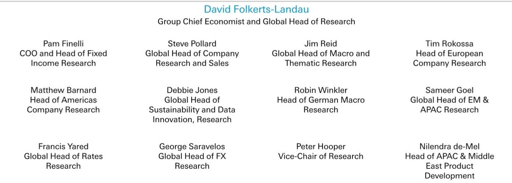
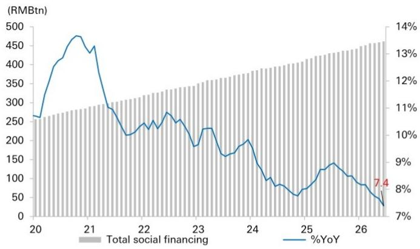
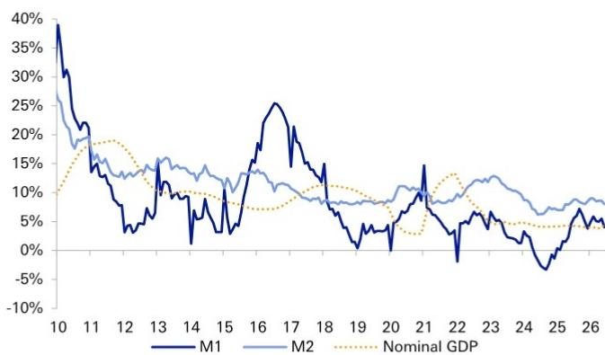

# China's Credit Data Signals a Structural Shift,Not Just a Cyclical Slowdown—Policy Response Must Be Equally Structural

June's credit data from China presents a paradox that investors cannot afford to dismiss as merely another soft month in a predictable cycle. Total Social Financing and new RMB loans both improved sequentially due to quarter-end seasonality,yet the headline recovery masks a deeper deterioration. TSF balance growth decelerated to 7.4% year-on-year,and loan outstanding growth hit a new historical low of 5.2%. These figures were not only below the prior year's levels but also missed consensus estimates. The sequential improvement was real,but the year-on-year comparisons and the underlying composition tell a fundamentally different story:the engine of credit creation is changing structure,and the traditional playbook for interpreting Chinese credit cycles is becoming obsolete.

The tension in the June data is between the surface-level recovery and the structural weakness beneath it. Corporate loans rose to RMB1.5 trillion from RMB637 billion in May,but medium-to-long-term corporate loans were 45% lower than a year ago. The gap was filled by bill financing,which surged to RMB114 billion. This is not a sign of healthy investment demand;it is a signal that corporations are borrowing to roll over existing obligations rather than to fund new capacity. Household loans turned positive after a contraction in May,but the increase remains historically weak. The data points to a real economy that is not yet ready to absorb credit at the pace policymakers desire.

The strategic implication for investors is clear:the Chinese economy is moving from a phase of credit-driven expansion to one of selective,quality-focused lending. The era of chasing headline loan growth is ending. The new regime demands a different analytical framework—one that prioritizes credit quality,sectoral allocation,and the interaction between fiscal and monetary policy over simple aggregate growth rates.

## The Composition of June's TSF Reveals a Divergence Between Government Support and Private Sector Caution

Government bond issuance slowed to RMB768 billion in June from RMB1.2 trillion in May,a sequential decline that might appear concerning at first glance. Yet government bonds remain the largest contributor to TSF after loans,and the slower pace is not a sign of retreat but of timing. The first half of the year saw a deliberate,measured pace of fiscal spending. The data implies that a significant portion of the fiscal firepower has been reserved for the second half of the year. This is a strategic choice,not a failure of execution.

Corporate bond issuance,in contrast,accelerated to RMB401 billion in June,up from RMB168 billion in May and RMB242 billion a year earlier. This improvement reflects corporations taking advantage of the low-interest-rate environment to refinance existing debt at lower costs. It is a rational response to monetary conditions,but it is not a signal of renewed investment appetite. The divergence is instructive:government and large corporations are using the low-rate environment to manage their balance sheets,while the broader private sector remains hesitant to commit to long-term capital expenditure.

Equity financing rose to RMB63 billion,driven by listings from innovative technology companies. This is a bright spot that confirms the policy focus on capital market support for strategic sectors. However,off-balance-sheet financing remained weak,reflecting sustained deleveraging by corporates. The pattern is one of selective credit expansion:capital flows to sectors and instruments aligned with policy priorities,while traditional credit channels remain constrained. Investors should interpret this not as a broad recovery but as a targeted allocation of financial resources.

## The Collapse in Medium-to-Long-Term Corporate Lending Signals a Structural Shift in Corporate Behavior,Not Just a Cyclical Pullback

The most striking data point in the June release is the 45% year-on-year decline in medium-to-long-term corporate loans. This is not a marginal softening;it is a collapse in the kind of lending that historically drove fixed-asset investment and industrial expansion. The offset came from bill financing,which surged to RMB114 billion. Bill financing is short-term,often used for working capital or to bridge temporary liquidity gaps. It does not fund factories,equipment,or R&D.

The question is why corporations are avoiding long-term commitments despite improvements in PMI and industrial production data earlier in the year. One interpretation is that the improvements in sentiment indicators were not backed by a commensurate improvement in order books or profitability. Another is that corporations have learned from past cycles of overinvestment and are now prioritizing balance sheet resilience over growth. The data supports the latter view. The cautious stance on investment is not a temporary hesitation;it reflects a structural shift in corporate risk appetite that will persist even if macroeconomic conditions improve.

For investors,this means that traditional cyclical recovery plays in Chinese banking and industrial sectors may not materialize as expected. Banks will not see a rapid rebound in loan volumes,and corporates will not rush to expand capacity. The investment narrative must shift from volume growth to margin resilience and asset quality. Banks that can maintain net interest margins and control credit costs in a low-growth environment will 报告观点those that rely on loan volume expansion.

## Household Credit Demand Remains Structurally Weak Despite Seasonal Improvement

Household loans turned positive at RMB265 billion in June,recovering from a contraction of RMB141 billion in May. This improvement is almost entirely seasonal,reflecting quarter-end window dressing by banks and a temporary easing of deleveraging pressures. The comparison to historical levels is sobering. Household credit demand remains far below the levels consistent with a healthy consumption and property market recovery.

The data on deposits provides additional context. Household new deposits turned positive by RMB2.0 trillion in June,rebounding from a decline in May. This suggests that households are still prioritizing saving over spending and borrowing. The decline in non-bank financial institution deposits by RMB990 billion reflects a slowdown in flows into wealth management products,likely due to market volatility. Households are parking cash in bank deposits rather than seeking higher-yielding alternatives. This is a defensive posture,not a sign of confidence.

The persistence of weak household credit demand has significant implications for consumption-driven growth. If households are reluctant to borrow,the property market will remain under pressure,and consumer durables spending will be constrained. The policy response cannot rely solely on lowering interest rates;it must address the underlying causes of household caution,including income uncertainty and property price expectations. Investors should expect further policy measures aimed at stabilizing household confidence,but the impact will be gradual.

## The Liquidity Contraction in M1 and M2 Confirms That Economic Activity Has Weakened Since the Second Quarter

M1 growth slowed to 8.0% in June from 8.6% in May,and M2 growth decelerated to 4.0% from 5.5%. These declines are not marginal;they represent a meaningful contraction in liquidity at the quarter-end. M1,which includes cash and demand deposits,is a leading indicator of economic activity. Its deceleration confirms that the economic momentum observed in the first quarter has not been sustained.

The narrowing of the gap between M1 and M2 growth is also notable. A wider gap typically indicates that funds are moving from savings into transaction accounts,signaling increased economic activity. The narrowing gap suggests the opposite:funds are flowing back into time deposits and other less liquid forms,reflecting a lack of spending and investment opportunities. This is consistent with the weak corporate and household credit data.

For investors,the liquidity data reinforces the view that the second half of the year will require more aggressive policy support. The PBOC's second-quarter Monetary Policy Committee meeting reiterated an accommodative stance,emphasizing counter-cyclical and cross-cyclical adjustments. The language signals a willingness to act,but the timing and magnitude of the response remain uncertain. The data suggests that the window for effective policy intervention is narrowing. If liquidity continues to contract,the risk of a more pronounced economic slowdown increases.

## A Decision Framework for Investors:Prioritize Asset Quality,Dividend Stability,and Fiscal Exposure Over Loan Growth

The June credit data provides a clear decision framework for investors navigating the Chinese banking and credit markets. The traditional metric of loan growth is no longer a reliable indicator of bank performance or economic health. Instead,investors should focus on three dimensions:asset quality,dividend stability,and exposure to fiscal-driven sectors.

First,asset quality is the critical variable. With medium-to-long-term corporate lending declining and bill financing rising,the risk of credit deterioration increases. Banks with larger corporate business exposure and a track record of disciplined underwriting will be better positioned. The increase in write-offs in June,reflected in the "other financing" category,hints at accelerated book clean-up. This is a positive signal for banks that have already recognized losses,but it also indicates that asset quality pressures are real.

Second,dividend stability becomes more important in a low-growth environment. Banks that can maintain or increase dividend payouts will attract investors seeking yield in a world of declining interest rates. The preference for large banks with resilient operating performance and fair dividend yields is grounded in this logic. These banks have the balance sheet strength to absorb credit losses while maintaining payouts.

Third,exposure to fiscal-driven sectors offers a degree of protection. Government bond issuance will accelerate in the second half of the year,and fiscal spending will increase. Banks that have strong relationships with state-owned enterprises and local government financing vehicles will benefit from this flow. The selective credit expansion favors those with deep ties to the policy apparatus.

The PBOC's increasing focus on funding efficiency and loan quality,rather than headline loan growth,reinforces this framework. Banks will be encouraged to lend to high-quality borrowers and strategic sectors,not to chase volume. Investors should align their portfolios accordingly,favoring banks that operate within this new paradigm rather than those that rely on the old model of volume-driven growth.

*For informational purposes only. Portions may be generated,translated,summarized,or edited with AI assistance based on source materials and may contain omissions or errors. Please verify independently. This is not investment,legal,tax,accounting,or other professional advice.*

For informational purposes only. Portions may be generated,translated,summarized,or edited with AI assistance based on source materials and may contain omissions or errors. Please verify independently. This is not investment,legal,tax,accounting,or other professional advice.
