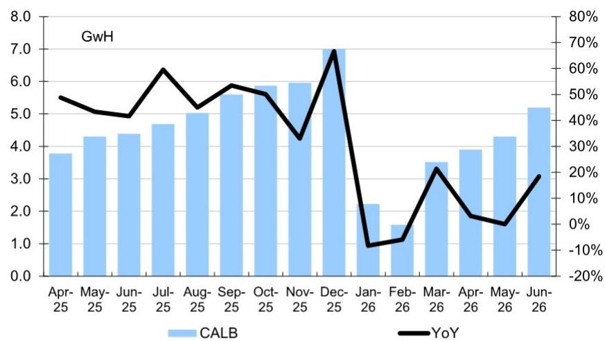
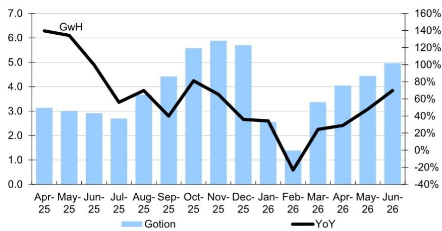

# DB：中国电池月度监测-2026年6月

2026年6月的数据，给中国电池行业画出了一条并不简单的曲线。DB最新发布的月度监测报告显示，当月中国xEV与储能电池总产量达到206 GWh，同比增长59%，上半年累计产量突破1068.9 GWh，同比增幅53%。销量端同样强劲，6月总销量196 GWh，同比增49%，上半年累计接近980 GWh。

但真正值得关注的，不是这些数字本身，而是数字背后的结构性分化：产量和销量在高位加速增长的同时，电池材料价格却出现了截然不同的走势。碳酸锂价格在6月环比下跌12%，而磷酸铁锂正极材料价格同比涨幅高达90%。这种“量价背离”正在重塑产业链各环节的利润分配格局。

## 1. 储能电池正在成为增长的主引擎，其增速已显著超过动力电池

报告中最突出的结构性变化，是储能电池的爆发。6月储能电池销量62.6 GWh，同比增长67%，环比增长13%；上半年累计销量318.1 GWh，同比增幅高达83%。相比之下，动力电池上半年销量661.2 GWh，同比增速为36%，不到储能电池的一半。

这意味着，储能正在从“补充角色”变为“增长引擎”。上半年储能电池销量已占电池总销量的32.5%，而一年前这个比例还不到25%。如果这一趋势延续，储能电池将在未来12-18个月内成为电池行业最大的增量来源。

> **KC评论：** 储能电池的高增速并非短期现象。上半年83%的同比增幅，叠加动力电池增速的相对节奏变化，意味着产业链的产能规划和材料需求结构需要重新校准。那些过度押注动力电池单一赛道的企业，可能面临需求错配的不确定性。

## 2. 磷酸铁锂路线正在全面主导市场，三元材料的份额被持续压缩

从产品结构看，磷酸铁锂（LFP）的统治力在进一步增强。6月LFP电池产量169.2 GWh，同比增长70%，在总产量中占比高达82%。同期三元（NCM）产量36.6 GWh，增速仅为24%，占比已降至17.8%。

在动力电池装机端，LFP的份额同样在扩大。6月LFP装机63.7 GWh，同比增长34%，而NCM装机12.7 GWh，同比仅增19%，环比甚至下降了5%。上半年累计装机中，LFP占比已从去年同期的约78%升至81%。

这一趋势背后是成本与性能的权衡。当碳酸锂价格从高位回落时，LFP的成本优势更加突出，而能量密度差距在乘用车领域已不再构成决定性障碍。报告没有给出明确的判断，但数据本身指向一个结论：三元材料在中低端市场的空间正在被LFP持续侵蚀。

## 3. 电池出口结构正在发生质变：LFP出口弹性较高，海外市场对中国电池的依赖度在上升

6月中国电池出口总量36.2 GWh，同比增长48%，环比增长24%。其中动力电池出口25.5 GWh，同比增61%；储能电池出口10.7 GWh，同比增26%。

最引人注目的是LFP动力电池的出口表现：6月出口13.9 GWh，同比增幅高达104%，上半年累计出口62.4 GWh，同比增88%。这意味着海外市场对中国LFP电池的接受度正在快速提升。相比之下，NCM动力电池出口增速仅为28%，上半年累计增速24%。

出口结构的这一变化，与全球车企加速推进低成本电动化战略密切相关。欧洲和东南亚市场对LFP电池的需求正在从“试点”转向“规模化采购”。DB的报告没有展开分析，但数据本身已经说明：中国电池企业的海外竞争，正在从“以量取胜”转向“以技术路线优势取胜”。

## 4. 材料价格分化加剧：碳酸锂回落，但正极材料和电解液仍在上涨

6月的价格数据显示，产业链利润正在向上游材料端集中。碳酸锂价格环比下跌12%至16.45万元/吨，但同比仍上涨172%。与此同时，磷酸铁锂正极材料价格同比上涨90%，六氟磷酸锂（LiPF6）价格同比上涨118%。

这种分化背后是供需结构的差异：碳酸锂产能释放较快，价格承压；而正极材料和电解液受制于产能瓶颈和环保约束，供给弹性较小。报告显示，LFP正极材料价格在6月环比下跌5%，但同比涨幅仍高达90%，说明价格虽有松动，但相对水平仍处于高位。

对于电池企业而言，这意味着成本不确定性并未真正缓解。尽管碳酸锂价格回落，但正极材料和电解液的价格上涨正在抵消这一利好。电池企业的毛利率修复，可能比市场预期的更慢。

> **KC评论：** 材料价格的分化，本质上是产业链不同环节的议价能力差异。碳酸锂价格回落但正极材料价格坚挺，说明加工环节的产能瓶颈比资源端更紧。读者在评估电池企业成本时，不能只看碳酸锂，更要关注正极材料、电解液等加工环节的价格走势。

## 5. 头部企业装机增速分化：CATL稳中有进，BYD承压，二线企业正在加速追赶

从装机数据看，6月CATL装机32.6 GWh，同比增长28%，环比微降1%；上半年累计154.3 GWh，同比增20%。BYD装机14.1 GWh，同比仅增13%，但环比增长19%；上半年累计57.4 GWh，同比下降18%。

二线企业的表现更为亮眼。EVE（亿纬锂能）6月装机4.5 GWh，同比增长76%，环比增长38%；Gotion（国轩高科）装机5.0 GWh，同比增长70%，环比增长12%；Zenergy（中创新航）装机2.1 GWh，同比增长62%。

这一格局变化值得关注。CATL的增速虽然稳健，但并未显著超越行业平均水平；BYD上半年装机同比下降，可能与其自身整车销量结构调整有关；而二线企业的高增速，反映出下游整车厂正在主动分散电池供应商，以降低对单一供应商的依赖。

对于行业观察者而言，这意味着电池行业的竞争格局正在从“一超多强”向“多极竞争”演变。CATL的份额优势依然明显，但二线企业的追赶速度正在加快。

For informational purposes only. Portions may be generated,translated,summarized,or edited with AI assistance based on source materials and may contain omissions or errors. Please verify independently. This is not investment,legal,tax,accounting,or other professional advice.

For informational purposes only. Portions may be generated,translated,summarized,or edited with AI assistance based on source materials and may contain omissions or errors. Please verify independently. This is not investment,legal,tax,accounting,or other professional advice.
