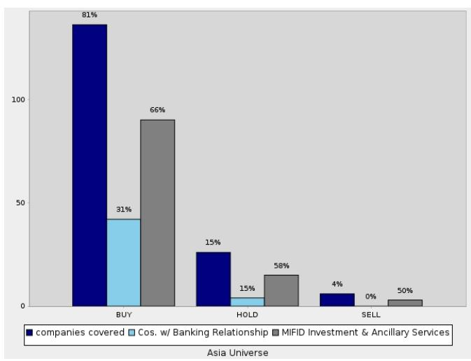
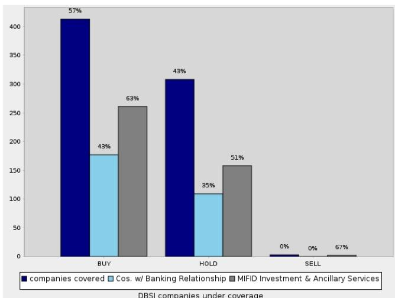

# Industry Humanoid Robot Pulse

Asia
Japan
North America

Industrials
Manufacturing

Date
16 July 2026

Industry Update

# US activities stepping up; China scaling fast; Supportive policies (2Q edition)

Amid the heavy newsflow around humanoid robots, we summarise the key themes and developments in the market globally in this quarterly series.

DB views: The humanoid robot market is accelerating globally. China is leading in production, with government officials estimating 100,000 units of humanoid robot production in 2026, significantly higher than our expectation of \~40,000 units. In the US, Agility Robotics utilises a 75% locally-sourced supply chain and aims to reduce the bill of materials (BOM) cost from US\$125k currently to US\$30k. AGIBOT and Figure AI have livestreamed their humanoid robots working in factories and warehouses, demonstrating commercial viability. This rapidly developing market indicates growing component demand, which bodes well for component manufacturers. Within our APAC Industrials coverage, we prefer Hengli (Buy, closing price RMB110.58), Shuanghuan (Buy, closing price RMB42.39), Harmonic Drive (Buy, closing price ¥7,430), and Yaskawa (Buy, closing price ¥5,490). We also highlight Tesla (Buy, closing price US\$394.46) and Mobileye (Buy, closing price US\$9.43) (through Mentee Robotics) as humanoid robotic OEMs in the US.

## We highlight the key themes and developments in 2Q26:

1. Activities in the US stepping up: Agility going public through SPAC by 4Q26; Meta acquiring an embodied AI model startup; OpenAI recruiting robotics engineers; and NVIDIA expanding its robotics team in China.

2. Continuing developments in China: AGIBOT accelerating production; updates from BYD and Li Auto on robotics; Alibaba unveiling robotic models; and Kepler undergoing acquisition.

3. Policy updates: China to produce 100,000 humanoids in 2026; Shanghai to deploy 100,000 humanoids by 2030; the US could restrict Chinese robotics; and Japan to deploy 10mn AI robots by 2040.

4. Use case: Livestreaming of humanoids working in factories and warehouses by AGIBOT and Figure.

5. Emotional companion: Bionic humanoids from UBTECH and DOBOT.

Iris Zheng, CFA
Research Analyst
+852-2203-5884

Edison Yu
Research Analyst
+1-212-250-7263

Laura Li
Research Associate
+1-212-250-2266

Winnie Dong
Research Analyst
+1-212-250-5121

## Companies featured

<table><tr><td colspan="2">Companies featured</td></tr><tr><td>Hengli Hydraulic(601100.SS),CNY110.58</td><td>Buy</td></tr><tr><td>Shuanghuan Driveline(002472.SZ),CNY42.39</td><td>Buy</td></tr><tr><td>Yaskawa Electric (6506.T),¥5,490</td><td>Buy</td></tr><tr><td>Harmonic Drive Systems (6324.T),¥7,430</td><td>Buy</td></tr><tr><td>Tesla Inc. (TSLA.OQ),USD394.46</td><td>Buy</td></tr><tr><td>Mobileye (MBLY.OQ),USD9.43</td><td>Buy</td></tr><tr><td>FANUC (6954.T),¥7,008</td><td>Hold</td></tr><tr><td colspan="2">Source: DB</td></tr></table>

## We also highlight reports from DB Research:

Comparing Unitree, UBTECH, DEEP, Dobot and Leju based on their prospectuses and public information, published on 15 June. Link to report.

■ Comprehensive update of the humanoid robot market and six visions for 2026, published on 6 March. Link to report.

## Activities in the US stepping up: Agility; Meta; OpenAI; NVIDIA

## Agility targets IPO through SPAC by 4Q26; 75% supply chain sourced within the US

On 24 June 2026, Agility Robotics announced its intention to go public through a business combination with Churchill Capital Corp XI (CCXI), a publicly traded Special Purpose Acquisition Company (SPAC). The transaction will make Agility the first US-listed pure humanoid robotics company. Upon completion, the combined entity will operate as Agility and trade under the ticker "AGLT." The deal values Agility at a pre-money valuation of US\$2.5bn, and is expected to raise more than US\$620mn, according to Agility.

Agility's humanoid robot Digit is commercially deployed with enterprises including Schaeffler, GXO, Toyota Motor Manufacturing Canada, and Mercado Libre, with more than 65,000 hours of operation accumulated. Agility runs a manufacturing facility with production capacity of up to 10,000 units of Digits annually. Agility sources \~75% of Digit parts within the US. Agility has recorded over US\$300mn orders for Digit v5 so far, with a pipeline multiple times that amount. Digit v4 has a carrying capacity of 35lbs (\~16kg) and a runtime of 4 hours. Agility plans to launch Digit v5 in 2026, which is designed to safely operate outside the work cell and alongside humans for commercial scale. Agility aims to reduce the bill of materials (BOM) cost from US\$125k currently to US\$30k when the production scales up to 10,000 units per year.

## Meta acquired embodied AI model startup Assured Robot Intelligence

On 1 May 2026, Meta Platforms announced its acquisition of Assured Robot Intelligence (ARI), a San Diego-based start-up specializing in AI models for robots, for an undisclosed amount. ARI's 20-member team, led by its co-founders Lerrel Pinto and Mr. Wang Xiaolong, will join Meta Superintelligence Labs (MSL) to build humanoid intelligence, as announced by Wang via his X account. Wang was a former NVIDIA researcher and currently holds an associate professorship at the University of California. Pinto previously co-founded Fauna Robotics in 2024, and the humanoid robot startup was officially acquired by Amazon in March 2026.

## OpenAI recruiting robotics engineers

On 31 May 2026, OpenAI's CEO Sam Altman publicly revealed that the company was seeking to hire “exceptional full-stack hardware, operations, systems, and machine learning engineers to help OpenAI program and manufacture robots that are useful for society”. It marked the relaunch of OpenAI’s internal robotics division, five years after disbanding its previous robotics research team in 2021 to pivot resources toward Large Language Models (LLMs).

## NVIDIA expanding robotics team in China

According to Nvidia's official account announcement on 30 June 2026, the company is recruiting for more than a dozen roles within its robotics team in China. These new opening roles, located in Shanghai, Beijing and Shenzhen include four key domains: embodied intelligence, simulation, implementation and solutions architecture.

## NVIDIA unveiled Reference Humanoid Robot on GTC Taipei 2026

At GTC Taipei on 1 June 2026, NVIDIA CEO Jenson Huang launched the NVIDIA Isaac GR00T reference humanoid robot, an open humanoid robot reference design built on NVIDIA Jetson Thor and NVIDIA's humanoid-focused AI models, namely NVIDIA Isaac GR00T, for academic research. The robot features 22 DoF on each dexterous hand supplied by Singapore-based Sharpa, and integrates H2 Plus humanoid robot from Unitree Robotics. According to Unitree's website, this Reference Humanoid Robot is expected to be available in late 2026. Furthermore, the NVIDIA Isaac GR00T developer platform will also support Unitree's G1 humanoid robot. However, Unitree has since been added to the Military Companies list by the U.S. Department of Defense, on 8 June 2026, which raises questions over this collaboration.

Following the GTC Taipei event, Jensen Huang visited South Korea and met with LG Group Chairman Koo Kwang-mo, to discuss their collaborations spanning robotics, AI data centers and mobility. As part of the strategic partnership, LG plans to leverage NVIDIA's Isaac GR00T open platform to develop its own humanoid and logistics robots.

## Continuing developments in China: AGIBOT; BYD; Li Auto; Alibaba; Kepler

## AGIBOT achieved 15,000 units cumulative embodied robot production

On 28 June 2026, AGIBOT announced the production of its 15,000th general-purpose embodied robot, Genie G2. This milestone follows a rapid increase in production, with AGIBOT's embodied robot cumulative production reaching 1,000 units in January 2025, 5,000 units by 8 December 2025, and 10,000 units by 28 March 2026. The accelerating pace in 1Q26 underscores AGIBOT's enhanced scaling capabilities.

## BYD provided updates on humanoid robot

In May 2026, BYD's Executive Vice President Ms. Li Ke shared the company's advancements in robotics business. Ms. Li stated that BYD's accumulated technology in intelligent driving, sensor fusion, motor control, and other fields can naturally be transferred to humanoid robots. As for manufacturing, she commented that BYD intends to establish an open platform to either self-develop humanoid robots or cooperate with external partners. However, BYD recently refuted several items of market news, including claims that "the humanoid robot project is named 'Yao Shun Yu'," "the 7th-generation prototype is being tested on-site at Shenzhen and Changsha factories," and "approximately 150 units of humanoid robots are on duty, with a target of 20,000 units for internal use within 2026."

## Li Auto announced its entry into humanoid robots

During Li Auto's 1Q26 earnings call on 28 May 2026, the Chairman and CEO Mr. Li Xiang outlined the strategic approach to develop both facets of embodied AI: autonomous driving, considered the "first half" of the technology, and general-purpose humanoid robots, representing the "second half." The company highlighted that the core technological stack—comprising self-developed chips, large language models, perception systems, control systems, and operating systems—essential for autonomous driving, also forms the fundamental base for general-purpose humanoid robots. This synergy allows technical capabilities validated in mass-produced vehicles to directly propel advancements in humanoid robots. Li Auto has already initiated the development of humanoid robot products. According to unconfirmed market news from early 2026, Li Auto's humanoid robot team, operating under the internal codename "Nexus," has been working on the project for nearly a year. The team has planned two distinct products: a two-wheeled humanoid robot and a bipedal humanoid robot. The two-wheeled product is ideally slated for release by mid-2026, primarily targeting factory manufacturing applications.

## Alibaba unveiled robotics foundation model Qwen-Robot

On 16 June 2026, Alibaba launched its Qwen-Robot series, a suite of embodied intelligent large models comprising three components:

Qwen-RobotManip: a Vision-Language-Action (VLA) model excels in object manipulation and interaction within physical environments. It empowers robots to perform intricate tasks such as grasping objects and opening / closing drawers. The model addresses the challenge of incompatible action representations across various robot platforms.

Qwen-RobotNav: a Vision-Language-Navigation (VLN) model engineered to tackle autonomous robot movement and navigation challenges. Equipped with a built-in environmental memory module, it enables robots to perform tasks such as indoor item retrieval and short-distance material transfer.

Qwen-RobotWorld: a world model simulates the underlying physical dynamics that facilitate both navigation and manipulation. This model allows personnel to generate extensive simulated training data, significantly reducing the costs associated with on-site calibration of physical robots.

## Kepler Robotics was acquired by Hangzhou Kelin

On 19 May 2026, Hangzhou Kelin Electric Co., Ltd. (688611.SH) announced its plan to acquire a $41.57\%$ stake in Kepler Robotics for no more than RMB300mn. Combined with the $9.43\%$ stake already secured, Hangzhou Kelin will hold $51\%$ of Kepler' equity. Kepler is valued at approximately RMB722mn in this acquisition. Hangzhou Kelin, specializing in intelligent monitoring and control technologies for the power IoT, developed six-axis force sensors for humanoid robots in early 2026. Notably, prior to this acquisition, Kepler's former CEO and co-founder, Mr. Hu Debo, had departed to establish his own venture. According to financial disclosures from Hangzhou Kelin, in 2025, Kepler reported revenue of RMB4.3mn and net loss of RMB67mn; in 1Q26, revenue stood at RMB2.6mn with a net loss of RMB17mn. Despite these figures, according to Kepler's CFO, the internal target for FY2026 is to achieve over RMB100mn in revenue. Currently, Kepler holds orders backlog exceeding RMB47mn across industrial and commercial sectors, all representing commercialized repurchase orders from existing clients.

## Policy updates: China; the US; Japan

China's humanoid robot production to exceed 100,000 units in 2026

On 7 July 2026, an official from the Ministry of Industry and Information Technology (MIIT) projected that China's annual humanoid robots production would surpass 100,000 units in 2026. Compared to our estimates of \~15k units in 2025, it represents a more than five-fold increase. The official also noted that more than 30% of China's large-scale industrial enterprises currently are utilising AI applications. MIIT is implementing specialised initiatives, such as "Model-Data Resonance" and "Humanoid Robots and Embodied Intelligence Real-Scenario Training", to identify high-value application scenarios.

## Shanghai to deploy 100,000 units of humanoids by 2030

On 18 May 2026, the Shanghai Municipal Government Information Office announced its "AI+" initiative during a press conference on the "15th Five-Year Plan." This strategic action aims to leverage artificial intelligence to drive a paradigm shift in industrial sectors. By the end of the "15th Five-Year Plan" period (2026-2030), Shanghai plans to integrate 100,000 units of humanoid robots into local factories and achieve an intelligent agent application popularisation rate exceeding $80\%$ among industrial enterprises above a designated size.

## Figure 1: Shanghai policies on robotics

<table><tr><td>Date</td><td>Policy</td></tr><tr><td colspan="2">Shanghai</td></tr><tr><td>May-26</td><td>Shanghai &quot;AI+&quot; initiative (上海&quot;人工智能+行动)&quot;15th Five Year Plan (2026-2030)&quot; goal: integrate 100,000 units of humanoid robots into local factories and achieve an intelligent agent application popularization rate exceeding 80% among industrial enterprises above a designated size.</td></tr><tr><td>Jan-26</td><td>&quot;Shanghai Action Plan for Supporting the Transformation and Upgrade of Advanced Manufacturing (2026-2028)&quot; (上海市支持先进制造业转型升级三年行动方案(2026-2028年))Encourage enterprises to invest in emerging fields such as low-altitude economy, commercial aerospace, embodied intelligence, bio-manufacturing, and intelligent terminals, accelerating the breakthrough of industrial large-scale development bottlenecks for innovative products such as eVTOL, commercial rockets, and humanoid robots.</td></tr><tr><td>Oct-25</td><td>Shanghai: &quot;Action Plan for High-Quality Development of the Smart Terminal Industry (2026-2027)&quot; (智能终端产业高质量发展行动方案(2026-2027年))Further supports the mass production of humanoid robots and the industrialization of core components such as edge-side chips and dexterous hands.</td></tr><tr><td>Aug-25</td><td>Shanghai: &quot;Embodied AI Industry Development Implementation Plan&quot; (上海市具身智能产业发展实施方案)2027 goal: Achieving 20+ core algorithm and other technology breakthroughs in embodied models and datasets; clustering 100 industry leading companies, launching 100 innovative application scenarios, and promoting 100 globally competitive products. Overall to grow the embodied AI industry&#x27;s core output beyond RMB50bn.</td></tr><tr><td>Dec-24</td><td>Shanghai: &quot;Implementation Plan for AI &#x27;Molding Shanghai&#x27;&quot; (关于人工智能“模塑申城”的实施方案)Organizing technological R&amp;D efforts to develop embodied AI algorithmic models, including end-to-end, multi-modal, and spatial intelligence. Focusing on open-source robot bodies and datasets, as well as open-source autonomous simulation platforms, to build an open-source technology foundation. Conducting embodied AI data collection and releasing action datasets. Piloting the large-scale application with 100+ robots.</td></tr><tr><td>Oct-23</td><td>Shanghai: &quot;Action Plan for Promoting High-quality Innovation and Development of Smart Robots Industry (2023-2025)&quot; (上海市促进智能机器人产业高质量创新发展行动方案(2023-2025年))2025 goal: Building three public service platforms, smart robot detection and pilot verification innovation center, humanoid robot manufacturing innovation center, general robot industry research institute, etc.</td></tr><tr><td>Sep-23</td><td>Shanghai: &quot;Action Plan for Further Promoting the Construction of New Infrastructure (2023-2026)&quot; (上海市进一步推进新型基础设施建设行动方案(2023-2026年))</td></tr><tr><td>May-23</td><td>Shanghai: &quot;Three-Year Action Plan for Promoting the High-quality Development of Manufacturing (2023-2025)&quot; (上海市推动制造业高质量发展三年行动计划(2023-2025年))Targeting the forefront of AI technology, to build general large models and to develop industrial ecosystems for vertical domains; establishing international algorithm innovation base, and accelerating the innovative development of humanoid robots.</td></tr><tr><td>Sep-22</td><td>Shanghai: &quot;Regulations on Promoting the Development of the Artificial Intelligence Sector&quot; (上海市促进人工智能产业发展条例)The city promotes the standardization and modularization of smart robot software and hardware systems, supports the cultivation of smart robot system integrators, and encourages relevant enterprises, product users, and financial institutions to adopt methods such as product leasing and service procurement to expand smart robot application scenarios.</td></tr></table>

Source : DB, local government

## The US to impose potential restrictions on China-produced humanoid robots

During a closed-door meeting held on 23 June 2026, the U.S. Commerce Secretary Howard Lutnick commented that his department was studying Chinese state-subsidized robotics imports and signaled that the US administration could take action once the review is complete. Earlier in June, the U.S. lawmakers proposed the GUARD Act (Guarding the U.S. Against Adversarial Robotics Dominance Act). The U.S. national security agencies would be required to assess humanoid and quadruped robots produced by China and other foreign adversaries and potentially ban their import into the U.S..

Figure 2: US policies on robotics

<table><tr><td>Policy</td><td>Date</td><td>Topic</td><td>Details</td></tr><tr><td colspan="4">Robot related policies or events</td></tr><tr><td>Closed-door meeting</td><td>Jun 2026</td><td>Robotics</td><td>U.S. Commerce Secretary Howard Lutnick stated that his department is studying Chinese state-subsidized robotics imports and signaled the administration could take action once the review is complete.</td></tr><tr><td>The GUARD Act</td><td>Proposed in Jun 2026</td><td>Humanoid robot</td><td>A bipartisan group of lawmakers introduced legislation to scrutinize and potentially ban the importation of robots made in China. It would require national security agencies to begin a review process for any humanoid and quadruped robots made by China or other countries.</td></tr><tr><td>American Security Robotics Act</td><td>Mar 2026</td><td>Humanoid robot</td><td>Suggested to prohibit the federal government from procuring and operating unmanned ground vehicle systems manufactured by foreign entities of concern (especially China), including humanoid robots and autonomous patrol technology.</td></tr><tr><td>Chinese Military Companies List</td><td>Updated in Feb 2026</td><td>Humanoid robot</td><td>The US Department of Defense (DoD) has updated its Chinese Military Companies List (CMC List), adding robot company Unitree robotics to the &quot;blacklist&quot;.</td></tr><tr><td>Executive Order</td><td>Potential release in 2026</td><td>Robotics</td><td>On 3 December, news reported that the Trump administration is actively drafting a new executive order focused on robotics policy, with a potential release planned for 2026. The administration is framing this as a move to bolster domestic manufacturing, with Commerce Secretary Howard Lutnick meeting with industry CEOs to shape a strategy that prioritizes industrial and defense applications, aiming to &quot;remove sand from the gears&quot; of innovation.</td></tr><tr><td>Department of Transportation</td><td>By end of 2026</td><td>Robotics/Autonomous technologies</td><td>Reportedly to form a robotics working group, to be announced as part of a broader federal robotics effort to accelerate the deployment of autonomous technologies. This initiative aims to strengthen competitiveness in critical sectors, with a focus on integrating robotic systems into transportation infrastructure and enhancing AI-driven operations.</td></tr><tr><td>National Commission on Robotics Act</td><td>Proposed in Feb 2026</td><td>Robotics</td><td>Proposed to establish a national commission to evaluate U.S. competitiveness in robotics and provide policy recommendations</td></tr><tr><td>Humanoid ROBOT Act of 2025</td><td>Proposed in Nov 2025</td><td>Robotics</td><td>Suggested to prohibit the federal government from acquiring humanoid robots with integrated artificial intelligence from foreign entities, including military suppliers from China, Iran, North Korea, and Russia</td></tr><tr><td>Section 232 Investigation</td><td>Sep 2025</td><td>Robotics</td><td>News reported that the US Department of Commerce Bureau of Industry and Security (BIS) announced the initiation of an investigation into the effects on US national security of imports of robotics and industrial machinery. The investigation could result in the imposition of tariffs or other import restrictions by Spring 2026.</td></tr></table>

Source : DB, White House

## Japan to deploy 10mn units of AI robots by 2040

On 30 June 2026, Japan's Ministry of Economy, Trade and Industry (METI) unveiled a revised "AI Robotics Strategy", targeting to deploy 10mn units of AI robots by 2040. This updated strategy significantly broadened its focus from basic manufacturing to encompassing 18 high-demand sectors, such as food processing, high-precision medical care, retail distribution, and elderly care. The strategy will leverage "Noetra", a domestically developed multimodal foundational large model co-founded by SoftBank, NEC, Honda and Sony. Noetra will initiate AI research and development from July, aiming to develop Japan's largest AI model by 2027. Over the next five years, METI will allocate a total of JPY1tn in funding to Noetra, with JPY387bn specially for FY2026. Furthermore, starting from mid-July, 35 additional companies, including manufacturers such as Fanuc, Yaskawa, Murata Manufacturing, Sharp and Fujitsu, will also invest in the initiative.

## Use case: Livestreaming of humanoids working in factories and warehouses by AGIBOT and Figure

## AGIBOT livestreamed Genie G2 operating on a tablet production line for 6 days

From 23 June to 28 June 2026, AGIBOT hosted a 6-day livestream demonstrating humanoid robots operating across a complete tablet production inspection line at Longcheer Technology's Nanchang factory. During this unedited and unrehearsed live broadcast, AGIBOT's wheeled humanoid robots, Genie G2, performed high-precision inspection tasks including multimedia interface, audio, radiated spurious emission, and coupling testing for 11 hours daily (from 8am to 7pm), working collaboratively with human personnel.

Earlier, in April 2026, AGIBOT already demonstrated an 8-hour livestream of tablet production line operations at the same factory. According to AGIBOT, in April, the humanoid robots completed 2,283 tasks with a $100\%$ success rate, performing precise loading and unloading on high-speed assembly lines. In June, the eight humanoid robots completed 17,625 tasks with a success rate of $99.99\%$ . Compared to April, the June demonstration offers a full coverage of the tablet's entire quality inspection process. AGIBOT revealed that approximately 100 units of humanoid robots will be deployed on Longcheer's production lines by 3Q26. This followed Longcheer's multi-hundred million yuan framework order placed in Oct

2025, targeting the deployment of nearly one thousand units of Genie G2 robots.

Figure AI showcased 200-hour humanoid robot live stream in warehouse

In May 2026, Figure AI completed a 200-hour autonomous livestream, demonstrating three Figure 03 humanoid robots sorting packages in a warehouse. Their mission involved detecting package barcodes, picking up the packages, and then placing them on a conveyor belt with the barcode face down. Throughout the livestream, the robots processed \~250,000 packages without experiencing hardware failure. While occasional issues such as dropped or incorrectly oriented packages occurred, Figure AI classified these as package-handling errors, not robot malfunctions. According to Figure AI's CEO Brett Adcock, the robots now match human speed on this sorting task, achieving less than 3 seconds per package.

## Emotional companion Bionic: humanoids from UBTECH and DOBOT

## UBTECH launched ultra-bionic humanoid robots

On 30 June 2026, UBTECH's consumer-grade brand UWorld unveiled U1 series, its first full-size, ultra-bionic humanoid robot positioned as a "household emotional companion". The U1 series offer three models: U1 Lite (half-body version) priced at RMB119,800; U1 Pro (full-body version) priced at RMB169,800; and U1 Ultra (high-dynamic full-body version), with male and female versions priced at RMB990,000/880,000, respectively. The exterior of U1 series is covered in silicone material, mimicking human skin tone, hair, and texture. The U1 Pro model features 88 DoF. However, it currently only supports static pose interaction; only U1 Ultra supports walking and dancing functionalities. Its battery life of 2 to 4 hours per charge also presents a limitation for daily household use. According to UBTECH, the cumulative orders for the bionic robots have surpassed 13,361 units by end of June. UBTECH aims to deliver the orders within 2026. According to UBTECH's CEO, humanoid robots sales across all categories are projected to account for over $80\%$ of the group's total revenue in 2026 (2025: $43\%$ from full-size embodied and non-embodied smart humanoid robot products and services).

Figure 3: Appearance and key parameters of U1 Pro  
  
Source : Company announcement, DB

<table><tr><td colspan="3">U1 Pro</td></tr><tr><td>Name</td><td>Nix (Male)</td><td>Una (Female)</td></tr><tr><td>Height</td><td>183cm</td><td>168cm</td></tr><tr><td>Weight</td><td>42kg</td><td>35.2kg</td></tr><tr><td>DoF</td><td colspan="2">88 (Active: 24)</td></tr><tr><td>- Facial</td><td colspan="2">33</td></tr><tr><td>Runtime</td><td colspan="2">≥ 4 hours on a full charge</td></tr><tr><td>Battery</td><td colspan="2">21.6V (8100mAh)</td></tr><tr><td>Computing</td><td colspan="2">arm64+ NVIDIA Jetson Orin</td></tr><tr><td>Pricing</td><td colspan="2">RMB169,800</td></tr></table>

## DOBOT set to launch companion AI humanoid robot

In June, Dobot announced its plans to unveil its next-generation interactive companion AI humanoid robot. The new product will integrate "DobotWAM" - Dobot's self-developed embodied large model – as its intelligent core. Designed specifically for household scenarios, the robot will possess intelligent capabilities to understand, adapt to, and serve people, marking DOBOT's strategic expansion from its traditional commercial and industrial applications into household sector.

## Key catalysts for the humanoid robot space

Figure 4: Humanoid robot events in next several months

<table><tr><td colspan="3">Humanoid robot events</td></tr><tr><td>17-20 July 2026</td><td>Humanoid Robot</td><td>World Artificial Intelligence Conference in Shanghai (WAIC 2026) (上海世界人工智能大会)</td></tr><tr><td>23/7/2026</td><td>Tesla</td><td>2Q26 results and call (5:30 a.m. HKT)</td></tr><tr><td>July-August 2026</td><td>Tesla</td><td>To unveil Optimus V3 in mid 2026</td></tr><tr><td>July-August 2026</td><td>Tesla</td><td>To start Optimus V3 mass production</td></tr><tr><td>July-August 2026</td><td>Unitree Robotics (宇树)</td><td>IPO listing in A-share (IPO application approved by CSRC on 2 July 2026)</td></tr><tr><td>Mid 2026</td><td>Li Auto (理想)</td><td>Wheeled humanoid robot to be released in mid-2026</td></tr><tr><td>Aug 2026</td><td>Humanoid Robot</td><td>2nd World Humanoid Robotics Games (第二届世界人形机器人运动会) in Beijing</td></tr><tr><td>12-14 Aug 2026</td><td>Humanoid Robot</td><td>The 4th China Embodied Intelligent Robot Industry Conference in Shanghai (第四届中国具身智能机器人产业大会暨展览会)</td></tr><tr><td>19-22 Aug 2026</td><td>Robot</td><td>Automation Taipei (台北国际自动化工业大展) &amp; Taiwan Robot &amp; Intelligent Automation Show (台湾机器人与智慧自动化展)</td></tr><tr><td>19-23 Aug 2026</td><td>Humanoid Robot</td><td>2026 WRC (World Robot Conference) in Beijing</td></tr><tr><td>2H26</td><td>DOBOT (越疆)</td><td>To release interactive AI companion humanoid robot</td></tr><tr><td>4Q26</td><td>XPeng</td><td>To start mass producing humanoid robots</td></tr><tr><td>2026</td><td>DOBOT (越疆)</td><td>In A-share IPO process (IPO application accepted by Shenzhen Stock Exchange on 27 April 2026)</td></tr><tr><td>2026</td><td>DEEP Robotics (云深处)</td><td>In A-share IPO process (IPO application accepted by Shanghai Stock Exchange on 18 May 2026)</td></tr><tr><td>2026</td><td>Leju Robotics (乐聚)</td><td>In A-share IPO process (IPO application accepted by Shenzhen Stock Exchange&#x27;s ChiNext Board (创业板) on 19 May 2026)</td></tr><tr><td>2026</td><td>Xiaomi</td><td>New humanoid robot for mass production to be released in 2026</td></tr><tr><td>2026</td><td>Galbot (银河通用)</td><td>Reportedly in IPO process</td></tr><tr><td>2026</td><td>AGIBOT (智元)</td><td>Reportedly in IPO process</td></tr></table>

Source : Public information, DB

## Links to previous reports on Humanoid Robots

■ Humanoid Robot: Comparing Unitree, UBTECH, DEEP, Dobot and Leju: Opportunities and risks coexist - 15 Jun 2026

■ Mobileye: Mentee humanoid deep dive - 9 Mar 2026

■ Humanoid Robot (III): Six visions for 2026 – Scaling, iterating and diversifying - 6 Mar 2026

■ Humanoid Robots Pulse: Emerging electronics and Japanese players; Humanoid policy (4Q25 edition) - 18 Dec 2025

■ Rise of Humanoid Robots: Takeaways from expert call with Humanoid - 4 Dec 2025

2026 outlook: More positives than negatives - 25 Nov 2025

Newsletter: Tesla, Sanhua, AgiBot, Unitree, Figure update - 23 Oct 2025

European marketing feedback: Humanoid robot, China market, ... - 5 Oct 2025

Newsletter: Tesla Optimus; Unitree IPO; Nvidia and Hon Hai - 12 Sep 2025

Newsletter: Tesla update; Unitree new model and potential listing - 8 Aug 2025

■ Rise of Humanoid Robots: Takeaways from an expert at a leading Chinese humanoid robot start-up - 17 Jun 2025

Newsletter: Optimus learning by watching; Figure 20-hour shifts; Huawei & UBTECH - 30 May 2025

Newsletter: First half marathon for humanoids; Tesla humanoid update; XPeng IRON debut - 28 Apr 2025

China Macro: The upcoming AI Boom in China - 26 Mar 2025

TIMTOS takeaways: Takeaways from Taiwan Machine Tool Show (TIMTOS): Humanoids, demand... - 5 Mar 2025

■ Humanoid Robots expert call takeaways: Takeaways from expert call with Agility Robotics - 20 Feb 2025

■ Humanoid Robot (II): Go big and go home - 14 Feb 2025

## Appendix 1

## Important Disclosures

## \*Other information available upon request

\*Prices are current as of the end of the previous trading session unless otherwise indicated and are sourced from local exchanges via Reuters, Bloomberg and other vendors. Other information is sourced from DB, subject companies, and other sources. For disclosures pertaining to recommendations or estimates made on securities other than the primary subject of this research, please see the most recently published company report or visit our global disclosure look-up page on our website at https://research.db.com/Research/Disclosures/EquityResearchDisclosures. Aside from within this report, important risk and conflict disclosures can also be found at https://research.db.com/Research/Disclosures/Disclaimer. Investors are strongly encouraged to review this information before investing.

## Analyst Certification

The views expressed in this report accurately reflect the personal views of the undersigned lead analyst about the subject issuers and the securities of those issuers. In addition, the undersigned lead analyst has not and will not receive any compensation for providing a specific recommendation or view in this report. Iris Zheng, Edison Yu.

Equity rating dispersion and banking relationships  
  
Equity Rating and Dispersion Key

The Equity Rating Dispersion Chart depicts the following:

The proportion of recommendations that are rated "buy", "sell" and "hold" over the previous 12 months. This is shown for securities issued in the stated region e.g. "Europe Universe". See rating definitions below. This is represented by the "Companies Covered" bars in the chart. The percentage value displayed above the bar is the proportion as a percentage. E.g. 50% above the "buy" / "Companies Covered" bar means that 50% of DB's equity research covered companies over the past 12 months have a "buy" rating.

Next to each of the three respective bars showing the proportion of "buy", "sell" and "hold" recommendations we provide two additional bars to show:

\- The proportion of "buy", "sell" or "hold recommendations where DB and or/Affiliates provided MIFID Investment or Ancillary Services in the past 12 months. This is represented in the "MIFID Investment and Ancillary Services" bar. The percentage value displayed above the bar shows the proportion of Companies Covered with the given rating where DB has also provided MIFID Investment and Ancillary Services in the past 12 months. E.g. 50% above the "Cos. w/ MIFID Investment and Ancillary Services" bar means 50% of the Companies Covered with the rating stated have also received MIFID Investment and Ancillary Services from DB.

\- The proportion of "buy" (or "sell" or "hold") recommendations where DB and or/Affiliates has provided Investment Banking services in the past 12 months for which it has received compensation. The percentage value displayed above the bar shows the proportion of Companies Covered with the stated rating where DB has also provided Investment Banking services in the past 12 months. E.g. 50% above the "Cos. w/ Investment Banking relationship" bar means 50% of the Companies Covered with the rating stated also have an Investment Banking Relationship with DB.

Buy: Based on a current 12-month view of TSR, we recommend that investors buy the stock.

Sell: Based on a current 12-month view of TSR, we recommend that investors sell the stock.

Hold: We take a neutral view on the stock 12-months out and, based on this time horizon, do not recommend either a Buy or Sell.

TSR = Total Shareholder Return. Percentage change in share price from current price to projected target price plus projected dividend yield

Newly issued research recommendations and target prices supersede previously published research.

## Additional Information

The information and opinions in this report were prepared by DB AG or one of its affiliates (collectively 'DB'). Though the information herein is believed to be reliable and has been obtained from public sources believed to be reliable, DB makes no representation as to its accuracy or completeness. Hyperlinks to third-party websites in this report are provided for reader convenience only. DB neither endorses the content nor is responsible for the accuracy or security controls of those websites.

If you use the services of DB in connection with a purchase or sale of a security that is discussed in this report, or is included or discussed in another communication (oral or written) from a DB analyst, DB may act as principal for its own account or as agent for another person.

DB may consider this report in deciding to trade as principal. It may also engage in transactions, for its own account or with customers, in a manner inconsistent with the views taken in this research report. Others within DB, including strategists, sales staff and other analysts, may take views that are inconsistent with those taken in this research report. DB issues a variety of research products, including fundamental analysis, equity-linked analysis, quantitative analysis and trade ideas. Recommendations contained in one type of communication may differ from recommendations contained in others, whether as a result of differing time horizons, methodologies, perspectives or otherwise. DB and/or its affiliates may also be holding debt or equity securities of the issuers it writes on. Analysts are paid in part based on the profitability of DB AG and its affiliates, which includes investment banking, trading and principal trading revenues.

Opinions, estimates and projections constitute the current judgment of the author as of the date of this report. They do not necessarily reflect the opinions of DB and are subject to change without notice. DB provides liquidity for buyers and sellers of securities issued by the companies it covers. DB analysts sometimes have shorter-term trade ideas that may be inconsistent with DB's existing longer-term ratings. Some trade ideas for equities are listed as Catalyst Calls on the Research Website (https://research.db.com/Research/), and can be found on the general coverage list and also on the covered company's page. A Catalyst Call represents a high-conviction belief by an analyst that a stock will outperform or underperform the market and/or a specified sector over a time frame of no less than two weeks and no more than three months. In addition to Catalyst Calls, analysts may occasionally discuss with our clients, and with DB salespersons and traders, trading strategies or ideas that reference catalysts or events that may have a near-term or medium-term impact on the market price of the securities discussed in this report, which impact may be directionally counter to the analysts' current 12-month view of total return or investment return as described herein. DB has no obligation to update, modify or amend this report or to otherwise notify a recipient thereof if an opinion, forecast or estimate changes or becomes inaccurate. Coverage and the frequency of changes in market conditions and in both general and company-specific economic prospects make it difficult to update research at defined intervals. Updates are at the sole discretion of the coverage analyst or of the Research Department Management, and the majority of reports are published at irregular intervals. This report is provided for informational purposes only and does not take into account the particular investment objectives, financial situations, or needs of individual clients. It is not an offer or a solicitation of an offer to buy or sell any financial instruments or to participate in any particular trading strategy. Target prices are inherently imprecise and a product of the analyst's judgment. The financial instruments discussed in this report may not be suitable for all investors, and investors must make their own informed investment decisions. Prices and availability of financial instruments are subject to change without notice, and investment transactions can lead to losses as a result of price fluctuations and other factors. If a financial instrument is denominated in a currency other than an investor's currency, a change in exchange rates may adversely affect the investment. Past performance is not necessarily indicative of future results. Performance calculations exclude transaction costs, unless otherwise indicated. Unless otherwise indicated, prices are current as of the end of the previous trading session and are sourced from local exchanges via Reuters, Bloomberg and other vendors. Data is also sourced from DB, subject companies, and other parties. Artificial intelligence tools may be used in the preparation of this material, including but not limited to assist in fact-finding, data analysis, pattern recognition, content drafting and editorial corrections pertaining to research material.

The DB Department is independent of other business divisions of the Bank. Details regarding our organizational arrangements and information barriers we have to prevent and avoid conflicts of interest with respect to our research are available on our website (https://research.db.com/Research/) under Disclaimer.

Macroeconomic fluctuations often account for most of the risks associated with exposures to instruments that promise to pay fixed or variable interest rates. For an investor who is long fixed-rate instruments (thus receiving these cash flows), increases in interest rates naturally lift the discount factors applied to the expected cash flows and thus cause a loss. The longer the maturity of a certain cash flow and the higher the move in the discount factor, the higher will be the loss. Upside surprises in inflation, fiscal funding needs, and FX depreciation rates are among the most common adverse macroeconomic shocks to receivers. But counterparty exposure, issuer creditworthiness, client segmentation, regulation (including changes in assets holding limits for different types of investors), changes in tax policies, currency convertibility (which may constrain currency conversion, repatriation of profits and/or liquidation of positions), and settlement issues related to local clearing houses are also important risk factors. The sensitivity of fixed-income instruments to macroeconomic shocks may be mitigated by indexing the contracted cash flows to inflation, to FX depreciation, or to specified interest rates - these are common in emerging markets. The index fixings may - by construction - lag or mis-measure the actual move in the underlying variables they are intended to track. The choice of the proper fixing (or metric) is particularly important in swaps markets, where floating coupon rates (i.e., coupons indexed to a typically short-dated interest rate reference index) are exchanged for fixed coupons. Funding in a currency that differs from the currency in which coupons are denominated carries FX risk. Options on swaps (swaptions) the risks typical to options in addition to the risks related to rates movements.

Derivative transactions involve numerous risks including market, counterparty default and illiquidity risk. The appropriateness of these products for use by investors depends on the investors' own circumstances, including their tax position, their regulatory environment and the nature of their other assets and liabilities; as such, investors should take expert legal and financial advice before entering into any transaction similar to or inspired by the contents of this publication. The risk of loss in futures trading and options, foreign or domestic, can be substantial. As a result of the high degree of leverage obtainable in futures and options trading, losses may be incurred that are greater than the amount of funds initially deposited - up to theoretically unlimited losses. Trading in options involves risk and is not suitable for all investors. Prior to buying or selling an option, investors must review the 'Characteristics and Risks of Standardized Options", at https://www.theocc.com/company-information/documents-and-archives/options-disclosure-document. If you are unable to access the website, please contact your DB representative for a copy of this important document.

Participants in foreign exchange transactions may incur risks arising from several factors, including the following: (i) exchange rates can be volatile and are subject to large fluctuations; (ii) the value of currencies may be affected by numerous market factors, including world and national economic, political and regulatory events, events in equity and debt markets and changes in interest rates; and (iii) currencies may be subject to devaluation or government-imposed exchange controls, which could affect the value of the currency. Investors in securities such as ADRs, whose values are affected by the currency of an underlying security, effectively assume currency risk.

Unless governing law provides otherwise, all transactions should be executed through the DB entity in the investor's home jurisdiction. Aside from within this report, important conflict disclosures can also be found at https://research.db.com/Research/ on each company's research page or under the 'Disclosures' tab. Investors are strongly encouraged to review this information before investing.

DB (which includes DB AG, its branches and affiliated companies) is not acting as a financial adviser, consultant or fiduciary to you or any of your agents (collectively, "You" or "Your") with respect to any information provided in this report. DB does not provide investment, legal, tax or accounting advice, DB is not acting as your impartial adviser, and does not express any opinion or recommendation whatsoever as to any strategies, products or any other information presented in the materials. Information contained herein is being provided solely on the basis that the recipient will make an independent assessment of the merits of any investment decision, and it does not constitute a recommendation of, or express an opinion on, any product or service or any trading strategy.

The information presented is general in nature and is not directed to retirement accounts or any specific person or account type, and is therefore provided to You on the express basis that it is not advice, and You may not rely upon it in making Your decision. The information we provide is being directed only to persons we believe to be financially sophisticated, who are capable of evaluating investment risks independently, both in general and with regard to particular transactions and investment strategies, and who understand that DB has financial interests in the offering of its products and services. If this is not the case, or if You are an IRA or other retail investor receiving this directly from us, we ask that you inform us immediately.

In July 2018, DB revised its rating system for short term ideas whereby the branding has been changed to Catalyst Calls ("CC") from SOLAR ideas; the rating categories for Catalyst Calls originated in the Americas region have been made consistent with the categories used by Analysts globally; and the effective time period for CCs has been reduced from a maximum of 180 days to 90 days.

United States: Approved and/or distributed by DB Securities Incorporated, a member of FINRA and SIPC. Analysts located outside of the United States are employed by non-US affiliates and are not registered/qualified as research analysts with FINRA.

European Economic Area (exc. United Kingdom): Approved and/or distributed by DB AG, a joint stock corporation with limited liability incorporated in the Federal Republic of Germany with its principal office in Frankfurt am Main. DB AG is authorized under German Banking Law and is subject to supervision by the European Central Bank and by BaFin, Germany's Federal Financial Supervisory Authority.

United Kingdom: Approved and/or distributed by DB AG acting through its London Branch at 21 Moorfields, London EC2Y 9DB. DB AG in the United Kingdom is authorised by the Prudential Regulation Authority and is subject to limited regulation by the Prudential Regulation Authority and Financial Conduct Authority. Details about the extent of our authorisation and regulation are available on request.

Hong Kong SAR: Distributed by DB AG, Hong Kong Branch except for any research content relating to futures contracts within the meaning of the Hong Kong Securities and Futures Ordinance Cap. 571. Research reports on such futures contracts are not intended for access by persons who are located, incorporated, constituted or resident in Hong Kong. The author(s) of a research report, and the entities for which they act and/or are affiliated with, may not be licensed to carry on regulated activities in Hong Kong and, if not licensed, do not hold themselves out as being able to do so. The provisions set out above in the 'Additional Information' section shall apply to the fullest extent permissible by local laws and regulations, including without limitation the Code of Conduct for Persons Licensed or Registered with the Securities and Futures Commission. This report is intended for distribution only to 'professional investors' as defined in Part 1 of Schedule of the SFO. This document must not be acted or relied on by persons who are not professional investors. Any investment or investment activity to which this document relates is only available to professional investors and will be engaged only with professional investors.

India: Prepared by Deutsche Equities India Private Limited (DEIPL) having CIN: U65990MH2002PTC137431 and registered office at 14th Floor, The Capital, C-70, G Block, Bandra Kurla Complex, Mumbai (India) 400051. Tel: +91 22 7180 4444. It is registered by the Securities and Exchange Board of India (SEBI) as a Stock broker bearing registration no.: INZ000252437; Merchant Banker bearing SEBI Registration no.: INM000010833 and Research Analyst bearing SEBI Registration no.: INH000001741. DEIPL's Compliance / Grievance officer is Ms. Rashmi Poddar (Tel: +91 22 7180 4929 email ID: complaints.deipl@db.com). Registration granted by SEBI and certification from NISM in no way guarantee performance of DEIPL or provide any assurance of returns to investors. Investment in securities market are subject to market risks. Read all the related documents carefully before investing. DEIPL may have received administrative warnings from the SEBI for breaches of Indian regulations. DB and/or its affiliate(s) may have debt holdings or positions in the subject company. With regard to information on associates, please refer to the "Shareholdings" section in the Annual Report at: https://www.db.com/ir/en/annual-reports.htm. For latest India research audit report, refer https://country.db.com/india/deutsche-equities-india/index?language\_id=1.

Japan: Approved and/or distributed by Deutsche Securities Inc.(DSI). Registration number - Registered as a financial instruments dealer by the Head of the Kanto Local Finance Bureau (Kinsho) No. 117. Member of associations: JSDA, Type II Financial Instruments Firms Association and The Financial Futures Association of Japan. Commissions and risks involved in stock transactions - for stock transactions, we charge stock commissions and consumption tax by multiplying the transaction amount by the commission rate agreed with each customer. Stock transactions can lead to losses as a result of share price fluctuations and other factors. Transactions in foreign stocks can lead to additional losses stemming from foreign exchange fluctuations. We may also charge commissions and fees for certain categories of investment advice, products and services. Recommended investment strategies, products and services carry the risk of losses to principal and other losses as a result of changes in market and/or economic trends, and/or fluctuations in market value. Before deciding on the purchase of financial products and/or services, customers should carefully read the relevant disclosures, prospectuses and other documentation. 'Moody's', 'Standard Poor's', and 'Fitch' mentioned in this report are not registered credit rating agencies in Japan unless Japan or 'Nippon' is specifically designated in the name of the entity. Reports on Japanese listed companies not written by analysts of DSI are written by DB Group's analysts with the coverage companies specified by DSI. Some of the foreign securities stated on this report are not disclosed according to the Financial Instruments and Exchange Law of Japan. Target prices set by DB's equity analysts are based on a 12-month forecast period.

Korea: Distributed by Deutsche Securities Korea Co.

South Africa: DB AG Johannesburg is incorporated in the Federal Republic of Germany (Branch Register Number in South Africa: 1998/003298/10).

Singapore: This report is issued by DB AG, Singapore Branch (One Raffles Quay #18-00 South Tower Singapore 048583, 65 6423 8001), which may be contacted in respect of any matters arising from, or in connection with, this report. Where this report is issued or promulgated by DB in Singapore to a person who is not an accredited investor, expert investor or institutional investor (as defined in the applicable Singapore laws and regulations), they accept legal responsibility to such person for its contents.

Taiwan: Information on securities/investments that trade in Taiwan is for your reference only. Readers should independently evaluate investment risks and are solely responsible for their investment decisions. DB may not be distributed to the Taiwan public media or quoted or used by the Taiwan public media without written consent. Information on securities/instruments that do not trade in Taiwan is for informational purposes only and is not to be construed as a recommendation to trade in such securities/instruments.

Qatar: DB AG in the Qatar Financial Centre (registered no. 00032) is regulated by the Qatar Financial Centre Regulatory Authority. DB AG - QFC Branch may undertake only the financial services activities that fall within the scope of its existing QFCRA license. Its principal place of business in the QFC: Qatar Financial Centre, Tower, West Bay, Level 5, PO Box 14928, Doha, Qatar. This information has been distributed by DB AG. Related financial products or services are only available only to Business Customers, as defined by the Qatar Financial Centre Regulatory Authority.

Russia: The information, interpretation and opinions submitted herein are not in the context of, and do not constitute, any appraisal or evaluation activity requiring a license in the Russian Federation.

Kingdom of Saudi Arabia: Deutsche Securities Saudi Arabia (DSSA) is a closed joint stock company authorized by the Capital Market Authority of the Kingdom of Saudi Arabia with a license number (No. 37-07073) to conduct the following business activities: Dealing, Arranging, Advising, and Custody activities. DSSA registered office is Faisaliah Tower, 17th Floor, King Fahad Road - Al Olaya District Riyadh, Kingdom of Saudi Arabia P.O. Box 301806.

United Arab Emirates: DB AG in the Dubai International Financial Centre (registered no. 00045) is regulated by the Dubai Financial Services Authority. DB AG - DIFC Branch may only undertake the financial services activities that fall within the scope of its existing DFSA license. Principal place of business in the DIFC: Dubai International Financial Centre, The Gate Village, Building 5, PO Box 504902, Dubai, U.A.E. This information has been distributed by DB AG. Related financial products or services are available only to Professional Clients, as defined by the Dubai Financial Services Authority.

Australia and New Zealand: This research is intended only for 'wholesale clients' within the meaning of the Australian Corporations Act and New Zealand Financial Advisors Act, respectively. Please refer to Australia-specific research disclosures and related information at https://www.dbresearch.com/PROD/RPS\_EN-PROD/PROD0000000000521304.xhtml. Where research refers to any particular financial product recipients of the research should consider any product disclosure statement, prospectus or other applicable disclosure document before making any decision about whether to acquire the product. In preparing this report, the primary analyst or an individual who assisted in the preparation of this report has likely been in contact with the company that is the subject of this research for confirmation/clarification of data, facts, statements, permission to use company-sourced material in the report, and/or site-visit attendance. Without prior approval from Research Management, analysts may not accept from current or potential Banking clients the costs of travel, accommodations, or other expenses incurred by analysts attending site visits, conferences, social events, and the like. Similarly, without prior approval from Research Management and Anti-Bribery and Corruption ("ABC") team, analysts may not accept perks or other items of value for their personal use from issuers they cover.

Additional information relative to securities, other financial products or issuers discussed in this report is available upon request. This report may not be reproduced, distributed or published without DB's prior written consent.

Backtested, hypothetical or simulated performance results have inherent limitations. Unlike an actual performance record based on trading actual client portfolios, simulated results are achieved by means of the retroactive application of a backtested model itself designed with the benefit of hindsight. Taking into account historical events the backtesting of performance also differs from actual account performance because an actual investment strategy may be adjusted any time, for any reason, including a response to material, economic or market factors. The backtested performance includes hypothetical results that do not reflect the reinvestment of dividends and other earnings or the deduction of advisory fees, brokerage or other commissions, and any other expenses that a client would have paid or actually paid. No representation is made that any trading strategy or account will or is likely to achieve profits or losses similar to those shown. Alternative modeling techniques or assumptions might produce significantly different results and prove to be more appropriate. Past hypothetical backtest results are neither an indicator nor guarantee of future returns. Actual results will vary, perhaps materially, from the analysis.

The method for computing individual E,S,G and composite ESG scores set forth herein is a novel method developed by the Research department within DB AG, computed using a systematic approach without human intervention. Different data providers, market sectors and geographies approach ESG analysis and incorporate the findings in a variety of ways. As such, the ESG scores referred to herein may differ from equivalent ratings developed and implemented by other ESG data providers in the market and may also differ from equivalent ratings developed and implemented by other divisions within the DB Group. Such ESG scores also differ from other ratings and rankings that have historically been applied in research reports published by DB AG. Further, such ESG scores do not represent a formal or official view of DB AG. It should be noted that the decision to incorporate ESG factors into any investment strategy may inhibit the ability to participate in certain investment opportunities that otherwise would be consistent with your investment objective and other principal investment strategies. The returns on a portfolio consisting primarily of sustainable investments may be lower or higher than portfolios where ESG factors, exclusions, or other sustainability issues are not considered, and the investment opportunities available to such portfolios may differ. Companies may not necessarily meet high performance standards on all aspects of ESG or sustainable investing issues; there is also no guarantee that any company will meet expectations in connection with corporate responsibility, sustainability, and/or impact performance.

Copyright © 2026 DB AG

<table><tr><td>DB AG21 MoorfieldsLondon EC2Y 9DBUnited KingdomTel: (44) 20 7545 8000</td><td>DB Securities Inc.The DB Center1 Columbus CircleNew York, NY 10019Tel: (1) 212 250 2500</td><td>DB AGFiliale SingapurOne Raffles Quay, South Tower,Singapore 048583TeL: +65 6423 8001</td></tr></table>

<table><tr><td colspan="4">David Folkerts-LandauGroup Chief Economist and Global Head of Research</td></tr><tr><td>Pam FinelliCOO and Head of Fixed Income Research</td><td>Steve PollardGlobal Head of Company Research and Sales</td><td>Jim ReidGlobal Head of Macro and Thematic Research</td><td>Tim RokossaHead of European Company Research</td></tr><tr><td>Matthew BarnardHead of AmericasCompany Research</td><td>Debbie JonesGlobal Head of Sustainability and Data Innovation, Research</td><td>Robin WinklerHead of German Macro Research</td><td>Sameer GoelGlobal Head of EM &amp; APAC Research</td></tr><tr><td>Francis YaredGlobal Head of Rates Research</td><td>George SaravelosGlobal Head of FX Research</td><td>Peter HooperVice-Chair of Research</td><td>Nilendra de-MelHead of APAC &amp; Middle East Product Development</td></tr></table>

## International Production Locations

<table><tr><td>DB AG</td><td>DB AG</td><td>DB AG</td><td>Deutsche Securities Inc.</td></tr><tr><td>DB Place</td><td>Equity Research</td><td>Filiale Hongkong</td><td>1-3-1 Azabudai</td></tr><tr><td>Level 16</td><td>Mainzer Landstrasse 11-17</td><td>International Commerce</td><td>Azabudai Hills Mori JP Tower</td></tr><tr><td>Corner of Hunter &amp; Phillip</td><td>60329 Frankfurt am Main</td><td>Centre,</td><td>Minato-ku, Tokyo 106-0041</td></tr><tr><td>Streets</td><td>Germany</td><td>1 Austin Road West,Kowloon,</td><td>Japan</td></tr><tr><td>Sydney, NSW 2000</td><td>Tel: (49) 69 910 00</td><td>Hong Kong</td><td>Tel: (81) 3 6730 1000</td></tr><tr><td>Australia</td><td></td><td>Tel: (852) 2203 8888</td><td></td></tr><tr><td>Tel: (61) 2 8258 1234</td><td></td><td></td><td></td></tr></table>