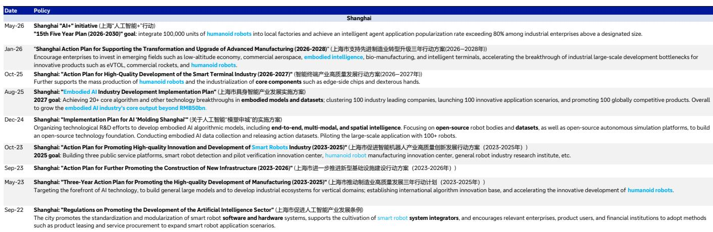
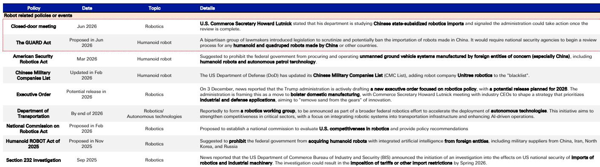
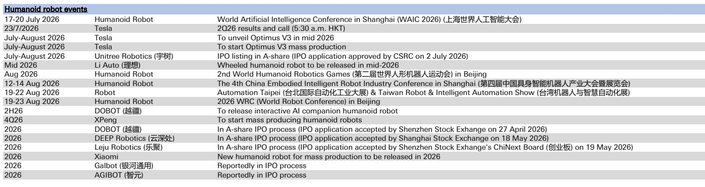

# DB：人形机器人脉冲-美国活动加速-中国快速扩张-支持性政策

2026年第二季度，人形机器人行业的关键词不再是“谁发布了原型机”，而是“谁在量产、谁在融资、谁在把机器人放进真实产线”。DB最新发布的季度行业追踪报告给出了一个清晰的判断：全球人形机器人市场正在加速，但中美两国的推进路径已经出现本质分化。

中国在产能端领先。报告引用中国工信部官员在2026年7月的表态：当年中国人形机器人产量预计超过10万台。这一数字远超DB此前约4万台的预期，也意味着从2025年约1.5万台的产量基数出发，一年内增长超过五倍。上海市政府更进一步，提出到2030年在本市工厂部署10万台人形机器人，规模以上工业企业智能体应用普及率超过80%。

美国则在资本和供应链端发力。Agility Robotics宣布将通过SPAC在2026年第四季度上市，成为首家在美上市的纯人形机器人公司，交易前估值25亿美元。更值得关注的是其供应链策略：Digit人形机器人约75%的零部件在美国本土采购，当前单台物料成本约12.5万美元，目标是在年产量达到1万台时将物料成本降至3万美元。

> **KC评论：** 3万美元的物料成本目标，意味着人形机器人正在逼近工业机器人的价格区间。如果这一目标实现，人形机器人的部署逻辑将从“试点验证”转向“成本驱动的规模化替代”。

## 1. 中国产能爬坡的速度，正在改写行业预期

AGIBOT是当前最激进的产能玩家。报告显示，其通用具身机器人Genie G2累计产量在2026年6月达到1.5万台。这一数字的加速曲线值得注意：从0到1000台用了约一年时间，从1000到5000台用了约11个月，而从5000到1万台仅用了不到4个月。2026年第一季度，产能爬坡明显提速。

与此同时，中国企业之间的整合也在发生。杭州柯林电气以不超过3亿元人民币收购了开普勒机器人约41.57%的股权，加上此前已持有的股份，最终持股51%。开普勒2025年营收仅430万元人民币，净亏损6700万元，但内部2026年营收目标超过1亿元，在手订单超过4700万元，且均为商业化复购订单。

比亚迪和理想汽车也在报告中首次披露了机器人业务进展。比亚迪明确表示，其在智能驾驶、传感器融合、电机控制等领域积累的技术可以自然迁移至人形机器人，但否认了市场上关于“项目代号尧舜禹”“第七代原型机在工厂测试”等传闻。理想汽车则将人形机器人定位为“具身智能的后半段”，其自动驾驶积累的芯片、大模型、感知系统等技术栈可直接复用。

## 2. 美国路径：资本化先行，供应链本土化是硬约束

与美国产能相比，美国企业的策略更偏向资本化和供应链控制。Agility的SPAC上市是标志性事件——它意味着人形机器人赛道开始被资本市场接受为独立资产类别。Agility已累计获得超过3亿美元的Digit v5订单，管道订单数倍于此，且已部署在舍弗勒、GXO、丰田加拿大工厂和Mercado Libre等真实商业场景中。

Meta和OpenAI的入局则从AI模型端切入。Meta收购了圣地亚哥的具身AI模型初创公司Assured Robot Intelligence，其团队将加入Meta超级智能实验室。OpenAI则在2026年5月重启了内部机器人部门，CEO Sam Altman公开招募全栈硬件、运营和机器学习工程师。五年前OpenAI解散了机器人团队，将资源转向大语言模型，如今这一转向正在逆转。

NVIDIA的动作更加系统化。在2026年6月的GTC台北大会上，黄仁勋发布了基于Jetson Thor的Isaac GR00T参考人形机器人，采用宇树科技的H2 Plus机器人本体和新加坡公司Sharpa的22自由度灵巧手。但值得注意的是，宇树科技在大会一周后被美国国防部列入军事公司名单，这给双方合作增添了不确定性。

> **KC评论：** 美国正在形成两条并行但可能冲突的路线：一条是Agility代表的“本土供应链+资本化”路径，另一条是NVIDIA代表的“开放平台+中国硬件”路径。GUARD法案和商务部对中国机器人进口的审查，可能会迫使后者重新设计供应链。

## 3. 政策正在成为产能和部署的“加速器”，而非“催化剂”

报告中最容易被忽视的信号，是政策已经从“鼓励研发”转向“设定量化目标”。中国工信部官员提出的10万台产量目标，以及上海市政府提出的10万台部署目标，都是有明确时间表和数字约束的。这与过去“支持创新”“鼓励探索”的表述有本质区别。

日本也在跟进。报告提到日本计划到2040年部署1000万台AI机器人，但未给出更具体的年度分解目标。相比之下，中国的政策节奏更紧凑、目标更具体。

美国则更多从安全角度切入。GUARD法案要求美国国家安全机构评估中国等国生产的人形和四足机器人，并可能禁止其进口。商务部也在研究中国受补贴的机器人进口问题。这意味着，未来全球人形机器人市场可能出现“中国产能+美国供应链”的割裂格局。

## 4. 一个可复用的观察框架：从“谁发布了”转向“谁部署了”

对于产业决策者而言，当前阶段最需要关注的指标已经不是“谁发布了新机器人”，而是“机器人是否在真实产线上运行、订单是否来自复购客户、供应链是否可控”。

DB报告提供了一个清晰的判断维度：区分“演示”和“部署”。AGIBOT和Figure AI通过直播展示机器人在工厂和仓库中工作，这是“部署”的证据；而大多数初创公司仍停留在“演示”阶段。开普勒的复购订单、Agility的65,000小时运行时长，才是衡量商业可行性的真实标尺。

另一个被低估的变量是供应链本土化。Agility的75%美国采购比例，与NVIDIA采用中国机器人本体的策略，代表了两种不同的供应链哲学。在政策不确定性上升的背景下，供应链的“可预测性”可能比“成本”更重要。

For informational purposes only. Portions may be generated,translated,summarized,or edited with AI assistance based on source materials and may contain omissions or errors. Please verify independently. This is not investment,legal,tax,accounting,or other professional advice.

For informational purposes only. Portions may be generated,translated,summarized,or edited with AI assistance based on source materials and may contain omissions or errors. Please verify independently. This is not investment,legal,tax,accounting,or other professional advice.
