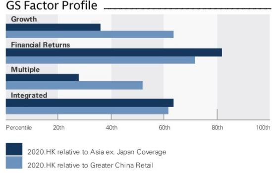
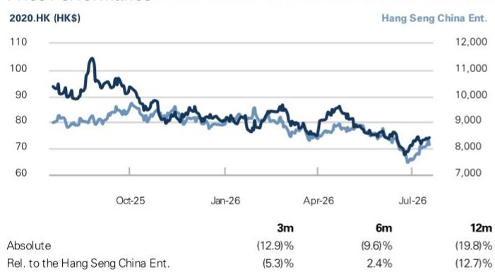

# Anta Sports Products (2020.HK)

# 2Q26 retail sales broadly in-line; 1H26 modestly ahead of the full-year guidance

2020.HK 12m Price Target: HK\$108.00 Price: HK\$74.15

Anta Sports reported healthy 2Q26 sell-through results, tracking largely in-line with market expectation and our conversation with mgmt, though we believe Fila's 1H26 MSD growth is slightly below market's expectation of HSD while Kolon's strong growth should provide upside to overall other brands' growth. Although Anta brand/Fila/Other brands retail sales decelerated to +LSD%/+LSD%/+25-30% in 2Q26 (or +MSD%/+MSD%, but close to HSD%/+35-40% yoy in 1H26) mainly due to seasonality and the industry-wise factors we observed, including later CNY, weather conditions and softer macro demand, etc. Yet, Anta continued to outperform peers, with Xtep/ Li Ning adult+kids /Pou Sheng/ Topsports reporting -MSD%/flat/ -3%/-low-teens% yoy decline in 2Q26. Mgmt remained confident to achieve and maintain the full year guidance (>+LSD%/+MSD%/>20% retail sales growth for Anta brand/Fila/other brands) considering demand uncertainty and weather volatility, despite an easier comparison base in 2H26 and a favorable Mid-Autumn Festival calendar shift in 3Q26.

More specifically, 1) Anta brand growth in 2Q26 was led by online channel of low-DD% yoy growth following product and channel strategy optimization initiated from 3Q25, though online discount was deepened by c.2pp due to the longer 618 shopping festival. Offline retail sales declined with stable yoy discount. On the recent mgmt change decision, the company emphasized that recent management changes will not affect the brand's long-term strategy or operating direction. 2) Fila growth was also led by online channel of low-DD% yoy growth with stable discount yoy, though accompanied by offline channel decline with c.1pp deepened discount. 3) Descente recorded +20% yoy growth in 2Q26 (or +25-30% in 1H26) with stable and disciplined discount, as well as healthy inventory level. Management attributed the strong performance to resilient spending by high-income consumers and continued product appeal. To broaden its customer base, the brand is expanding into footwear,

Michelle Cheng
+852-2978-6631 | michelle.cheng@gs.com
GS (Asia) L.L.C.

Molly Dai
+852-3966-4000 | molly.dai@gs.com
GS (Asia) L.L.C.

Keira Liu
+852-2978-0473 | keira.liu@gs.com
GS (Asia) L.L.C.

## Key Data

Market cap: HK\$207.4bn / \$26.5bn
Enterprise value: HK\$249.0bn / \$31.8bn
3m ADTV: HK\$564.6mn / \$72.1mn
China
Greater China Retail
M&A Rank: 3
Leases incl. in net debt & EV?: Yes

GS Forecast

<table><tr><td></td><td>12/25</td><td>12/26E</td><td>12/27E</td><td>12/28E</td></tr><tr><td>Revenue (Rmb mn) New</td><td>80,219.0</td><td>88,352.1</td><td>95,068.3</td><td>101,761.3</td></tr><tr><td>Revenue (Rmb mn) Old</td><td>80,219.0</td><td>87,373.3</td><td>94,350.1</td><td>101,273.0</td></tr><tr><td>EBITDA (Rmb mn)</td><td>22,427.0</td><td>24,799.9</td><td>27,858.3</td><td>30,311.4</td></tr><tr><td>EPS (Rmb) New</td><td>4.89</td><td>5.15</td><td>5.93</td><td>6.58</td></tr><tr><td>EPS (Rmb) Old</td><td>4.89</td><td>5.11</td><td>5.93</td><td>6.58</td></tr><tr><td>P/E (X)</td><td>16.7</td><td>12.4</td><td>10.8</td><td>9.7</td></tr><tr><td>P/B (X)</td><td>3.5</td><td>2.5</td><td>2.2</td><td>2.0</td></tr><tr><td>Dividend yield (%)</td><td>2.7</td><td>3.2</td><td>3.6</td><td>4.0</td></tr><tr><td>CROCI (%)</td><td>18.1</td><td>17.3</td><td>31.1</td><td>40.9</td></tr><tr><td></td><td>6/25</td><td>12/25</td><td>6/26E</td><td>12/26E</td></tr><tr><td>EPS (Rmb)</td><td>2.53</td><td>2.36</td><td>2.69</td><td>2.46</td></tr></table>

GS Factor Profile

  
Source: Company data, GS estimates. See disclosures for details.

## Anta Sports Products (2020.HK) Rating since Jun 27, 2019

Ratios & Valuation

<table><tr><td></td><td>12/25</td><td>12/26E</td><td>12/27E</td><td>12/28E</td></tr><tr><td>P/E (X)</td><td>16.7</td><td>12.4</td><td>10.8</td><td>9.7</td></tr><tr><td>P/B (X)</td><td>3.5</td><td>2.5</td><td>2.2</td><td>2.0</td></tr><tr><td>FCF yield (%)</td><td>5.8</td><td>8.6</td><td>8.9</td><td>10.1</td></tr><tr><td>EV/EBITDAR (X)</td><td>11.6</td><td>8.7</td><td>6.1</td><td>5.4</td></tr><tr><td>EV/EBITDA (excl. leases) (X)</td><td>14.6</td><td>10.7</td><td>7.3</td><td>6.3</td></tr><tr><td>CROCI (%)</td><td>18.1</td><td>17.3</td><td>31.1</td><td>40.9</td></tr><tr><td>ROE (%)</td><td>21.3</td><td>20.8</td><td>21.6</td><td>21.5</td></tr><tr><td>Net debt/equity (%)</td><td>(7.4)</td><td>(15.2)</td><td>(22.0)</td><td>(28.4)</td></tr><tr><td>Net debt/equity (excl. leases) (%)</td><td>(19.1)</td><td>(26.9)</td><td>(33.1)</td><td>(39.0)</td></tr><tr><td>Interest cover (X)</td><td>31.6</td><td>55.8</td><td>64.2</td><td>70.5</td></tr><tr><td>Days inventory outst, sales</td><td>52.1</td><td>50.7</td><td>49.6</td><td>48.9</td></tr><tr><td>Receivable days</td><td>20.7</td><td>20.0</td><td>20.3</td><td>20.3</td></tr><tr><td>Days payable outstanding</td><td>50.8</td><td>47.6</td><td>48.5</td><td>48.4</td></tr><tr><td>DuPont ROE (%)</td><td>18.8</td><td>17.6</td><td>17.8</td><td>17.5</td></tr><tr><td>Turnover (X)</td><td>0.6</td><td>0.6</td><td>0.6</td><td>0.6</td></tr><tr><td>Leverage (X)</td><td>1.7</td><td>1.7</td><td>1.6</td><td>1.6</td></tr><tr><td>Gross cash invested (ex cash) (Rmb)</td><td>86,875.0</td><td>98,651.3</td><td>64,019.4</td><td>68,748.9</td></tr><tr><td>Average capital employed (Rmb)</td><td>57,800.0</td><td>59,025.6</td><td>60,679.0</td><td>62,859.8</td></tr><tr><td>BVPS (Rmb)</td><td>23.52</td><td>25.80</td><td>28.79</td><td>32.01</td></tr></table>

Income Statement (Rmb mn)

<table><tr><td></td><td>12/25</td><td>12/26E</td><td>12/27E</td><td>12/28E</td></tr><tr><td>Total revenue</td><td>80,219.0</td><td>88,352.1</td><td>95,068.3</td><td>101,761.3</td></tr><tr><td>Cost of goods sold</td><td>(30,485.0)</td><td>(33,463.2)</td><td>(35,344.7)</td><td>(37,431.2)</td></tr><tr><td>SG&A</td><td>(31,444.0)</td><td>(34,719.8)</td><td>(36,740.8)</td><td>(39,167.5)</td></tr><tr><td>R&D</td><td>(2,198.0)</td><td>(2,394.3)</td><td>(2,576.4)</td><td>(2,757.7)</td></tr><tr><td>Other operating inc./(exp.)</td><td>-</td><td>-</td><td>-</td><td>-</td></tr><tr><td>EBITDA</td><td>22,427.0</td><td>24,799.9</td><td>27,858.3</td><td>30,311.4</td></tr><tr><td>Depreciation & amortization</td><td>(6,335.0)</td><td>(7,025.2)</td><td>(7,451.8)</td><td>(7,906.5)</td></tr><tr><td>EBIT</td><td>16,092.0</td><td>17,774.8</td><td>20,406.5</td><td>22,404.8</td></tr><tr><td>Net interest inc./(exp.)</td><td>897.0</td><td>427.6</td><td>411.9</td><td>600.4</td></tr><tr><td>Income/(loss) from associates</td><td>1,203.0</td><td>1,762.4</td><td>2,397.2</td><td>2,867.1</td></tr><tr><td>Pre-tax profit</td><td>21,446.0</td><td>22,941.1</td><td>26,138.7</td><td>28,785.8</td></tr><tr><td>Provision for taxes</td><td>(5,784.0)</td><td>(6,051.4)</td><td>(6,783.6)</td><td>(7,405.7)</td></tr><tr><td>Minority interest</td><td>(2,074.0)</td><td>(2,557.6)</td><td>(2,855.1)</td><td>(3,080.9)</td></tr><tr><td>Preferred dividends</td><td>-</td><td>-</td><td>-</td><td>-</td></tr><tr><td>Net inc. (pre-exceptionals)</td><td>13,588.0</td><td>14,332.1</td><td>16,500.1</td><td>18,299.2</td></tr><tr><td>Post-tax exceptionals</td><td>-</td><td>-</td><td>-</td><td>-</td></tr><tr><td>Net inc. (post-exceptionals)</td><td>13,588.0</td><td>14,332.1</td><td>16,500.1</td><td>18,299.2</td></tr><tr><td>EPS (basic, pre-except) (Rmb)</td><td>4.89</td><td>5.15</td><td>5.93</td><td>6.58</td></tr><tr><td>EPS (diluted, pre-except) (Rmb)</td><td>4.68</td><td>4.94</td><td>5.68</td><td>6.30</td></tr><tr><td>EPS (basic, post-except) (Rmb)</td><td>4.89</td><td>5.15</td><td>5.93</td><td>6.58</td></tr><tr><td>EPS (diluted, post-except) (Rmb)</td><td>4.68</td><td>4.94</td><td>5.68</td><td>6.30</td></tr><tr><td>DPS (Rmb)</td><td>2.23</td><td>2.06</td><td>2.31</td><td>2.53</td></tr><tr><td>Div. payout ratio (%)</td><td>45.6</td><td>40.0</td><td>39.0</td><td>38.5</td></tr></table>

Growth & Margins (%)

<table><tr><td colspan="5">Growth & Margins (%)</td></tr><tr><td></td><td>12/25</td><td>12/26E</td><td>12/27E</td><td>12/28E</td></tr><tr><td>Total revenue growth</td><td>13.3</td><td>10.1</td><td>7.6</td><td>7.0</td></tr><tr><td>EBITDA growth</td><td>14.1</td><td>10.6</td><td>12.3</td><td>8.8</td></tr><tr><td>EPS growth</td><td>(12.0)</td><td>5.5</td><td>15.1</td><td>10.9</td></tr><tr><td>DPS growth</td><td>2.1</td><td>(7.5)</td><td>12.2</td><td>9.4</td></tr><tr><td>EBIT margin</td><td>20.1</td><td>20.1</td><td>21.5</td><td>22.0</td></tr><tr><td>EBITDA margin</td><td>28.0</td><td>28.1</td><td>29.3</td><td>29.8</td></tr><tr><td>Net income margin</td><td>16.9</td><td>16.2</td><td>17.4</td><td>18.0</td></tr></table>

Price Performance  
  
Source: FactSet. Price as of 17 Jul 2026 close.

Balance Sheet (Rmb mn)

<table><tr><td colspan="5">Balance Sheet (Kmb mn)</td></tr><tr><td></td><td>12/25</td><td>12/26E</td><td>12/27E</td><td>12/28E</td></tr><tr><td>Cash & cash equivalents</td><td>37,115.0</td><td>45,176.2</td><td>53,960.0</td><td>64,117.1</td></tr><tr><td>Accounts receivable</td><td>4,616.0</td><td>5,084.0</td><td>5,470.5</td><td>5,855.6</td></tr><tr><td>Inventory</td><td>12,152.0</td><td>12,381.4</td><td>13,431.0</td><td>13,849.6</td></tr><tr><td>Other current assets</td><td>5,773.0</td><td>5,773.0</td><td>5,773.0</td><td>5,773.0</td></tr><tr><td>Total current assets</td><td>59,656.0</td><td>68,414.6</td><td>78,634.4</td><td>89,595.3</td></tr><tr><td>Net PP&E</td><td>18,824.0</td><td>20,250.9</td><td>21,262.7</td><td>21,930.7</td></tr><tr><td>Net intangibles</td><td>5,095.0</td><td>4,918.0</td><td>4,741.0</td><td>4,564.0</td></tr><tr><td>Total investments</td><td>20,881.0</td><td>22,643.4</td><td>25,040.6</td><td>27,907.7</td></tr><tr><td>Other long-term assets</td><td>19,839.0</td><td>19,839.0</td><td>19,839.0</td><td>19,839.0</td></tr><tr><td>Total assets</td><td>124,295.0</td><td>136,065.8</td><td>149,517.7</td><td>163,836.6</td></tr><tr><td>Accounts payable</td><td>4,158.0</td><td>4,564.2</td><td>4,820.8</td><td>5,105.4</td></tr><tr><td>Short-term debt</td><td>11,532.0</td><td>11,532.0</td><td>11,532.0</td><td>11,532.0</td></tr><tr><td>Short-term lease liabilities</td><td>3,687.0</td><td>4,030.8</td><td>4,301.2</td><td>4,567.4</td></tr><tr><td>Other current liabilities</td><td>13,981.0</td><td>15,398.5</td><td>16,569.0</td><td>17,735.5</td></tr><tr><td>Total current liabilities</td><td>33,358.0</td><td>35,525.5</td><td>37,223.1</td><td>38,940.3</td></tr><tr><td>Long-term debt</td><td>11,770.0</td><td>11,770.0</td><td>11,770.0</td><td>11,770.0</td></tr><tr><td>Long-term lease liabilities</td><td>4,775.0</td><td>5,450.0</td><td>5,980.9</td><td>6,503.5</td></tr><tr><td>Other long-term liabilities</td><td>1,987.0</td><td>1,987.0</td><td>1,987.0</td><td>1,987.0</td></tr><tr><td>Total long-term liabilities</td><td>18,532.0</td><td>19,207.0</td><td>19,737.9</td><td>20,260.5</td></tr><tr><td>Total liabilities</td><td>51,890.0</td><td>54,732.5</td><td>56,961.0</td><td>59,200.8</td></tr><tr><td>Preferred shares</td><td>-</td><td>-</td><td>-</td><td>-</td></tr><tr><td>Total common equity</td><td>65,782.0</td><td>72,152.7</td><td>80,521.1</td><td>89,519.3</td></tr><tr><td>Minority interest</td><td>6,623.0</td><td>9,180.6</td><td>12,035.7</td><td>15,116.6</td></tr><tr><td>Total liabilities & equity</td><td>124,295.0</td><td>136,065.8</td><td>149,517.7</td><td>163,836.6</td></tr><tr><td>Net debt, adjusted</td><td>(13,813.0)</td><td>(21,874.2)</td><td>(30,658.0)</td><td>(40,815.1)</td></tr></table>

<table><tr><td colspan="5">Cash Flow (Rmb mn)</td></tr><tr><td></td><td>12/25</td><td>12/26E</td><td>12/27E</td><td>12/28E</td></tr><tr><td>Net income</td><td>13,588.0</td><td>14,332.1</td><td>16,500.1</td><td>18,299.2</td></tr><tr><td>D&A add-back</td><td>6,335.0</td><td>7,025.2</td><td>7,451.8</td><td>7,906.5</td></tr><tr><td>Minority interest add-back</td><td>2,074.0</td><td>2,557.6</td><td>2,855.1</td><td>3,080.9</td></tr><tr><td>Net (inc)/dec working capital</td><td>230.0</td><td>(291.2)</td><td>(1,179.4)</td><td>(519.1)</td></tr><tr><td>Other operating cash flow</td><td>(1,231.0)</td><td>(344.9)</td><td>(1,226.7)</td><td>(1,700.6)</td></tr><tr><td>Cash flow from operations</td><td>20,996.0</td><td>23,278.8</td><td>24,400.8</td><td>27,066.9</td></tr><tr><td>Capital expenditures</td><td>(2,716.0)</td><td>(2,060.2)</td><td>(1,940.8)</td><td>(1,721.1)</td></tr><tr><td>Acquisitions</td><td>(2,218.0)</td><td>-</td><td>-</td><td>-</td></tr><tr><td>Divestitures</td><td>-</td><td>-</td><td>-</td><td>-</td></tr><tr><td>Others</td><td>(2,112.0)</td><td>(1,762.4)</td><td>(2,397.2)</td><td>(2,867.1)</td></tr><tr><td>Cash flow from investing</td><td>(7,046.0)</td><td>(3,822.6)</td><td>(4,338.1)</td><td>(4,588.2)</td></tr><tr><td>Repayment of lease liabilities</td><td>(4,787.0)</td><td>(5,196.0)</td><td>(5,544.6)</td><td>(5,887.6)</td></tr><tr><td>Dividends paid (common & pref)</td><td>(6,585.0)</td><td>(6,199.0)</td><td>(5,734.4)</td><td>(6,433.9)</td></tr><tr><td>Inc/(dec) in debt</td><td>(1,359.0)</td><td>0.0</td><td>-</td><td>-</td></tr><tr><td>Other financing cash flows</td><td>562.0</td><td>(5,196.0)</td><td>(5,544.6)</td><td>(5,887.6)</td></tr><tr><td>Cash flow from financing</td><td>(7,382.0)</td><td>(11,395.0)</td><td>(11,279.0)</td><td>(12,321.5)</td></tr><tr><td>Total cash flow</td><td>6,568.0</td><td>8,061.2</td><td>8,783.7</td><td>10,157.2</td></tr><tr><td>Free cash flow</td><td>13,493.0</td><td>16,022.6</td><td>16,915.4</td><td>19,458.1</td></tr></table>

Source: Company data, GS estimates.

women's categories and sub-brands, etc. In addition, expanding product portfolios will support higher store productivity, while aggressive store expansion is not the first priority. 4) For other brands, Kolon growth in 2Q26 remained solid at $+ > 40\%$ yoy with healthy discount and inventory level; MAIA saw offline growth outpace online growth for the first time, driven by successful new product launches; Jack Wolfskin brand's repositioning is faster than expected in China and on track in Europe. The brand plans to open several new stores with refreshed product assortments in cities in Northern China beginning in October 2026. Nevertheless, mgmt expects the brand to remain loss-making in 2026, and aims to be profitable in 2027 for China, followed by profitability for the global business in 2028; Management also noted that Puma acquisition process is on track.

All in all, we revised up Anta group's revenue upward by $<1.5\%$ and earnings upward by $<1\%$ in 2026-28E, reflecting solid growth at other brands including Descente and Kolon and disciplined OPEX control, though partly offset by slightly lower GPM given the mildly expanded discounts. Our 12-month target price and valuation methodology stay unchanged at HK\$108. Current valuation of c.13x 2026E P/E remain undemanding considering the group's proven ability to operate multi-brands and navigate cycles.

## Key operating updates & takeaways from the conference call Anta core brand:

2Q retail sales: Anta brand delivered +LSD% yoy growth (moderated vs. +HSD% in 1Q26), the sequential moderation was due to the timing shift of CNY, longer 618 promotional period and weather conditions. That said, mgmt highlighted healthy online performance during 618 promotion; By channel, adult offline/kids offline declined and online grew by +LDD% yoy in 2Q26 (vs+MSD%/+HSD%/+mid-teens% in 1Q26).

■ Discounts/Inventory: Anta offline discount was stable yoy yet online discount deepened by 2pp due to longer 618 promotional period v.s. last year, inventory month was stable yoy at 5X.

2026 Outlook: mgmt highlighted Anta brands 1H26 +MSD% yoy growth above its full year guidance of full-year guidance of >+LSD%, and mgmt reiterated the FY26 guidance. Looking into 2H26, management expects the relatively low comparison base in 3Q25 and the calendar shift of the Mid-Autumn Festival to provide some support, yet the competitive and promotional environment and weather conditions, could remain near-term factors. On products, Anta introduced its self-developed structural cushioning platform and launched the new Anta FOLD running shoes (ASP Rmb599) and management expects the product to support momentum in the running category during 2H26.

On management change, Anta recently announced the CEO change and mgmt noted that it is a standard leadership appointment and emphasized that it would not affect the continuity or stability of Anta brand's operations. Mgmt reiterated the brand's FY26 guidance and noted that its long-term strategic direction remains unchanged, while expressing confidence in Anta's future development.

## Fila

Retail sales: Fila total retail sales grew by +LSD% (moderated v.s. +low-teens% yoy in 1Q26). Fila Classic and Fila Kids offline declined yoy and Fila Fusion MSD% yoy thanks to stronger demand for outdoor and cold-weather products amid cooler weather in early 2Q. Online sales increased by +LDD%, driven by solid performance during the 618 shopping festival. Despite the sequential moderation in 2Q, management highlighted 1H26 FILA's retail sales grew by +MSD%(close to the +HSD% range), on track of its full-year +MSD% growth guidance.

Discounts/Inventory: Fila Classic's discount deepened 1pp for offline and flat for online; inventory level by 2Q26 improved by 0.3 month yoy at $<5x$ .

2026 Outlook : mgmt reiterated the full-year of +MSD% retail sales guidance. On product, Daddy Shoes and polo products performed well during 618, while FILA Golf recorded +DD% growth in 2Q26 and tennis category is expected to provide further growth in 2H26.

## Descente/Kolon

Descente achieved a strong growth of $+20\%+$ yoy, and mgmt highlighted strong performance from core products, including the D-FLOW running shoes and women's products in 2Q26. Looking ahead, mgmt expect continued momentum driven by offline channel upgrade and improvements in SSSG. By category, skiing, golf, triathlon and training are expected to maintain solid growth while running shoes and women's products to contribute incremental upside. On customer, the brand will continue to strengthen its membership management and offline community engagement to enhance customer retention and sales.

Kolon achieved +40+% yoy growth and healthy discount (<10% off of all channels) and inventory level (less than 4 months) in 2Q26. Kolon continued to reinforce its professional outdoor positioning with launch of the flagship MOVE ALPHA 3.0 VENTI trekking shoe and further expanded into products designed for professional trekking.

For Jack Wolfskin, mgmt noted that the channel restructuring progress for China is ahead of expectations, while Europe in-line. The brand plans to open flagship stores in China and launch new products tailored to China market from autumn. Mgmt expects Jack Wolfskin to remain loss-making in 2026, and aims to achieve profitable in 2027 for China, followed by profitability for the global business in 2028. Of note, though Jack Wolfskin sell-through is not included in current disclosure, its contribution will be included in reported 1H26 revenue.

Exhibit 1: Sportswear quarterly sales trend

<table><tr><td>Sales yoy</td><td>1Q24</td><td>2Q24</td><td>3Q24</td><td>4Q24</td><td>1Q25</td><td>2Q25</td><td>3Q25</td><td>4Q25</td><td>1Q26</td><td>2Q26</td></tr><tr><td>Nike (Greater China)</td><td>6%</td><td>7%</td><td>-3%</td><td>-11%</td><td>-15%</td><td>-20%</td><td>-10%</td><td>-16%</td><td>-10%</td><td>-17%</td></tr><tr><td>adidas (Greater China)</td><td>8%</td><td>9%</td><td>9%</td><td>16%</td><td>+14% ex-Yeezy +13% incl-Yeezy</td><td>+11% ex-Yeezy +2% incl-Yeezy</td><td>+10% ex-Yeezy +6% incl-Yeezy</td><td>+15% ex-Yeezy +15% incl-Yeezy</td><td>17%</td><td></td></tr><tr><td>Amer Sports (Greater China) -</td><td>51%</td><td>54%</td><td>56%</td><td>54%</td><td>43%</td><td>42%</td><td>47%</td><td>42%</td><td>45%</td><td></td></tr><tr><td>Puma (Greater China)</td><td>7%</td><td>8%</td><td>1%</td><td>7%</td><td>-18%</td><td>-4%</td><td>-20%</td><td>-20%</td><td>9%</td><td></td></tr><tr><td>Puma (Asia Pacific)</td><td>1%</td><td>2%</td><td>4%</td><td>10%</td><td>-5%</td><td>-3%</td><td>-9%</td><td>-13%</td><td>8%</td><td></td></tr><tr><td>Under Armour (Asia Pacific)</td><td>9%</td><td>-7%</td><td>-10%</td><td>-6%</td><td>-26%</td><td>-10%</td><td>-14%</td><td>-5%</td><td></td><td></td></tr><tr><td>Uniqlo (Greater China)</td><td>-3%</td><td>-5
