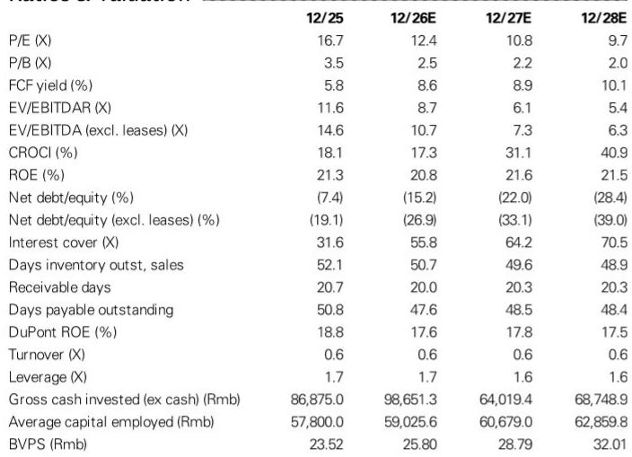
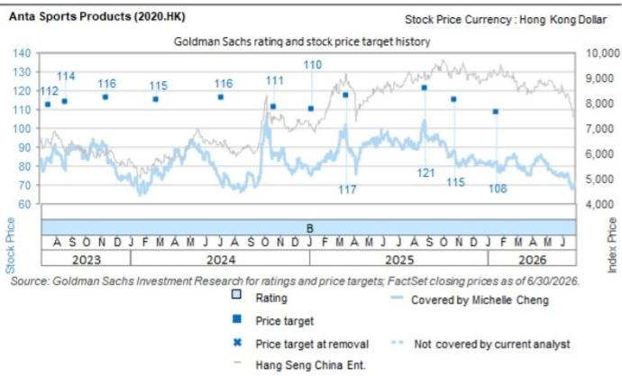

# Anta's Multi-Brand Strategy: How Three Distinct Growth Vectors Create Portfolio Resilience

Anta Sports delivered second-quarter 2026 retail sales that, on the surface, show a pattern of moderation. The Anta brand slowed to low-single-digit growth from high-single-digit in the prior quarter. Fila moderated from low-teens to low-single-digit. Even the other brands, while still growing at 25-30%, eased from their first-quarter pace. Yet a global research report covering the company reveals a more strategically significant picture: Anta's first-half 2026 performance across all three segments came in modestly ahead of the full-year guidance targets it set at the beginning of the year. The Anta brand grew at mid-single-digit in the first half, Fila at mid-single-digit approaching high-single-digit, and other brands at 35-40%. Each of these figures exceeds or sits at the upper end of the respective annual guidance ranges of low-single-digit-plus, mid-single-digit, and above 20%. This is not a company losing momentum. It is a company absorbing industry-wide factors—a later Chinese New Year, weather patterns, a prolonged 618 promotional period, and softer macro demand—while still delivering above-plan results.

The context matters because the competitive field is not standing still. Xtep recorded a mid-single-digit decline in second-quarter retail sales. Li Ning's adult and kids segments were flat. Pou Sheng and Topsports, two of China's largest sportswear distributors, posted declines of 3% and low-teens respectively. Anta's three-brand portfolio not only grew but did so with management reaffirming full-year guidance despite near-term fluctuations. The question for observers is no longer whether Anta can navigate a changing consumer environment. It can, and the evidence is in the numbers. The question is whether the company's multi-brand strategy, which has been its defining structural advantage, can continue to deliver compounding growth as each brand enters a different phase of maturity, competitive intensity, and operational complexity.

The report points to three distinct narratives within Anta's portfolio, each with its own growth drivers, margin dynamics, and strategic challenges. Understanding how these three vectors interact, and where the trade-offs emerge, is the core analytical task for anyone evaluating Anta at a current valuation of roughly 13 times 2026 estimated earnings.

## The Anta Brand's Online-Led Recovery Shows the Power of Product and Channel Optimization, But the Discount Trade-Off Demands Close Monitoring

The Anta brand's second-quarter retail sales growth of low-single-digit represented a clear sequential moderation from the high-single-digit pace in the first quarter. Management attributed this to the calendar shift of Chinese New Year, a longer 618 promotional period, and weather conditions. These are not structural issues. They are timing and seasonal factors that will partially reverse in the second half, aided by an easier comparison base from the third quarter of 2025 and a favorable calendar shift for the Mid-Autumn Festival in the third quarter of 2026.

What matters more than the headline growth rate is the composition of that growth. The Anta brand's online channel grew at a low-double-digit rate year-over-year in the second quarter, accelerating from mid-teens in the first quarter. This is not an accident. It is the result of a product and channel strategy optimization that began in the third quarter of 2025 and is now bearing fruit. The brand introduced a self-developed structural cushioning platform and launched the Anta FOLD running shoe at an ASP of RMB 599, a product that management expects to sustain momentum in the running category through the second half of 2026.

The trade-off is visible in the discount data. Online discounts deepened by approximately two percentage points year-over-year due to the extended 618 festival. Offline discounts remained stable. The gross margin pressure from this channel mix shift is real, and the report reflects this by noting that the upward revision to revenue estimates was partially offset by slightly lower gross margin assumptions. The question is whether the volume gains from online growth will more than compensate for the margin compression, or whether the promotional environment will intensify further in the second half as competitors respond. Management's confidence in maintaining full-year guidance suggests the former, but observers should watch inventory levels and discount depth in the coming quarters as leading indicators.

## Fila's Deceleration Masks a Healthy First-Half Performance and a Product-Led Recovery Path That Depends on Category Expansion Beyond Core Apparel

Fila's second-quarter retail sales growth of low-single-digit was a notable deceleration from low-teens in the first quarter, and the report acknowledges that the first-half mid-single-digit growth, while within the full-year guidance of mid-single-digit, was slightly below market expectations of high-single-digit. This is the segment where observer attention is most likely to concentrate, given Fila's historical role as Anta's highest-margin and most brand-equity-driven asset.

The detail beneath the headline, however, suggests a more nuanced picture. Fila's online channel grew at low-double-digit year-over-year, mirroring the Anta brand's pattern, driven by strong 618 performance in categories such as Daddy Shoes and polo products. The offline channel declined, with discount deepening by approximately one percentage point. But within the offline mix, Fila Fusion, the brand's outdoor-oriented sub-line, grew at mid-single-digit, benefiting from cooler early-second-quarter weather that drove demand for cold-weather and outdoor products. This is a meaningful signal because it indicates that Fila's brand equity is not static. It is finding new resonance in categories that extend beyond its traditional core.

The second-half outlook for Fila hinges on two category drivers. Fila Golf recorded double-digit growth in the second quarter, and management expects the tennis category to contribute incremental growth in the second half. These are not marginal additions. Golf and tennis represent higher-ASP categories with more affluent consumer demographics, and they align with the broader premiumization trend in Chinese sportswear. If Fila can sustain growth in these categories while stabilizing its core apparel business, the deceleration in the second quarter will look like a seasonal blip rather than a trend. The risk is that the promotional environment in the core categories intensifies, forcing deeper discounts that affect Fila's industry-leading margin structure.

## Descente and Kolon Are the Portfolio's Growth Engines, But Their Contribution to Group-Level Earnings Depends on Scale and the Successful Integration of New Brands

The other brands segment, which includes Descente, Kolon, MAIA, and Jack Wolfskin, delivered 25-30% retail sales growth in the second quarter and 35-40% in the first half. This is the portfolio's highest-growth vector, and it is driven by two standout performers. Descente grew at over 20% in the second quarter, with management attributing the performance to resilient spending by high-income consumers and continued product appeal in skiing, golf, triathlon, and training categories. The brand is expanding into footwear and women's categories, which management expects to support higher store productivity without aggressive store expansion. This is a capital-light growth strategy that protects margins while driving same-store-sales growth.

Kolon grew at over 40% year-over-year in the second quarter, with healthy discount levels below 10% across all channels and disciplined inventory management. The brand's performance is a direct beneficiary of the outdoor and lifestyle trend in China, and its growth trajectory shows no signs of moderating. MAIA, the women's activewear brand, achieved a notable milestone: offline growth outpaced online growth for the first time, driven by successful new product launches. This suggests that the brand is building genuine retail traction rather than relying solely on digital marketing.

The strategic question for this segment is not about growth, which is clearly robust. It is about earnings contribution and the integration of new acquisitions. Jack Wolfskin, which Anta acquired and is repositioning, is progressing faster than expected in China but remains loss-making for the full year 2026. Management targets profitability for the China business in 2027 and global profitability in 2028. The Puma acquisition process is described as on track. These are long-term value creation initiatives that will consume management attention and capital in the near term. The risk is that the complexity of integrating multiple brands at different stages of maturity and profitability dilutes the focus that has made Descente and Kolon so successful.

## A Decision Framework for Evaluating Anta Through the Lens of Multi-Brand Portfolio Management

For observers and analysts, the challenge is not to assess Anta as a single entity but to evaluate it as a portfolio of brands with different risk-return profiles and different stages of the lifecycle. A useful framework is to think of Anta's three segments as occupying distinct positions on a growth-maturity matrix.

The Anta brand is the volume and cash flow anchor. It operates in the most competitive segment of the Chinese sportswear market, where it competes directly with international brands and domestic peers. Its growth will be moderate but should be stable, and its primary value lies in its ability to generate consistent operating cash flow and fund investments in higher-growth segments. The key metrics to watch are market share trends, inventory turns, and online channel profitability.

Fila is the margin and brand equity engine. It operates in the premium segment, where brand perception and category leadership matter more than price. Its growth will be cyclical, influenced by consumer sentiment and category trends, but its margin structure should remain superior to the Anta brand. The key metrics are same-store-sales growth, discount depth, and the contribution from new categories such as golf and tennis.

Descente and Kolon are the growth and valuation multipliers. They operate in niche premium segments with high barriers to entry and strong consumer loyalty. Their growth rates will remain elevated, but their contribution to group-level earnings will increase only as they achieve greater scale. The key metrics are store productivity, customer retention rates, and the timeline to profitability for newer brands like Jack Wolfskin.

The interaction between these three vectors determines Anta's overall risk profile. When the Anta brand and Fila are both under adjustment, as they were in the second quarter of 2026, the other brands segment provides a buffer that most competitors lack. When the other brands are growing at 35-40%, they can more than compensate for a temporary deceleration in the core segments. This diversification is Anta's structural advantage, but it is not automatic. It requires disciplined capital allocation, consistent brand management, and the ability to resist the temptation to over-invest in any single brand at the expense of the portfolio.

The report's revised estimates, which raise revenue by less than 1.5% and earnings by less than 1% for 2026-2028, reflect this balanced view. The upward revision is driven by solid growth at Descente and Kolon and disciplined operating expense control, partially offset by slightly lower gross margins due to expanded discounts. The valuation, at roughly 13 times 2026 estimated earnings, is described as reasonable given the group's proven ability to operate multi-brands and navigate market dynamics.

The argument for Anta is not that it will grow at a uniform rate across all segments. It is that the portfolio structure allows it to absorb changes in any single segment while maintaining overall growth. The second quarter of 2026 is a case study in how this works in practice. The Anta brand and Fila decelerated, but the other brands accelerated. Management reaffirmed guidance. The company continued to perform relative to its peers. That pattern, if it persists, is what supports the current valuation and the potential for further development.

*For informational purposes only. Portions may be generated, translated, summarized, or edited with AI assistance based on source materials and may contain omissions or errors. Please verify independently. This is not professional advice.*

For informational purposes only. Portions may be generated, translated, summarized, or edited with AI assistance based on source materials and may contain omissions or errors. Please verify independently. This is not professional advice.

