# 大宗商品展望

欧洲
北美
全球

日期
2026年7月16日

# 关注积极面

本年度的Extel全球固定收益研究调查投票已开启，我们期待您在"全球大宗商品"类别中的支持（链接）。

## 外部环境虽有挑战，亦存机遇

从地缘政治波动角度来看，外部环境对大宗商品领域仍构成挑战，预计这一态势将持续。然而，全球增长在能源扰动中保持韧性，仅出现小幅调整。我们倾向于不追涨近期美元强势，维持对美元年底前偏弱的判断。此外，一个积极因素在于，由此产生的推动关键矿产和能源领域供应链韧性建设的动力。

## 贵金属：美联储鹰派立场存在边界

我们认为美联储鹰派立场及其对黄金的影响存在边界。近期的价格变动与黄金-利率回归关系呈现正交特征，2022年的案例表明此类关系可能发生变化。投机性资金流动仍是阻力，但我们预计随着结构性政府债务扩张战胜利率和外汇的短期剧烈波动，黄金和白银价格将在年底前走高。对于铂族金属，由于催化转化器车辆销售走弱，总需求可能下降45.5万盎司（3%），尽管钯金因俄罗斯产量的一次性下降而暂时获得支撑。原油供应、炼厂开工率和裂解价差方面存在较大失衡，预计至少需要到年底才能恢复正常。然而，一旦调整完成，我们认为2027年显著过剩的现实将成为主导焦点。

## 工业金属：宏观逆风与结构性逻辑并存

铜价因美元走强和AI资本支出相关股票回调而承压。供应端依然紧张，我们预计价格将从第三季度的约13,000美元/吨逐步上升至第四季度的约13,600美元/吨。美国铜关税的最新进展预计将在下半年公布，其结果可能引发波动（详情请参考我们的美国关税报告）。铝价因海湾地区冶炼厂重启速度快于预期而大幅回调。我们预计下半年价格将温和反弹（第四季度约3,300美元/吨），随后随着海湾地区供应恢复，到2027年逐步正常化至约3,000美元/吨。铁矿石因战争驱动因素基本消退而承压，同时强劲的海运出口和西芒杜项目初步增产的迹象加剧了供应端压力。我们预计成本曲线高端的支撑（>100美元/吨）将在季节性疲软的夏季限制下行空间。

Liam Fitzpatrick
研究分析师
+44-20-754-13233

Bastian Synagowitz
研究分析师
+41-44-227-3377

Corinne Blanchard
研究分析师
+1-904-645-2360

## 目录

大宗商品展望....3
DB大宗商品价格预测....4
展望：外部环境虽有挑战，亦存机遇....5
核心观点....10
铜：关税不确定性下的结构性紧张....10
铝：供应恢复....10
铁矿石：成本曲线支撑....11
原油：成品油紧张持续....11
黄金和白银：美联储鹰派立场存在边界....12
铂族金属：油价上涨导致汽车销售走弱....13
大宗商品图表....14
中国和LME库存概览....14
铜：精炼过剩，矿端短缺....16
铝：峰值已过....18
铁矿石：战争驱动因素消退....20
黄金和白银：美联储鹰派立场存在边界....23
铂族金属：油价上涨导致汽车销售走弱....24
原油：成品油紧张持续....25

## 大宗商品展望

## 能源

图1：近1个月表现（%）
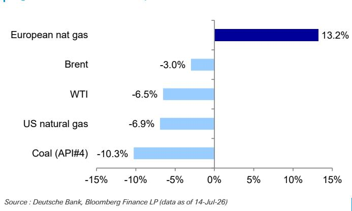
工业金属和黑色金属

图2：近12个月表现（%）
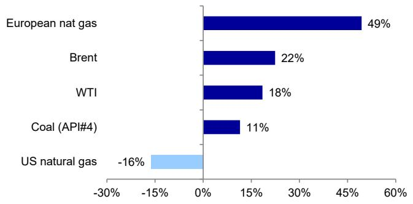
来源：DB，彭博财经LP（数据截至2026年7月14日）

图3：近1个月表现（%）
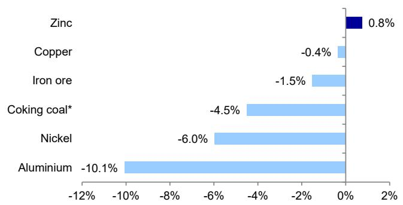
来源：DB，彭博财经LP（数据截至2026年7月14日）。焦煤代表1个月期货

图4：近12个月表现（%）
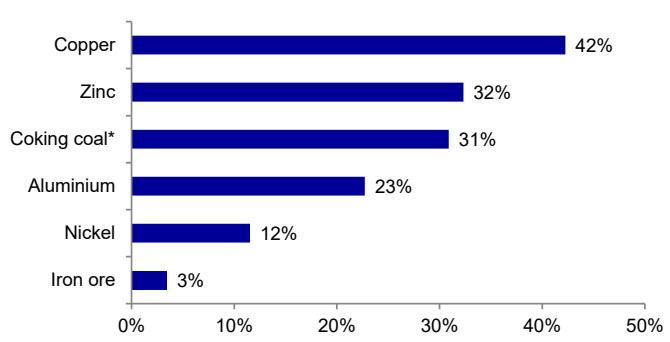
来源：DB，彭博财经LP（数据截至2026年7月14日）。焦煤代表1个月期货
图5：近1个月表现（%）

贵金属

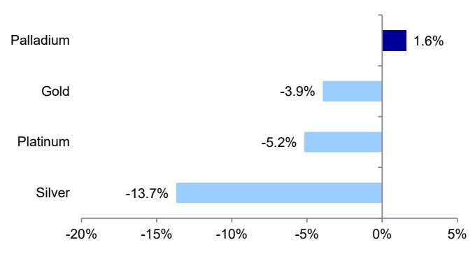

图6：近12个月表现（%）
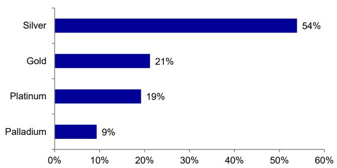
来源：DB，彭博财经LP（数据截至2026年7月14日）

## DB大宗商品价格预测

图7：基本金属价格预测

<table><tr><td>美元/吨</td><td>2024</td><td>2025</td><td>2026年Q1</td><td>2026年Q2</td><td>2026年Q3</td><td>2026年Q4</td><td>2026</td><td>2027</td><td>2028</td><td>现货</td></tr><tr><td>铝（美分/磅）</td><td>109.8</td><td>119.3</td><td>145.1</td><td>161.7</td><td>145.1</td><td>149.7</td><td>150.4</td><td>144.0</td><td>136.1</td><td>144.1</td></tr><tr><td>美元/吨</td><td>2,420</td><td>2,631</td><td>3,198</td><td>3,565</td><td>3,200</td><td>3,300</td><td>3,316</td><td>3,175</td><td>3,000</td><td>3,177</td></tr><tr><td>%变化</td><td></td><td></td><td></td><td></td><td>-20.0%</td><td>-13.2%</td><td>-9.4%</td><td>-10.6%</td><td>-6.3%</td><td></td></tr><tr><td>铜（美分/磅）</td><td>414.9</td><td>451.3</td><td>581.7</td><td>604.8</td><td>589.7</td><td>616.9</td><td>598.3</td><td>567.0</td><td>569.6</td><td>616.7</td></tr><tr><td>美元/吨</td><td>9,146</td><td>9,949</td><td>12,824</td><td>13,333</td><td>13,000</td><td>13,600</td><td>13,189</td><td>12,500</td><td>12,558</td><td>13,596</td></tr><tr><td>%变化</td><td></td><td></td><td></td><td></td><td>4.0%</td><td>8.8%</td><td>3.2%</td><td>4.2%</td><td>13.2%</td><td></td></tr><tr><td>锌（美分/磅）</td><td>126.0</td><td>130.0</td><td>146.8</td><td>156.9</td><td>154.2</td><td>154.2</td><td>153.1</td><td>145.1</td><td>137.7</td><td>163.5</td></tr><tr><td>美元/吨</td><td>2,777</td><td>2,866</td><td>3,237</td><td>3,460</td><td>3,400</td><td>3,400</td><td>3,374</td><td>3,200</td><td>3,035</td><td>3,605</td></tr><tr><td>%变化</td><td></td><td></td><td></td><td></td><td>13.3%</td><td>13.3%</td><td>6.5%</td><td>10.3%</td><td>7.4%</td><td></td></tr></table>

来源：DB估计；数据为期间平均值。2026年Q3至2028年为我们的预测。铝价变化与2026年6月1日发布的"全球铝业"报告比较。铜和锌价变化与2026年4月14日发布的"定价更新"报告比较。

图8：油价预测

<table><tr><td>美元</td><td>2024</td><td>2025</td><td>2026年Q1</td><td>2026年Q2</td><td>2026年Q3</td><td>2026年Q4</td><td>2026</td><td>2027</td><td>2028</td><td>现货</td></tr><tr><td>WTI（桶）</td><td>75.8</td><td>64.9</td><td>72.3</td><td>92.5</td><td>77.0</td><td>72.0</td><td>78.5</td><td>67.0</td><td>73.3</td><td>79.9</td></tr><tr><td>%变化</td><td></td><td></td><td></td><td></td><td>6.9%</td><td>7.5%</td><td>3.3%</td><td>0.0%</td><td>0.0%</td><td></td></tr><tr><td>布伦特（桶）</td><td>79.9</td><td>68.2</td><td>78.4</td><td>96.7</td><td>80.0</td><td>75.0</td><td>82.5</td><td>70.0</td><td>76.4</td><td>85.3</td></tr><tr><td>%变化</td><td></td><td></td><td></td><td></td><td>6.7%</td><td>7.1%</td><td>3.1%</td><td>0.0%</td><td>0.0%</td><td></td></tr></table>

来源：DB估计；数据为期间平均值。2026年Q3至2028年为我们的预测。价格变化与2026年7月6日发布的"Hsueh on Oil"报告比较。

## 图9：铁矿石和焦煤价格预测

<table><tr><td>美元/吨</td><td>2024</td><td>2025</td><td>2026年Q1</td><td>2026年Q2</td><td>2026年Q3</td><td>2026年Q4</td><td>2026</td><td>2027</td><td>2028</td><td>现货</td></tr><tr><td>铁矿石61%粉矿CFR</td><td>110</td><td>102</td><td>104</td><td>105</td><td>98</td><td>100</td><td>102</td><td>100</td><td>99</td><td>99</td></tr><tr><td>%变化</td><td></td><td></td><td></td><td></td><td>0.0%</td><td>0.0%</td><td>-0.4%</td><td>0.0%</td><td>0.0%</td><td></td></tr><tr><td>优质硬焦煤</td><td>244</td><td>188</td><td>232</td><td>238</td><td>230</td><td>230</td><td>233</td><td>225</td><td>220</td><td>233</td></tr><tr><td>%变化</td><td></td><td></td><td></td><td></td><td>7.0%</td><td>0.0%</td><td>1.8%</td><td>0.0%</td><td>0.0%</td><td></td></tr><tr><td>纽卡斯尔动力煤FOB</td><td>136</td><td>106</td><td>120</td><td>137</td><td>135</td><td>130</td><td>131</td><td>130</td><td>120</td><td>128</td></tr><tr><td>%变化</td><td></td><td></td><td></td><td></td><td>-3.6%</td><td>0.0%</td><td>-0.6%</td><td>0.0%</td><td>0.0%</td><td></td></tr></table>

来源：DB估计；数据为期间平均值。2026年Q3至2028年为我们的预测。2026年之前，铁矿石价格基于62%铁品位基准价格进行市值计价。价格变化与2026年4月14日发布的"定价更新"报告比较。

图10：贵金属价格预测

<table><tr><td>美元/盎司</td><td>2024</td><td>2025</td><td>2026年Q1</td><td>2026年Q2</td><td>2026年Q3</td><td>2026年Q4</td><td>2026</td><td>2027</td><td>2028</td><td>现货</td></tr><tr><td>黄金</td><td>2,387</td><td>3,440</td><td>4,873</td><td>4,508</td><td>4,300</td><td>4,600</td><td>4,570</td><td>5,100</td><td>5,442</td><td>4,033</td></tr><tr><td>%变化</td><td></td><td></td><td></td><td></td><td>0.0%</td><td>-4.2%</td><td>-1.1%</td><td>-3.8%</td><td>0.0%</td><td></td></tr><tr><td>白银</td><td>28.2</td><td>40.1</td><td>83.9</td><td>73.1</td><td>65.0</td><td>70.0</td><td>73.0</td><td>77.5</td><td>78.5</td><td>58.0</td></tr><tr><td>%变化</td><td></td><td></td><td></td><td></td><td>0.0%</td><td>-4.1%</td><td>-1.0%</td><td>-3.7%</td><td>-6.2%</td><td></td></tr><tr><td>铂金</td><td>956</td><td>1,283</td><td>2,204</td><td>1,915</td><td>1,720</td><td>1,840</td><td>1,920</td><td>2,040</td><td>2,300</td><td>1,623</td></tr><tr><td>%变化</td><td></td><td></td><td></td><td></td><td>0.0%</td><td>-4.2%</td><td>-1.0%</td><td>-3.8%</td><td>0.0%</td><td></td></tr><tr><td>钯金</td><td>983</td><td>1,151</td><td>1,706</td><td>1,408</td><td>1,300</td><td>1,390</td><td>1,451</td><td>1,478</td><td>1,570</td><td>1,296</td></tr><tr><td>%变化</td><td></td><td></td><td></td><td></td><td>0.0%</td><td>-4.1%</td><td>-1.0%</td><td>-3.7%</td><td>0.0%</td><td></td></tr></table>

来源：DB估计；数据为期间平均值。2026年Q3至2028年为我们的预测。价格变化与2026年6月22日发布的"贵金属特别报告"比较。

## 展望：外部环境虽有挑战，亦存机遇

图11：年初至今价格表现趋势（美元计价）
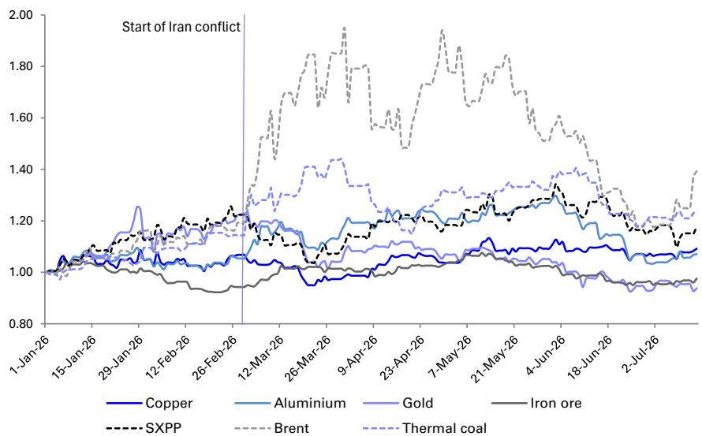
来源：DB，彭博财经LP

在此，我们更新对大宗商品外部环境的评估，延续我们在1月（"结构性更高的地缘政治风险"）中探讨的维度。这些主题可能影响大宗商品市场，但不一定会在我们针对单个大宗商品的观点中逐一讨论：地缘政治气候、美元、读者持仓以及宏观环境。

（A）在地缘政治方面，DB年中展望认为地缘政治波动将持续，这与我们观察到结构性转变的观点一致。一个不可预测且碎片化的全球运营环境的延续，体现在多个方面。

关于美国，我们预计外交政策波动性将增加，因为取得可见外交政策成果的激励因素增强。中东地区存在冲突重燃的可能性，而艰难的美国-伊朗谈判可能延长至最初的60天期限之后。美中关系的缓和并不能否定更广泛的关系仍将是战略竞争关系，并受到互不信任和相互竞争的国家安全优先事项的影响。欧盟与美国关系的裂痕意味着欧洲可能面临新一轮经济和贸易冲突，并持续面临克服内部分歧以构建更多战略自主权的压力。关于乌克兰，三方谈判陷入停滞，但中东危机的缓和可能意味着对潜在停火与和平计划的关注度提升，同时可能伴随对俄罗斯制裁的放松。

对大宗商品市场最直接的影响渠道，可能是全球范围内构建关键矿产供应韧性的举措，包括供应链多元化以及储备库存化。2025年末，美国与日本、澳大利亚、马来西亚、越南、柬埔寨和泰国签署了协议。这一势头在今年上半年进一步扩大，美国"金库计划"（关键矿产储备）、美国-欧盟关键矿产计划、美国-印度关键矿产框架、欧洲关键原材料中心、四方安全对话关键矿产倡议框架以及澳大利亚关键矿产战略储备相继宣布。

（B）关于美元，我们倾向于不追涨近期美元强势，该强势已使彭博现货美元指数触及一年高位。值得肯定的是，美国目前预计将成为G10经济体中增长最快的国家，其2年期和3个月期利率在G10经济体中的排名也具有一定支撑。然而，鹰派的美联储重新定价可能无法支撑持续上涨趋势，因为与核心CPI的超出相比，这一重新定价已走得相当远（链接）。此外，我们观察到非常强劲的持仓变动，净多头持仓与2025年1月DXY指数水平高出约6-7%时相似（链接）。我们认为风险货币有反弹空间，尽管目前难以识别包括欧元和日元在内的美元全面走弱的催化剂。我们的预测是，到年底，美联储贸易加权广义美元指数将温和走低（-3.7%）。

图12：美元隐含净多头持仓接近2025年高点，DXY指数水平则低得多
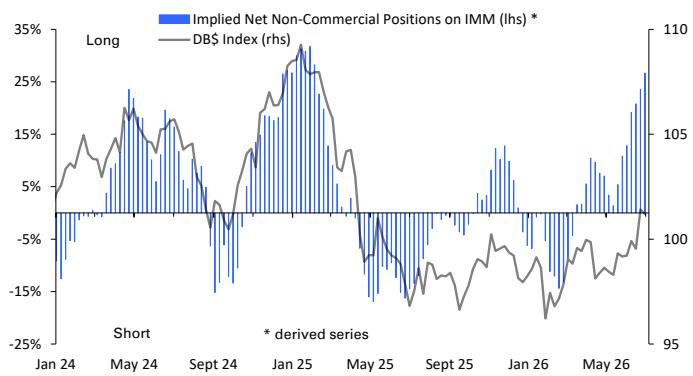
来源：CFTC，彭博财经LP，DB

图13：调查显示，同样高比例的储备管理人打算在未来12个月内增持黄金
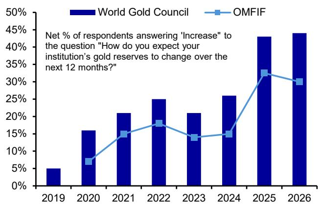
来源：世界黄金协会，OMFIF

（C）第三点是资本流动和读者持仓。我们看到，与私人读者相比，储备管理人追求去美元化议程的倾向更为明显。在OMFIF的全球公共读者调查数据中，更多储备管理人表达了长期（10年）减少（24%）而非增加（16%）美元敞口的意向，多数（60%）打算维持美元敞口。

另一方面，私人读者的活动与历史相比没有显示出明显的偏离，尽管由于投资活动曾长期为负后又转为正，判断其是否已偏离较为困难。例如，公共读者在2015-2020年间是美债的净卖方，而私人读者在2022年和2024年是美股的大规模净卖方。在这些情况下，人们不一定能区分去美元化意图与对资产类别的看法。现在的不同之处在于，今年早些时候，我们听到一些大型私人投资实体表示将寻求从美国资产中分散投资。然而，私人读者和公共读者的总体数据并未明确显示此类情况。

图14：私人读者对美国资产的净外国投资（3个月平均月率，十亿美元）
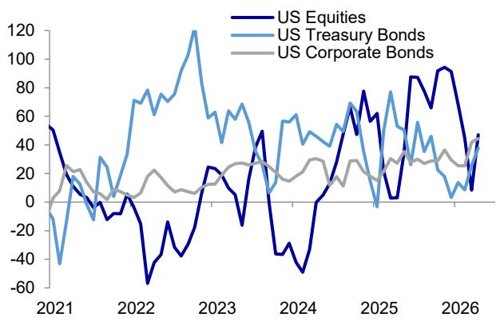
来源：彭博财经LP，美国财政部，DB

图15：公共读者对美国资产的净外国投资（3个月平均月率，十亿美元）
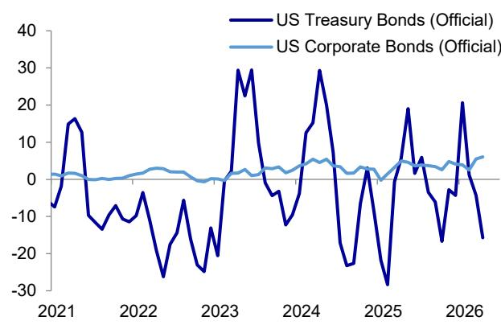
来源：彭博财经LP，美国财政部，DB

（D）关于宏观环境，我们的团队从《世界展望》中指出，全球经济正应对着持续的AI驱动乐观情绪与中东冲突破坏性力量之间复杂的相互作用。自3月以来，中位数预测的趋势一直在下移，但公平地说，从彭博汇编的中位数分析师角度来看，变动幅度相对温和。

为了强化DB《世界展望》所描述的由AI投资和中东冲突塑造的增长前景框架，对这些主题的不同侧重有助于解释OECD对2026年全球增长2.8%的估计与更为乐观的IMF 7月估计3.0%之间的差异。IMF评论指出，"中东战争的影响正被全球技术周期中因人工智能进步及其应用而加速的需求驱动动力部分抵消"。另一方面，OECD认为中东冲突是"塑造全球经济前景的主导力量"，包括其对能源、农业和工业投入品价格和数量的影响。IMF对2027年前景也更为乐观，将预测从3.2%上调至3.4%，而OECD维持了3.1%的预测（DB估计为3.2%）。

图16：大宗商品在美国经济周期中的表现
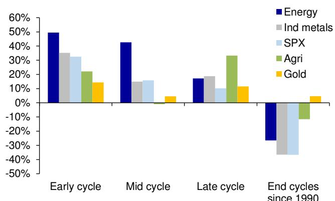
来源：彭博财经LP，DB

图17：过去12个月大宗商品表现
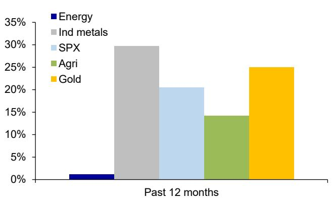
来源：彭博财经LP，DB

图18：全球增长预测在3月达到峰值
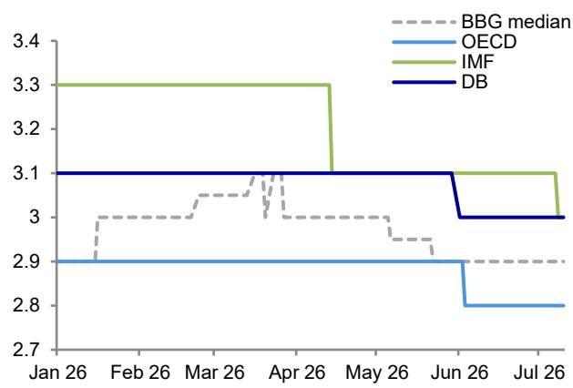
来源：IMF，OECD，彭博财经LP，DB

图19：DB GDP增长预测

<table><tr><td rowspan="2">实际GDP（同比%）</td><td colspan="4">2026年6月《世界展望》</td><td colspan="2">与11月《世界展望》相比的变化</td><td colspan="2">彭博共识（2026年7月9日）</td></tr><tr><td>2024</td><td>2025</td><td>2026</td><td>2027</td><td>2026</td><td>2027</td><td>2026</td><td>2027</td></tr><tr><td>全球</td><td>3.4</td><td>3.2</td><td>3.0</td><td>3.2</td><td>-0.1</td><td>0.1</td><td>2.9</td><td>3.1</td></tr><tr><td>美国</td><td>2.8</td><td>2.1</td><td>2.2</td><td>2.2</td><td>-0.2</td><td>0.1</td><td>2.1</td><td>2.1</td></tr><tr><td>欧元区</td><td>0.9</td><td>1.5</td><td>0.5</td><td>1.1</td><td>-0.6</td><td>-0.2</td><td>0.6</td><td>1.2</td></tr><tr><td>德国</td><td>-0.5</td><td>0.2</td><td>0.5</td><td>1.3</td><td>-1.0</td><td>-0.3</td><td>0.6</td><td>1.1</td></tr><tr><td>英国</td><td>1.0</td><td>1.4</td><td>1.0</td><td>1.2</td><td>-0.2</td><td>-0.2</td><td>1.0</td><td>1.1</td></tr><tr><td>日本</td><td>-0.2</td><td>1.1</td><td>0.7</td><td>0.7</td><td>-0.2</td><td>-0.2</td><td>0.6</td><td>0.8</td></tr><tr><td>澳大利亚</td><td>1.0</td><td>2.0</td><td>2.2</td><td>1.4</td><td>-0.2</td><td>-0.8</td><td>1.9</td><td>1.7</td></tr><tr><td>加拿大</td><td>2.0</td><td>1.9</td><td>0.6</td><td>1.6</td><td>-0.3</td><td>-0.1</td><td>0.7</td><td>1.9</td></tr><tr><td>中国</td><td>5.0</td><td>5.0</td><td>4.7</td><td>4.5</td><td>0.2</td><td>0.2</td><td>4.6</td><td>4.4</td></tr><tr><td>印度</td><td>7.2</td><td>7.5</td><td>6.7</td><td>7.2</td><td>0.3</td><td>0.5</td><td>7.5</td><td>6.6</td></tr><tr><td>韩国</td><td>2.0</td><td>1.0</td><td>2.9</td><td>2.3</td><td>0.9</td><td>0.6</td><td>2.7</td><td>2.1</td></tr><tr><td>俄罗斯</td><td>4.9</td><td>1.0</td><td>0.6</td><td>1.3</td><td>-0.2</td><td>-0.1</td><td>0.8</td><td>1.3</td></tr><tr><td>南非</td><td>0.5</td><td>1.1</td><td>1.4</td><td>1.4</td><td>-0.4</td><td>-0.4</td><td>1.3</td><td>1.6</td></tr><tr><td>土耳其</td><td>3.3</td><td>3.6</td><td>3.0</td><td>4.5</td><td>-0.9</td><td>0.2</td><td>3.0</td><td>3.6</td></tr><tr><td>巴西</td><td>3.4</td><td>2.3</td><td>1.9</td><td>1.7</td><td>0.3</td><td>-0.3</td><td>1.9</td><td>1.8</td></tr><tr><td>墨西哥</td><td>1.4</td><td>0.6</td><td>1.2</td><td>1.8</td><td colspan="2">-0.3 不变</td><td>1.1</td><td>1.8</td></tr></table>

来源：彭博财经LP，DB

## 核心观点

## 铜：关税不确定性下的结构性紧张

铜价从3月到6月初经历了强劲反弹，从约12,000美元的低点回升至14,000美元的高点。近几周，由于美元走强和AI资本支出相关股票回调，价格承压，但由于微观趋势相对紧张，价格表现优于其他金属。我们预计短期内价格将维持区间震荡，随后在第四季度反弹至约13,600美元/吨。正如我们在2026年展望中详述的，我们认为激励价格机制将持续存在，这得益于缺乏弹性的矿山供应、电气化相关的需求驱动因素以及高昂的绿地资本支出。我们假设，在经历了2025/26年严重中断后，随着全球矿山供应恢复，2027年价格将有所缓和（至约12,500美元/吨）。

市场仍在热切等待美国政府关于铜关税的最新消息。根据总统公告，商务部长需在2026年6月30日前就国内铜市场提供最新情况，随后将就精炼铜关税做出决定。我们最近发布了一份报告，概述了三种可能的政策路径：（1）分阶段引入关税（2027年15%，2028年升至30%）；这是市场的基准情形，短期内对铜有利。（2）立即征收关税；这将有效关闭美国进口流，并可能对LME价格构成下行压力。（3）不征收关税；鉴于美国库存高企，这可能引发急剧抛售。

## 铝：供应恢复

铝价在6月初因中东供应冲击达到约3,850美元/吨的峰值，该冲击暂时移除了约250-300万吨/年的原铝产能（占全球原生供应量的3-4%）。这也收紧了区域市场，并推动实物溢价大幅走高。然而，随着霍尔木兹海峡重新开放，看涨仓位部分解除，以及海湾地区增产速度加快的报道，价格随后回落至约3,100美元/吨。

鉴于库存较低且下半年供应预计仍将疲软，我们认为下半年价格有温和回升的空间（DB第四季度约3,300美元/吨），随后到2027年逐步正常化至约3,000美元/吨。中东铝生产商的表现好于预期，近期的渠道检查表明海湾地区的冶炼厂正在快速增产。一个关键的意外是Al Taweelah冶炼厂，其氧化铝精炼厂已经重启（预计年底前全面恢复氧化铝生产），并且该公司被认为正在"启动"冶炼厂的部分电解槽。这反过来使我们对2026年市场缺口的估计从超过200万吨缩小至不到100万吨，2027年接近平衡。

## 铁矿石：成本曲线支撑

铁矿石价格在3月和4月因中东冲突而走高，反映了对柴油供应、运费和潜在供应中断的担忧。随着这些担忧缓解，价格已回落至约100美元/吨。虽然价格在季节性疲软的夏季可能进一步走低，但我们预计成本曲线高端的支撑（>100美元/吨）将限制下行空间。高频指标指向市场状况走软；中国钢材库存增加，钢材利润依然疲弱，未来几周钢材产量可能下降。与此同时，强劲的海运出口和西芒杜项目的初步增产（近几个月运费率显著上升）加剧了供应端压力。

进入秋季，中国的政策支持仍是关注焦点。任何针对基础设施投资和/或房地产行业的措施都可能支撑钢材需求预期并改善市场情绪。就2026年全年而言，我们预测铁矿石将出现小幅过剩，主要集中在下半年，原因是港口库存高企、中国钢材需求持续收缩以及供应增量对平衡构成压力。我们预测第三季度平均价格（CFR 61%）约为98美元/吨，第四季度约为100美元/吨，2026年全年约为103美元/吨。

## 原油：成品油紧张持续

自特朗普总统于7月初宣布美伊谅解备忘录失效以来，石油市场面临的紧迫且重新出现的问题是霍尔木兹海峡的交通阻塞。7月中旬的船舶动态显示，出境油轮量可能已从7月7日时的7天均值1300万桶/日下降至不到一半的400万桶/日，尽管最新数据可能修正（图86）。同样令人担忧的是，入境空载油轮的运力下降更为急剧，从7月初的7天均值1500万桶/日降至400万桶/日。这表明航运商现在对海湾地区船舶滞留风险的接受度降低。

这种流量阻塞仅将布伦特价格推高至85美元/桶，而非价格-基本面回归关系所隐含的90美元/桶（图101），这一事实表明，系统中的调整可能在抑制本可能发生的价格上涨。这表现为库存提取：中国从增加50万桶/日转为减少100万桶/日（图87），IEA协调的全球战略石油储备提取在6月估计为150万桶/日，以及全球炼厂加工量较2025年减少480万桶/日（图91）。这产生的副作用是将部分原油紧张传导至成品油市场，表现为欧洲炼油裂解价差仍处高位，美国裂解价差甚至更高（图90）。除了上述原油提取外，中国也从成品油库存增加36万桶/日转为减少26万桶/日，形成了62万桶/日的波动。

我们的预测假设美国和伊朗能够找到重新开放霍尔木兹海峡商业交通的方式，达到6月下旬可见的水平，该水平超过了使原油供应正常化所需的正常流量的65%。在此之后，可能仍会有一个暂时的正常化障碍，表现为炼厂加工量仍低、裂解价差高企以及中国库存提取。扭转这些失衡应该是互补的（即更高的炼厂加工量降低裂解价差）。然而，一个复杂因素是俄罗斯一直是炼油中断的重要贡献者，因此与俄乌冲突存在关联。总而言之，我们假设这些失衡中的大部分将在年底前自行解决，此后2027年可能达到+400万桶/日的过剩将成为焦点（图88和图89）。

## 黄金和白银：美联储鹰派立场存在边界

自3月以来，黄金走弱最主要与货币政策收紧预期相关，这受到油价对整体CPI的上行风险、核心CPI驱动因素的广泛强势（链接），以及2025年保险性降息后不久出现的劳动力市场
