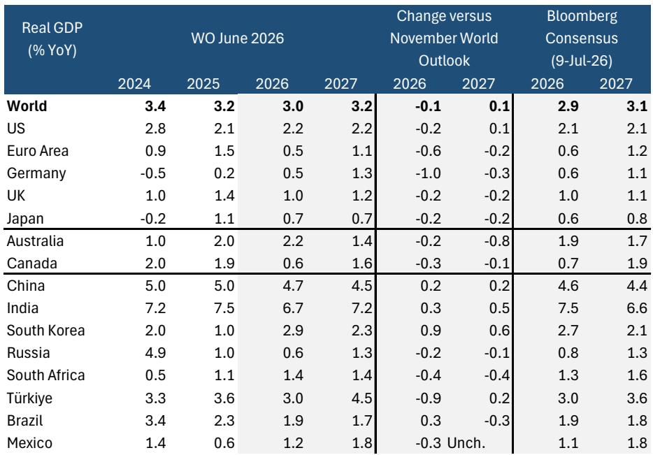
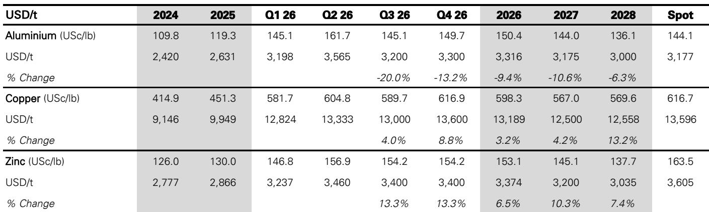
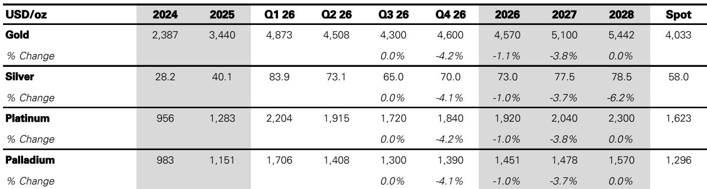

# DB：大宗商品观察——关注积极因素，外部不确定性推动供应体系调整

外部环境波动、美元走强、美联储政策偏紧——这些因素几乎贯穿了2026年上半年的商品市场。但DB在7月中旬发布的这份大宗商品观察中，提出了一个容易被忽略的判断：外部环境的挑战性并不全是负面。全球增长在能源冲击下仍保持韧性，而外部不确定性反而推动了关键矿产和能源领域的供应体系建设。报告的核心主张是，当前市场定价过度反映了短期不确定性，而忽略了结构性支撑——尤其是贵金属领域的政府债务扩张逻辑和工业金属领域的供应刚性。

这份报告覆盖了从原油到贵金属的完整商品谱系，但最值得关注的不是某个品种的预测数字，而是其分析框架：在宏观叙事和资金流向之间，哪个变量才是真正的市场定价锚。

## 1. 贵金属的定价锚正在从利率转向财政

黄金近期的回调让不少参与者困惑——美联储政策偏紧、美元走强，按传统回归模型，金价应该承压。但DB明确指出，最近的价格波动已经与黄金-利率回归关系脱钩。2022年的经验表明，这种关系是可以改变的。投机性资金流出确实是短期影响，但报告认为，结构性政府债务扩张最终会压倒利率和汇率的短期波动。到年底，金价和银价都有望回升。

> **KC评论：** 这里的核心逻辑不是“看多黄金”，而是“利率对黄金的解释力正在下降”。如果读者还在用实际利率框架判断金价方向，可能需要重新校准。报告给出的替代锚点是政府债务轨迹——这是一个更慢、但更持久的变量。

## 2. 铜的供应故事没有变，但关税不确定性是短期扰动

铜价近期承压，表面原因是美元走强和与AI资本开支相关的公司回调。但DB认为，供应端仍然偏紧。报告给出的价格路径是Q3约13000美元/吨，Q4升至约13600美元/吨。关键变量是美国铜关税的更新——预计在H2落地，结果将决定短期波动方向。

铝的情况则不同。海湾地区冶炼厂重启速度快于预期，导致价格大幅回调。报告认为H2有望温和反弹至约3300美元/吨，但到2027年随着海湾供应回归，价格将向3000美元/吨正常化。铁矿石方面，战争溢价已基本消退，海运出口强劲加上西芒杜项目早期增产信号，供应不确定性在累积。但成本曲线高端（高于100美元/吨）的支撑位应能限制夏季季节性调整时的节奏变化空间。

## 3. 原油的短期错配掩盖了2027年的过剩现实

原油市场目前面临的是成品油端的严重错配——供应、炼厂开工率和裂解价差都处于非正常状态。DB预计这些错配至少需要到年底才能正常化。但报告的关键判断在于：一旦错配修复，2027年将出现显著过剩，这个现实会成为市场的主导叙事。Q3布伦特原油预测为80美元/桶，Q4降至75美元/桶，2027年进一步降至70美元/桶。

## 4. 市场参与者对美元资产的配置调整，数据上还没有兑现

报告花了不少篇幅讨论资本流动。一个值得注意的发现是：尽管今年早些时候多家大型私人研究机构公开表示要分散对美元资产的配置，但无论是私人参与者还是公共参与者的汇总数据，都没有清晰显示这一趋势。OMFIF的调查显示，更多储备管理者表达了长期减少美元敞口的意愿（24%计划减少，16%计划增加），但实际行动与历史模式相比没有明显偏离。

这意味着，去美元化的叙事目前更多停留在意愿层面，而非资金流动的现实。对于商品定价而言，美元短期走强可能已经过度，DB维持年底前美元温和走弱的判断。

> **KC评论：** 报告对资本流动的分析值得反复看。它提醒我们，不要把机构公开表态等同于实际仓位变化。数据滞后、行动滞后，叙事和现实之间往往存在几个季度的时差。

## 5. 一个可复用的观察框架：区分“叙事驱动”和“结构驱动”

这份报告最实用的部分，不是具体价格预测，而是它区分不同商品定价逻辑的方式。黄金看财政而非利率，铜看供应刚性而非宏观情绪，原油看短期错配而非长期需求。对于产业决策者或研究读者来说，一个有效的做法是：在分析任何商品时，先问自己——当前价格波动的主要驱动力，是叙事层面的宏观情绪，还是结构层面的供需刚性？前者往往提供交易窗口，后者才决定趋势方向。

For informational purposes only. Portions may be generated,translated,summarized,or edited with AI assistance based on source materials and may contain omissions or errors. Please verify independently. This is not investment,legal,tax,accounting,or other professional advice.

For informational purposes only. Portions may be generated,translated,summarized,or edited with AI assistance based on source materials and may contain omissions or errors. Please verify independently. This is not investment,legal,tax,accounting,or other professional advice.

