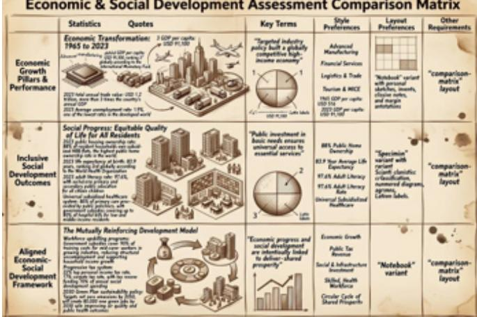
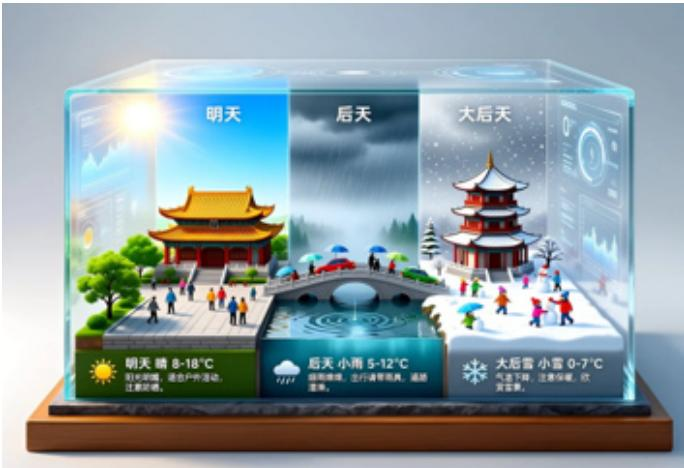

# 中国软件行业：产品追踪——综合型AI Agent工具推动使用量增长；AI原生应用持续扩展

## 中国软件行业

我们梳理了2026年初至今的新软件产品发布情况（图表1-3），发现AI Agent以及软件应用的新AI功能势头依然强劲，其背后支撑因素包括：训练/推理效率提升带来更高的性价比、开源模型性能持续增强、面向消费者和企业用户的采用率上升推动数据飞轮效应，以及商业化路径更加清晰。

- **Agent型AI覆盖完整工作流**：国内增强的基础模型支持Agent型任务（工作助手、呼叫中心、行业专家等）和编程场景，同时用户需求持续增长，Token经济迎来拐点。近期新推出的AI Agent主要集中在：（1）功能全面的桌面AI；（2）减少重复工作流的AI/数字员工；（3）覆盖建筑、网络安全、图像与视频生成等领域的行业应用。

- **AI功能赋能软件**：近期新产品发布聚焦于AI原生应用，包括更具针对性的生产力工具（如WPS笔记、福昕PDF编辑器），以及面向新领域的娱乐工具（如用于音乐视觉内容生成的MVLand、AI短剧生成等）。总体来看，我们预计AI应用的月活跃用户数将继续增长，消费者和企业用户将越来越多地使用生成式AI产品来体验更多嵌入式功能。

- **AI变现路径**：随着Token成本降低和用户场景扩展，我们认为AI应用对终端用户实现正向回报将推动进一步的采用和支出。对于软件供应商而言，我们观察到从订阅费逐步向基于用量的Token费用转变的趋势。不过，年费/季度费仍将是覆盖基础成本的核心收入来源。

## 新软件发布的主要亮点

**美图（1357.HK）** 视频AI解决方案持续扩展：除Wink、开拍、Roboneo等视频应用外，公司还发布了MVLAND和Artflo等新产品。Artflo主要用于灵感管理和概念视觉创作，赋能用户生产。MVLAND通过多Agent协作快速生成音乐相关的高质量视觉内容，管理层指出用户平均支出上升且需求强劲。我们也预计，配备AI助手的新版开拍以及具备AI短剧功能的Roboneo将推动用户采用。

**商汤（0020.HK）** AI办公产品发布：商汤发布了开源工具SenseNova U1（兼具理解与生成能力），并推出AI办公技能套件SenseNova-Skills，以更好地支持其AI办公助手“办公小浣熊”，实现核心工作流的端到端自动化，包括信息图生成、PPT生成、数据分析和深度研究。我们预计其快速安装和用户自定义集成将推动采用。

**广联达（002410.SZ）** 建筑行业AI Agent：广联达的行业AI解决方案聚焦于（1）高质量数据、（2）高价值场景和（3）可靠AI模型。公司积累了有效的数据资产，开发了包括PMLead、PMSmart在内的核心AI产品，并设立了AI工程部门以加速AI Agent开发。在工程造价方面，公司利用AI增强产品，并从房地产项目向工业、能源等新领域扩展。在施工管理方面，公司正在升级平台解决方案，与多家客户合作开展标杆项目，随后向更多客户推广。

图表1：AI模型新产品发布

| 领域 | 公司 | 产品/合作伙伴 | 主要升级/新产品发布 | 前代产品 |
|---|---|---|---|---|
| AI模型 | 商汤 | SenseNova 6.7 Flash-Lite | 轻量级原生多模态Agent模型（“看-思-行”），相比纯文本Agent降低约60%的Token消耗 | SenseNova V6.5（2025/7） |
| | 商汤 | SenseNova U1 V2和U1 pro | U1为开源原生统一理解-生成模型；U1 pro首次支持原生8K输出，聚焦“可投产”设计 | SenseNova U1（2026/4） |
| | 商汤 | ACE-Brain-0.5 | 基于空间智能的机器人基础模型，实现具备自主感知、规划、行动和评估能力的物理Agent型AI | ACE-Brain-0（2026/3） |
| | 科大讯飞 | 星火X2 | 293B MoE大语言模型，基于全自主（昇腾）算力，推理能力较前代提升50%，支持130+语言；驱动星火医疗X2 | 星火X1.5（2025/11）/ 星火X1（2025/1） |
| | 科大讯飞 | 星火X2-VL | 原生多模态扩展，支持图像、文档、图表及复杂真实场景的视觉推理 | — |
| | 科大讯飞 | GEAR-VLA | 视觉-语言-动作基础模型，使机器人能够在真实环境中感知、推理并自主执行任务 | — |
| | 美图 | MiracleVision V6 | 第六代视觉基础模型，MoE架构，多模态输入；美图应用中96.3%的生成式AI调用基于此模型 | MiracleVision V5（2024/6） |
| | 美图 | Lux3D模型/LuxReal AI | 面向专业创作者的AI短剧生成工具 | 空间智能大模型V1.5（2025年8月） |
| | 51WORLD | 51World Model | 具备物理直觉的世界模型，通过4D场景重建和物理一致性模拟实现物理AI | 新发布 |
| | 科大讯飞 | WIM 2.0 | 水务智能模型平台，采用多模态交互和空间智能大模型 | WIM 1.0（2024/01） |

图表2：AI Agent新产品发布

| 领域 | 公司 | 产品/合作伙伴 | 主要升级/新产品发布 | 前代产品 |
|---|---|---|---|---|
| AI Agent | 金山办公 | WPS灵犀 | WPS AI 4.0：WPS灵犀2.0，通过自然语言交互实现文档创作、PPT生成、数据分析和文档编辑的Agent型工作流 | WPS灵犀/WPS AI 3.0（2025/7） |
| | 彩云科技 | 办公小浣熊桌面Agent | 桌面AI Agent升级，支持本地文件处理、浏览器交互、企业工作流集成和任务执行，同时可在OpenClaw生态中使用 | 办公小浣熊3.0（2025/12） |
| | 用友 | YonClaw | 企业超级Agent，覆盖ERP全功能（HR/财务/供应链）；首批通过中国信通院企业级Claw型Agent安全评估 | YonGPT模型矩阵（2025/8） |
| | 商汤 | Mavens | 一站式“AI HR专家”平台早期供应商；基于商汤大模型和商汤Agent的15位数字HR专家，10亿元AI研发投入；另推出AI招聘3.0五Agent团队 | 新发布 |
| | 美图 | Picchi | 专属人像精修Agent，通过“学习我的风格”和“学习他们的风格”等功能复制个性化审美 | 新发布 |
| | 美图 | Artflo | 灵感管理与概念图像创作工具 | 新发布 |
| | 美图 | MVLAND | 多Agent协作快速生成音乐相关高质量视觉内容 | 新发布 |
| | 美图 | MeituHub | 作为技术解决方案和基础支撑平台 | 新发布 |
| | 美图 | ZCOOL V6.2 | 通过AI生态连接设计师、品牌和创意需求 | ZCOOL 6.1（2026/3） |
| | 美图 | 美图设计室V8.2 | 引入AI设计团队，从单纯生成内容转向交付商业成果 | 美图设计室V8.11（2026/5） |
| | 美图 | 开拍V4.2 | 推出AI助手，实现从选题策划到成片制作的连续交付 | 开拍V4.1（2026/5） |
| | 美图 | RoboNeo V2.0 | AI短剧功能 | RoboNeo V1.1（2026/3） |
| | 安恒信息 | 安恒数字员工+AI-PTS | 基于太合安全大模型的安全运营“数字员工”；天镜AI-PTS自动化渗透测试 | 安恒Agent矩阵/太合大模型（2025/3） |
| | 安恒信息 | AI安全Agent | 基于Agent的安全运营升级，实现自动化威胁狩猎、事件分析、漏洞发现和响应工作流 | — |
| | 致远互联 | AstronClaw/Agent | 企业级智能协作平台，基于多Agent机制，实现从需求理解到资源匹配的完整工作流自动化 | 新发布 |
| | 实在智能 | Tida Claw | AI驱动的文档自动化平台，通过独特的五支柱架构将非结构化文件转化为可信、可审计的数据资产 | 新发布 |
| | 洛可可 | Lovart AI设计Agent | 从自然语言提示到全链路视觉创作的AI设计Agent | Lovart beta/候补名单设计Agent版（2025/5） |
| | 百望股份 | 智能发票专家团 | 税务与发票AI Agent，接入腾讯云AI平台/WorkBuddy生态 | 百望数字税务/发票SaaS及AI原生战略3.0产品（2025/11） |
| | 纷享销客 | ShareHive AI-Agent | AI原生CRM平台，将AI Agent融入销售、营销和服务工作流，实现客户管理自动化、提升销售效率 | ShareAI/CRM AI Agent矩阵功能（2026/3） |
| | 来也科技 | Laiye Worker | 桌面Agent产品发布，作为企业工作流的“AI员工” | 来也科技AI Agent数字员工解决方案（2024/6） |
| | 广联达 | 广晓知 | 施工现场管理AI Agent，自动从工作聊天、文档和图像中提取数据，生成施工日志和风险预警 | 新发布 |
| | 微盟 | AI Work365 | 企业AI原生工作空间，将生成式AI嵌入工作流、文案撰写和任务管理，微盟重心从前端电商转向后台生产力 | WAI（2025/10） |
| | 微盟 | 微盟WAI | 升级为“Agent+技能”架构，将电商逻辑解耦为模块，支持移动端聊天式线索培育、店铺搭建和业务分析 | — |
| | 明源云 | 超级大礼包 | AI房地产增长套件，自动化短视频策略、内容创作、直播和获客 | 新发布 |
| | 明源云 | 明源启明大模型 | 明源云开发的行业专用大语言模型，针对房地产和汽车等垂直营销领域 | 新发布 |
| | 明源云 | 明源租赁Agent | 7x24小时AI租赁Agent，具备专有知识和10维策略引擎，自动完成画像、匹配和预订，提升O2O转化 | 新发布 |

图表3：AI软件应用新产品发布

| 领域 | 公司 | 产品/合作伙伴 | 主要升级/新产品发布 | 前代产品 |
|---|---|---|---|---|
| AI应用/AI基础设施 | 金蝶 | 金蝶Lingee | 企业AI操作系统，集成大模型、AI Agent、MCP、低代码开发和企业知识，实现财务、HR、供应链和运营的自主业务工作流 | 新发布 |
| | 金蝶 | AL Ultra套件 | 综合性企业AI解决方案，具备全场景覆盖、实时AI和全球化能力，无缝集成智能Agent | 新发布 |
| | 用友 | YonCode | 基于自研“Harness”引擎（六层架构）的企业AI编程平台——覆盖需求→编码→测试→部署全生命周期；BIP超级版本 | 新发布 |
| | 金山办公 | WPS笔记 | 全新AI原生多模态笔记应用（语音/图像/文本/网页），实现记录→整理→复用；支持MCP接入外部AI工具（Cursor、Claude） | 新发布 |
| | 福昕软件 | 福昕PDF编辑器（新版） | AI增强的PDF工作流升级，新增改进的AI助手、文档聊天管理、安全分析（Action Inspector） | 福昕PDF编辑器2025.3（2025/12） |
| | 深信服 | SF-FastGPT | 企业AI产品套件，支持AI Agent的生产部署，包括低代码Agent开发（SF-FastGPT）、AI编程助手（CoStrict） | 新发布 |
| | 中软国际 | Allmeta本体1.0 | AI原生智能系统，自动将遗留企业数据（ERP/MES）转化为可自主执行的AI Agent工作流和全生命周期代码，无需手动提示编程 | 新发布 |
| | 影刀RPA | 影刀RPA V6.0 | 新增AI工作流指令和AI辅助流程生成/修复功能 | 影刀RPA V5.32（2026/1） |
| | 商汤 | Seko | Seko 2.0升级：AI视频创作Agent升级，实现自动化故事板工作流、多集资产管理及专业电影工具，使Seko从AI视频生成器进化为AI原生内容制作平台 | Seko 2.0（2025/12） |
| | 51WORLD | SimOne | SimOne 4.0：面向自动驾驶和具身AI的仿真平台，提供高保真虚拟环境、场景生成和测试能力 | SimOne 3.8（2025/12） |
| | 万兴科技 | 万兴剧厂 | 一站式AI漫画短剧平台——AI剧本、小说改编、分集故事板；2026年3月13日全面上线，通过Kling实现原生4K | — |
| | 万兴科技 | Filmora V15新功能 | 新增生成式增强功能，为颗粒感、模糊或低光片段提供高质量降噪和放大 | Filmora V15（2025/11） |
| | 广联达 | AECOS | AECOS平台2.0：允许合作伙伴将行业知识封装为可通过API调用的技能，为工程领域垂直AI Agent平台奠定基础 | AECOS平台1.0（2025/9） |
| | 中望软件 | ZW3D悟空2027 | 基于自研Overdrive内核的3D CAD/CAE/CAM——AI自动编程提升90%加工效率，CAM精度±0.005mm；ZW Plant、鸿蒙版 | ZW3D 2026（2025/6）/ ZWCAD 2026（2025/5） |
| | 中望软件 | ZW CAD 365 2.0 | 云原生智能设计平台，支持实时多用户协作和深度理解工程图纸的AI | ZW CAD 1.0（2025/5） |
| | 中科创达 | AquaDrive AIOS 2.1 + AIBOX-Q1 | 行业首个“AI即OS”原生汽车操作系统——从内核到应用的重构、AquaClaw Agent、首个端侧30B MoE演示、无缝多Agent任务执行、动态HMI生成及安全长期记忆资产保留 | AquaDrive OS 2.0 Pre（2026/1） |
| | 德赛西威 | EA01U | 旗舰级舱驾泊跨域平台，集成云边AI、MoE/Omni模型、AI OS和Agent框架，面向全球OEM | 新发布 |
| | 德赛西威 | 车辆AI Agent生态 | 高通支持的Agent框架，实现AI原生车载体验 | 新发布 |
| | 群核科技 | Aholo Viewer | 基于浏览器的3DGS渲染引擎，无需安装软件即可交互大规模3D环境 | 新发布 |
| | 石基信息 | Shiji Iceportal | 为AI搜索结构化酒店视觉内容和描述，跨450+全球渠道同步高质量内容，确保在AI推荐引擎中获得一致曝光 | Shiji Horizon（2025/6）/ Shiji Iceportal（2025/10） |
| | 石基信息 | Infrasys POS with FPG CheckMax | 为员工提供实时AI销售辅导和数据分析，通过AI驱动的提示和追加销售，目标是将每位客人的增量收入提升5%至15% | — |
| | 石基信息 | ReviewPro声誉管理 | 增强AI语义分析和自动摘要，帮助酒店高效解读海量客人反馈 | — |
| | 恒生电子 | LIGHT 6.0 | 六引擎技术基础（包括CRES、JRES、PHOTON、HDP、LightSEE和LightCode），集成AI和分布式架构，推动核心系统创新、数据资产化和自动化DevOps | Light 5.0（2024/6） |

图表4：美图MVLand生成AI音乐视频

图表5：Picchi人像精修AI Agent

图表6：商汤AI办公深度研究与信息图生成功能

图表7：商汤AI办公信息图生成功能

