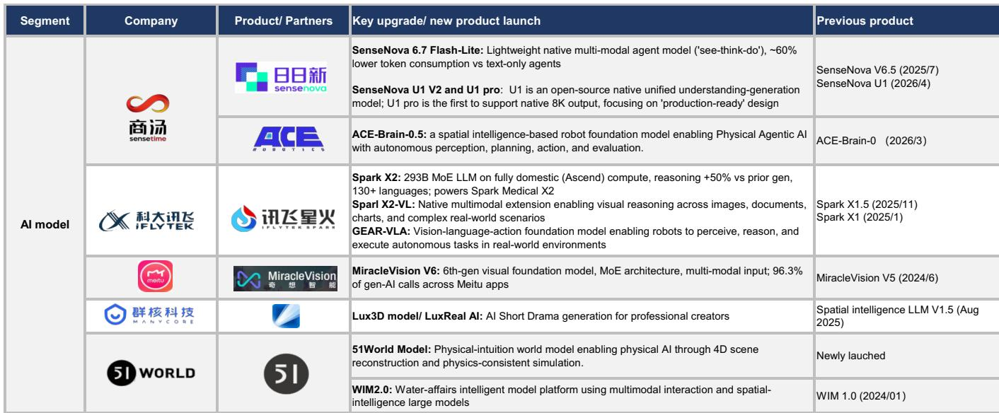

# 中国软件行业观察：AI代理正从功能演进为价值引擎

近期中国软件产品发布浪潮中，最值得关注的信号并非技术本身，而是其背后的商业逻辑。从2026年初至今，国内领先软件企业集中推出了一批AI原生产品和代理系统，这共同标志着一个战略转折点。叙事已不再是将实验性生成式AI功能附加到现有应用上，而是围绕专门构建、覆盖完整工作流的AI代理和AI原生工具展开，旨在驱动可衡量的用户参与和清晰的商业化路径。

三个结构性力量正在汇聚，使这一时刻与众不同。首先，训练和推理效率的提升显著改善了中国基础模型的性价比。其次，开源模型竞争力增强，降低了下游应用开发的门槛。第三，消费者和企业用户的采用正在加速，形成了改善模型质量的数据飞轮。结果是，AI正从成本中心转变为收入驱动力，而商业化模式本身也在从传统订阅费向基于使用量的定价转变。

本文综合近期全球研究机构报告中的产品发布数据，构建了一个战略框架，以理解价值正在何处创造，以及决策者应如何分配关注和资源。

## AI代理浪潮并非渐进式——它代表了软件价值捕获方式的结构性转变

近期产品周期中最具深远意义的发展，是综合性桌面和企业AI代理的出现。这些并非聊天机器人叠加或功能增强，而是覆盖完整工作流的自主系统，涵盖文档创建、数据分析、企业资源规划和网络安全运营。

以AI代理类别的产品发布为例。金山办公的WPS灵犀2.0，作为WPS AI 4.0版本的一部分，通过自然语言交互实现了文档创建、演示生成、数据分析和编辑的代理工作流。这直接替代了此前需要切换多个软件工具的手动多步骤流程。同样，Office Raccoon桌面代理升级版支持本地文件处理、浏览器交互和企业工作流集成，其任务执行能力延伸至整个OpenClaw生态系统。

模式很清晰：这些代理旨在捕获重复使用，这直接驱动了用户参与。对软件供应商而言，这具有战略重要性，因为基于使用量的定价创造了一种随用户参与度而非座位数增长的收入流。在企业领域，用友的YonClaw——一个覆盖人力资源、财务和供应链的企业超级代理——已通过中国信通院企业代理安全评估，表明其已为广泛部署做好监管准备。Mavens作为一站式AI人力资源平台的早期供应商，已在其SenGPT和SenClaw架构上部署了15个数字人力资源专家，并承诺投入10亿元人民币用于AI研发。

战略意义在于，企业软件的价值捕获机制正在被重写。传统的许可或订阅模式基于访问权限产生收入。AI代理则基于使用强度产生收入。对于能够将代理嵌入核心业务流程的公司而言，收入上限由自动化的任务量决定，而非许可用户数。

## AI原生应用正扩展到此前被认为边缘的垂直领域

除了代理，产品发布数据还揭示了一波针对特定高价值用例的AI原生应用。这些并非通用生产力工具，而是旨在解决具体问题、产生可衡量结果的垂直聚焦产品。

在生产力领域，WPS笔记代表了一个新类别：一款AI原生多模态笔记应用，接受语音、图像、文本和网页输入，并支持记录-整理-复用工作流。关键的是，它包含MCP访问接口，可连接Cursor和Claude等外部AI工具，表明其开放生态系统策略增加了效用面。福昕PDF编辑器已升级，配备增强型AI助手、文档聊天管理以及名为Action Inspector的安全分析功能，将成熟的文档工具转变为AI增强的安全与生产力平台。

娱乐和内容创作垂直领域正经历尤为积极的扩张。美图已发布MVLAND，一个多代理协作平台，可快速为音乐生成高质量视觉内容；以及Artflo，一个灵感管理和概念视觉创作工具。其开拍V4.2引入了AI助手，可实现从主题规划到完成视频制作的连续交付。RoboNeo V2.0增加了AI短剧功能。这些并非边缘更新；它们代表了从图像编辑到全光谱AI原生内容生产的战略转型。

这里的商业化逻辑与企业软件不同。美图管理层已强调每用户平均收入上升和强劲需求，表明消费者为AI生成内容付费的意愿正在增强。该公司基于混合专家架构构建的MiracleVision V6视觉基础模型，现已驱动美图应用生态系统中96.3%的生成式AI调用。这是一个运行中的数据飞轮：更多用户产生更多调用，生成更多训练数据，改善模型，吸引更多用户。

对于评估中国软件领域的观察者而言，关键洞察是AI原生应用不再局限于文本生成或图像编辑。它们正扩展到视频、音乐、3D设计、工程模拟，甚至短剧制作。每个新垂直领域都代表新的收入流和新的用户参与向量。

## 商业化模式正从订阅费向基于使用量的定价迁移，但这一过渡是渐进且战略性的

产品发布数据中最具分析意义的发现之一是AI软件不断演变的商业化结构。报告明确指出，对软件供应商而言，从订阅费向基于使用量的定价的逐步迁移正在进行，但年度和季度费用仍为核心收入，用于覆盖基础成本。

这种双收入模式具有战略重要性，因为它解决了AI经济学中的一个经典张力。一方面，基于使用量的定价使供应商收入与交付给客户的价值保持一致。如果一个AI代理自动化了高容量工作流，供应商通过增加的用户参与来捕获部分价值。另一方面，订阅费提供了可预测的基础收入，覆盖模型训练和基础设施的固定成本。

用户参与的经济拐点由两个因素驱动。首先，中国的基础模型已变得显著更高效。例如，商汤SenseNova 6.7 Flash-Lite模型相比纯文本代理，实现了约60%的用户参与降低，同时保持原生多模态能力。每次参与成本的降低使AI在经济上对更广泛的用例变得可行。其次，随着用户采用规模扩大，数据飞轮降低了模型改进成本，进一步改善了性价比。

对企业采购者而言，实际意义在于采购决策现在应包含自动化总成本计算，而不仅仅是每座位许可比较。对软件供应商而言，战略要务是将AI功能足够深入地嵌入工作流，使参与成为常规操作的自然副产品，而非可自由选择的附加项。

## 决策框架：如何评估当前周期中的中国AI软件

对于需要将产品发布数据转化为可操作战略决策的读者，以下框架将证据组织为三个评估维度。

第一，评估工作流集成深度。替换或自动化完整工作流的产品——如用于文档创建的WPS AI 4.0、用于企业资源规划的YonClaw、或来也Worker桌面代理——比将AI作为外围功能添加的产品具有更高的产生持续用户参与的潜力。关键问题是AI系统是否成为完成任务的首选方法，或仅仅是可选增强。

第二，评估商业化模式轨迹。那些在向基于使用量的定价过渡的同时，维持订阅收入以覆盖基础成本的公司，比仅依赖任一模式的公司提供更具韧性的收入组合。基于使用量的定价机制的存在表明供应商对每单位AI计算交付的价值有信心，这是长期收入增长的积极信号。

第三，分析数据飞轮潜力。产生高容量用户交互的产品——尤其是在面向消费者的应用中，如美图的内容创作套件或金山办公的办公工具——会创建专有训练数据，随时间推移改善模型质量。这创造了新进入者难以复制的竞争护城河。报告中MiracleVision V6驱动美图96.3%生成式AI调用的数据点，是这一动态在实践中的有力例证。

对企业技术领导者而言，这意味着采购应优先考虑提供深度工作流集成和透明基于使用量定价的平台，同时保持与现有IT基础设施的兼容性。对于观察者而言，那些在所有三个维度——工作流深度、商业化清晰度和数据飞轮速度——上展现出较强一致性的公司，很可能在当前周期中捕获不成比例的价值。

## AI向工程、安全和行业特定应用的垂直扩展，标志着可寻址市场的拓宽

产品发布数据揭示，AI的采用并不局限于办公生产力和内容创作。它正以日益复杂的程度渗透到工程、网络安全、建筑和行业特定垂直领域。

在工程领域，中望软件的ZW3D悟空2027，基于自研Overdrive内核构建，通过AI自动编程和±0.005mm CAM精度，实现了加工效率90%的提升。这并非边际效率增益；它代表了计算机辅助设计和制造软件运行方式的根本性变化。广联达的广晓智AI代理用于施工现场管理，可自动从工作聊天、文档和图像中提取数据，生成施工日志和风险警报，将非结构化现场数据转化为结构化运营情报。

在网络安全领域，安恒信息已在其中泰安全大语言模型上推出数字员工，包括AI-PTS自动化渗透测试系统和AI安全代理，可实现自动化威胁狩猎、事件分析、漏洞发现和响应工作流。从人类主导的安全运营到AI驱动的自主安全的转变，是当前周期中最被低估的发展之一。

在汽车领域，中科创达的AquaDrive AIOS 2.1代表了行业首个“AI即操作系统”的原生汽车操作系统，具有从内核到应用的重建、车载30B混合专家模型以及无缝多代理任务执行。德赛西威的EA01U旗舰舱驾泊跨域平台集成了云边AI、混合专家模型和全模态模型，以及面向全球原始设备制造商的代理框架。

这一垂直扩展的战略意义在于，它显著增加了AI软件的总可寻址市场。每个行业垂直领域都有自己的一套工作流、合规要求和数据特征，这意味着专门的AI代理和应用不易被商品化。这为软件供应商创造了在特定垂直领域建立防御性地位的机会，其定价能力源于领域专业知识，而非通用AI能力。

*仅供参考。部分内容可能基于源材料通过AI辅助生成、翻译、总结或编辑，可能存在遗漏或错误。请独立核实。本文不构成任何专业建议。*

仅供参考。部分内容可能基于源材料通过AI辅助生成、翻译、总结或编辑，可能存在遗漏或错误。请独立核实。本文不构成任何专业建议。

