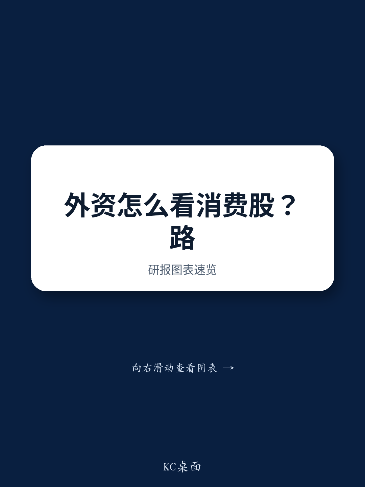

# 中国消费必需品情绪拐点：市场预期与公司差异化的窗口

海外读者在新加坡和香港的市场调研中形成共识：中国消费必需品第二季度趋势偏弱，且市场对此已有预期。对下半年的预期已相应调整。然而，无论是长期导向还是趋势导向的读者，都在积极寻找轮动信号和政策催化剂，这些因素可能引发第三季度情绪拐点。核心问题不在于基本面是否会复苏——多数人认为这需要时间——而在于市场是否已为情绪先于数据转变的时刻做好了准备。

当前市场状态较为紧张。消费必需品仓位较轻，预期较低。7月13日，中国发布了《扩大消费五年规划》，目标到2030年社会消费品零售总额从2025年的约50.1万亿元增至约60万亿元，规划期内年均名义增长率为3.7%。相比之下，上半年增长率仅为1.3%。读者对这一规划反应平淡，但也持怀疑态度：市场需要具体措施而非高层政策表述来重建信心。这意味着，中国消费必需品下一阶段的表现不会由盈利上调驱动，而将由情绪重估驱动，受益最大的将是那些具有差异化、公司特定叙事的个股，而非广泛的市场敞口。

## 调味品和乳制品领先行业偏好，啤酒仍保持观望

读者普遍认同行业排序：调味品和乳制品领先于啤酒。调味品在宏观环境下展现出韧性和市场份额增长故事，而餐饮渠道偏弱。乳制品受益于供需再平衡，预计下半年将更加明显。相比之下，啤酒仍是读者不愿投入的领域，这种谨慎有分析依据。啤酒销量面临人口结构变化和渠道组合恶化的结构性压力，高端化叙事因可支配收入增长放缓而减速。该行业2026年预期市盈率平均为16倍，虽不算极端，但如果销量趋势进一步低于预期，安全边际有限。在餐饮渠道复苏或成本通缩传导至利润率出现更明确证据之前，啤酒仍是一个需要验证的故事。偏好调味品和乳制品不仅是防御性选择，更反映了这些子行业具有可识别的公司层面催化剂，不依赖宏观全面好转。

## 蒙牛持仓广泛，但UHT奶税收不确定性带来需关注的具体风险

蒙牛是价值基金和对冲基金讨论最多的个股，但讨论焦点已从乳制品整体复苏转向一个具体且被低估的风险：UHT奶和鲜奶的潜在税收调整。读者关注相关税收政策变化的范围及其对蒙牛有效税率的影响。下半年供需再平衡前景是核心正面逻辑，但税收问题引入了一个尚未完全定价的二元因素。报告提供了说明性税收敏感性分析，关键结论是：即使销量复苏按预期进行，潜在税收影响的规模也可能显著改变盈利轨迹。对于蒙牛持有者而言，该股持仓广泛意味着任何负面税收意外都可能引发快速轮动。风险不在于乳制品复苏失败，而在于复苏转化为盈利的过程被财政政策稀释。读者应针对一系列有效税率情景（而非仅销量和价格假设）对蒙牛持仓进行压力测试。

## 结构性增长故事如巴比食品和万辰生物：补贴动态不升级才有价值

巴比食品和万辰生物仍相对较少被长线基金持有，讨论焦点在于其门店扩张速度——上半年超出预期——是否可持续。核心担忧是竞争驱动的补贴水平。两家公司均使用补贴推动门店增长，部分读者担心下半年补贴强度可能增加，因双方争夺货架空间和消费者心智。看多逻辑基于单店经济：如果门店层面盈利能力在扩张中保持稳定，当前10-12倍中期市盈率的估值是合理入场点。读者普遍认同这一估值阈值，表明存在底部支撑。风险在于竞争动态升级至单店经济恶化，使当前门店数量不可持续。分析挑战在于区分建立市场份额的临时促销支出与结构性利润率侵蚀。读者应跟踪同店销售趋势和补贴收入比，而非仅关注门店数量增长。该股的吸引力取决于市场相信增长是盈利的，而不仅仅是快速的。

## 高质量龙头提供防御性增长，但与饮料同行比较揭示不同风险特征

海天味业和农夫山泉是消费必需品领域的高质量锚点，但读者讨论揭示了重要细微差别。对于海天味业，市场高度确信公司将在第二季度维持高个位数收入增长，尽管宏观和餐饮渠道偏弱，即使预计环比放缓。港股受益于回购计划和股息率，合计提供约9%的总股东回报。该股是收益增强型复合增长股而非高增长故事，其吸引力直接：韧性加资本回报。对于农夫山泉，讨论更为复杂。读者将农夫山泉与东鹏饮料、康师傅和统一企业中国进行比较。公司开发新品类的能力——尤其是无糖茶品牌东方树叶——受到广泛赞赏，仍是强劲增长动力。但围绕瓶装水放缓和成本趋势（尤其是茉莉花原料）的担忧正在增加。农夫山泉2026年预期市盈率为22倍，这一溢价反映了其品类创新能力。问题在于，如果核心水业务进一步放缓，这一溢价能否维持。该股并非简单的观点；需要相信新品类增长足以抵消水业务疲软，且成本压力是暂时而非结构性的。

## 白酒：低谷价值之争，“最坏已过”叙事需中秋价格确认

白酒仍是最具争议的子行业。部分读者看到触底机会，茅台2026年预期市盈率19倍、2027年17倍，股息率4.2%。看多逻辑基于盈利下调周期最坏阶段已过。但争论激烈。第二季度业绩预计显示茅台净利润下降3%，古井贡酒下降35%，今世缘仅增长4%，这被报告描述为2026年低谷。关键问题是“最坏已过”故事是否在第三季度兑现，届时行业将面对反腐运动后的低基数。批发价格企稳的早期迹象正在出现，库存水平预计在第二季度去库存后更为健康。但关键数据点是飞天茅台中秋前的批发价格走势。如果批发价格企稳或上涨，情绪拐点可能强劲。如果继续走弱，估值支撑将削弱。读者应将白酒视为高信念、高风险交易，完全取决于未来60-90天可观察的价格数据。这不是一个观点和观点复苏故事；而是一个依赖催化剂的头寸。

## 颐海国际：最差异化的思路——市场仍低估的运营转折

在讨论的个股中，颐海国际是最差异化的思路。部分长线读者认识到，公司今年的运营转折尚未完全反映在股价中。证据具体且可衡量。海外销售年初至今增长35%，目前约占总销售的9-10%。国内，2C业务受益于渠道改革，开始显现成效。该股2026年预期市盈率14倍，相对于调味品同行存在折价，考虑到增长轨迹，这一折价似乎不合理。市场的怀疑似乎源于对宏观环境下转折故事的普遍谨慎，但颐海国际的海外势头提供了与中国国内消费相关性较低的多元化收入来源。对于寻求不依赖消费全面复苏的差异化敞口的读者，颐海国际提供了公司特定催化剂路径。关键风险在于执行：转折必须保持节奏，海外增长不能因基数扩大而放缓。但当前估值下，不对称性有利。

## 情绪拐点定位的决策框架

以下框架将市场反馈和分析见解转化为可操作的组合决策。首先，评估时间跨度。如果交易3-6个月情绪拐点，关注具有可识别催化剂的个股：茅台中秋前批发价格走势、蒙牛税收政策明确性、颐海国际海外增长势头。这些个股提供事件驱动型上行空间，不要求基本面复苏。其次，如果以12个月为投资周期，优先选择基本面故事与宏观脱钩的个股：海天味业因其总股东回报和品类韧性，农夫山泉因其新产品管线。这些个股在情绪反弹中可能不提供最高上行空间，但无论宏观路径如何，都提供最高概率实现基准回报。第三，避免依赖宏观环境改善而无公司特定催化剂的个股。啤酒大致属于此类，任何研究逻辑基于销量复苏而非市场份额增长或成本改善的调味品或乳制品个股也是如此。第四，仅当愿意每周监控批发价格数据并相应调整时，才配置白酒仓位。该行业在情绪转变时提供最高潜在上行空间，但价格数据令人失望时也面临最高进一步下行风险。最后，考虑将颐海国际作为核心差异化持仓：它提供公司特定转折、海外多元化以及未定价成功的估值。在大多数消费必需品个股要么是共识多头要么是共识回避的市场中，颐海国际提供了真正的分析优势。

*仅供参考。部分内容可能基于源材料通过AI辅助生成、翻译、总结或编辑，可能包含遗漏或错误。请独立核实。本文不构成专业建议。*

仅供参考。部分内容可能基于源材料通过AI辅助生成、翻译、总结或编辑，可能包含遗漏或错误。请独立核实。本文不构成专业建议。

