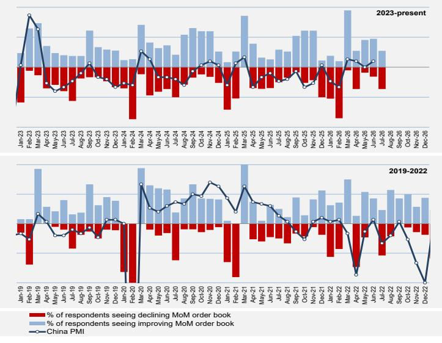

# 中国基础材料月度观察

## 摘要

截至7月中旬，终端用户订单簿出现季节性走弱，与历史同期模式基本一致。与前期相比，趋势有所变化，主要受季节性因素、出口增量动能不足以及国内需求持续偏弱共同影响。具体来看，建筑、汽车、金属加工领域的变化是7月增速放缓的主要驱动因素。产成品库存略有上升——24%的生产商反映库存高于正常水平（6月为9%），主要集中在电池、机械、家电及部分金属加工领域。供给端方面，煤炭生产安全监管持续严格，预计未来数月仍将维持。其他政策相关的供给端工作，包括行业基准能效要求等，尚未在各行业产生明显变化。受利润承压影响，钢厂及小型水泥企业已开始减产。与此同时，6月中国原铝产量进一步上升。

高频数据显示，7月上半月，中国水泥和建筑用钢需求同比下降4-10%，扁平材需求基本持平，铜需求同比增长3%。水泥和铜的利润/价格保持稳定，而铝、钢、煤和锂的价格有所走弱。

渠道调研：根据我们自有调查中生产商的反馈，远期订单趋势环比走弱——27%的受访者表示7月下游行业及大宗商品订单环比改善。

图表1：7月下游订单环比走弱

  
来源：CEIC，GS全球投资研究（自有调查）

Trina Chen
+852-2978-2678 | trina.chen@gs.com
GS (Asia) L.L.C.

Joy Zhang
+852-2978-6545 | joy.x.zhang@gs.com
GS (Asia) L.L.C.

Roy Shi
+852-2978-0110 | roy.shi@gs.com
GS (Asia) L.L.C.

Fiona Ye
+852-2978-0680 | fiona.ye@gs.com
GS (Asia) L.L.C.

Daisy Dai
+852-2978-7904 | daisy.dai@gs.com
GS (Asia) L.L.C.

## 目录

中国基础材料——覆盖摘要 3
大宗商品价格表 4
中国基础材料月度观察（2026年7月）：增量动能减弱 5
中国下游需求快照——基础设施 9
中国下游需求快照——房地产 10
中国下游需求快照——传统制造业 11
中国下游需求快照——先进制造业 12
中国下游需求快照——电力、交通及出口 13
铜：需求图景偏弱 14
铝/氧化铝：出口动能放缓，产量上升 17
锂：供应缺口持续，但供给加速在即 19
钢铁：需求进一步走弱，供给端有所响应 22
炼钢原料：焦煤边际宽松 24
煤炭：价格回调 27
水泥：供给端动作有限 30
纸包装：出口需求仍处高位，国内需求形成拖累 33
目标价方法与风险 36
附录 41

## 中国基础材料——覆盖摘要

图表2：中国基础材料——覆盖摘要

<table><tr><td rowspan="2" colspan="2">公司 截至2026年7月16日价格</td><td rowspan="2">代码</td><td rowspan="2">价格 本币</td><td rowspan="2">目标价 本币</td><td rowspan="2">交易 货币</td><td rowspan="2">评级</td><td rowspan="2">上行空间 %</td><td rowspan="2">市值 十亿美元</td><td colspan="3">净利润（报告货币，十亿）</td><td colspan="2">市盈率</td><td colspan="2">市盈率-一致预期</td><td colspan="2">净资产回报表现</td><td colspan="2">市净率</td><td colspan="2">企业价值/EBITDA</td><td colspan="2">自由现金流回报表现</td><td colspan="3">股息率</td><td rowspan="2">1个月表现</td><td rowspan="2">年初至今表现 百万美元</td></tr><tr><td>25A</td><td>26E</td><td>27E</td><td>26E</td><td>27E</td><td>26E</td><td>27E</td><td>26E</td><td>27E</td><td>26E</td><td>27E</td><td>26E</td><td>27E</td><td>25A</td><td>26E</td><td>27E</td></tr><tr><td colspan="29">钢铁</td></tr><tr><td>鞍钢-H</td><td>0347.HK</td><td>1.16</td><td>1.15</td><td>港元</td><td>卖出</td><td>-1%</td><td>1.4</td><td>(4.07)</td><td>(4.83)</td><td>(1.35)</td><td>不适用</td><td>不适用</td><td>不适用</td><td>不适用</td><td>不适用</td><td>-12%</td><td>-4%</td><td>0.2</td><td>0.2</td><td>不适用</td><td>10.2</td><td>-45%</td><td>-1%</td><td>0.0%</td><td>0.0%</td><td>0.0%</td><td>-6%</td><td>-41%</td></tr><tr><td>鞍钢-A</td><td>000898.SZ</td><td>1.96</td><td>1.65</td><td>人民币</td><td>卖出</td><td>-16%</td><td>2.7</td><td>(4.07)</td><td>(4.83)</td><td>(1.35)</td><td>不适用</td><td>不适用</td><td>不适用</td><td>不适用</td><td>不适用</td><td>-12%</td><td>-4%</td><td>0.5</td><td>0.5</td><td>不适用</td><td>13.6</td><td>-24%</td><td>-1%</td><td>0.0%</td><td>0.0%</td><td>0.0%</td><td>-2%</td><td>-23%</td></tr><tr><td>宝钢</td><td>600019.SS</td><td>5.68</td><td>6.70</td><td>人民币</td><td>中性</td><td>18%</td><td>18.6</td><td>10.35</td><td>9.83</td><td>13.81</td><td>12.4</td><td>8.8</td><td>11.5</td><td>9.8</td><td>5%</td><td>6%</td><td>0.6</td><td>0.6</td><td>5.0</td><td>4.1</td><td>6%</td><td>11%</td><td>4.3%</td><td>5.0%</td><td>7.0%</td><td>-2%</td><td>-24%</td><td>88.2</td></tr><tr><td>马钢-H</td><td>0323.HK</td><td>1.65</td><td>2.20</td><td>港元</td><td>中性</td><td>33%</td><td>1.6</td><td>(0.21)</td><td>0.30</td><td>0.98</td><td>36.7</td><td>11.2</td><td>17.2</td><td>6.4</td><td>1%</td><td>4%</td><td>0.5</td><td>0.5</td><td>6.6</td><td>5.0</td><td>0%</td><td>8%</td><td>0.0%</td><td>1.4%</td><td>4.5%</td><td>-6%</td><td>-37%</td><td>2.6</td></tr><tr><td>马钢-A</td><td>600808.SS</td><td>2.49</td><td>2.40</td><td>人民币</td><td>卖出</td><td>-4%</td><td>2.8</td><td>(0.21)</td><td>0.30</td><td>0.98</td><td>64.1</td><td>19.6</td><td>29.3</td><td>12.8</td><td>1%</td><td>4%</td><td>0.8</td><td>0.8</td><td>8.3</td><td>6.3</td><td>0%</td><td>6%</td><td>0.0%</td><td>0.8%</td><td>2.5%</td><td>-9%</td><td>-41%</td><td>29.4</td></tr><tr><td colspan="29">煤炭</td></tr><tr><td>神华-H</td><td>1088.HK</td><td>41.88</td><td>45.00</td><td>港元</td><td>中性</td><td>7%</td><td>109.8</td><td>54.2</td><td>66.5</td><td>65.8</td><td>11.2</td><td>11.7</td><td>12.7</td><td>12.6</td><td>16%</td><td>15%</td><td>1.8</td><td>1.7</td><td>6.0</td><td>6.3</td><td>8%</td><td>7%</td><td>6.6%</td><td>6.7%</td><td>6.6%</td><td>-3%</td><td>6%</td><td>79.4</td></tr><tr><td>神华-A</td><td>601088.SS</td><td>43.27</td><td>47.00</td><td>人民币</td><td>中性</td><td>9%</td><td>131.4</td><td>54.2</td><td>66.5</td><td>65.8</td><td>13.4</td><td>14.0</td><td>15.2</td><td>15.2</td><td>16%</td><td>15%</td><td>2.1</td><td>2.0</td><td>7.2</td><td>7.5</td><td>6%</td><td>6%</td><td>5.4%</td><td>5.6%</td><td>5.5%</td><td>3%</td><td>7%</td><td>271.1</td></tr><tr><td>中煤-H</td><td>1898.HK</td><td>10.03</td><td>18.00</td><td>港元</td><td>买入</td><td>79%</td><td>17.0</td><td>14.5</td><td>19.7</td><td>20.2</td><td>5.8</td><td>5.7</td><td>6.1</td><td>6.3</td><td>12%</td><td>11%</td><td>0.7</td><td>0.6</td><td>3.5</td><td>3.1</td><td>9%</td><td>18%</td><td>4.5%</td><td>6.4%</td><td>6.5%</td><td>-11%</td><td>-1%</td><td>32.6</td></tr><tr><td>中煤-A</td><td>601898.SS</td><td>12.54</td><td>23.00</td><td>人民币</td><td>买入</td><td>83%</td><td>24.6</td><td>14.5</td><td>19.7</td><td>20.2</td><td>8.4</td><td>8.2</td><td>8.6</td><td>8.6</td><td>12%</td><td>11%</td><td>1.0</td><td>0.9</td><td>4.8</td><td>4.3</td><td>7%</td><td>14%</td><td>3.3%</td><td>4.4%</td><td>4.5%</td><td>-10%</td><td>1%</td><td>116.3</td></tr><tr><td>兖矿-H</td><td>1171.HK</td><td>11.11</td><td>15.00</td><td>港元</td><td>中性</td><td>35%</td><td>14.2</td><td>8.5</td><td>13.3</td><td>11.9</td><td>7.2</td><td>8.1</td><td>6.1</td><td>7.0</td><td>18%</td><td>15%</td><td>1.2</td><td>1.1</td><td>5.3</td><td>5.4</td><td>14%</td><td>14%</td><td>6.0%</td><td>8.1%</td><td>7.3%</td><td>-13%</td><td>14%</td><td>72.2</td></tr><tr><td>兖矿-A</td><td>600188.SS</td><td>19.47</td><td>19.00</td><td>人民币</td><td>卖出</td><td>-2%</td><td>28.9</td><td>8.5</td><td>13.3</td><td>11.9</td><td>14.7</td><td>16.5</td><td>12.3</td><td>12.6</td><td>18%</td><td>15%</td><td>2.5</td><td>2.3</td><td>7.1</td><td>7.4</td><td>10%</td><td>10%</td><td>3.8%</td><td>4.0%</td><td>3.6%</td><td>-3%</td><td>48%</td><td>202.3</td></tr><tr><td colspan="29">水泥</td></tr><tr><td>海螺-H</td><td>0914.HK</td><td>17.03</td><td>27.00</td><td>港元</td><td>买入</td><td>59%</td><td>11.5</td><td>8.46</td><td>9.7</td><td>13.8</td><td>8.0</td><td>5.6</td><td>9.1</td><td>8.2</td><td>5%</td><td>7%</td><td>0.4</td><td>0.4</td><td>1.8</td><td>0.9</td><td>6%</td><td>18%</td><td>4.1%</td><td>6.6%</td><td>9.5%</td><td>-5%</td><td>-25%</td><td>19.1</td></tr><tr><td>海螺-A</td><td>600585.SS</td><td>17.55</td><td>26.50</td><td>人民币</td><td>买入</td><td>51%</td><td>13.7</td><td>8.46</td><td>9.7</td><td>13.8</td><td>9.6</td><td>6.7</td><td>10.7</td><td>9.6</td><td>5%</td><td>7%</td><td>0.5</td><td>0.4</td><td>2.6</td><td>1.5</td><td>5%</td><td>15%</td><td>3.6%</td><td>5.6%</td><td>8.0%</td><td>-4%</td><td>-20%</td><td>94.4</td></tr><tr><td>金隅-H</td><td>2009.HK</td><td>0.58</td><td>0.70</td><td>港元</td><td>中性</td><td>21%</td><td>0.8</td><td>(1.01)</td><td>(2.23)</td><td>(2.07)</td><td>不适用</td><td>不适用</td><td>不适用</td><td>不适用</td><td>-3%</td><td>-3%</td><td>0.1</td><td>0.1</td><td>25.5</td><td>20.5</td><td>-48%</td><td>-11%</td><td>7.0%</td><td>10.0%</td><td>10.0%</td><td>-9%</td><td>-22%</td><td>0.9</td></tr><tr><td>金隅-A</td><td>601992.SS</td><td>1.42</td><td>1.00</td><td>人民币</td><td>卖出</td><td>-30%</td><td>2.2</td><td>(1.01)</td><td>(2.23)</td><td>(2.07)</td><td>不适用</td><td>不适用</td><td>不适用</td><td>不适用</td><td>-3%</td><td>-3%</td><td>0.2</td><td>0.2</td><td>27.3</td><td>21.9</td><td>-33%</td><td>-8%</td><td>3.0%</td><td>3.5%</td><td>3.5%</td><td>-5%</td><td>-15%</td><td>15.7</td></tr><tr><td>中国建材</td><td>3323.HK</td><td>3.84</td><td>6.00</td><td>港元</td><td>买入</td><td>56%</td><td>3.7</td><td>(3.75)</td><td>3.57</td><td>6.83</td><td>7.0</td><td>3.7</td><td>5.5</td><td>4.4</td><td>4%</td><td>7%</td><td>0.3</td><td>0.2</td><td>9.9</td><td>7.8</td><td>-2%</td><td>15%</td><td>3.6%</td><td>7.1%</td><td>13.6%</td><td>-42%</td><td>-25%</td><td>56.5</td></tr><tr><td>华润水泥</td><td>1313.HK</td><td>1.06</td><td>1.30</td><td>港元</td><td>中性</td><td>23%</td><td>0.9</td><td>0.48</td><td>(0.03)</td><td>0.70</td><td>不适用</td><td>9.1</td><td>10.1</td><td>7.4</td><td>0%</td><td>2%</td><td>0.1</td><td>0.1</td><td>8.7</td><td>5.5</td><td>-19%</td><td>20%</td><td>2.2%</td><td>1.3%</td><td>5.5%</td><td>-9%</td><td>-34%</td><td>2.3</td></tr><tr><td>西部水泥</td><td>2233.HK</td><td>1.71</td><td>1.10</td><td>港元</td><td>卖出</td><td>-36%</td><td>1.2</td><td>0.88</td><td>0.59</td><td>1.03</td><td>13.8</td><td>7.8</td><td>10.5</td><td>7.2</td><td>5%</td><td>8%</td><td>0.6</td><td>0.6</td><td>6.1</td><td>5.3</td><td>-7%</td><td>-2%</td><td>2.5%</td><td>2.2%</td><td>3.8%</td><td>4%</td><td>-45%</td><td>7.0</td></tr><tr><td colspan="29">基本金属</td></tr><tr><td>中铝-H</td><td>2600.HK</td><td>7.87</td><td>7.50</td><td>港元</td><td>卖出</td><td>-5%</td><td>17.2</td><td>12.7</td><td>20.7</td><td>9.7</td><td>5.6</td><td>12.0</td><td>5.4</td><td>5.9</td><td>25%</td><td>11%</td><td>1.3</td><td>1.3</td><td>3.4</td><td>6.3</td><td>20%</td><td>8%</td><td>4.8%</td><td>7.4%</td><td>3.8%</td><td>-11%</td><td>-38%</td><td>76.0</td></tr><tr><td>中铝-A</td><td>601600.SS</td><td>8.68</td><td>7.80</td><td>人民币</td><td>卖出</td><td>-10%</td><td>22.0</td><td>12.7</td><td>20.7</td><td>9.7</td><td>7.2</td><td>15.3</td><td>6.9</td><td>7.5</td><td>25%</td><td>11%</td><td>1.6</td><td>1.6</td><td>4.0</td><td>7.4</td><td>17%</td><td>6%</td><td>3.6%</td><td>5.8%</td><td>3.0%</td><td>-13%</td><td>-29%</td><td>443.5</td></tr><tr><td>中国宏桥</td><td>1378.HK</td><td>22.86</td><td>26.00</td><td>港元</td><td>中性</td><td>14%</td><td>28.8</td><td>22.6</td><td>37.1</td><td>22.4</td><td>5.3</td><td>8.6</td><td>5.9</td><td>6.1</td><td>26%</td><td>15%</td><td>1.3</td><td>1.3</td><td>3.4</td><td>5.3</td><td>15%</td><td>9%</td><td>8.5%</td><td>12.7%</td><td>7.7%</td><td>-4%</td><td>-33%</td><td>183.2</td></tr><tr><td>江西铜业-H</td><td>0358.HK</td><td>32.32</td><td>45.00</td><td>港元</td><td>买入</td><td>39%</td><td>14.3</td><td>7.37</td><td>14.1</td><td>14.1</td><td>6.8</td><td>6.9</td><td>7.8</td><td>7.8</td><td>16%</td><td>15%</td><td>1.1</td><td>1.0</td><td>6.5</td><td>6.4</td><td>-7%</td><td>8%</td><td>5.4%</td><td>6.8%</td><td>6.8%</td><td>-14%</td><td>-26%</td><td>68.7</td></tr><tr><td>江西铜业-A</td><td>600362.SS</td><td>42.11</td><td>60.00</td><td>人民币</td><td>买入</td><td>42%</td><td>21.5</td><td>7.37</td><td>14.1</td><td>14.1</td><td>10.3</td><td>10.4</td><td>11.6</td><td>11.9</td><td>16%</td><td>15%</td><td>1.6</td><td>1.5</td><td>8.7</td><td>8.5</td><td>-5%</td><td>5%</td><td>3.6%</td><td>4.5%</td><td>4.5%</td><td>-13%</td><td>-23%</td><td>406.6</td></tr><tr><td>五矿资源</td><td>1208.HK</td><td>7.63</td><td>14.00</td><td>港元</td><td>买入</td><td>83%</td><td>11.8</td><td>0.51</td><td>2.03</td><td>2.12</td><td>5.8</td><td>5.6</td><td>7.8</td><td>7.6</td><td>41%</td><td>30%</td><td>2.0</td><td>1.5</td><td>2.8</td><td>2.4</td><td>14%</td><td>20%</td><td>0.0%</td><td>0.0%</td><td>1.8%</td><td>-11%</td><td>-16%</td><td>52.9</td></tr><tr><td>洛阳钼业-H</td><td>3993.HK</td><td>16.29</td><td>25.00</td><td>港元</td><td>买入</td><td>53%</td><td>44.5</td><td>20.3</td><td>35.0</td><td>37.4</td><td>8.6</td><td>8.0</td><td>9.7</td><td>8.9</td><td>36%</td><td>30%</td><td>2.7</td><td>2.2</td><td>5.1</td><td>4.1</td><td>5%</td><td>10%</td><td>3.1%</td><td>3.5%</td><td>3.7%</td><td>-16%</td><td>-19%</td><td>108.3</td></tr><tr><td>洛阳钼业-A</td><td>603993.SS</td><td>18.20</td><td>26.00</td><td>人民币</td><td>买入</td><td>43%</td><td>57.5</td><td>20.3</td><td>35.0</td><td>37.4</td><td>11.1</td><td>10.4</td><td>11.9</td><td>11.3</td><td>36%</td><td>30%</td><td>3.5</td><td>2.8</td><td>6.6</td><td>5.3</td><td>4%</td><td>8%</td><td>2.7%</td><td>2.7%</td><td>2.9%</td><td>-10%</td><td>-9%</td><td>823.8</td></tr><tr><td>紫金-H</td><td>2899.HK</td><td>30.86</td><td>51.00</td><td>港元</td><td>买入</td><td>65%</td><td>104.7</td><td>51.8</td><td>78.9</td><td>91.0</td><td>9.0</td><td>7.8</td><td>8.7</td><td>8.1</td><td>36%</td><td>32%</td><td>2.9</td><td>2.3</td><td>5.7</td><td>4.8</td><td>11%</td><td>12%</td><td>2.9%</td><td>3.9%</td><td>4.5%</td><td>-7%</td><td>-16%</td><td>265.7</td></tr><tr><td>紫金-A</td><td>601899.SS</td><td>29.25</td><td>49.00</td><td>人民币</td><td>买入</td><td>68%</td><td>114.9</td><td>51.8</td><td>78.9</td><td>91.0</td><td>9.9</td><td>8.5</td><td>9.6</td><td>8.8</td><td>36%</td><td>32%</td><td>3.1</td><td>2.5</td><td>6.2</td><td>5.2</td><td>10%</td><td>11%</td><td>2.7%</td><td>3.5%</td><td>4.1%</td><td>-4%</td><td>-15%</td><td>1,426.2</td></tr><tr><td>招金</td><td>1818.HK</td><td>18.63</td><td>42.00</td><td>港元</td><td>买入</td><td>125%</td><td>8.4</td><td>3.61</td><td>6.97</td><td>10.25</td><td>8.2</td><td>5.6</td><td>10.6</td><td>8.3</td><td>25%</td><td>28%</td><td>1.8</td><td>1.4</td><td>5.7</td><td>3.6</td><td>12%</td><td>15%</td><td>0.5%</td><td>1.2%</td><td>1.7%</td><td>-13%</td><td>-42%</td><td>57.5</td></tr><tr><td colspan="29">锂</td></tr><tr><td>赣锋-H</td><td>1772.HK</td><td>39.84</td><td>60.00</td><td>港元</td><td>卖出</td><td>51%</td><td>10.7</td><td>1.61</td><td>3.65</td><td>1.61</td><td>19.8</td><td>44.8</td><td>9.8</td><td>8.6</td><td>8%</td><td>3%</td><td>1.5</td><td>1.5</td><td>12.2</td><td>16.8</td><td>1%</td><td>0%</td><td>0.5%</td><td>1.0%</td><td>0.4%</td><td>-34%</td><td>-26%</td><td>106.5</td></tr><tr><td>赣锋-A</td><td>002460.SZ</td><td>49.97</td><td>53.00</td><td>人民币</td><td>卖出</td><td>6%</td><td>15.5</td><td>1.61</td><td>3.65</td><td>1.61</td><td>28.7</td><td>65.0</td><td>14.8</td><td>14.2</td><td>8%</td><td>3%</td><td>2.2</td><td>2.1</td><td>16.0</td><td>21.9</td><td>1%</td><td>0%</td><td>0.3%</td><td>0.7%</td><td>0.3%</td><td>-30%</td><td>-21%</td><td
