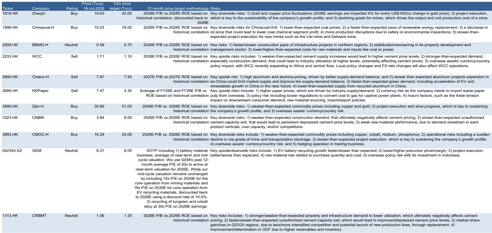
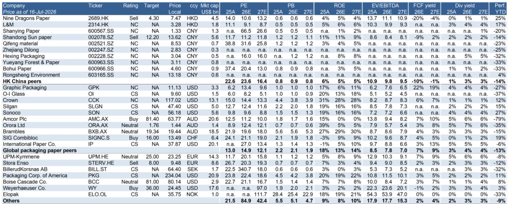
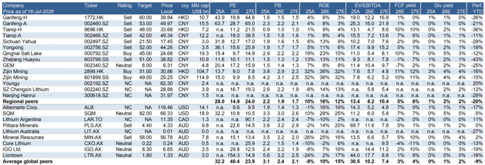

# GS：中国基础材料监测-需求端边际变化观察

7月中旬的渠道调研传递出一个信号：中国基础材料下游订单在经历数月稳定后，出现季节性之外的调整。GS最新一期中国基础材料监测报告显示，27%的受访企业反馈下游行业订单环比改善，27%反馈大宗商品订单环比改善——这个比例在6月还更高。值得关注的是，产成品库存正在被动累积：24%的生产商报告库存高于正常水平，而6月这一比例仅为9%。电池、机械、家电和部分金属加工品是库存上升的主要领域。

这份报告覆盖水泥、钢铁、铜、铝、锂、煤炭和纸包装等多个品种，核心观察是：内需表现平稳，出口缺乏新增动力，季节性因素叠加之下，7月需求端边际变化与前几个月有所不同。这不是剧烈波动，而是一轮“增量减弱”的过程——对依赖量价齐升逻辑的周期品而言，这比短期波动更值得关注。

> **KC评论：** GS这份监测的价值不在于预测拐点，而在于用一手渠道数据刻画了“需求边际变化”这个状态。对于跟踪周期品的读者，库存被动累积和订单改善比例下降这两个指标，比单月价格波动更能反映供需关系的边际变化。

## 1. 建筑、汽车和金属加工是7月减速的主要影响

GS将需求变化归因于三个终端领域的变化。建筑用钢和水泥的同比需求在7月上半月下降4%-10%，这与房地产新开工情况、基建项目资金到位节奏有关。汽车和金属加工领域的订单也出现环比变化，前者受到新能源车补贴退坡后的观望情绪影响，后者则与出口订单的边际降温同步。

报告特别指出，出口端“缺乏新增强度”——此前支撑部分品种需求的海外订单，在7月没有进一步改善。这意味着，过去几个月靠出口弥补内需缺口的逻辑，正在变得不再可靠。

## 2. 供给端开始自发调整，但政策驱动的供给调整尚未落地

利润持续变化之下，部分生产企业已经开始主动调整产量。GS观察到，钢厂和小型水泥企业已经启动减产，这是市场化的供给响应。但政策层面的供给调整——例如行业基准能效标准要求的执行——目前尚未转化为实质性的产能调整。煤炭生产的安全监管依然严格，且预计在未来几个月持续，但这更多是维持现有约束而非新增收紧。

一个值得注意的例外是电解铝。中国原铝产量在6月继续攀升，这与铝价相对稳定、部分新增产能投产有关。但报告也提示，铝的出口动能正在减速，而产量仍在增加，供需平衡正在向宽松方向移动。

## 3. 不同品种的分化：铜需求变化，锂缺口仍在但供给加速

铜的下游需求在7月出现更明显的变化信号，这与电力研究和家电出口的边际变化有关。铝的出口动能减速叠加产量上升，价格和利润空间面临调整。锂方面，报告认为当前市场仍处于供需缺口状态，但供给加速正在路上——这意味着缺口收窄只是时间问题。

钢铁和水泥是需求不确定性最直接的品种。水泥价格和利润虽然短期稳定，但报告指出，供给端政策调整“有限”，这意味着价格支撑更多来自企业自发调整而非结构性改善。煤炭价格在7月出现回调，与需求变化和库存累积一致。

> **KC评论：** GS这份报告提供了一个观察框架：把需求拆成“内需+出口”，把供给拆成“市场化调整+政策驱动调整”。当前阶段，市场化调整已经开始，但政策驱动尚未落地。对于判断各品种的价格区间和持续时间，这两个变量的组合比单一价格数据更有参考价值。

## 4. 一个可复用的观察框架：关注“库存被动累积”的扩散范围

GS调研中一个容易被忽略的细节是：库存高于正常水平的企业比例从6月的9%跳升至7月的24%，主要集中在电池、机械、家电和部分金属加工领域。这不是全行业的普遍现象，而是特定环节的库存不确定性在积累。如果这一比例在未来两个月继续上升，或者扩散到更多品种，将意味着需求变化已经从终端传导至中游加工环节，届时供给端的调整不确定性会更大。

反过来，如果库存比例在8-9月季节性旺季中回落，则说明当前变化更多是节奏问题而非趋势问题。这个指标比单月价格波动更适合作为领先信号。

For informational purposes only. Portions may be generated,translated,summarized,or edited with AI assistance based on source materials and may contain omissions or errors. Please verify independently. This is not investment,legal,tax,accounting,or other professional advice.

For informational purposes only. Portions may be generated,translated,summarized,or edited with AI assistance based on source materials and may contain omissions or errors. Please verify independently. This is not investment,legal,tax,accounting,or other professional advice.

