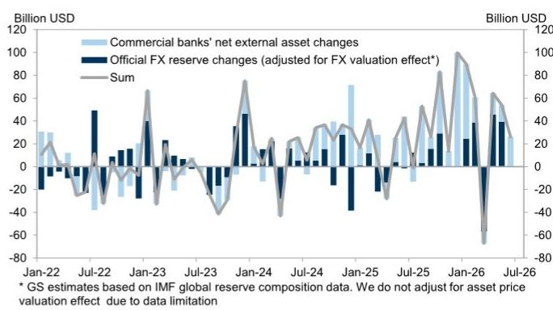
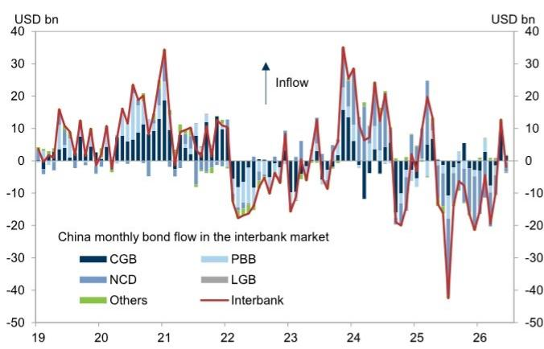
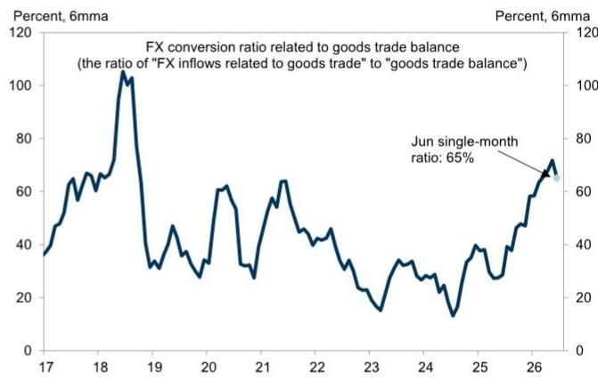

# 中国外汇流动数据揭示结构性变化：贸易顺差转化驱动资金流入，而非组合投资信心

根据国家外汇管理局数据，6月份中国录得净外汇流入340亿美元。这一数字低于5月份的500亿美元，但资金流入的构成揭示了比总体下降更具意义的模式。经常项目渠道贡献了650亿美元流入，较上月的370亿美元大幅上升，而组合投资渠道则从温和流入转为40亿美元净流出。6月份中国对外头寸的故事并非整体压力减弱，而是哪些渠道在生成和吸收美元流动性方面发生了根本性转变。

对于关注中国国际收支动态的研究者而言，关键张力在于：货物贸易相关流入正在增强，但资本项目流动变得更加波动。货物贸易顺差的外汇兑换比率在6月份升至65%，高于5月份的51%和第二季度58%的平均水平。这意味着出口商将更大比例的外汇收入转换为人民币，这种行为通常表明对本币的信心或对人民币流动性的需求。与此同时，境外读者通过北向债券通卖出人民币债券，6月份净流出20亿美元，而5月份为净流入130亿美元。组合投资的更广泛净外部收入指标显示流出360亿美元，与5月份180亿美元的流入形成鲜明对比。

这两种力量——贸易顺差美元兑换率上升和组合投资流出增加——正朝着相反方向拉动。理解哪种动态将主导，对于人民币的走势、中国储备头寸的韧性以及境内资产的更广泛风险偏好具有重要意义。

## 货物贸易渠道增强，出口商增加美元兑换

6月份报告中最重要的数据点是货物贸易外汇兑换比率的跃升。65%的水平不仅是一个月度峰值；它高于第二季度平均水平，并标志着从5月份开始的明显加速。基础货物贸易相关净流入升至810亿美元，高于5月份的530亿美元。贸易顺差流入的扩张是显著的，这表明中国的出口引擎正在产生比经济所需用于进口或服务贸易逆差更多的美元收入。

战略含义是直接的。当出口商选择将更高比例的美元收入兑换为人民币时，他们实际上是在边际上为本币投票。这种行为减少了私人部门美元资产的积累，并增加了银行体系可用的外汇供应。对于政策制定者而言，这是一个有利的发展：它无需直接干预即可缓解人民币压力，并为资本项目流出提供了自然缓冲。

相比之下，服务贸易逆差保持稳定，流出110亿美元，而收入和转移账户显示温和流出50亿美元。这些并非变化的驱动因素。货物贸易渠道才是关键所在，而兑换比率告诉我们出口商越来越愿意将美元带入境内。

## 组合投资流动恶化，受存单销售和更广泛风险规避驱动

组合投资渠道讲述了一个不同的故事。北向债券通流量在6月份转为负值，净流出20亿美元。报告将此主要归因于可转让存单的销售，这是境外读者在前几个月积累的短期工具。逆转是剧烈的：5月份曾录得130亿美元流入。组合投资的更广泛净外部收入指标，涵盖外汇和人民币计价的流量，显示流出360亿美元，而5月份为流入180亿美元。

贸易和组合渠道之间的这种分歧是中国外部账户的核心张力。贸易顺差正在产生充足的美元流动性，但这种流动性并未通过组合投资流入完全保留在境内金融体系中。相反，境外读者正在减少对境内债券的敞口，尤其是较短期限的工具。存单的销售表明回报表现预期的转变或对信用风险的重新评估，而非对中国政府债券的广泛撤退。

对于研究者而言，这意味着中国的资本项目仍然容易受到全球风险偏好变化和相对回报表现差异的影响。贸易渠道可以吸收部分由此产生的压力，但无法完全抵消持续的组合投资流出周期。如果境外读者继续减少持有，即使贸易顺差保持强劲，人民币也将面临阶段性贬值压力。

## 官方储备在估值调整后保持稳定，但银行正在吸收流入

官方外汇储备从5月份的34,420亿美元降至6月份的34,160亿美元。这一总体下降可能看起来令人担忧，但报告的分析显示，估值效应——主要是非美元储备资产美元价值的变化——估计造成了260亿美元的减少。在调整这些估值效应后，储备大致保持不变。

这种稳定性值得注意，因为它意味着中国人民银行在6月份无需大力干预来管理人民币。贸易渠道的强劲流入和出口商的兑换行为提供了足够的美元供应，使货币保持稳定而不消耗储备。央行的储备头寸仍然是一个可信的缓冲，而非担忧的来源。

与此同时，商业银行的净外部资产增加了260亿美元，高于5月份的150亿美元。未偿存量现在达到15,320亿美元。这是一个关键细节。当银行增加其净外部资产时，它们正在积累对非居民的要求权——本质上，它们在境外或以外币计价工具持有更多美元。这代表了一种资本流出形式，但这是私人部门的决定，而非政策驱动的决定。

官方储备稳定与银行外部资产上升的并置表明，银行体系正在充当减震器。私人部门正在中介美元流入和流出，而非迫使央行干预。这是一个外汇市场正常运作的标志，但也意味着调整的负担落在商业银行的资产负债表上。如果这些银行面临流动性约束或监管压力，动态可能会发生变化。

## 解读中国外汇流动数据的分析框架

对于关注中国对外头寸的研究者和企业财务人员而言，6月份的数据提供了一个评估风险的清晰框架。该框架包含三个层面：贸易渠道、组合投资渠道和银行体系的中介能力。

首先，监测货物贸易的外汇兑换比率。持续高于60%的水平表明出口商愿意将美元兑换为人民币，这支持本币并减少官方干预的需要。回落至50%附近将表明出口商情绪转变，可能由人民币贬值预期或对营运资金美元流动性的需求驱动。

其次，跟踪北向债券通流量和组合投资的更广泛净外部收入指标。6月份数据显示明显恶化，但问题在于这是5月份强劲流入后的一个月度修正，还是持续趋势的开始。如果组合投资流出持续，贸易渠道的流入将越来越多地被抵消，无论贸易顺差如何，人民币都将面临下行压力。

第三，关注商业银行净外部资产的增长。如果这些资产继续以每月200-300亿美元的速度增长，这表明银行体系正在吸收美元流入并将其部署到境外。这对货币短期而言是一个发展，但意味着私人部门正在建立更大的离岸美元头寸，如果条件变化，这些头寸可能迅速回流。银行外部资产积累的突然逆转将表明风险偏好的转变。

这三个因素的相互作用决定了中国对外头寸是增强还是减弱。6月份，贸易渠道强劲，组合投资渠道疲弱，银行体系吸收了差额。净结果是储备稳定和总体温和流入。风险情景是组合投资渠道继续恶化，同时贸易兑换比率下降，迫使银行体系或央行更积极地介入。

## 对人民币和资本流动政策的二阶影响

6月份的数据也指向中国政策制定者面临的一个更广泛的战略问题。经常项目顺差在结构上是庞大的，但资本项目正变得更加波动。如果组合投资流出持续，当局面临一个选择：允许人民币贬值以反映资本项目压力，或收紧资本管制以将顺差保留在境内体系内。

允许贬值的优势在于，通过使出口更便宜来进一步提振贸易顺差，可能产生更大的美元流入。风险在于贬值预期成为自我实现的预言，引发更广泛的资本外逃，压倒贸易渠道的支持。收紧管制的优势在于维持当前汇率水平，并保持境内资产对长期读者的吸引力。风险在于管制被视为疲弱的信号，加速了它们旨在阻止的流出。

6月份的数据表明，目前政策制定者正依赖银行体系来中介流动，而无需采取戏剧性的政策行动。官方储备的稳定和银行外部资产的增加表明了一种不干预的做法。但如果组合投资流出加速，这一立场将更难维持。研究者应关注北向债券通规则的任何变化、人民币每日定盘机制的调整，或官方关于资本流动沟通基调的转变。

6月份数据传递的基本信息是，中国的对外头寸并非处于危机之中，而是处于转型期。贸易顺差仍然是一个强大的锚点，但资本项目正成为周期性拖累的来源。这两种力量之间的平衡将决定下半年人民币的路径和中国储备头寸的韧性。

*仅供参考。部分内容可能基于源材料通过AI辅助生成、翻译、总结或编辑，可能包含遗漏或错误。请独立核实。这不构成专业建议。*

仅供参考。部分内容可能基于源材料通过AI辅助生成、翻译、总结或编辑，可能包含遗漏或错误。请独立核实。这不构成专业建议。

