# 全球外汇市场观察

## 冷静、稳定与积累

我们对美元、英镑、韩元、匈牙利福林、瑞士法郎、加元、泰铢、澳元/新西兰元及前沿市场货币的看法

**美元：冷静、稳定，持续积累利差收益。** 美国通胀数据低于预期，限制了原本可能引发更大政策分化及外汇现货市场剧烈波动的尾部风险。在此背景下，利差考量再次成为回报和读者偏好的主要驱动因素，即便在G10货币内部也是如此（图表1）。在一个以低波动性和利率水平高度离散为特征的市场中，这一现象合乎逻辑，我们预计这种情况将持续。然而，当大宗商品和股票市场的担忧情绪上升时，这一现象显得尤为突出。我们此前认为，市场波动性的来源正日益从宏观驱动因素转向更微观的层面，目前来看这一判断是正确的。如果这些微观因素演变为宏观驱动因素，可能会打断外汇市场中有利于利差交易的环境。但我们认为，出现这种情况的门槛较高，因为即使在受影响最严重的资产类别中，波动性在行业层面之外仍然较低；区域分化程度较以往科技动荡时期更为有限；且利率水平的离散程度为货币提供了宽裕的缓冲。我们认为，这要求更审慎地选择融资货币——我们偏好的顺序大致为：瑞士法郎、欧元、以色列谢克尔、日元、加元和泰铢——并尊重美元相对高收益的地位。我们仍认为未来政策路径存在进一步分化的风险，因此将美元作为跨资产对冲工具具有价值，但在我们的基准情景中，预计这将是一个渐进的过程。

Kamakshya Trivedi
+44(20)7051-4005 |
kamakshya.trivedi@gs.com
GS International

Michael Cahill  
+44(20)7552-8314 |  
michael.e.cahill@gs.com  
GS International

Danny Suwanapruti
+65-6889-1987 |
danny.suwanapruti@gs.com
GS (Singapore) Pte

Teresa Alves  
+44(20)7051-7566 | teresa.alves@gs.com GS International

Karen Reichgott Fishman  
+1(212)855-6006 |  
karen.fishman@gs.com  
GS & Co. LLC

Stuart Jenkins
+44(20)7051-4700 |
stuart.jenkins@gs.com
GS International

Victor Engel  
+44(20)7051-3862 | victor.engel@gs.com GS International

Lexi Kanter
+1(212)855-9701 |
alexandra.kanter@gs.com
GS & Co. LLC

**图表1：年初至今，利差回报解释了主要美元货币对总回报的很大一部分**
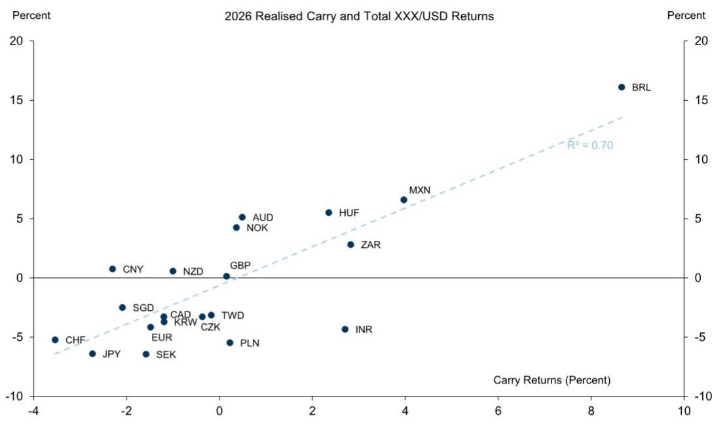  
按年份计算，主要美元货币对总回报对利差回报的R²。利差使用2026年初的6个月远期年化数据估算。  
来源：GS全球投资研究，GS FICC及股票部门

**英镑：强势难以为继，战术性做空英镑/美元。** 英镑在7月份的显著强势表现本周仍在延续，这超出了我们对进一步上涨空间有限的预期。我们注意到一系列新兴的中期利好因素——包括有利的全球周期性背景、欧元/英镑的利差交易需求、可观的并购资金流入，以及加强与欧盟关系的可能性。但英镑7月涨势的速度和时机，在我们看来，更多是反映了市场对伯纳姆政府日益增长的乐观情绪（包括周三英镑走势与人事报道的巧合），以及欧元/英镑突破区间后引发的技术性因素和仓位调整。从基本面模型来看，英镑的走势与其GSBEER模型隐含的表现完全不符，后者主要反映的是欧盟-英国前端利率差已收窄至年初至今最窄水平附近（图表2）。我们在过去一年中注意到，英镑跑输周期性基本面的溢价行情通常会迅速逆转，我们认为同样的逻辑在此处反向适用。在政策仍存在诸多不确定性、财政方面存在根本性约束，以及该货币面临更持久的宏观和估值挑战的背景下，我们对英镑涨势的速度持怀疑态度。我们对近邻货币对的历史分析表明，回归GSBEER隐含水平的“最清晰”路径体现在欧元/英镑上，但我们当前看多美元的倾向、能源问题再度升级的风险，以及在此背景下利差考量的重要性，使我们相信英镑/美元目前是更高质量的表达方式。因此，我们建议做空英镑/美元，目标位1.3250，止损位1.3600，以期出现短期回调。

**图表2：欧元/英镑近期的走势与周期性基本面不符……**
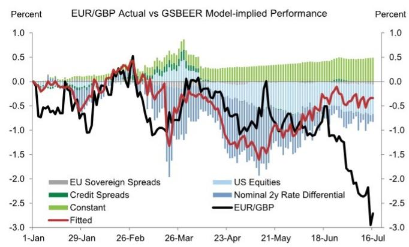  
来源：GS全球投资研究

**图表3：……这种背离在近期英镑/美元的价格走势中也部分显现**
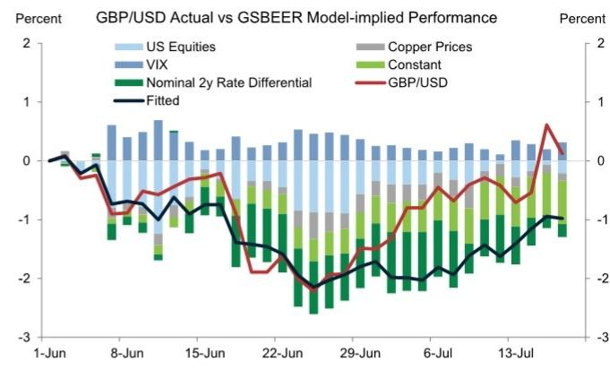  
来源：GS全球投资研究

**韩元：迎来喘息。** 韩元终于在7月份迎来喘息，本月至今已升值。此轮升值恰逢利率上调、对杠杆投资的新限制以及本地股指的回落。股市回落可能阻止了集中持仓的被迫抛售，并且部分与一笔大规模的海外ADR上市有关，这至少在短期内可能催化了部分资金流入。更广泛地看，回顾今年早些时候（截至6月22日KOSPI指数见顶）韩元在“股市下跌”事件中的表现，相关性大多为轻微正相关（即两种资产同时下跌），尽管韩元在更极端的抛售中确实升值，且大部分时间处于相对区间波动（图表4）。在年初至今KOSPI表现最好的日子里也是如此，当时韩元通常并未从强劲的股市表现中受益（图表5）。近期，这种相关性已明显转为负相关，即韩元在本地股市下跌时升值。然而，这种相关性高度依赖于资金流入和流出的方向及来源，并可能再次转变，正如先前相对表现所显示的混合信号。此外，韩元7月份的升值仅逆转了5月和6月的贬值。韩元在大多数估值指标上仍然偏弱。尽管过去几年人工智能驱动的出口繁荣对韩国出口、财政收入和增长非常有利，但伴随而来的是货币走弱，这反映了韩国散户和机构读者大量未对冲的海外投资，以及外国买家对韩国股票的外汇对冲和再平衡资金流。虽然我们的股票策略师预计本地股市将回升，但若没有读者配置或对冲行为的转变，这不太可能伴随韩元的持续走强。

**图表4：在截至6月中旬的大部分KOSPI最差交易日中，韩元下跌，但在更极端的抛售中确实升值……**
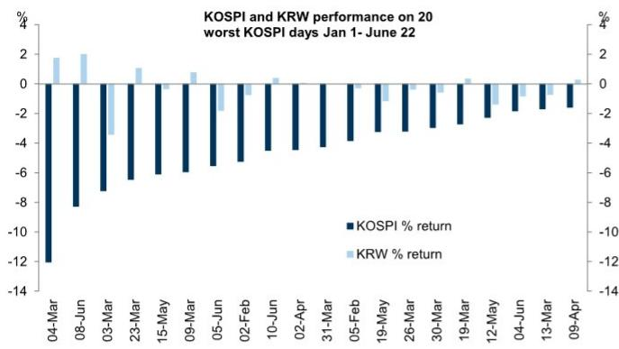  
来源：彭博，GS全球投资研究

**图表5：……但在大多数这些事件中，韩元相对处于区间波动，包括在年初至今KOSPI表现最好的日子里。**
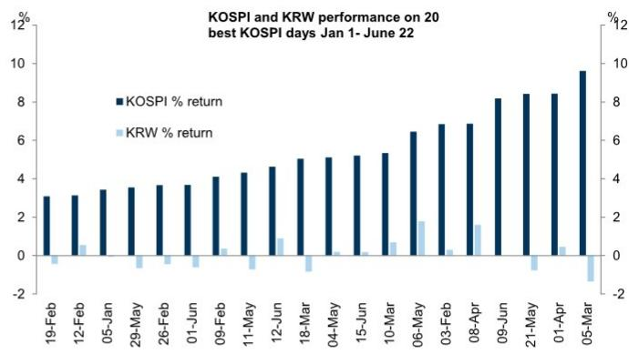  
来源：彭博，GS全球投资研究

**匈牙利福林：战术性逆风 vs 基本面顺风。** 尽管上周匈牙利福林的抛售相对迅速地逆转，但本周福林再次面临压力。我们继续将价格走势归因于在本地积极发展有限、但全球因素日益不利（能源价格上涨，特别是天然气价格，以及风险情绪减弱）的背景下，大量的多头仓位，这使得福林成为新兴市场中贝塔值最高的货币对之一。我们认为，对冬季能源价格和供应的担忧日益加剧——卡塔尔天然气供应持续低位，以及美国正在讨论对俄罗斯石油进口商征收新关税——可能在短期内继续给福林带来压力。诚然，我们认为福林向我们的6个月预测值350升值的基本面理由依然强劲，但新的本地催化剂可能要到今年晚些时候才会出现，届时将公布更低的通胀目标（我们的经济学家预计在2026年底），并且RRF资金开始流入（付款请求截止日期为9月底）。此外，在能源价格方面，我们认为欧盟资金流入可以抵消当前石油和天然气价格所暗示的能源平衡恶化。短期内，即将召开的MNB会议是下一个关键的本地事件，此前行长瓦尔加发表了关于维持7月和8月降息指引的评论，并指出福林在355-360区间的稳定有助于经济。这是自大选以来福林在会议间隔期内走弱的第一次会议，但鉴于持续的通胀回落势头，我们的经济学家仍预计将降息25个基点。我们认为，MNB在降息的同时，其措辞谨慎的程度，将是衡量政策制定者如何看待自大选以来更广泛的风险溢价降低中利率与汇率之间权衡的重要信号。我们仍然认为，随着欧盟趋同进程的推进，汇率和利率可以共同回升，但在短期内，更强的货币路径可能需要利率在日益恶化的全球背景下承担更多压力。

**瑞士法郎：融资货币的关注焦点。** 上周，我们讨论了G10外汇市场当前提供的异常高的利差波动比，而在许多方面，瑞士法郎融资是其中最引人注目的机会。瑞士低且稳定的通胀支持了瑞士央行坚定按兵不动，这既有助于保持瑞士法郎货币对中由利率差驱动的波动性处于低位，也使其政策利率与G10其他经济体保持了异常大的差距。这种组合支撑了美元/瑞士法郎和欧元/瑞士法郎中有利的利差波动比水平——两者均接近数十年高位（图表6）。瑞士法郎与黄金的贸易条件联系也为这些货币对的利差交易增添了额外看点。近期黄金风险对冲属性的减弱已蔓延至瑞士法郎，这在一定程度上解释了今年欧元/瑞士法郎和美元/瑞士法郎对风险贝塔值的降低（图表7）。特别是美元/瑞士法郎，对于一个在此环境下充当明确风险对冲工具的货币对而言，提供了异常高的利差水平，我们认为这使其在能源冲击风险依然存在的环境中，成为一个有吸引力的投资组合对冲工具。同时，瑞士法郎与黄金的联系也是我们认为融资策略面临的最明显风险。黄金价格近几周已从1月份的高点大幅回落并企稳，但如果恢复强劲的升值趋势（正如我们的商品策略师最终预期的那样），可能会为瑞士法郎提供支撑，并对融资策略构成挑战。我们继续认为，瑞士央行重新转向中性干预立场是瑞士法郎可能表现优异的另一条路径，不过，在瑞士央行6月份进行微调后，这一过程在我们看来将更为渐进。我们认为，在三个月的时间框架内，瑞士法郎融资具有良好价值，因为届时这些关键风险似乎更为遥远，其在G10货币对中提供的利差高于更典型的日元选择。

**图表6：美元/瑞士法郎和欧元/瑞士法郎的利差波动比均接近数十年高位**
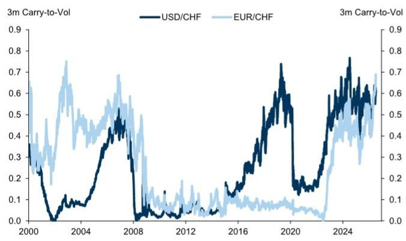  
来源：GS全球投资研究，GS FICC及股票部门

**图表7：近期黄金风险对冲属性的减弱已蔓延至瑞士法郎，这在一定程度上解释了今年欧元/瑞士法郎和美元/瑞士法郎对风险贝塔值的降低**
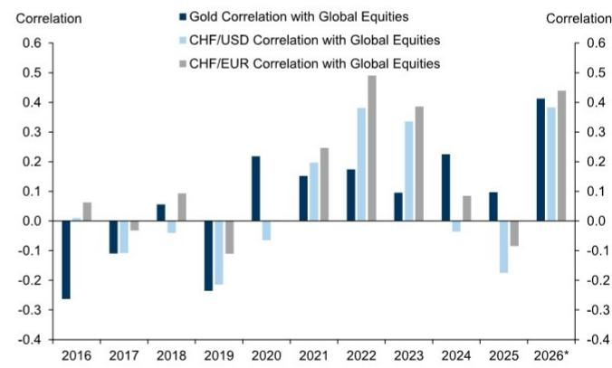  
来源：GS全球投资研究，GS FICC及股票部门

**加元：高位但区间宽阔。** 今年大部分时间里，我们一直在强调加元作为融资货币的吸引力，包括其降低风险敞口和相对于美元融资改善利差的能力。这些属性依然存在，我们预计持续的贸易谈判将通过广泛的美元-加元利率差对加元构成压力——加拿大央行7月会议的开场声明再次强调，加拿大与美国的关系以及中东冲突仍是前景面临的两大风险。不过，措辞有所缓和，指出企业正在“寻找应对不确定性的方法”。更广泛地说，加拿大央行7月会议是平衡的，声明恢复了战前的指引，指出当前政策利率是“适当的”，这与我们经济学家的预期一致。加拿大央行坚定按兵不动应能使加元继续成为有效的融资货币，尽管我们一直认为，加元从此处出现更急剧的现货贬值似乎不太有吸引力。美元/加元近几周继续与利率差紧密挂钩（图表8），一方面，加元似乎不太可能通过更鹰派的加拿大央行获得支撑；另一方面，美国6月CPI数据低于预期，应会限制美联储近期更鹰派重新定价的程度，从而减少美元/加元进一步上行的空间。

**图表8：美元/加元近几周继续与利率差紧密挂钩**
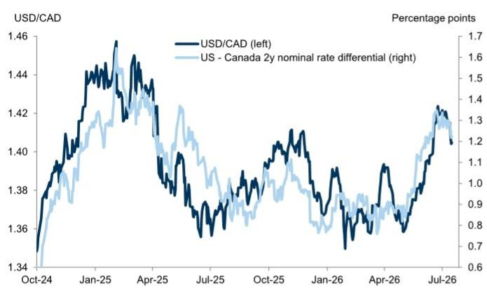  
来源：GS FICC及股票部门，GS全球投资研究

**图表9：美国6月CPI数据低于预期，应会限制美联储近期更鹰派重新定价的程度，从而减少美元/加元进一步上行的空间**
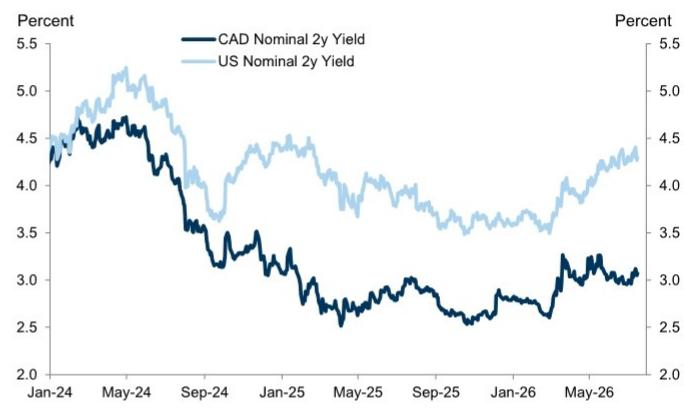  
来源：GS FICC及股票部门，GS全球投资研究

**泰铢：受黄金和利率影响走低。** 泰铢已从2025年表现最佳的亚洲货币之一（仅次于马来西亚林吉特）转变为今年表现最差的低收益亚洲货币。尽管泰国央行近期将2026年GDP预测上调至同比增长2.3%（此前为1.5%），其中0.6个百分点的增长提振归因于4000亿泰铢的紧急法令，0.2个百分点归因于第一季度和第二季度增长追踪数据改善，但泰铢仍表现不佳。此外，在今年2月令人信服的选举结果之后，政治环境似乎更加稳定。除了能源冲击，我们将泰铢的疲软归因于三个因素。首先，6月底出现了大规模股票资金外流，新加坡电信出售了其在泰国海湾能源公司2.3%的股份，价值10亿美元。其次，全球黄金价格已从年初略低于5000美元/盎司的水平跌至约4000美元/盎司。正如我们之前所讨论的，鉴于泰国作为大型黄金交易中心的角色，黄金价格与泰铢之间存在正相关关系。泰国央行在2月底宣布了几项措施，试图打破这种相关性，但效果可能只会逐渐显现并消退。最后，我们注意到实际利率差已显著转向有利于美元/泰铢走强。泰国央行已将政策利率下调至1.0%，而通胀数据一直在上升（6月同比2.4%），使实际利率处于负值区域。与此同时，美国实际利率已上升。展望未来，尽管石油和黄金价格的变动将继续影响泰国的贸易条件和旅游前景，但我们预计泰铢将因其较低的实际利率而继续表现不佳，并认为它是做多区域内较高收益货币的良好融资货币，我们继续建议做空泰铢/印度卢比。

**澳元/新西兰元：趋势转变。** 几个月前，我们指出，如果相对政策背景发生变化、国内数据出现分化或贸易条件背景变得不那么有利，澳元/新西兰元存在回调空间。新公布的国内数据越来越多地满足了这些条件，我们近期建议买入澳元/新西兰元6个月期1.1650看跌期权。尽管过去一周的事态发展表明，能源价格压力再度上升仍是一个风险，但澳元/新西兰元近期对大宗商品价格上涨的反应已不那么一致，而对利率差的反应则更为一致，后者正朝着有利于新西兰元的方向变动。鉴于我们的经济学家指出，新西兰联储近期加息的风险以及澳洲联储加息次数低于他们预测的风险，这使我们对澳元/新西兰元的下行前景更有信心，尽管能源风险依然存在。新西兰元也容易受到“鹰派政策冲击”背景的影响，即股市随回报表现上升而下跌，因此6月FOMC会议为新西兰元的任何优异表现引入了新的潜在阻力。然而，本周美国6月CPI数据低于预期，使得在7月FOMC会议之前，推动市场定价显著转向更鹰派的催化剂有限。最后，虽然我们发现澳元对中国经济增长的敞口更大，但我们的经济学家继续认为，鉴于出口具有韧性且全年增长目标仍可实现，近期推出大规模、广泛刺激措施的紧迫性不大。综合来看，尽管风险依然存在，但我们列出的条件已基本实现，我们认为澳元/新西兰元存在进一步回调的空间。

**前沿市场货币：穿越短期波动。** 中东局势再度升级为前沿市场注入了短期波动，尤其是打断了我们偏好的埃及镑的近期走强趋势。尽管我们仍预计该货币中期内将对美元逐步升值，但在逐步上调目标后，我们已扩大了做空美元/埃及镑交易建议的止损范围。这将为积累利差回报留出更多空间，尽管近期因本地债券市场中外资持仓仍处高位（图表10）而出现的资金外流导致了现货波动。这与我们的观点一致，即高水平的利差，尤其是在本地债务工具中，可以在“缓解”情景（如6月中旬美伊和平协议宣布后）中放大现货回报，但更重要的是，在现货回报更为有限的“勉强维持”情景中，也可以缓冲总回报，正如近期因地缘政治不确定性持续而出现的情况。更广泛地说，我们仍然认为，受控的宏观波动应有利于在新兴市场货币中积累利差回报，保持对精选的高利差前沿市场货币的敞口是有意义的，包括做多土耳其里拉、尼日利亚奈拉和哈萨克斯坦坚戈兑美元（图表11）。除了土耳其里拉在持续管理贬值下仍提供的高利差水平外，我们认为尼日利亚和哈萨克斯坦的风险偏向于现货升值。

**图表10：尽管近期本地债券市场出现资金外流并伴随现货损失，但以一个月滚动总和计算，外资持仓仍高于战前高点**
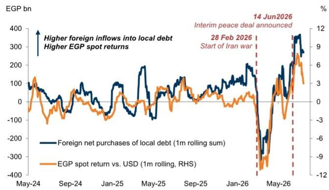  
本地债券包括债券和票据。  
来源：彭博，Haver Analytics，GS全球投资研究

**图表11：许多前沿市场货币，如土耳其里拉、埃及镑、尼日利亚奈拉和哈萨克斯坦坚戈，提供的利差水平显著高于其新兴市场高收益同类货币**
12个月名义外汇利差（%）
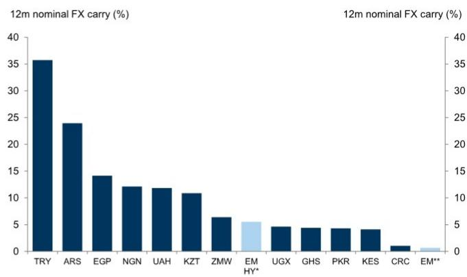  
对于前沿市场货币（土耳其里拉和乌干达先令除外），利差使用12个月NDF计算。\*巴西雷亚尔、哥伦比亚比索、墨西哥比索和南非兰特的中位利差。\*\*巴西雷亚尔、智利比索、离岸人民币、哥伦比亚比索、捷克克朗、港元、匈牙利福林、印尼盾、以色列谢克尔、印度卢比、韩元、墨西哥比索、马来西亚林吉特、秘鲁索尔、菲律宾比索、波兰兹罗提、罗马尼亚列伊、新加坡元、泰铢、土耳其里拉、新台币和南非兰特的中位利差。  
来源：彭博，GS全球投资研究

**全球外汇预测**

<table><tr><td rowspan="2"></td><td rowspan="2">当前即期</td><td colspan="2">3个月展望</td><td colspan="2">6个月展望</td><td colspan="2">12个月展望</td></tr><tr><td>远期</td><td>预测</td><td>远期</td><td>预测</td><td>远期</td><td>预测</td></tr><tr><td colspan="8">G10</td></tr><tr><td>欧元/$</td><td>1.14</td><td>1.15</td><td>1.14</td><td>1.15</td><td>1.12</td><td>1.16</td><td>1.12</td></tr><tr><td>英镑/$</td><td>1.35</td><td>1.35</td><td>1.33</td><td>1.35</td><td>1.29</td><td>1.35</td><td>1.28</td></tr><tr><td>澳元/$</td><td>0.70</td><td>0.70</td><td>0.72</td><td>0.70</td><td>0.73</td><td>0.70</td><td>0.74</td></tr><tr><td>新西兰元/$</td><td>0.58</td><td>0.59</td><td>0.60</td><td>0.59</td><td>0.61</td><td>0.59</td><td>0.62</td></tr><tr><td>$/加元</td><td>1.40</td><td>1.40</td><td>1.40</td><td>1.39</td><td>1.38</td><td>1.38</td><td>1.38</td></tr><tr><td>$/瑞士法郎</td><td>0.81</td><td>0.80</td><td>0.80</td><td>0.79</td><td>0.80</td><td>0.78</td><td>0.79</td></tr><tr><td>$/挪威克朗</td><td>9.68</td><td>9.69</td><td>9.56</td><td>9.70</td><td>9.55</td><td>9.73</td><td>9.38</td></tr><tr><td>$/瑞典克朗</td><td>9.64</td><td>9.60</td><td>9.65</td><td>9.55</td><td>9.64</td><td>9.47</td><td>9.38</td></tr><tr><td>$/日元</td><td>162</td><td>161</td><td>162</td><td>160</td><td>163</td><td>158</td><td>165</td></tr><tr><td colspan="8">欧洲、中东和非洲</td></tr><tr><td>$/捷克克朗</td><td>21.2</td><td>21.1</td><td>21.5</td><td>21.1</td><td>21.8</td><td>21.1</td><td>21.6</td></tr><tr><td>$/匈牙利福林</td><td>316</td><td>318</td><td>311</td><td>318</td><td>313</td><td>319</td><td>308</td></tr><tr><td>$/波兰兹罗提</td><td>3.78</td><td>3.78</td><td>3.77</td><td>3.78</td><td>3.79</td><td>3.78</td><td>3.79</td></tr><tr><td>$/罗马尼亚列伊</td><td>4.58</td><td>4.60</td><td>4.52</td><td>4.62</td><td>4.63</td><td>4.67</td><td>4.69</td></tr><tr><td>$/俄罗斯卢布</td><td>80.50</td><td>80.50</td><td>80.0</td><td>82.91</td><td>85.0</td><td>87.60</td><td>90.0</td></tr><tr><td>$/乌克兰格里夫纳</td><td>44.6</td><td>45.8</td><td>46.0</td><td>47.0</td><td>48.0</td><td>49.9</td><td>52.0</td></tr><tr><td>$/土耳其里拉</td><td>47.09</td><td>50.70</td><td>48.0</td><td>55.08</td><td>50.0</td><td>64.02</td><td>54.0</td></tr><tr><td>$/以色列谢克尔</td><td>3.02</td><td>3.01</td><td>3.00</td><td>3.00</td><td>3.05</td><td>2.98</td><td>3.10</td></tr><tr><td>$/埃及镑</td><td>50.5</td><td>53.0</td><td>49.0</td><td>54.8</td><td>48.0</td><td>58.5</td><td>46.0</td></tr><tr><td>$/南非兰特</td><td>16.40</td><td>16.53</td><td>16.50</td><td>16.65</td><td>16.00</td><td>16.88</td><td>15.75</td></tr><tr><td>$/尼日利亚奈拉</td><td>1381</td><td>1425</td><td>1325</td><td>1465</td><td>1300</td><td>1547</td><td>1250</td></tr><tr><td colspan="8">美洲</td></tr><tr><td>$/阿根廷比索</td><td>1476</td><td>1550</td><td>1500</td><td>1642</td><td>1600</td><td>1826</td><td>1800</td></tr><tr><td>$/巴西雷亚尔</td><td>5.10</td><td>5.21</td><td>4.90</td><td>5.31</td><td>5.00</td><td>5.52</td><td>5.00</td></tr><tr><td>$/墨西哥比索</td><td>17.42</td><td>17.56</td><td>17.75</td><td>17.69</td><td>18.00</td><td>17.95</td><td>18.00</td></tr><tr><td>$/智利比索</td><td>926</td><td>925</td><td>920</td><td>924</td><td>900</td><td>923</td><td>860</td></tr><tr><td>$/秘鲁索尔</td><td>3.40</td><td>3.41</td><td>3.40</td><td>3.42</td><td>3.35</td><td>3.44</td><td>3.30</td></tr><tr><td>$/哥伦比亚比索</td><td>3230</td><td>3303</td><td>3350</td><td>3376</td><td>3300</td><td>3519</td><td>3200</td></tr><tr><td colspan="8">亚洲</td></tr><tr><td>$/人民币</td><td>6.77</td><td>6.73</td><td>6.80</td><td>6.69</td><td>6.70</td><td>6.60</td><td>6.50</td></tr><tr><td>$/港元</td><td>7.84</td><td>7.82</td><td>7.80</td><td>7.80</td><td>7.80</td><td>7.77</td><td>7.80</td></tr><tr><td>$/印度卢比</td><td>96.35</td><td>97.22</td><td>94.00</td><td>98.02</td><td>95.00</td><td>99.43</td><td>96.00</td></tr><tr><td>$/韩元</td><td>1481</td><td>1477</td><td>1460</td><td>1473</td><td>1440</td><td>1466</td><td>1420</td></tr><tr><td>$/马来西亚林吉特</td><td>4.07</td><td>4.06</td><td>3.90</td><td>4.05</td><td>3.80</td><td>4.03</td><td>3.70</td></tr><tr><td>$/新加坡元</td><td>1.29</td><td>1.28</td><td>1.28</td><td>1.27</td><td>1.25</td><td>1.26</td><td>1.24</td></tr><tr><td>$/新台币</td><td>32.3</td><td>32.3</td><td>31.5</td><td>32.4</td><td>31.0</td><td>32.5</td><td>30.5</td></tr><tr><td>$/泰铢</td><td>33.55</td><td>33.48</td><td>34.00</td><td>33.28</td><td>33.50</td><td>32.88</td><td>33.00</td></tr><tr><td>$/印尼盾</td><td>17985</td><td>18095</td><td>17000</td><td>18223</td><td>17100</td><td>18476</td><td>17200</td></tr><tr><td>$/菲律宾比索</td><td>61.63</td><td>61.76</td><td>62.00</td><td>61.92</td><td>61.00</td><td>62.24</td><td>61.00</td></tr><tr><td colspan="8">欧元交叉盘</td></tr><tr><td>欧元/英镑</td><td>0.85</td><td>0.85</td><td>0.86</td><td>0.86</td><td>0.87</td><td>0.86</td><td>0.88</td></tr><tr><td>欧元/瑞士法郎</td><td>0.93</td><td>0.92</td><td>0.91</td><td>0.91</td><td>0.90</td><td>0.90</td><td>0.88</td></tr><tr><td>欧元/挪威克朗</td><td>11.07</td><td>11.13</td><td>10.90</td><td>11.18</td><td>10.70</td><td>11.29</td><td>10.50</td></tr><tr><td>欧元/瑞典克朗</td><td>11.04</td><td>11.02</td><td>11.00</td><td>11.00</td><td>10.80</td><td>10.98</td><td>10.50</td></tr><tr><td>欧元/捷克克朗</td><td>24.21</td><td>24.29</td><td>24.50</td><td>24.33</td><td>24.40</td><td>24.46</td><td>24.20</td></tr><tr><td>欧元/匈牙利福林</td><td>362</td><td>365</td><td>355</td><td>367</td><td>350</td><td>370</td><td>345</td></tr><tr><td>欧元/波兰兹罗提</td><td>4.33</td><td>4.35</td><td>4.30</td><td>4.36</td><td>4.25</td><td>4.38</td><td>4.25</td></tr><tr><td>欧元/罗马尼亚列伊</td><td>5.24</td><td>5.29</td><td>5.15</td><td>5.33</td><td>5.18</td><td>5.42</td><td>5.25</td></tr><tr><td>欧元/俄罗斯卢布</td><td>92.1</td><td>92.4</td><td>91.2</td><td>95.6</td><td>95.2</td><td>101.6</td><td>100.8</td></tr></table>

注：即期价格为周三收盘价。
查看动态表格（或点击上方图片）：https://publishing.gs.com/content/themes/fx-forecasts.html
来源：GS全球投资研究

**回报预测与估值**

<table><tr><td rowspan="3"></td><td rowspan="3">当前即期</td><td rowspan="2" colspan="4">预测：12个月回报（%）</td><td colspan="3">GSDEER</td><td colspan="3">GSFEER</td><td rowspan="3">平均估计</td><td rowspan="3">购买力平价*</td></tr><tr><td rowspan="2">估计</td><td colspan="2">偏差</td><td rowspan="2">估计</td><td colspan="2">偏差</td></tr><tr><td>即期</td><td>利差</td><td>总计</td><td>NEER</td><td>双边</td><td>贸易加权</td><td>双边</td><td>贸易加权</td></tr><tr><td colspan="14">G10</td></tr><tr><td>欧元/$</td><td>1.14</td><td>-2.1</td><td>-1.4</td><td>-3.5</td><td>-1.9</td><td>1.19</td><td>-3%</td><td>8%</td><td>1.14</td><td>0%</td><td>0%</td><td>1.17</td><td>1.52</td></tr><tr><td>英镑/$</td><td>1.35</td><td>-5.0</td><td>0.1</td><td>-4.9</td><td>-4.3</td><td>1.19</td><td>13%</td><td>26%</td><td>1.24</td><td>8%</td><td>8%</td><td>1.21</td><td>1.50</td></tr><tr><td>澳元/$</td><td>0.70</td><td>5.8</td><td>0.6</td><td>6.4</td><td>3.5</td><td>0.79</td><td>-12%</td><td>10%</td><td>0.66</td><td>5%</td><td>11%</td><td>0.74</td><td>0.70</td></tr><tr><td>新西兰元/$</td><td>0.58</td><td>6.1</td><td>-0.8</td><td>5.3</td><td>3.7</td><td>0.66</td><td>-12%</td><td>4%</td><td>0.58</td><td>0%</td><td>1%</td><td>0.63</td><td>0.67</td></tr><tr><td>$/加元</td><td>1.40</td><td>1.8</td><
