# 全球利率市场观察

6月通胀数据有所缓和，为美国政策风险带来一定缓解。不过，美联储官员明确表示关注价格方面的目标，因此，在劳动力市场基线稳定的背景下，加息预期的持续消退需要更多通胀数据趋于平稳的积累。同时，考虑到周期性风险降低和持续的AI相关投入，长端回报表现的相对韧性是合理的，因此美国曲线面临的风险组合继续支持在5年期部位持有头寸。欧洲和英国短端的政策风险已被充分定价，尽管天然气价格的上行风险可能在短期内阻碍缓解。尽管如此，我们预计到2026年底，短端将出现缓解，曲线将趋于陡峭。通过GPIF和NISA将日本储蓄转向国内资产和日本国债，可能会使养老金和零售类别增加对日本国债的配置，但除了对长端利差提供适度支持外，我们认为宏观条件将决定日本国债回报表现，而非资金流向。

## 美国与加拿大

通胀数据带来喘息。稳定的劳动力市场使美联储官员坚定关注通胀方面的目标，近期的沟通显示，对进一步超标的容忍度正在下降。然而，就一个月而言，数据似乎带来了喘息，我们的经济学家预计，在当周的通胀报告之后，6月核心PCE月度数据为18个基点。不过，由于核心PCE同比仍明显高于3%，我们认为加息风险的持续消退依赖于更多良性通胀数据的积累。短期内，美联储会议前的静默期和较为稀疏的数据日历应会限制加息定价大幅压缩的空间；考虑到当周的压缩以及9月会议前的大量数据，我们认为短端支付/陡峭化头寸是对近期能源价格上行的合理对冲。我们预计长期回报表现在反弹中将继续滞后，周期性韧性与投资背景因素相结合，我们认为应会使长端回报表现保持相对韧性。尽管在油价推动的回报表现上行中，曲线中部表现相对落后，但我们维持对在5年期曲线部分持有头寸的偏好，因为通胀上行时2s5s有更大的平坦化空间，且长端远期在反弹中更具韧性。

■ 美国交易通胀信号混杂。本周交易通胀受到两股力量的影响，一方面是油价上涨，另一方面是鹰派的美联储讲话加上6月CPI报告温和。我们更新的宏观估值框架将长期通胀远期置于公允价值偏便宜的一侧。我们怀疑这反映了市场在6月会议后对美联储更为鹰派的看法——本周沃勒理事的评论也支持这一点——以及风险资产价格波动的加剧。尽管如此，1y1y和2y2y的交易价格略显昂贵，反映出对油价上涨的更高敏感性，而长期远期对此则更具免疫力（图表1）。尽管长期远期略偏便宜，但我们认为目前交易通胀并非一个具有吸引力的直接多头——我们经济学家的基线是未来12至18个月的通胀低于市场定价，任何通胀上行意外都可能遭遇实际利率上升，而美联储的措辞不会转向鸽派。

图表1：长期通胀远期相对于基本面略显便宜  
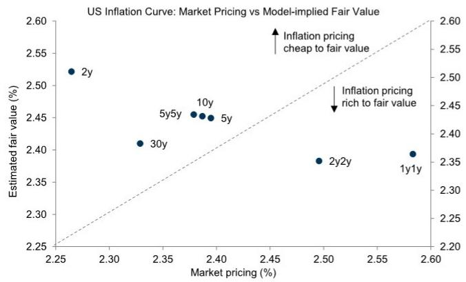  
来源：GS全球投资研究，GS FICC与股票  
图表2：长期信用债发行增加往往对应美国国债剥离活动减弱 美国国债以剥离形式持有的同比百分比变化 vs 彭博美国公司债20年以上未偿金额变化

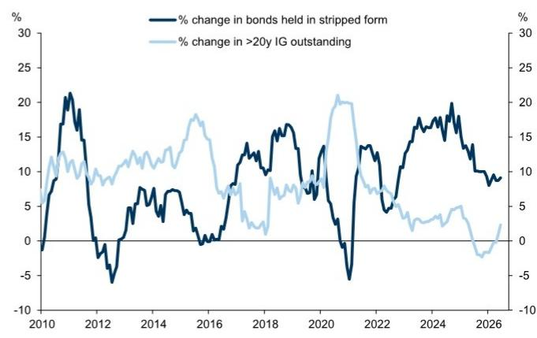  
来源：GS全球投资研究，彭博

美国国债需求半程检视——总体良性，但需关注局部。尽管今年迄今为止，某些类别的需求低于我们最初的预期，但我们仍认为前景总体良性，不过下半年吸收方面存在更明确的问题。我们的基线是2026年下半年净票据供应6840亿美元，净息票供应6050亿美元，我们预计这些将由多种买家吸收：我们预计美联储将在年底前额外购买1300-1400亿美元的票据，货币基金将利用未来的资产管理规模增长（在短端利率较高和风险资产波动可能加剧的支持下）部署到回购和票据中，因为供应在季节性淡季后回升。长期公司债供应增加可能会侵蚀美国国债的某些需求来源——我们将关注此处的剥离活动（图表2）——尽管我们认为与宏观驱动因素相比，这对长端估值的影响并不显著。外国官方购买减少可能反映了美元走强，而非需求模式的结构性转变；外国私人购买全年一直是稳定的净需求来源。最后，尽管商业银行的购买尚未因监管改革而明显加速，但我们认为更大的中介能力应能支持未来的吸收。

票据发行增加将回购利率锚定在区间较高位置。7月票据供应的增加有助于将短期融资成本推高至美联储目标区间的中部。我们此前认为宽松的融资条件反映了多种因素：季节性模式和美联储购买导致的票据供应受限、货币基金资产的持续增长，以及杠杆读者融资需求放缓的迹象。然而，有几个因素表明平衡正在发生变化。尽管货币基金资产管理规模的总体趋势仍然积极，且近期加权平均期限的缩短得以维持，但1个月期票据相对于OIS的利差走阔，同时拍卖规模扩大且当周MMF资产管理规模下降。杠杆基金在美国国债期货上的空头头寸最近几周也停止下降，这可能意味着未来对回购融资的需求将更加稳定。财政部一般账户降至5月以来的最低水平——部分可能反映了关税退税支付对财政部现金流的影响——也是月初条件宽松的一个因素；票据发行增加应有助于将TGA重建至接近稳态水平。尽管在货币基金WAM缩短的背景下，票据供应吸收可能导致局部压力以及票据-OIS曲线平坦化，但我们的基线是回购利率仍将略低于IORB，部分受到9月报税季前对RMP采取更谨慎态度的支持。

加拿大央行政策适当，正常化使曲线陡峭化并收窄美元-加元利差。加拿大央行本周维持利率不变，回归到“政策适当”的战前指引，符合预期。评估认为“过剩供应略高于预期”，并删除了可能连续加息的表述，这些是略微鸽派的发展，但被活动回升迹象的承认所平衡。我们认为这表明政策将保持在中性区间的底部，应继续支持活动的复苏。但随着更严重的贸易风险暂时减弱，我们认为市场将继续定价最终回归正常，这将转化为由中期和长期远期引领的曲线随时间推移而陡峭化。随着活动逆风和供应限制消退，以及宽松政策和AI建设的顺风支持远期前景，我们认为加元曲线中部相对于美国有表现落后的空间。由于美元-加元5年期利差处于去年贸易战以来的最宽水平，而增长前景差距缩小，我们认为该利差有收窄的空间（图表3）。

图表5：欧元区银行主权债券持有量接近高点
欧元区MFI一般政府持有量占总资产的比例  
图表3：虽然增长预期差距缩小，但美元-加元中部利率再次分化  
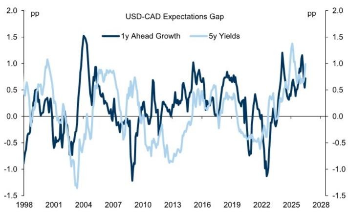  
来源：GS全球投资研究，GS FICC与股票，共识经济学

## 欧洲

欧元1y1y面临压力，但鹰派风险已被充分定价。对全球能源和欧洲天然气价格上行风险的担忧再度升温，推动近几周回报表现走高。自7月2日低点以来，1y1y已重新定价超过30个基点，目前定价了欧洲央行“更高更久”的路径。随着2026年几乎额外定价了两次加息，值得注意的是，2027年的加息定价也随着2026年定价的上升而增加。上周我们认为1y1y利率已经过高，相对于我们的预测，目前情况依然如此。我们认为1y1y-2y2y最终将陡峭化，但天然气价格持续的上行风险表明短期内战术风险更为平衡，尤其是1y1y相对于1y1y交易HICP并未显得脱节（图表4）。下周的欧洲央行会议应不会带来太多意外，管委会将按兵不动并提供有限指引——尽管9月加息的温和信号是可能的。在曲线更远端，我们继续认为10年期德国国债回报表现年底将接近3%，在欧洲央行按兵不动的情况下，这应会导致核心曲线陡峭化。

图表4：1y1y OIS与1y1y HICP交易一致  
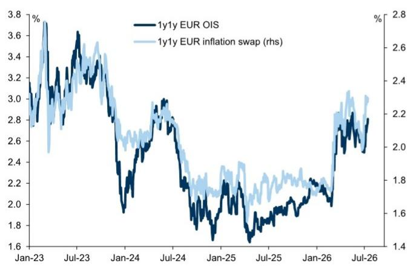  
来源：GS全球投资研究，GS FICC与股票

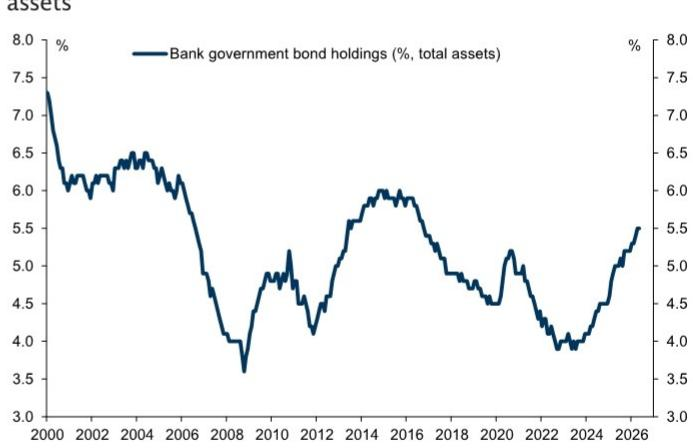  
来源：GS全球投资研究，欧洲央行，Haver Analytics

■ 欧元区政府债券互换利差可能获得杠杆率缓解。有报道称，欧盟正在考虑放宽欧元区的杠杆率要求，这应为资产互换中的欧元区政府债券提供增量支持。我们的银行研究团队估计，这可能会使整体资产负债表容量增加1800亿欧元。按照欧洲银行目前持有的政府债券水平（约5%，图表5），这将转化为90亿欧元的额外直接债券持有量，并为更广泛的金融体系吸收政府债券及其他资产提供进一步空间。此外，他们指出，降低杠杆率为政府债券持有提供了增量支持，政府债券持有是杠杆密集型的，但对风险加权资产要求的影响有限。尽管直接估计值较小（不到政府债券自由流通量的1%），但这表明资产互换中的欧元区政府债券将获得适度支持。利率波动加剧以及天然气价格上涨带来的加息风险是近期的逆风，但随着欧洲央行鹰派路径已被充分定价，我们认为主权carry和资产互换中的欧元区政府债券具有积极的风险回报。

近期数据温和，但英国央行MPC会议前能源风险依然存在。英国曲线对能源价格仍然敏感，自7月初以来，Z7承受了重新定价的主要压力，正如我们在欧洲所见，这表明市场越来越将新的能源压力视为可能持续到明年的风险。下周的CPI数据相对于近期的能源变动已显滞后，但可能有助于市场评估3月初始能源冲击传导效应的风险。从历史上看，需要20个基点或以上的偏差才能产生超过一个日标准差（约6-7个基点）的变动，5年期利率的反应最大（图表6）。尽管通胀数据本身的风险是对称的，但英国央行会议的鹰派风险在短端看起来已被充分定价。近期的政治不确定性可能随着下周领导层过渡正式化而减弱，但这并不能解决支出雄心、有限空间和受限税收选择之间的潜在财政紧张关系。由于政策议程的更大清晰度可能要到夏季才会逐渐显现，而秋季预算仍是财政风险的自然焦点，我们预计英国期限溢价将保持粘性，即使通胀走弱允许短端和中部反弹。因此，我们继续推荐英镑2s10s陡峭化交易，英国央行可能仍比市场定价更为鸽派，而财政不确定性限制了长端持续表现优异的空间。

图表6：英国大型通胀意外历史上在中部产生超常波动

基于整体CPI意外，经波动率调整后的英国2年、5年和10年利率平均变化

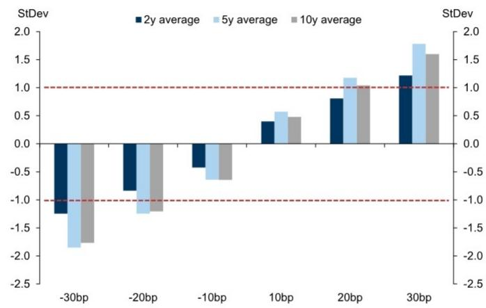  
来源：GS全球投资研究，GS FICC与股票，彭博

## 最新主题研究：

全球市场分析师：更新我们的G10期限溢价估计——仍处于高位——2026年6月19日

欧元区主权信用监测：欧盟债券——仍在深化——2026年6月12日

全球市场分析师：重新审视美联储资产负债表前景——2026年5月21日

全球利率报告：美国国债估值与回报表现逆转的条件——2026年5月20日

全球市场分析师：英国国库券：并非英国国债的灵丹妙药——2026年5月11日

## 最新全球市场日报：

美国国债需求半程检视——2026年7月16日

美国交易通胀信号混杂——2026年7月13日

欧元区货币市场接近关键时刻——2026年7月8日

偿付能力II审查将强化良性主权信用风险背景——2026年6月23日

G10利率观点——低波动，而非低回报表现——2026年6月22日

作者感谢Dario Scordamaglia对本报告的贡献。Dario是市场团队的实习生。

## 预测

G10 10年期回报表现预测

<table><tr><td colspan="14">G10 10年期回报表现预测</td></tr><tr><td></td><td>USD</td><td>DEM</td><td>FRA</td><td>ITA</td><td>ESP</td><td>GBP</td><td>JPY</td><td>CAD</td><td>CHF</td><td>SEK</td><td>NOK</td><td>AUD</td><td>NZD</td></tr><tr><td>即期</td><td>4.53</td><td>3.12</td><td>3.92</td><td>3.93</td><td>3.58</td><td>4.93</td><td>2.70</td><td>3.53</td><td>0.44</td><td>2.92</td><td>4.37</td><td>4.90</td><td>4.65</td></tr><tr><td>3Q26</td><td>4.45</td><td>2.95</td><td>3.60</td><td>3.65</td><td>3.35</td><td>4.60</td><td>2.50</td><td>3.50</td><td>0.40</td><td>3.20</td><td>4.00</td><td>4.75</td><td>4.50</td></tr><tr><td>4Q26</td><td>4.40</td><td>3.00</td><td>3.70</td><td>3.75</td><td>3.45</td><td>4.50</td><td>2.50</td><td>3.50</td><td>0.50</td><td>3.25</td><td>4.00</td><td>4.70</td><td>4.50</td></tr><tr><td>1Q27</td><td>4.35</td><td>3.00</td><td>3.75</td><td>3.80</td><td>3.50</td><td>4.50</td><td>2.45</td><td>3.50</td><td>0.50</td><td>3.25</td><td>4.00</td><td>4.60</td><td>4.50</td></tr><tr><td>2Q27</td><td>4.30</td><td>3.00</td><td>3.75</td><td>3.85</td><td>3.55</td><td>4.40</td><td>2.40</td><td>3.50</td><td>0.50</td><td>3.25</td><td>4.00</td><td>4.50</td><td>4.50</td></tr><tr><td>3Q27</td><td>4.25</td><td>3.00</td><td>3.75</td><td>3.90</td><td>3.60</td><td>4.40</td><td>2.30</td><td>3.50</td><td>0.50</td><td>3.25</td><td>4.00</td><td>4.50</td><td>4.50</td></tr><tr><td>4Q27</td><td>4.25</td><td>3.00</td><td>3.75</td><td>3.90</td><td>3.60</td><td>4.35</td><td>2.25</td><td>3.50</td><td>0.50</td><td>3.25</td><td>4.00</td><td>4.50</td><td>4.50</td></tr><tr><td>1Q28</td><td>4.25</td><td>3.00</td><td>3.75</td><td>3.90</td><td>3.60</td><td>4.30</td><td>2.20</td><td>3.50</td><td>0.50</td><td>3.25</td><td>4.00</td><td>4.50</td><td>4.50</td></tr></table>

<table><tr><td colspan="14">与远期偏差</td></tr><tr><td></td><td>USD</td><td>DEM</td><td>FRA</td><td>ITA</td><td>ESP</td><td>GBP</td><td>JPY</td><td>CAD</td><td>CHF</td><td>SEK</td><td>NOK</td><td>AUD</td><td>NZD</td></tr><tr><td>3Q26</td><td>-0.14</td><td>-0.20</td><td>-0.44</td><td>-0.27</td><td>-0.08</td><td>-0.06</td><td>0.28</td><td>-0.36</td><td>-0.18</td><td>-0.22</td><td>-0.35</td><td>-0.34</td><td>-0.26</td></tr><tr><td>4Q26</td><td>-0.24</td><td>-0.19</td><td>-0.60</td><td>-0.35</td><td>-0.12</td><td>0.01</td><td>0.30</td><td>-0.36</td><td>-0.26</td><td>-0.29</td><td>-0.32</td><td>-0.29</td><td>-0.21</td></tr><tr><td>1Q27</td><td>-0.33</td><td>-0.22</td><td>-0.65</td><td>-0.48</td><td>-0.16</td><td>-0.01</td><td>0.27</td><td>-0.35</td><td>-0.39</td><td>-0.36</td><td>-0.33</td><td>-0.30</td><td>-0.21</td></tr><tr><td>2Q27</td><td>-0.43</td><td>-0.26</td><td>-0.79</td><td>-0.60</td><td>-0.20</td><td>-0.03</td><td>0.25</td><td>-0.34</td><td>-0.51</td><td>-0.42</td><td>-0.34</td><td>-0.36</td><td>-0.21</td></tr></table>

来源：GS全球投资研究

G4曲线预测  
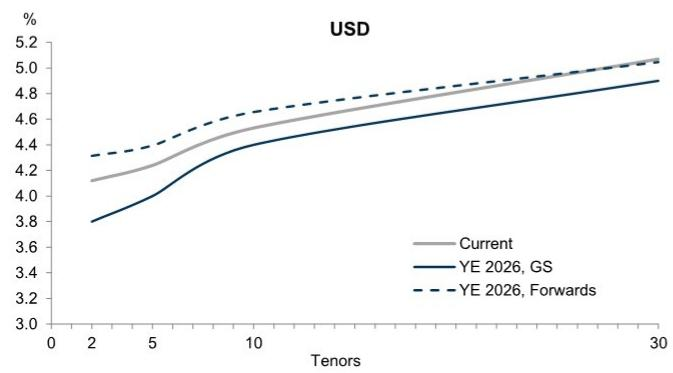

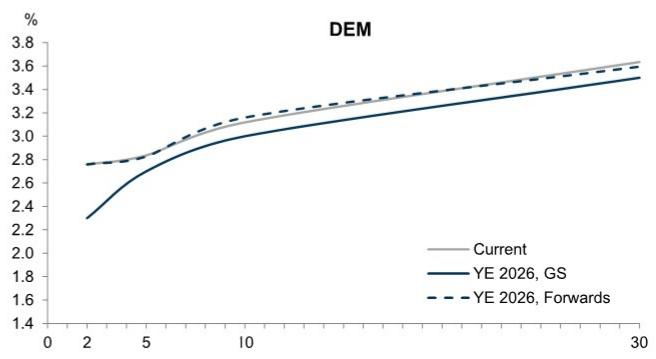

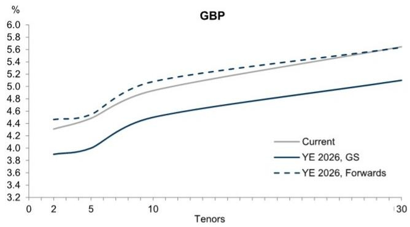  
来源：彭博，GS全球投资研究

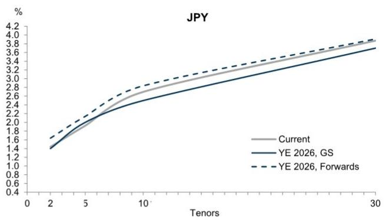

## 央行仪表盘

自今日起累计定价的加息/降息幅度  
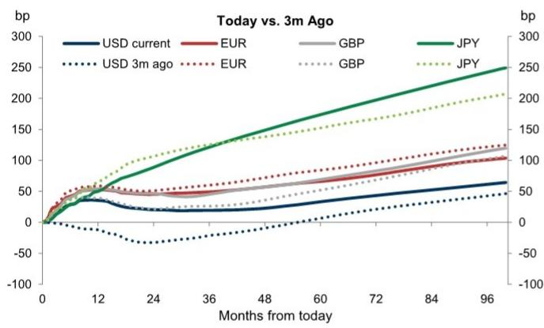  
来源：GS全球投资研究

按年份预期的加息次数，GS vs 市场  
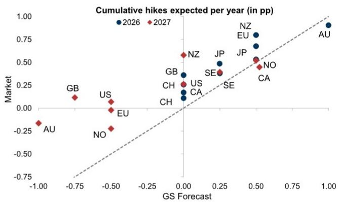  
来源：GS全球投资研究

央行持有主权债券，当前 vs 1年前  
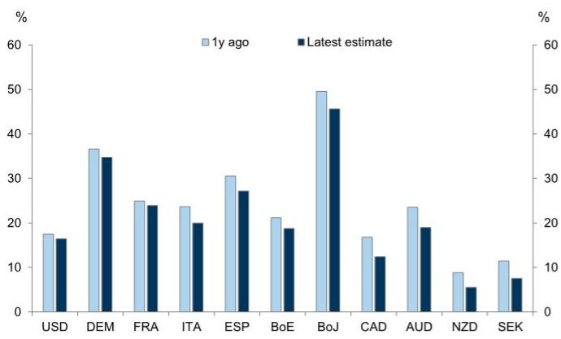  
来源：Haver Analytics

央行资产占GDP比重  
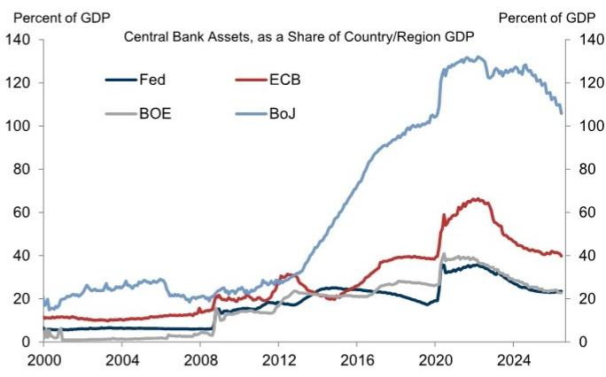  
来源：Haver Analytics

## 持仓与资金流监测

期权隐含持仓指标  
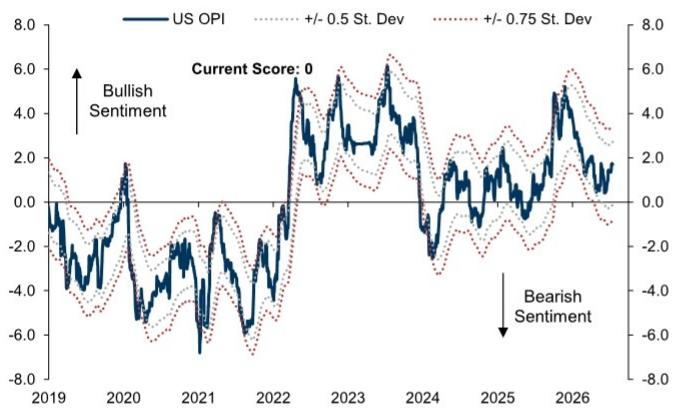  
来源：GS全球投资研究

GS基金持仓指标  
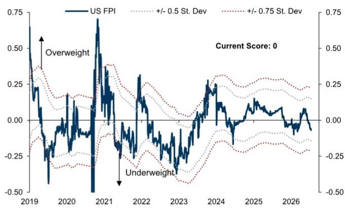  
来源：GS全球投资研究

美国数据响应指标  
  
来源：GS全球投资研究

## CFTC持仓报告与金融期货交易者

按读者类型划分的久期加权净头寸

久期加权持仓，按合约

<table><tr><td>$mm/bp</td><td>SFR</td><td>TU</td><td>FV</td><td>TY</td><td>TN</td><td>US</td><td>WN</td></tr><tr><td>投机者 当前</td><td>-81.6</td><td>-43.4</td><td>-55.1</td><td>-50.4</td><td>-12.7</td><td>-18.0</td><td>-52.7</td></tr><tr><td>投机者 1周变化</td><td>2.0</td><td>0.8</td><td>-1.6</td><td>-0.9</td><td>-0.7</td><td>-6.0</td><td>-2.2</td></tr><tr><td>杠杆基金 当前</td><td>-75.4</td><td>-60.4</td><td>-88.5</td><td>-125.0</td><td>-29.9</td><td>-47.8</td><td>-158.1</td></tr><tr><td>杠杆基金 1周变化</td><td>2.8</td><td>-0.3</td><td>-1.0</td><td>-3.3</td><td>-3.1</td><td>-1.8</td><td>2.7</td></tr><tr><td>资产管理公司+其他 当前</td><td>-6.3</td><td>69.8</td><td>122.0</td><td>153.6</td><td>62.0</td><td>65.3</td><td>194.8</td></tr><tr><td>资产管理公司+其他 1周变化</td><td>1.2</td><td>-2.2</td><td>2.3</td><td>5.3</td><td>1.2</td><td>-3.3</td><td>-3.8</td></tr><tr><td>交易商 当前</td><td>81.6</td><td>-12.2</td><td>-34.7</td><td>-29.8</td><td>-25.3</td><td>-34.8</td><td>-42.4</td></tr><tr><td>交易商 1周变化</td><td>-3.9</td><td>2.2</td><td>-0.8</td><td>-2.1</td><td>0.3</td><td>4.6</td><td>2.8</td></tr></table>

欧洲美元的净头寸  
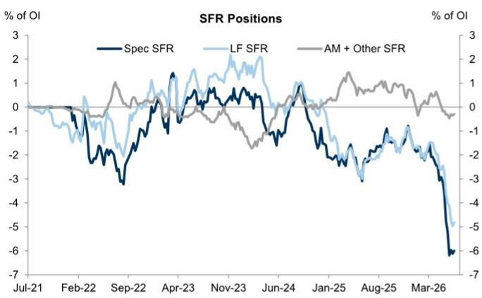  
注：久期加权净头寸（多头-空头）占久期加权总敞口（多头+空头+价差）的百分比  
来源：CFTC，GS全球投资研究

美国国债期货的净头寸  
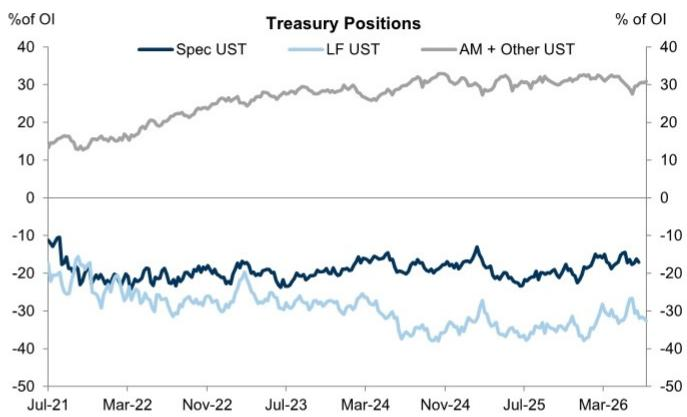  
注：久期加权净头寸（多头-空头）占久期加权总敞口（多头+空头+价差）的百分比  
来源：CFTC，GS全球投资研究

一级交易商交易 美国国债交易商净头寸  
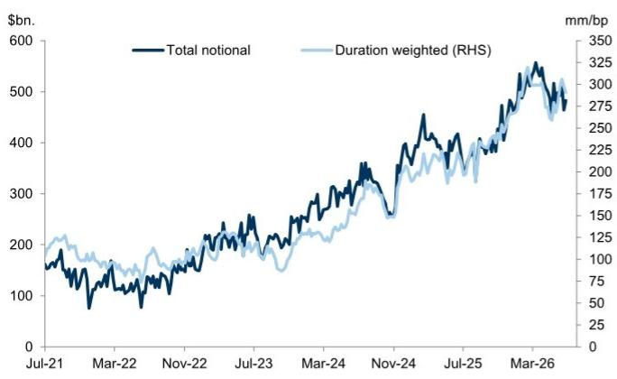  
来源：纽约联储，GS全球投资研究

## 美国商业银行持有的国债与机构证券

所有商业银行的国内外总持有量  
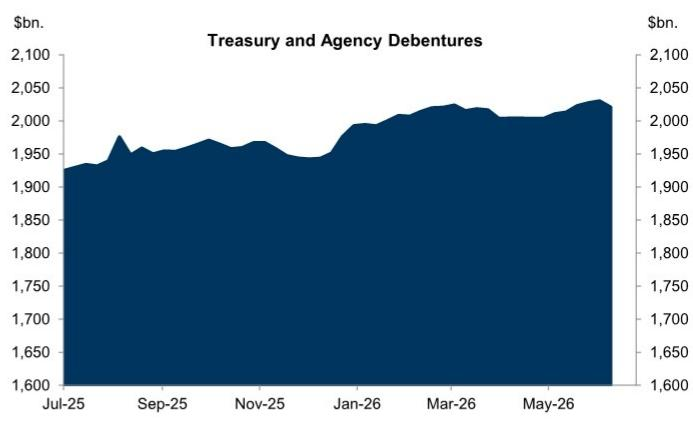  
来源：美联储委员会

纽约联储托管持有量 可交易美国国债  
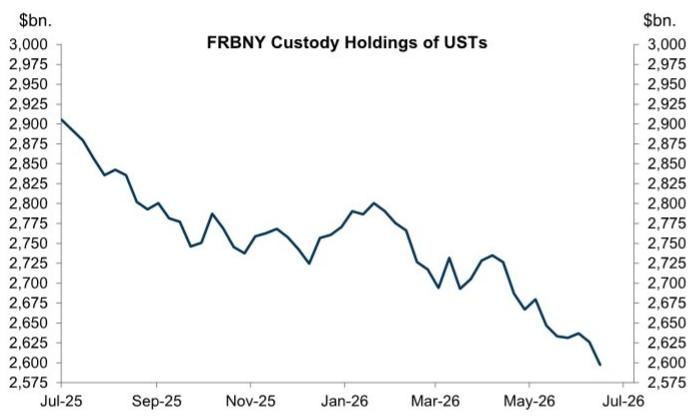  
来源：纽约联储

## 美国TIC国债资金流

按债务持有者划分的美国国债估值调整后持有量的12个月变化  
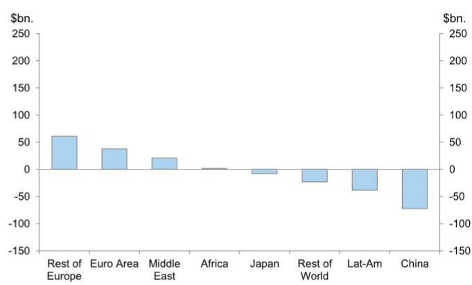  
来源：美国财政部，GS全球投资研究

日本读者对美国短期和长期国债的月度净购买  
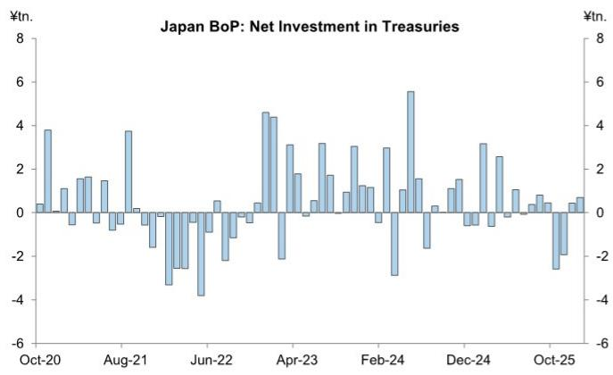  
来源：日本央行，Haver Analytics

按部门划分的美国国债年度净购买资金流  
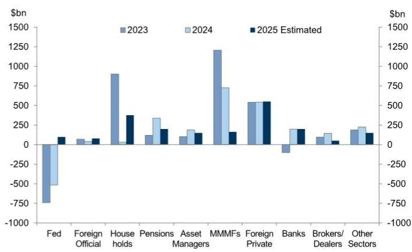  
来源：美联储委员会，GS全球投资研究

## 持有收益/滚动收益监测

## 直接持有收益

柱状图显示按货币划分的前两大持有收益点，实心表示多头头寸的持有收益，条纹表示空头头寸的持有收益。散点图显示按货币划分的前25个持有收益/波动率点，并标注每种货币的最高点

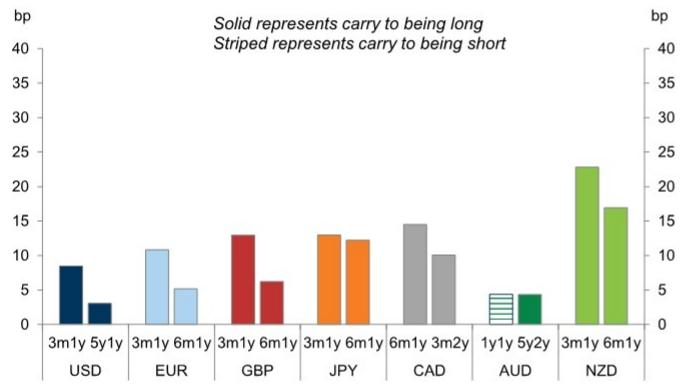  
来源：GS全球投资研究

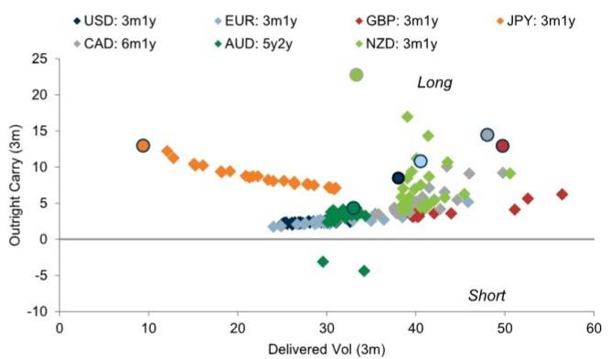

## 曲线持有收益

柱状图显示按货币划分的前两大持有收益曲线，实心表示陡峭化头寸的持有收益，条纹表示平坦化头寸的持有收益。散点图显示按货币划分的前5条持有收益/波动率曲线，并标注每种货币的最高曲线

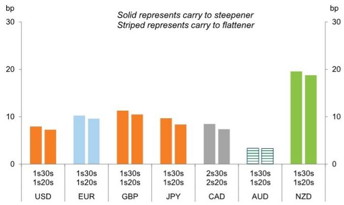

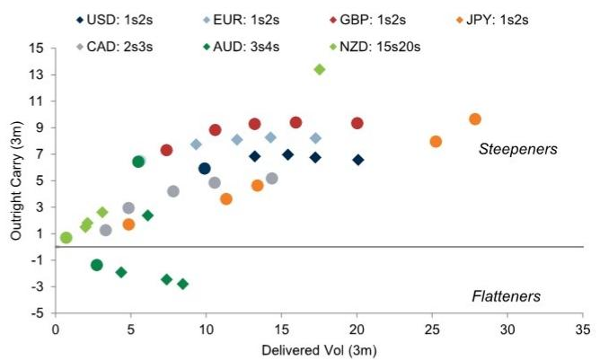  
来源：GS全球投资研究

## 蝶式持有收益

柱状图显示按货币划分的前两大持有收益蝶式，实心表示中部变贵的蝶式持有收益，条纹表示中部变便宜的蝶式持有收益。散点图显示按货币划分的前5个持有收益/波动率蝶式，并标注每种货币的最高蝶式。

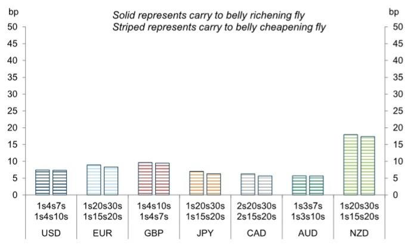  
来源：GS全球投资研究

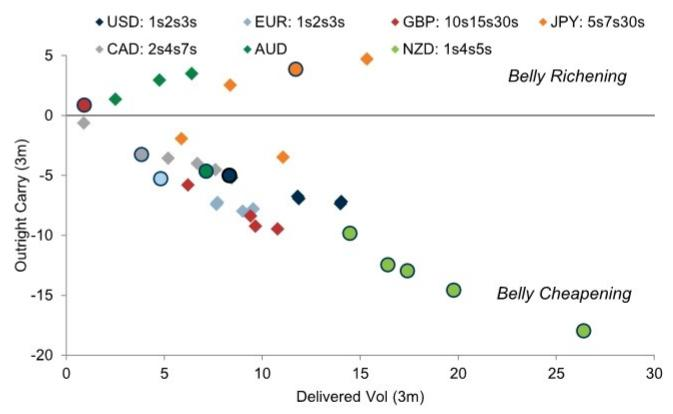

## 国债供应监测

按年底估算的美国国债拍卖规模，含GS预测

<table><tr><td colspan="12">日历年年底月度拍卖金额（十亿美元）</td></tr><tr><td></td><td>2年FRN</td><td>2年</td><td>3年</td><td>5年</td><td>7年</td><td>10年</td><td>20年</td><td>30年</td><td>5年TIPS</td><td>10年TIPS</td><td>30年TIPS</td></tr><tr><td>25年底（日历年）</td><td>30 / 28 (r)</td><td>69</td><td>58</td><td>70</td><td>44</td><td>42 / 39 (r)</td><td>16 / 13 (r)</td><td>25 / 22 (r)</td><td>26 / 24 (r)</td><td>21 / 19 (r)</td><td>9 / 8 (r)</td></tr><tr><td>26年底（日历年，GS）</td><td>30 / 28 (r)</td><td>69</td><td>58</td><td>70</td><td>44</td><td>42 / 39 (r)</td><td>16 / 13 (r)</td><td>25 / 22 (r)</td><td>26 / 24 (r)</td><td>21 / 19 (r)</td><td>9 / 8 (r)</td></tr><tr><td>27年底（日历年，GS）</td><td>33 / 30 (r)</td><td>83</td><td>72</td><td>84</td><td>58</td><td>42 / 39 (r)</td><td>16 / 13 (r)</td><td>25 / 22 (r)</td><td>28 / 26 (r)</td><td>21 / 19 (r)</td><td>9 / 8 (r)</td></tr></table>

\* 原发行/续发列示于FRN、10年、20年、30年和TIPS。

<table><tr><td colspan="7">按日历年划分的美国国债净发行（十亿美元）</td></tr><tr><td></td><td>净息票</td><td>美联储</td><td>扣除美联储后净额</td><td>净票据</td><td>美联储</td><td>扣除美联储后净额</td></tr><tr><td>日历年 2024</td><td>1346</td><td>-475</td><td>1821</td><td>511</td><td>-23</td><td>534</td></tr><tr><td>日历年 2025</td><td>1566</td><td>-115</td><td>1681</td><td>360</td><td>38</td><td>322</td></tr><tr><td>日历年 2026，GS</td><td>1228</td><td>-4</td><td>1232</td><td>827</td><td>390</td><td>437</td></tr><tr><td>日历年 2027，GS</td><td>1307</td><td>0</td><td>1307</td><td>907</td><td>453</td><td>453</td></tr></table>

来源：GS全球投资研究，美国财政部

<table><tr><td colspan="3">久期供应（十亿美元10年等价）</td></tr><tr><td>总供应</td><td>美联储</td><td>扣除美联储后净额</td></tr><tr><td>2765</td><td>0</td><td>2765</td></tr><tr><td>2797</td><td>0</td><td>2797</td></tr><tr><td>2797</td><td>0</td><td>2797</td></tr><tr><td>2931</td><td>0</td><td>2931</td></tr></table>

## 每季度净发行

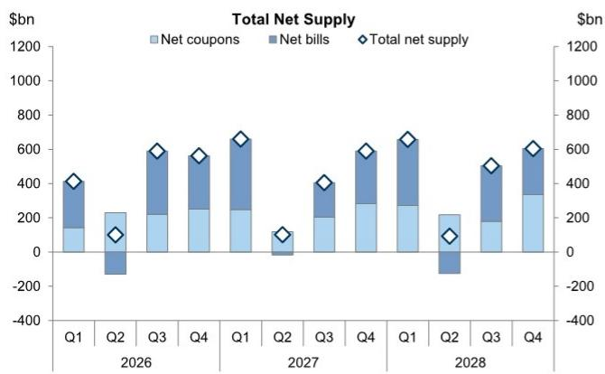  
来源：GS全球投资研究，美国财政部

美国国债月均发行，总发行和扣除美联储购买后净额；十亿美元10年等价  
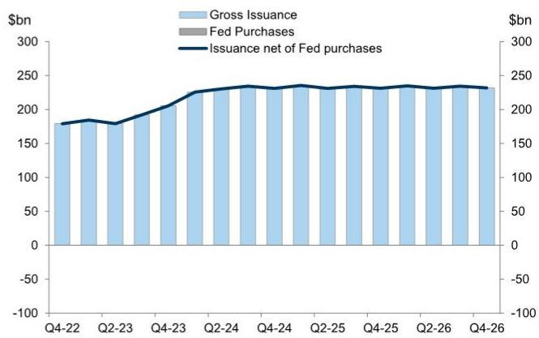  
来源：GS全球投资研究，美国财政部

自由流通量（未偿国债减去美联储和外国官方持有量）占GDP百分比  
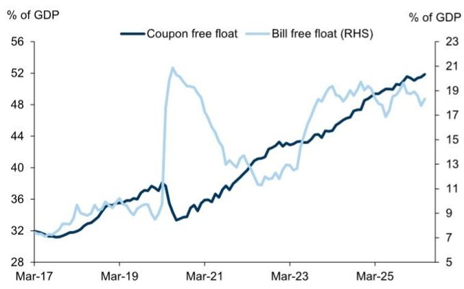  
来源：Haver Analytics，美国财政部，GS全球投资研究

票据占未偿国债比例及GS预测 灰色阴影表示TBAC建议的15-20%范围  
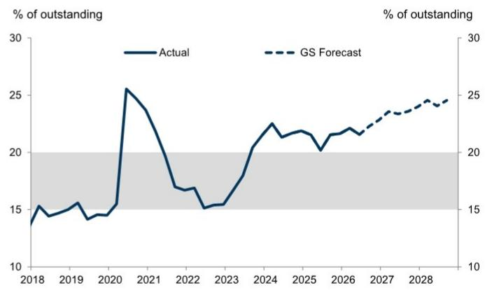  
来源：美国财政部，GS全球投资研究

## GS期限溢价分解

## G10 10年期回报表现的1年范围，按期限溢价和预期成分划分

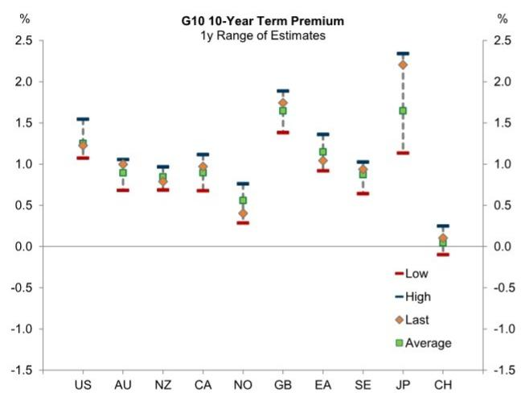

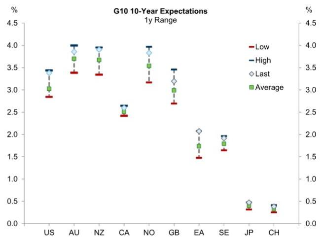

拟合回报表现的期限结构，按成分划分  
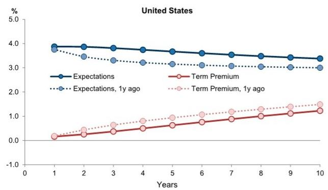

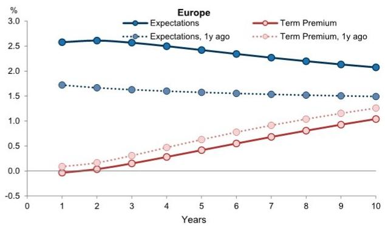

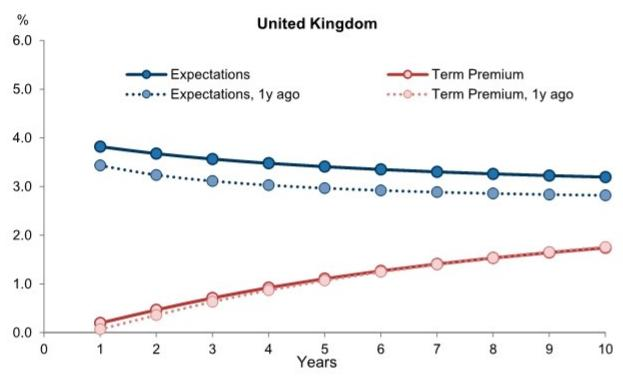  
来源：GS全球投资研究

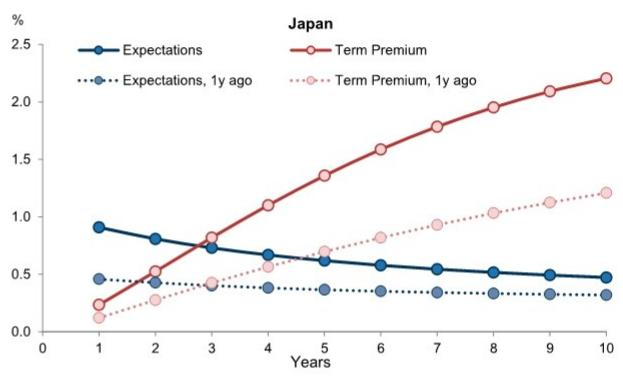

2026年交易建议

<table><tr><td colspan="7">GS利率交易</td></tr><tr><
