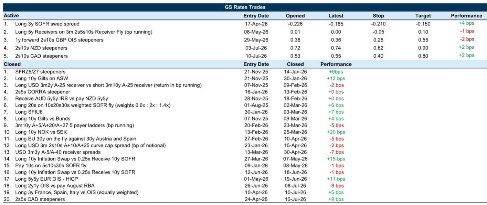
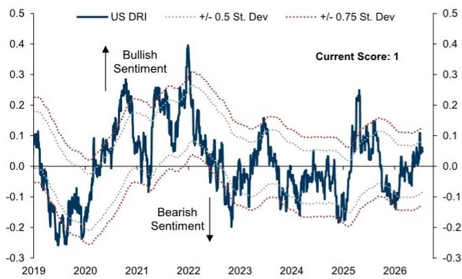

# 六月通胀数据有所缓和，但政策路径的转变需要持续的数据支持，而非单次报告

美国固定收益市场在六月迎来了一次喘息，核心PCE月度环比估值约为18个基点。如果这一数据得到确认，将是过去一年多以来最温和的月度读数。对于一家在解释高于目标通胀方面已公开失去耐心的美联储而言，这个单一数据点确实重要。但它无法代表一个趋势。核心PCE同比仍稳稳高于3%，而央行的沟通已明确一点：劳动力市场稳定，价格目标现在是约束条件。一次温和的数据不会改写政策路径。它所做的，是为市场打开一扇狭窄的窗口，用以测试美联储的鹰派立场是否会被一系列同样温和的通胀报告所侵蚀。

这就是当前利率观察者面临的核心张力。从现在到九月联邦公开市场委员会会议之间的数据日程足够密集，足以改变预期，但近期的静默期限制了有意义的重新定价的空间。市场已因六月通胀数据意外而压缩了加息定价，然而那些使长端回报表现保持粘性的结构性力量——周期韧性、人工智能投资周期以及依然沉重的国债供应前景——并未改变。对于试图为周期下一阶段布局的观察者而言，问题不在于通胀是否在降温，而在于它能否足够长时间地保持凉爽，以改变美联储的反应函数。我们对证据的解读表明，这是可能的，但前提是劳动力市场保持稳定且能源价格不再加速上涨。这是一个有条件的观点，而非确信的判断。

以下论述围绕四个分析层面展开。首先，我们审视为何美国回报表现曲线继续主张在五年期板块锚定多头头寸，即便曲线中段在近期石油驱动的抛售中表现不佳。其次，我们评估欧洲利率体系，其中鹰派风险已被充分定价，但近期能源上行风险使战术风险保持平衡。第三，我们将全球宏观图景转化为一个跨G10曲线进行头寸布局的决策框架。第四，我们强调将塑造下半年格局的国债需求与供给的结构性变化，包括公司债发行、外国官方购买以及欧洲杠杆率放松的影响。结论并非预测，而是一个策略性推断：利率市场面临的风险组合，在美国和欧洲都倾向于前端陡化交易，并偏好美国曲线五年期部分，作为通胀上行与长端粘性的支点。

## 五年期板块仍是美国曲线头寸布局的最优锚点，因其平衡了通胀不对称性与长端粘性

美国回报表现近期的上行由能源价格引领，曲线中段表现不佳，因为石油驱动的重新定价传导至了中期期限。这种模式与市场正在定价一个周期性冲击而非通胀轨迹的结构性转变是一致的。但长端的反应明显不同。在六月CPI数据公布后的反弹中，十年期和三十年期回报表现相对粘滞，而在随后的抛售中它们也滞后。这种粘性并非偶然。它反映了两种不太可能迅速消散的结构性力量：在一个已被证明对高利率具有韧性的经济体中，周期性风险溢价降低；以及由人工智能投资周期及相关企业借贷需求驱动的对长久期资产的持续需求。

在此背景下，五年期板块占据了一个独特位置。如果通胀继续缓和，它期限足够短，能从加息风险的压缩中受益；但又足够长，能避免使长端锚定的期限溢价的全部影响。我们的分析表明，在通胀上行情况下，2s5s曲线平坦化的空间依然显著，而长端远期利率的粘性意味着五年期板块的反弹不太可能因期限溢价飙升而被逆转。这不是说曲线会直线平坦化。而是说，考虑到对两个主导宏观风险——通胀意外和投资周期——的非对称敞口，五年期板块头寸布局的风险回报比前端或长端都更为有利。

交易通胀市场为这一头寸布局提供了额外支持。我们的宏观估值框架显示，较长期通胀远期相对于基本面交易略显便宜，这可能反映了市场在六月会议后对美联储更为鹰派的看法，以及风险资产价格走势的波动。但一年期和两年期远期交易略显昂贵，反映出对油价上涨的更高敏感性。这种分化很重要。这意味着较长期远期的便宜并非有吸引力的直接多头入场点，因为任何通胀上行意外都可能遭遇实际利率上升，而非美联储鸽派转向。相比之下，五年期板块受益于近期风险溢价的压缩，同时无需承受较长期通胀预期全面重新定价的风险。

## 欧洲鹰派风险已被充分定价，但天然气价格的上行风险阻止了战术性警报解除，并维持了陡化交易的生命力

自七月初以来，欧洲利率已大幅重新定价，一年期OIS远期从其低点上涨了超过30个基点。市场现在定价欧洲央行在2026年几乎再加息两次，值得注意的是，2027年的加息定价也随着2026年的重新定价而上升。这是一个正在为欧洲央行更高更久路径定价的市场，其驱动因素是对全球能源价格和欧洲天然气供应的重新担忧。我们的观点仍然是，一年期远期在最新变动之前已经过高，且相对于我们的预测仍然过高。但近期战术图景更为平衡，因为一年期远期相对于一年期交易HICP看起来并未脱节。换句话说，市场正在为天然气价格不确定性定价一个合理的风险溢价，而逆转这一重新定价需要能源价格的持续下跌。

下周的欧洲央行会议不太可能提供催化剂。管理委员会处于静默期，将提供有限的指引，尽管可能发出九月加息的软信号。对于观察者而言，关键洞察是鹰派路径已被充分定价，这意味着前端利率的下行风险是非对称的。如果天然气价格稳定或下跌，重新定价可能迅速逆转，前端将上涨。如果天然气价格进一步上涨，额外的重新定价可能更为温和，因为市场已经吸收了大量的鹰派风险。这种非对称性主张在核心欧洲曲线中维持陡化头寸，预期前端最终将上涨，而长端将因欧洲央行的静默立场和对德国国债的结构性需求而保持锚定。

英国市场呈现出类似动态，但增加了一层财政不确定性。英国曲线对能源价格保持敏感，2027年冬季合约承受了重新定价的主要压力。下周的CPI数据相对于近期的能源变动已显陈旧，但它将帮助市场评估三月份初始能源冲击的传导效应。历史上，大的通胀意外在英国曲线中段产生了超乎寻常的变动，五年期利率的反应最大。但即使通胀数据温和，长端持续反弹的空间也受到支出雄心、有限财政空间和受限税收选择之间潜在财政紧张关系的限制。近期政治不确定性可能随着领导层过渡的正式化而减弱，但秋季预算仍是财政风险的自然焦点。这种组合——相对于市场定价而言相对鸽派的英国央行与长端粘性的财政风险溢价——继续支持英镑2s10s陡化交易。

## G10曲线头寸布局的决策框架：三种情景及每种情景下有效的工具

全球利率环境由三个重叠的不确定性定义：通胀轨迹、能源价格路径以及央行对不断变化的增长-通胀组合的反应。与其试图预测每个变量，不如定义少量情景并识别在每种情景下表现最佳的工具。

情景一：通胀继续缓和，劳动力市场保持稳定，能源价格企稳。在此情景下，美联储和欧洲央行都有空间放松定价，前端利率应上涨。首选头寸是陡化交易，因为由于上述结构性因素，长端可能滞后。在美国，这意味着2s10s或5s30s陡化，偏好五年期作为中段锚点。在欧洲，同样的逻辑适用：德国国债和OAT的2s10s陡化，前端受益于加息风险的重新定价，长端则受期限溢价压制。

情景二：通胀保持粘性，能源价格进一步上涨，央行被迫维持或增加鹰派定价。在此情景下，前端利率上升，曲线平坦化，长端相对于前端表现不佳。首选头寸是平坦化交易，特别是在美国曲线的2s5s部分，那里对通胀上行的非对称性最大。在欧洲，已经发生的急剧重新定价意味着额外的平坦化空间更为有限，但如果天然气价格继续上涨，2s5s平坦化仍然可行。

情景三：增长放缓，通胀缓和，央行降息。这是对久期最有利的情景，但它需要经济前景出现目前数据中尚不可见的实质性恶化。在此情景下，长端将上涨，曲线将牛陡。首选头寸将是十年期和三十年期债券的直接多头，鉴于起始回报表现更高和重新定价空间更大，倾向于美国。

我们的基准观点与情景一最为接近，但认识到能源价格风险是真实存在的，可能将结果推向情景二。这就是为什么美国的五年期板块和欧洲的陡化交易是最稳健的头寸：它们受益于最可能的结果（通胀缓和、稳定增长），同时限制了来自能源价格上行尾部风险的下行空间。特别是五年期板块，提供了一种自然对冲，因为它期限足够长，能捕捉前端重新定价带来的上涨，但又足够短，能避免期限溢价冲击的全部影响。

## 下半年国债需求前景温和但非无条件，回购市场正从宽松转向中性

下半年美国国债需求前景总体温和，但存在一些值得关注的风险点。我们的基准预测是下半年净票据供应6840亿美元，净附息券供应6050亿美元，预计将由各类买家吸收。美联储预计到年底将再吸收1300至1400亿美元票据，货币市场基金应在季节性平静期过后，随着供应回升，将未来资产管理规模部署到回购和票据中。外国私人购买全年一直是稳定的净需求来源，而外国官方购买较低，这可能反映了美元强势，而非需求模式的结构性转变。

这一温和前景的风险来自两个方面。首先，长端公司债供应增加可能侵蚀某些国债需求来源，特别是拆息活动。历史上，长期限公司债发行与以拆息形式持有的国债份额之间存在负相关。我们将关注这一动态，但我们不认为与宏观驱动因素相比，它对长端估值产生了超乎寻常的影响。其次，商业银行购买尚未因监管改革而明显加速，但我们认为更大的中介能力应支持未来的吸收。关键结论是，需求图景足够稳定，能够吸收预期供应而不会出现重大错位，但也不至于强到在宏观前景转变时阻止回报表现回升。

回购市场也在转变。七月票据供应的增加帮助将短期融资成本推升至美联储目标区间的中间位置，逆转了今年早些时候盛行的宽松状况。几个因素指向融资条件的进一步收紧：财政部一般账户降至五月以来最低水平，部分反映了关税退税对财政部现金流的影响；杠杆基金在国债期货中的空头头寸趋于稳定，这可能意味着未来对回购融资的需求更为稳定；以及在九月税收季节期间，储备管理实践可能采取更谨慎的态度。我们的基准是回购利率将锚定在略低于IORB的水平，但风险平衡已从宽松转向中性，如果供应继续对前端构成压力，票据-OIS曲线可能进一步平坦化。

对于观察者而言，其含义是前端的套利交易吸引力正在下降，票据与OIS之间的相对价值正在转变。这强化了关注曲线中段的理由，那里的宏观故事更清晰，融资动态的约束也更小。

## 结论：一个有条件的温和观点，偏好五年期板块和陡化交易，能源是摇摆风险

六月通胀数据给了市场一个理由，希望美联储的鹰派立场可以被侵蚀，但通往持续鸽派重新定价的道路需要一系列温和数据，而非单一数据点。劳动力市场依然稳定，投资周期正在进行，能源价格构成真实的上行风险。在这种环境下，最稳健的头寸布局是平衡前端上涨潜力与使长端保持粘性的结构性力量。美国的五年期板块提供了这种平衡，而欧洲的陡化交易提供了类似的风险回报特征。

下半年将检验宏观背景能否维持温和通胀叙事。如果能够，前端将上涨，曲线将陡化，五年期板块将受益。如果不能，前端将再次面临压力，曲线将平坦化。无论哪种情况，五年期板块都是支点，也是我们继续锚定头寸布局的地方。

*仅供参考。部分内容可能基于源材料通过AI辅助生成、翻译、总结或编辑，可能存在遗漏或错误。请独立核实。本文不构成专业建议。*

仅供参考。部分内容可能基于源材料通过AI辅助生成、翻译、总结或编辑，可能存在遗漏或错误。请独立核实。本文不构成专业建议。

