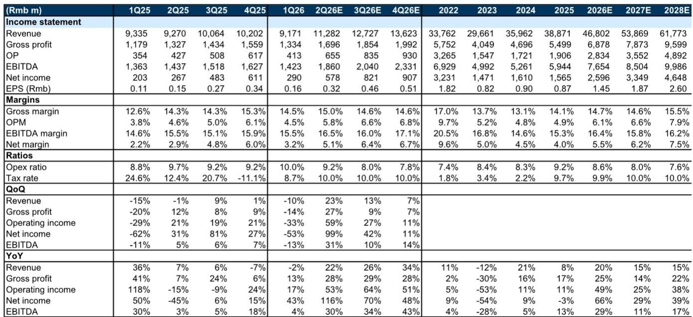
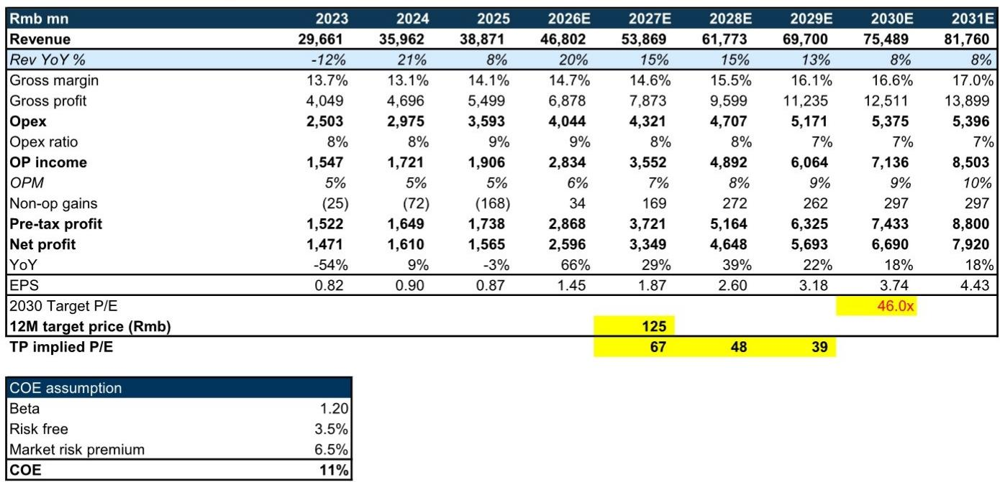
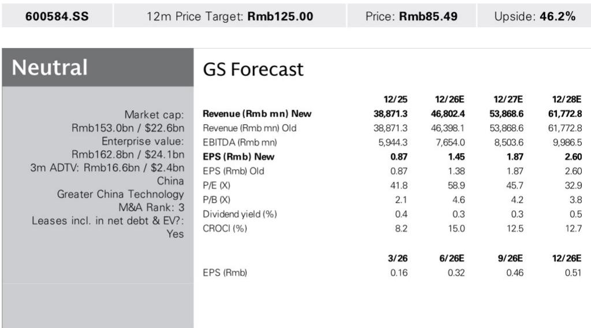

# 长电科技先进封装布局：不止是产能，更是重塑中国半导体外包服务的经济逻辑

长电科技2026年第二季度净利润指引中值为5.7亿元人民币，同比增长113%，环比增长96%。公司将这一拐点归因于三个相互强化的驱动因素：AI基础设施投入提升产能利用率、主动向高端OSAT服务的产品组合转型扩大利润空间、以及严格的成本控制。毛利率已从2025年第一季度的12.6%攀升至2026年第一季度的14.5%。然而，更具启示性的信号在于后续布局。公司宣布投资78亿元人民币建设新的先进封装产能，其中一期工程——涵盖厂房建设和设备安装——计划于2028年下半年完成。这不仅仅是产能的故事，更是长电科技在全球半导体价值链中的结构性重新定位，将决定公司能否维持近期指引所暗示的利润率改善。

这一产能扩张的时机至关重要。当前盈利加速由AI基础设施建设的周期性需求推动，但产能决策是一项长周期布局，要到2028年后才开始产生回报。对于观察者而言，问题在于长电科技能否在当前周期见顶之前，完成从产能利用率驱动的复苏向结构性更高利润率业务模式的转型。公司自身的财务轨迹表明，这一转型窗口正在收窄，但机遇空间正在扩大。

## 2026年第二季度指引拐点确认：AI基础设施需求正传导至OSAT盈利能力，而不仅仅是收入

2026年第二季度指引超预期的幅度——净利润近乎环比弹性较高——表明AI基础设施周期已从芯片设计和晶圆制造的初始受益者，延伸至封装和测试环节。长电科技2026年第二季度收入预计同比增长22%，但净利润同比增长113%。这种营收与利润增长的分化是报告中最具说明力的指标。同期营业利润预计同比增长53%，而收入增长为22%。经营杠杆真实存在且正在加速。

什么发生了变化？公司的毛利率轨迹提供了最清晰的答案。在2025年大部分时间徘徊于12.6%至14.3%区间后，毛利率在2026年第一季度突破14.5%，预计第二季度将达到15.0%。从2026年第一季度到第二季度的环比改善——从14.5%到15.0%——相对值不大，但这是在收入环比增长23%的基础上实现的。这种销量增长与利润率扩张的组合，是业务收入结构向更高价值服务转移的特征，而非简单用常规订单填满现有产能。

向高端OSAT服务的产品组合升级是推动利润率扩张的机制。AI计算芯片、高端消费电子和汽车电子都需要先进封装技术——扇出型晶圆级封装、系统级封装和2.5D/3D集成——这些技术相比传统引线键合封装具有显著更高的单价和利润率。长电科技管理层明确将指引超预期归因于这一产品组合转变。这意味着公司不仅是在享受销量增长的浪潮，更是在每单位出货中获取更大的价值份额。

## 78亿元产能投资创造第二增长曲线，2028年后方显成效，构建超越当前周期的多年盈利轨迹

产能扩张公告是报告中战略意义最重大的数据点，因为它揭示了管理层的信念：当前需求环境并非周期性，而是结构性的。一项78亿元的投资，直到2028年下半年才开始产生产出，这不是对短期订单的回应，而是押注未来三到五年中国先进封装市场将足够增长，以有吸引力的利润率吸收这一产能。

该投资针对三个终端市场领域：AI计算芯片、高端消费电子和汽车电子。这些正是先进封装需求最为迫切、中国国内需求增长最快的领域。AI芯片需要高带宽内存集成和中介层技术；高端消费设备需要小型化和异构集成；汽车电子需要只有先进封装才能提供的可靠性和热管理。长电科技正将自己定位为能够同时服务于这三个领域的国内OSAT供应商。

这项投资的财务影响最早要到2029年才会体现在盈利中。公司自身预测显示，收入将从2026年的468亿元增长至2028年的618亿元，年复合增长率为15%。但产能扩张意味着2028年之后的增长可能由新一波生产推动，而这些尚未反映在当前预测中。风险在于执行：建设先进封装工厂需要专业设备、熟练工程师和工艺认证周期，通常需要18至24个月。长电科技在2028年下半年完成一期工程的时间表雄心勃勃，但如果公司已获得设备承诺和客户认证时间表，则是可行的。

## 长电科技的估值框架取决于结构性利润率模型，需在新产能上线前证明自身

报告中的估值方法具有启发性，因为它揭示了市场对长电科技的定价逻辑。目标估值基于2027年预期市盈率，采用11%的权益成本。目标倍数本身来自同行业公司市盈率与预期净利润增长率和营业利润率之和的回归分析。对于长电科技，隐含的2031年预期净利润增长率为18%，隐含的2031年预期营业利润率为10%。这两个输入指标的比值为1.6，恰好处于同行业公司平均水平。

这一估值框架包含一个特定假设：长电科技的营业利润率将从当前约5%的水平弹性较高，到2031年达到10%。公司自身预测显示，营业利润率将从2026年预期的6.1%改善至2028年预期的7.9%，这一轨迹意味着到2031年将持续改善以达到10%的目标。产能投资是使这一利润率扩张变得可信的机制。没有新的先进封装产能，长电科技最终将面临向更高利润率服务转移的能力上限，因为现有产能将被传统封装完全占用。

隐含的2027年预期市盈率约为67倍，与公司近期约60倍的交易区间一致，表明当前估值已包含了预期利润率改善的相当一部分。报告观点与此评估一致，认为在当前水平上风险回报是平衡的。

## 如何构建研究框架：评估长电科技盈利轨迹的三阶段模型

报告提供了足够的细节来构建一个决策框架，将公司的盈利轨迹分为三个不同阶段。每个阶段有不同的驱动因素、不同的风险特征和对估值的不同影响。

第一阶段，涵盖2026年至2027年，由产能利用率恢复和初步产品组合升级驱动。关键观察指标是毛利率轨迹和收入增长的一致性。公司2026年第二季度的指引表明这一阶段已经开始。这一阶段的风险在于AI基础设施周期比预期更早见顶，导致在产能扩张上线前订单流放缓。报告的盈利修正——2026年预期净利润上调5%——反映了对至少到2026年底这一阶段可持续的信心。

第二阶段，涵盖2028年至2029年，是过渡期，新产能开始上线但尚未达到满负荷利用。这是风险最高的阶段，因为资本支出将达到峰值，而新产能的收入贡献仍在爬坡。公司预测显示，营业利润率从2028年预期的7.9%改善至2029年预期的9%，这意味着即使在爬坡阶段，新产能也开始对利润率产生积极贡献。观察者应关注公司在此期间的折旧费用和资本密集度。

第三阶段，涵盖2030年及以后，是全部产能投资开始产生回报的时期。基于2030年预期折现市盈率的目标估值意味着市场预期这一阶段将实现支撑目标倍数的10%营业利润率和18%净利润增长。这一阶段的风险在于技术过时：如果先进封装技术演进速度快于长电科技的产能建设，设备可能在完全折旧之前就已变得不够优化。

## 结构性利润率改善论点取决于长电科技在不牺牲收入增长的情况下执行产品组合转移的能力

报告中最重要的张力在于收入增长与利润率扩张之间。长电科技的收入预计从2026年预期到2028年预期将以15%的年复合增长率增长，而毛利率预计同期从14.7%改善至15.5%。营业利润率的改善更为显著——从6.1%到7.9%——因为营业费用占收入的比例预计从8.6%下降至7.6%。这意味着公司不仅在转移产品组合，还在实现固定成本基础的经营杠杆。

风险在于产品组合升级要求长电科技放弃低利润率业务，以腾出产能用于高利润率工作。如果公司在过程中损失了收入规模，相对利润改善可能小于利润率百分比所暗示的幅度。报告中的收入预测假设这种权衡是可控的：即使利润率扩张，收入增长仍保持15%的年增长率。2026年第二季度指引的证据支持这一假设，但这种平衡在三年时间跨度上的可持续性尚未经过检验。

竞争格局也很重要。长电科技在先进封装业务上与台积电、安靠、日月光等全球领导者以及华天科技、通富微电等国内同行竞争。报告中的同行业公司对比表显示，长电科技隐含的2031年预期营业利润率10%处于同行业公司区间的低端：台积电2028年预期营业利润率为58%，日月光为26%，安靠为10%。长电科技的市盈率与增长和利润率之和的比值为1.6，恰好处于同行业公司平均水平，表明市场并未因其国内市场地位或产能扩张计划而给予溢价。估值意味着长电科技必须通过执行来赢得利润率改善，而非通过结构性优势。

最后的核心观点是：长电科技正处于一个既令人鼓舞又要求严格的拐点。2026年第二季度指引确认公司正受益于AI基础设施周期，且这种受益正传导至盈利能力。产能扩张公告提供了在当前周期之外维持盈利能力的可信路径。但估值已包含了预期改善的相当一部分，执行风险集中在2028年至2030年新产能建设和爬坡期间。对于观察者而言，决策取决于长电科技能否在当前周期见顶之前足够快地执行产品组合转移，以展示结构性利润率改善。迄今为止的证据是积极的，但验证将来自未来四到六个季度的盈利表现。

*仅供参考。部分内容可能基于源材料通过AI辅助生成、翻译、总结或编辑，可能存在遗漏或错误。请独立核实。本文不构成任何专业建议。*

仅供参考。部分内容可能基于源材料通过AI辅助生成、翻译、总结或编辑，可能存在遗漏或错误。请独立核实。本文不构成任何专业建议。

