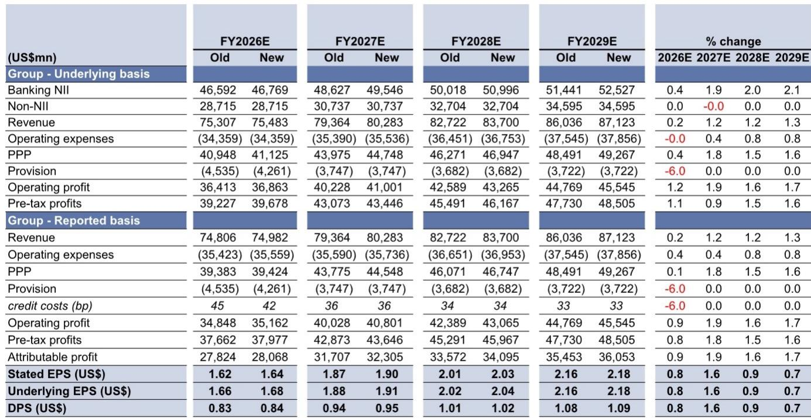
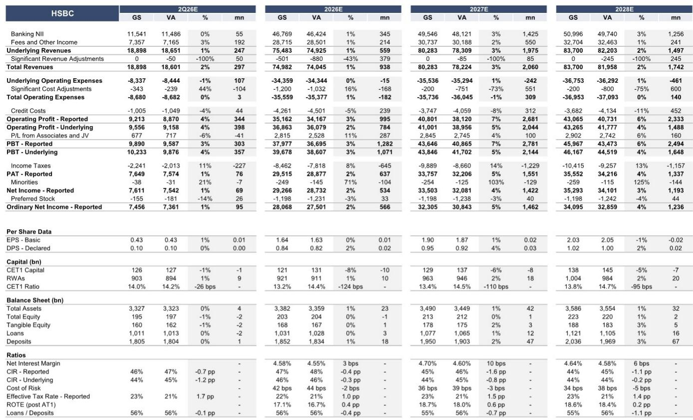
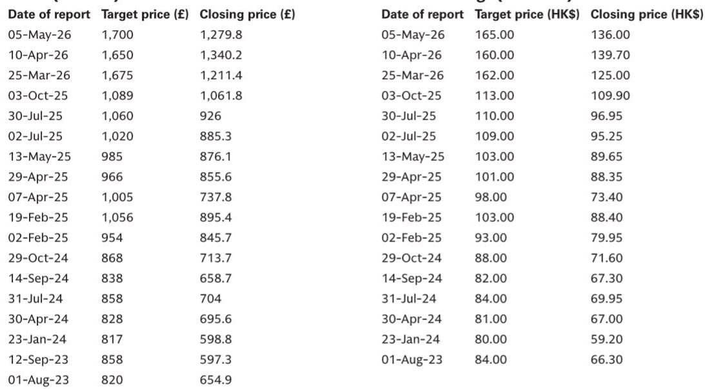

# GS：HSBC二季度预览，又一个强劲季度-关注净息差指引与财富趋势

HSBC将在8月4日公布二季度业绩。GS预期其基础税前利润达到102亿美元，同比增长25%，环比增长2%，比市场一致预期高出4%。这个季度最值得关注的不是利润本身，而是利润结构的变化方向——净息差正在受益于利率环境改善，但真正驱动长期增长的变量，是财富管理，尤其是来自中国跨境资金流入的持续性。

报告认为，二季度利润环比增长主要来自信用成本下降。GS预计二季度信用成本为40个基点，低于一季度的52个基点。中东冲突相关额外拨备不再出现，一季度的高拨备还受到一笔大额一次性信用事件影响。信用成本正常化是短期利润的支撑，但读者更应关注的是净息差指引和财富管理趋势。

## 1. 净息差受益于利率环境改善，但HIBOR的节奏才是关键

GS预计二季度银行净利息收入环比增长3%，背后是HIBOR季度均值上升6个基点、更高的计息天数以及资产负债表的持续扩张。更值得注意的信号是，HIBOR在季度末加速上行，这意味着三季度净息差的受益幅度可能更大。

报告上调了2026至2028年净利息收入预测，分别上调0.4%、2%和2%，目前银行净利息收入预测已比市场一致预期高出3%。上调的核心逻辑是“更高更久”的利率环境和更陡峭的回报表现曲线，通过结构性对冲再研究和资产负债表重定价持续发挥作用。

> **KC评论：** 净息差改善的持续性取决于HIBOR能否维持高位，而非利率水平本身。报告提到HIBOR在季度末才明显走强，这意味着二季度实际受益有限，真正的改善要等到三季度数据才能验证。

## 2. 财富管理才是真正的增长引擎，但高基数带来短期不确定性

非利息收入方面，GS预计二季度基础非银行净利息收入为74亿美元，同比增长6%，但环比下降7%。环比回落并非趋势逆转，而是因为一季度表现异常强劲——一季度财富净新增资金达到390亿美元，其中亚洲贡献340亿美元，远超四季度的260亿美元和一季度的230亿美元。

报告认为，二季度财富管理数据可能环比节奏变化，但这更多是基数效应，而非动能衰减。读者真正应该关注的是中国跨境监管政策的最新进展及其对财富流入的影响。这是HSBC区别于其他国际银行的核心变量——它在中国财富跨境流动中的中介地位，目前没有其他机构可以替代。

## 3. 资本回报重启，但回购规模只是起点

HSBC预计将在二季度恢复公司回购，此前因收购HSB暂停了三个季度。GS模型假设二季度宣布15亿美元回购，完成后核心一级资本充足率仍将保持在约14.0%。这个水平在行业内属于充裕，也为后续更大规模的回购留出空间。

报告上调了2026至2029年每股盈利预测，幅度最高达1.6%，主要反映更有利的利率前景，部分被更高的运营支出抵消——HSBC正在增加对增长计划和技术的研究。

HSBC二季度业绩的核心看点，不是利润是否符合预期，而是管理层如何回应三个问题：净息差指引是否上调、财富管理增长是否可持续、回购规模能否超出市场预期。这三个变量叠加在一起，决定了HSBC在未来12个月能否从“利率受益者”进化为“财富管理平台”。

For informational purposes only. Portions may be generated,translated,summarized,or edited with AI assistance based on source materials and may contain omissions or errors. Please verify independently. This is not investment,legal,tax,accounting,or other professional advice.

For informational purposes only. Portions may be generated,translated,summarized,or edited with AI assistance based on source materials and may contain omissions or errors. Please verify independently. This is not investment,legal,tax,accounting,or other professional advice.

