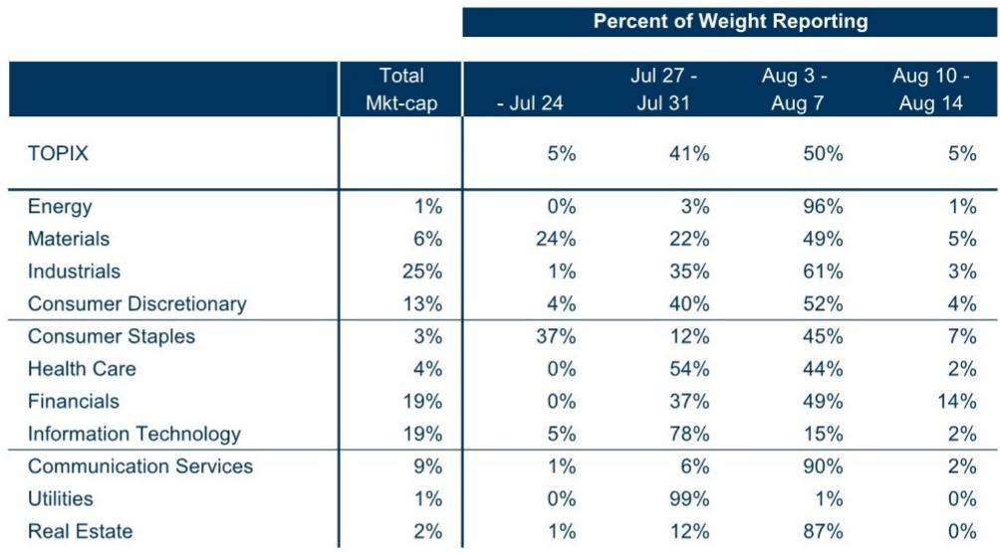
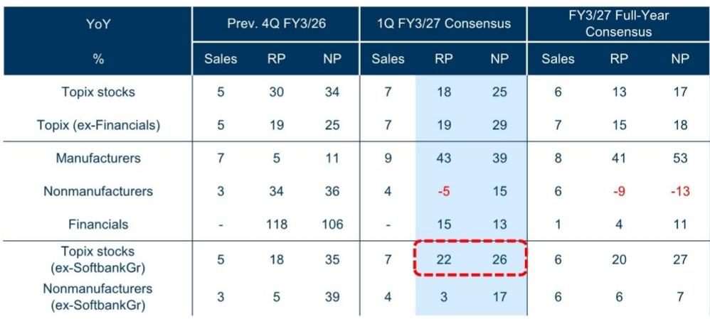
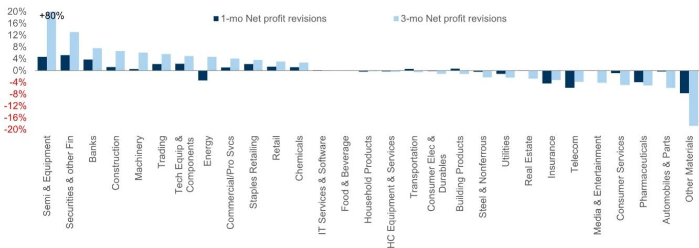

# GS：日本策略速报，FX与AI顺风遭遇高共识门槛

日本3月决算期企业的第一季财报即将进入发布高峰。GS在最新一期日本策略速报中给出了一个核心判断：市场对利润增长的预期已经很高，真正的考验不是企业能否盈利，而是能否交出超预期的数字。这份报告同时提供了两个关键变量——日元贬值和AI相关公司的贡献度——来帮助判断财报季可能出现的分化。

共识预期本身并不低。剔除软银集团后，TOPIX成分股第一季经常利润同比增长22%，净利润增长26%。未来四个季度，市场平均预期经常利润每季同比增长18%。这是一个连续高增长的基准线，意味着企业必须持续交出超预期成绩，才能维持当前的市场定价。

但GS提醒，价格反应可能不对称。AI相关公司对TOPIX每股盈利变动的贡献度，今年迄今已接近一半。如果这些公司在财报季未能提供足够大的正向惊喜，谨慎反应的概率反而更高。换句话说，AI主题已经部分被定价，财报季的边际信息价值在于“还能多好”，而不是“好需要继续观察”。

日元是另一个不可忽视的变量。报告显示，美元兑日元从2025财年第一季的均值144，升至2026财年第一季的159。GS外汇策略团队预计未来12个月日元将进一步走弱至165。根据其敏感性分析，美元兑日元每变动10日元，TOPIX每股盈利将反向变动约3.5%。而企业自身设定的2026财年汇率假设中位数为151，均值152，明显低于当前实际汇率。这意味着，如果日元维持当前水平，企业盈利存在进一步上修的空间。

> **KC评论：** 企业通常会在年初设定保守的汇率假设，实际汇率越偏离假设，盈利超预期的可能性越大。但这里的关键是，汇率红利能否持续，以及企业是否愿意在财报中主动上调全年指引。如果管理层选择保守，市场可能不会给予充分信任。

从行业层面看，半导体与半导体设备、资金、建筑、机械等板块在过去三个月获得分析师上调净利润预期最多；而医药、汽车及零部件、其他材料等板块则遭遇下调。这一分化已经体现在盈利修正指数中，该指数仍处于正值区间，但结构差异明显。

GS认为，整体而言，第一季财报的正向惊喜仍将多于负向惊喜。但考虑到AI相关公司的高权重和高预期，财报季的胜负手可能不在于整体数字，而在于那些被市场寄予厚望的公司能否兑现甚至超越预期。对于关注日本市场的读者而言，接下来两周的财报密集发布期，将是验证这一判断的关键窗口。

For informational purposes only. Portions may be generated,translated,summarized,or edited with AI assistance based on source materials and may contain omissions or errors. Please verify independently. This is not investment,legal,tax,accounting,or other professional advice.

For informational purposes only. Portions may be generated,translated,summarized,or edited with AI assistance based on source materials and may contain omissions or errors. Please verify independently. This is not investment,legal,tax,accounting,or other professional advice.

