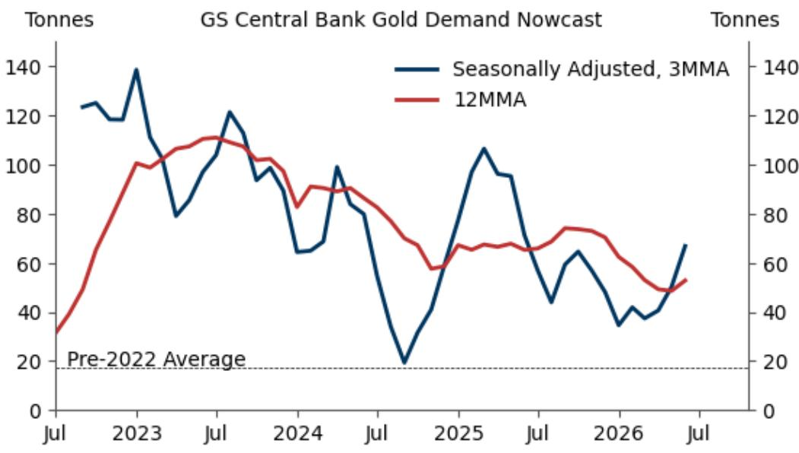
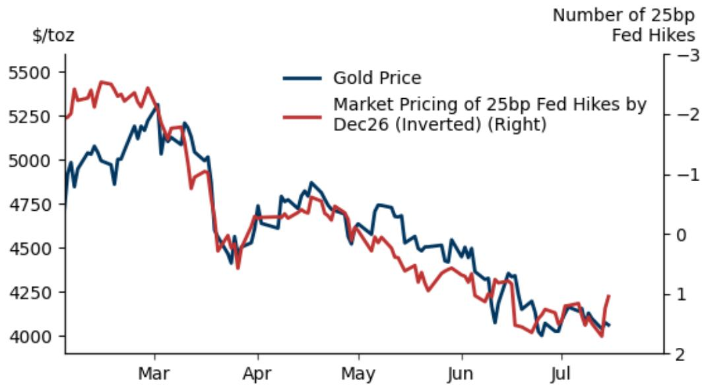
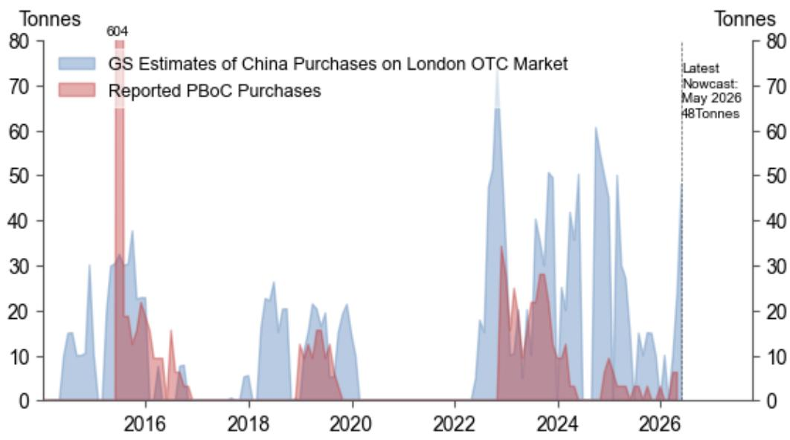

# GS：5月央行购金提供金价底部

5月全球央行黄金购买量达到81吨，这是GS最新nowcast模型给出的估算。其中中国一家就贡献了48吨，成为当月最大可识别买家。这个数字放在更长的时间轴上看更有意义：2022年之前，全球央行月均购金量只有17吨，而过去三个月经季节调整后的月均水平是67吨。央行买盘正在重新加速。

GS认为，央行购金的结构性趋势远未结束。2022年俄罗斯外汇储备被冻结之后，新兴市场央行开始系统性分散储备，这个逻辑至今仍是GS对2026年底金价每盎司4900美元预测的核心支撑。但报告同时指出，黄金短期面临来自美联储定价的不确定性——市场正在计入加息预期，这会抑制以利率敏感型ETF为代表的需求。好消息是，GS的宏观环境学家团队认为美联储不会真正加息，因此这个不确定性是暂时的。

## 1. 央行买盘的结构性逻辑比想象中更牢固

GS对央行购金的判断不是短期脉冲，而是多年代际趋势。2026年OMFIF调查显示，79%的储备管理者认为全球货币体系正在向多极化过渡，这直接导致地缘政治碎片化加剧。选择“保护免受地缘政治不确定性”作为购金理由的受访者占比达到51%，比2024年上升了11个百分点。分散化仍然是第一理由，但地缘政治对冲正在快速上升为并列支柱。

GS维持2026年月均购金50吨、2027年月均40吨的假设。报告还观察到一个季节性规律：央行购金通常在夏季节奏变化，9月之后重新加速。这意味着当前的数据波动更多是节奏问题，而非趋势逆转。

> **KC评论：** 央行购金的结构性叙事经常被简化为“去美元化”，但OMFIF调查揭示了一个更具体的驱动——对国际货币体系不确定性的担忧。79%的储备管理者认为体系在向多极化演变，这个比例本身就是一个比购金量更前置的信号。

## 2. 短期不确定性来自利率定价，而非基本面出现变化

黄金当前面临的最大近端不确定性是美联储加息预期。市场正在计入年内加息，这直接削弱了黄金作为宏观政策对冲工具的需求——当利率上升时，持有无息资产的机会成本上升，ETF资金流出不确定性加大。GS用一张图表展示了市场定价与黄金价格之间的负相关关系。

但报告明确区分了周期性和结构性因素。周期性不确定性来自市场对通胀的担忧和由此产生的加息定价，而结构性支撑来自央行购金和私人部门配置不足。GS宏观环境学家认为美联储不会真正加息，因此这个不确定性会随时间消退。关键在于，不确定性是“暂时的”，而不是趋势性的。

## 3. 私人部门配置是中期上行不确定性的核心变量

报告在中期展望中给出了一个容易被忽略的判断：黄金在私人组合观察中的占比仍然偏低。如果地缘政治紧张——包括伊朗局势和更广泛的冲突——持续发酵，分散化需求可能从央行扩展到私人读者。GS特别提到，这种扩展可能通过“削弱对西方财政可持续性的认知”来实现。

这是一个值得关注的逻辑链条：地缘政治不确定性不仅直接推高避险需求，还可能改变读者对主权信用的长期评估。如果西方主要地区的财政路径受到质疑，黄金作为无主权不确定性的资产，其配置价值会系统性上升。这个逻辑比短期利率定价更持久，也更难被证伪。

GS对金价的不确定性判断仍然是“偏向上行”。央行买盘提供了价格底部，而私人部门配置的潜在变化可能成为下一个增量来源。短期利率不确定性只是插曲，不是主旋律。

For informational purposes only. Portions may be generated,translated,summarized,or edited with AI assistance based on source materials and may contain omissions or errors. Please verify independently. This is not investment,legal,tax,accounting,or other professional advice.

