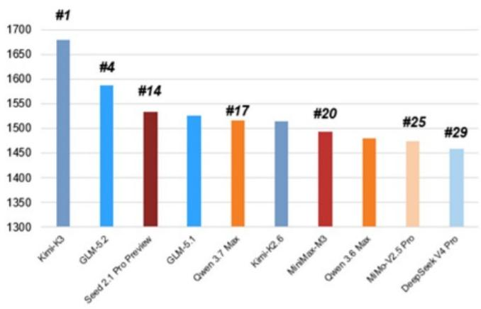
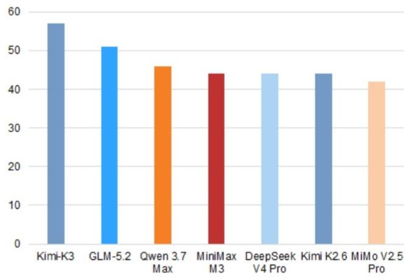
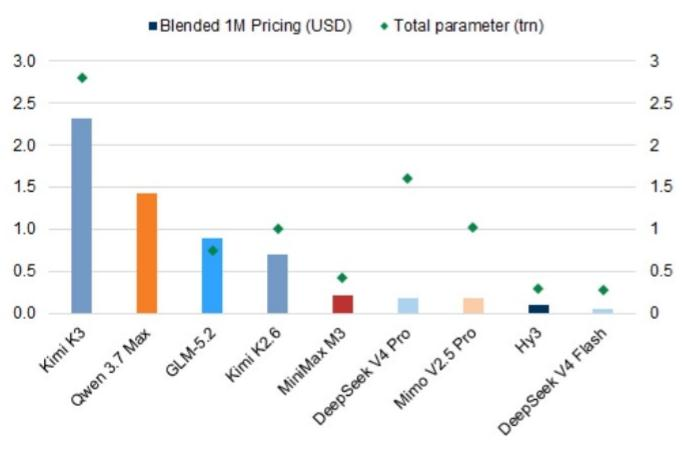
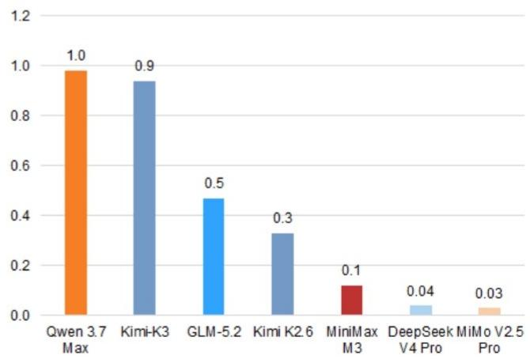
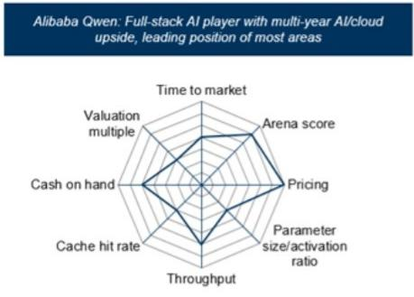
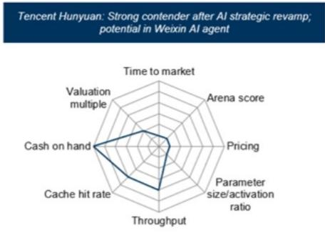
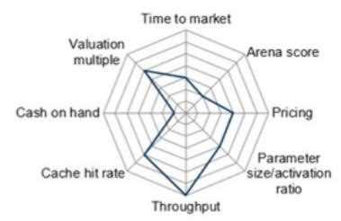
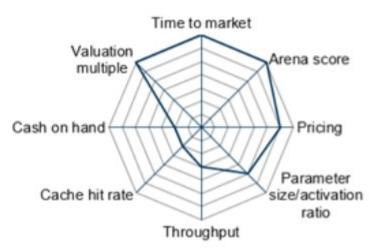
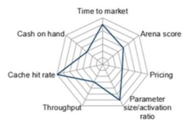
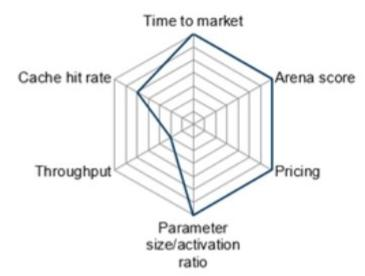

# 中国AI模型前沿观察

## 从Kimi K3看中国模型的新突破：从成本效率、智能水平到定价能力

从成本效率（DeepSeek）、模型智能水平提升（GLM）到Kimi K3的新前沿/定价能力

7月17日，Kimi K3开源权重模型发布，拥有2.8万亿参数，在编程和某些智能体能力方面达到了全球新水平，根据Arena.ai编程排名和Artificial Analysis Intelligence评分（图1）。同时，K3的定价在中国模型中创下新高，每百万token混合定价2.3美元，而Qwen3.7 Max为1.4美元、智谱GLM5.2为0.9美元、MiniMax M3为0.22美元、DeepSeek V4 Pro为0.18美元，仍低于全球前沿模型（图3）。

正如我们在近期中国大语言模型研究报告中指出的，我们认为中国的AI开源/开源权重模型在智能表现上正接近一个关键节点，有望实现全球范围的推广。展望2026年下半年，我们预计高端编程领域的竞争可能通过编程数据飞轮和规模扩展（向更大模型发展，参数规模达2-5万亿）而加剧。知识图谱/智谱（我们近期给予中性评级，7月17日下跌28%）和MiniMax（报告评级，7月17日下跌16%）的报价反应，我们认为源于市场对中国AI模型竞争格局以及潜在长期赢家的担忧，因为竞争格局和模型公司领导地位的可持续性仍高度动态。

我们持续认为，独立AI模型公司在我们构建的竞争定位框架中表现突出。我们也注意到，中国领导人在上海世界人工智能大会开幕式上的讲话传递了积极信号，将AI的社会影响类比于电力和蒸汽机的发明，并表示中国将以开放姿态向发展中国家提供技术基础设施，同时也提醒需要人类监督/控制和风险防范。

### 接下来关注什么？

**智能体/智能体应用：** 我们预计中国AI模型公司将越来越注重将智能体/智能体应用作为关键入口，尤其是在编程领域（如智谱ZCode、腾讯Workbuddy、阿里Qoder等聚合平台，支持全套AI模型），模型公司试图通过闭环获取更多真实编程和智能体数据用于规模扩展。协同工作和行业专家智能体产品可能是下一步重点。

■ **多个大参数高端编程模型发布，以及可能对境外获取最先进中国AI模型的限制趋严：** Kimi K3发布后，我们预计2026年下半年将有更多中国AI模型发布（智谱GLM、阿里Qwen、MiniMax M3 Pro等），参数规模将显著扩大至2-5万亿。编程领域的竞争将持续激烈。多模态/视觉理解能力的加入也将是中国AI基础模型的下一次升级。

■ **低端智能体领域的API定价持续承压：** 我们预计API定价及毛利率在低端定价领域（每百万token约0.1-0.2美元）在下半年仍将面临压力，因为中国AI模型公司在融资后拥有充裕现金储备来补贴竞争性定价。因此，我们认为财务实力是评估中国AI模型公司的三个最重要指标之一（与定价能力和成本效率并列）。

■ **多模态/视频生成模型的全球采用将推动ARR持续增长：** 我们预计视频生成领域（不同于基础文本模型）将保持健康的行业定价和毛利率，字节跳动的SeeDance（据报道毛利率达70%，最新ARR运行率约20亿美元）、快手（买入）的Kling和MiniMax（买入）的Hailuo/即将推出的H3模型，将在2026年下半年受益于新功能突破（视频生成与大语言模型结合）以及需求远超供给的紧张算力资源。

我们还预计，国内ASIC供应增加、未来最前沿中国模型对海外市场的任何更严格准入、西方市场对中国模型的政策、以及模型训练中高端算力的获取，将是影响我们对中国AI模型token/收入增长轨迹的关键变量/风险。

### 主要关注方向/公司

■ **在云与数据中心领域（我们在中国互联网板块中最看好的子领域），** 我们持续强调主要关注方向（阿里、万国数据、世纪互联、金山云），基于2026年下半年AI超大规模资本支出的增加。

■ **在AI模型领域，** 我们关注MiniMax，认为其风险回报偏向上行。MiniMax提升整体竞争定位的关键变量将取决于其定价能力，近期完成的融资已增强其财务实力。我们预计其H3视频生成模型表现（即将在比文本模型更有利的行业环境中发布）以及下一代M3更新的上市时间（重点通过后训练/强化学习进一步提升编程智能水平，我们估计M3更新在7-8月，更大参数规模的M3 Pro模型在2026年下半年晚些时候）将是下一个关键驱动因素。

### 近期研究报告参考

■ 中国AI模型导航：大语言模型研究报告——全球推广的智能关键节点，2026年7月10日

■ 知识图谱科技（2513.HK）：以1100亿美元估值给予中性评级；中国领先的企业/编程AI模型，2026年7月10日

■ MiniMax集团（0100.HK）：股份解禁后的关键关注点；风险回报偏向上行；买入，2026年7月10日

**图1：Code Arena已更新全球排名...**
最新评分及模型排名，截至2026年7月16日

来源：LMArena，数据由GS全球投资研究整理

**图2：...Artificial Analysis Intelligence指数也已达到或接近全球前沿水平**
Artificial Analysis Intelligence指数

来源：Artificial Analysis，数据由GS全球投资研究整理

**图3：Kimi K3因模型智能水平和参数规模提升而提高混合API定价**

来源：Artificial Analysis，数据由GS全球投资研究整理

**图4：完成AA智能基准测试的总成本上升3倍，与API定价涨幅一致**
每次任务成本（美元）

来源：Artificial Analysis，数据由GS全球投资研究整理

**图5：主要大语言模型实验室/模型的竞争定位分析**

MiniMax M系列：独立玩家中独特的全模态能力；成本高效的算力架构

DeepSeek：极致成本效率，以竞争性定价维持可扩展的token使用量

**Kimi K系列**

私有公司估值倍数不适用

来源：GS全球投资研究

**图6：AI模型玩家的竞争定位框架**

来源：GS全球投资研究
