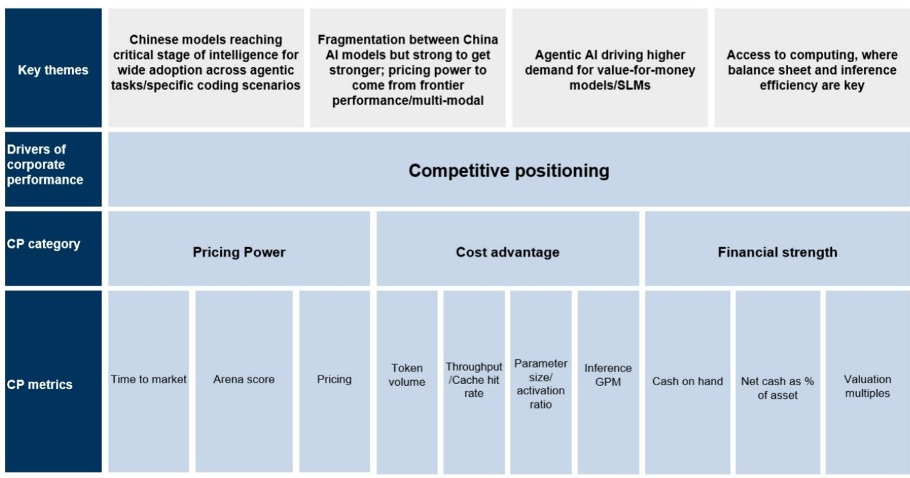
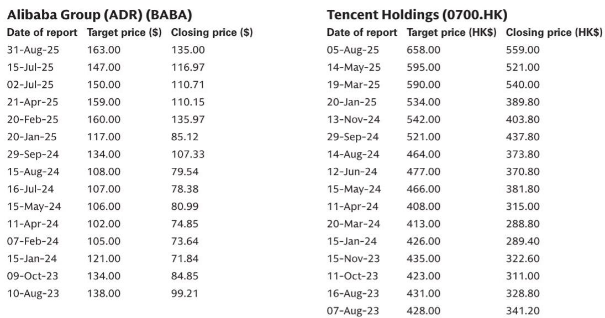
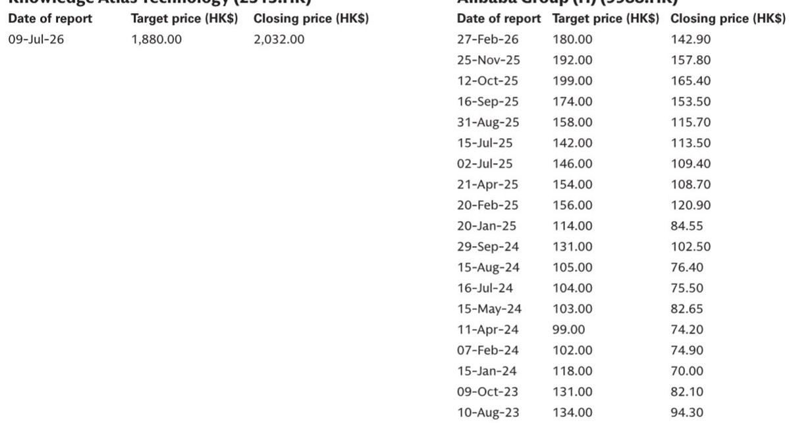

# GS：中国AI模型新前沿-KimiK3从成本效率到智能定价

7月17日，月之暗面发布Kimi K3开源权重模型，参数量2.8万亿。这个数字本身不是最值得关注的——真正值得关注的是它的定价。K3的混合API定价为每百万token 2.3美元，是中国模型迄今最高价，远超Qwen3.7 Max的1.4美元、智谱GLM5.2的0.9美元、MiniMax M3的0.22美元和DeepSeek V4 Pro的0.18美元。GS在最新报告中指出，中国开源模型正在接近一个关键节点：模型智能水平足以支撑全球扩散，而定价权开始从“成本效率”向“智能溢价”迁移。

这轮变化的信号很明确：中国AI模型竞争不再只是拼低价。K3在Arena.ai编程排名和Artificial Analysis智能指数上已接近全球最前沿水平，定价随之抬升。报告认为，独立模型公司的竞争格局仍高度动态，但定价能力正在成为区分赢家的新标尺。

## 1. 编程赛道的“数据飞轮”正在加速头部集中

GS在近期发布的LLM基础报告中预判，高端编程领域的竞争将在2026年下半年加剧，驱动力来自编程数据飞轮和模型规模扩张（参数规模升至2-5万亿）。K3的发布验证了这一方向。报告特别指出，编程/agentic应用正成为中国模型公司的关键入口——智谱的ZCode、腾讯的Workbuddy、阿里的Qoder等聚合平台试图通过闭环获取更多真实编程和agentic数据，用于模型迭代。

这意味着，编程赛道的竞争逻辑正在从“模型参数比拼”转向“数据-应用-模型”的飞轮效应。谁的平台能捕获更多高质量编程数据，谁就能在下一轮模型升级中占据先机。GS预计，2026年下半年还将有智谱GLM、阿里Qwen、MiniMax M3 Pro等更大参数规模（2-5万亿）的模型密集发布，编程赛道的竞争烈度只会更高。

> **KC评论：** 报告没有直接说，但隐含的判断是：编程数据飞轮一旦启动，后来者追赶的成本会指数级上升。这可能是当前模型公司估值分化的核心变量——不是谁参数大，而是谁的数据闭环更完整。

## 2. 低端API定价仍将承压，财务实力成为生存门槛

与高端模型定价抬升形成对比的是，低端agentic领域的API定价（约每百万token 0.1-0.2美元）将持续承压。GS判断，中国模型公司在完成融资后拥有充裕现金储备，有能力通过补贴维持低价竞争。这意味着，低端市场的毛利率改善在2026年下半年几乎看不到拐点。

报告因此将财务实力列为评估中国AI模型公司的三大核心指标之一，另外两个是定价能力和成本效率。这三者构成了一个三角：没有财务实力就无法支撑低价竞争，没有定价能力就无法在高端市场获利，没有成本效率就无法在低端市场存活。MiniMax在近期完成融资后财务实力增强，是GS将其列为“不确定性回报偏向上行”的关键原因之一。

## 3. 视频生成是当前最健康的细分赛道

与基础文本模型的价格战不同，视频生成赛道呈现出截然不同的行业格局。GS指出，字节跳动的SeeDance（据报毛利率70%，最新ARR约20亿美元）、快手的Kling和MiniMax的Hailuo/即将发布的H3模型，在2026年下半年有望保持健康增长。驱动力来自新功能突破（视频生成与LLM的结合）和算力资源紧张——需求显著超出供给。

这个细分赛道的定价权和毛利率远优于基础文本模型，原因在于：视频生成的技术壁垒更高、算力消耗更大、供给端玩家更少。报告认为，视频生成模型的ARR有望从全球采用中获得进一步加速。

## 4. 观察框架：用“财务实力-定价权-成本效率”三角评估模型公司

GS在报告中提供了一个可复用的竞争定位框架。这个框架的核心不是看模型跑分，而是看三个维度的组合：财务实力决定能烧多久，定价权决定能否在高端市场变现，成本效率决定低端市场的生存空间。

以Kimi K3为例，它在定价权维度上做到了中国模型的最高点，但财务实力（作为未上市公司）和成本效率（2.8万亿参数带来的推理成本）仍需观察。MiniMax则是在三个维度上相对均衡：近期融资补充了财务实力，M系列的全模态能力提供了差异化定价空间，成本效率架构是其长期优势。

> **KC评论：** 这个框架对读者最大的价值在于：它把“模型好需要继续观察”这个模糊问题，拆解成了三个可追踪、可比较的硬指标。下次看到新模型发布，不妨先问：它的定价比同行高还是低？它的现金能支撑多久低价竞争？它的推理成本有优势吗？

GS在报告中也列出了几个需要持续跟踪的变量：国内ASIC芯片供给的增加、中国最前沿模型在海外市场的准入限制、西方市场对中国模型的政策态度，以及高端训练算力的可获得性。这些外部因素可能随时改变上述三角框架的权重分配。

---

For informational purposes only. Portions may be generated,translated,summarized,or edited with AI assistance based on source materials and may contain omissions or errors. Please verify independently. This is not investment,legal,tax,accounting,or other professional advice.

For informational purposes only. Portions may be generated,translated,summarized,or edited with AI assistance based on source materials and may contain omissions or errors. Please verify independently. This is not investment,legal,tax,accounting,or other professional advice.

