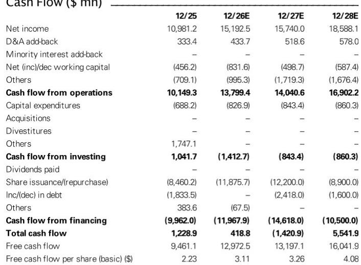
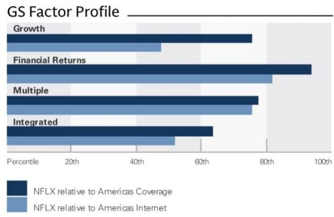
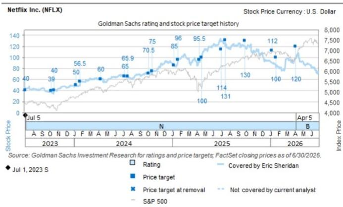

# GS：Netflix Q2-26观察，管理层聚焦收入复合增长与利润率轨迹

Netflix 在 2026 年第二季度的财报沟通中，管理层反复强调了一个核心信号：公司未来的价值创造，不再单纯依赖用户数的线性增长，而是转向收入复合增长、利润率轨迹和资本配置效率这三者的协同。这份GS研报指出，尽管市场对用户参与度和内容合作的讨论仍会引发短期波动，但长期来看，Netflix 的定价能力、广告收入爬坡和资本回报计划，正在重塑其作为成熟平台的估值逻辑。

报告特别点明了一个容易被忽视的事实：2026 年上半年，Netflix 的用户参与度数据与GS预期一致，并未出现市场此前担忧的下滑。管理层同时将行业参与度数据的披露频率从半年一次改为每年一次，这一变化本身就在暗示，公司认为用户参与度已不再是衡量平台健康度的相对少见敏感指标。

> **KC评论：** GS这份报告的核心判断是，Netflix 正在从“增长型公司”向“增长+回报型公司”过渡。读者需要关注的焦点，应从每季度的用户净增数字，转向自由现金流生成能力和资本回报计划的执行节奏。报告中的财务模型显示，2026 至 2028 年，Netflix 的自由现金流将从约 130 亿美元增长至约 160 亿美元，而同期股份回购规模预计将维持在每年 90 至 120 亿美元的水平。

## 1. 广告业务正在成为收入增长的“第二引擎”，而非附属品

管理层在沟通中重申了 2026 年广告收入达到 30 亿美元的目标。GS认为，这一目标的实现路径比市场预期的更为清晰。报告提到，Netflix 在广告技术基础设施上的研究以及与关键合作伙伴的整合，正在为 2026 年及以后的广告业务建立持续的增长动能。这并非一个“锦上添花”的故事，而是直接贡献于公司整体收入增速和利润率的结构性变量。

## 2. 内容研究策略正在从“量”转向“质”，新格式成为增长催化剂

管理层特别强调了“质量参与度”这一内部定义指标，并举例说明，在直播、游戏等新内容格式上的增量投入，已经直接刺激了用户增长。例如，Netflix 与 NFL 的直播合作续约，以及过去五年中用户注册量最高的十天里有六天来自直播内容。游戏方面，6 月推出的两款云游戏成为公司史上最成功的首发，Netflix Playground 的用户规模实现了三倍增长。这些数据表明，内容研究的边际回报正在改善，而非递减。

## 3. 资本回报计划正在改变公司的定价逻辑

第二季度，Netflix 回购了约 47 亿美元的公司，现有授权下仍有约 271 亿美元的回购额度。GS预计，2026 至 2028 年，公司每年将维持 90 至 120 亿美元的回购规模。在自由现金流持续增长、净债务/EBITDA 比率从 0.4 倍降至负值的背景下，资本回报正在成为支撑估值的重要力量。报告隐含的判断是，当一家公司能够同时实现 22.5% 的三年 EPS 复合增长和持续的资本回报时，其估值体系理应获得溢价。

## 4. 短期波动不会改变长期结构，但市场需要适应新的叙事节奏

报告坦承，第三季度的收入指引低于市场预期，管理层将其归因于季度间比较基数的波动。同时，三季度运营利润指引也低于预期，原因是销售与市场推广、技术开发等投入的增加。这些短期数字可能继续引发市场对用户增长和利润率节奏的讨论。但GS认为，这些讨论不会改变公司长期的基本面方向。关键在于，管理层正在主动引导市场关注年度预算和运营表现，而非季度波动。这一叙事转换本身，就是公司成熟化进程的一部分。

> **KC评论：** 对于关注 Netflix 的读者而言，GS这份报告提供了一个清晰的观察框架：将注意力从“每季度新增多少用户”转移到“每用户收入是否在提升、广告收入占比是否在扩大、资本回报是否在加速”。报告中的财务模型显示，2026 至 2028 年，Netflix 的 EBIT 利润率将从 31.5% 提升至 34.6%，而收入增速仍能维持在 12% 以上。这种“利润率扩张+中高增速”的组合，在大型互联网公司中并不多见。

For informational purposes only. Portions may be generated,translated,summarized,or edited with AI assistance based on source materials and may contain omissions or errors. Please verify independently. This is not investment,legal,tax,accounting,or other professional advice.

For informational purposes only. Portions may be generated,translated,summarized,or edited with AI assistance based on source materials and may contain omissions or errors. Please verify independently. This is not investment,legal,tax,accounting,or other professional advice.

