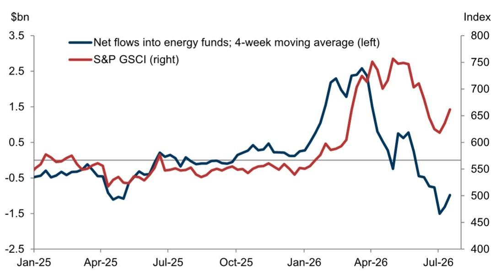
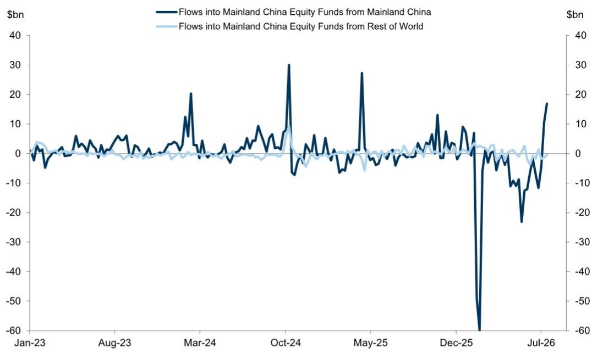
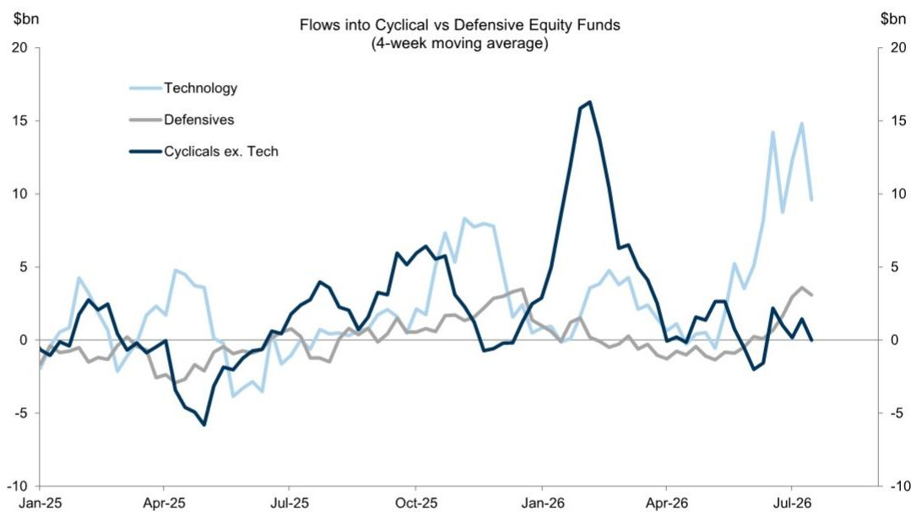

# 全球资金流向观察：能源与风险偏好的再校准

截至7月15日当周，全球权益类基金净流入560亿美元，与上周持平；固定收益类基金再添200亿美元。这些总体数字表明市场已找到支撑。但在整体稳定之下，一场更具启示性的转变正在发生：能源板块资金流在数周后首次转为净流入，科技板块继续以异常速度吸收资金，新兴市场权益类基金单周净流入飙升至250亿美元——远高于前一周的150亿美元。与此同时，货币市场基金遭遇1200亿美元的大幅流出，为统计期内最大单周降幅。这并非简单的“风险偏好回升”，而是一次有目的性的再配置：资金从现金转向特定区域和板块，反映出关于地缘格局、利率和增长差异的新宏观假设。

时机值得关注。中东局势再度紧张，重新引入了此前逐渐消退的能源风险溢价。但此次能源板块变动的构成不同寻常：欧洲天然气价格涨幅超过原油，这一分化已在汇市显现。美元和韩元跨境需求较强，而人民币持续净流出。这些并非随机信号，而是形成了一致模式：资本奖励那些直接受益于科技供应链和能源安全叙事的市场，同时回避被认为在地缘摩擦或通缩压力面前结构性脆弱的地区。

对于机构配置者而言，关键问题不再是风险偏好是否回归——它已经回归。问题是当前的轮动是可持续的还是战术性的。单周数据足以构建一个决策框架。资金流并非均匀分布，而是集中、有方向性，且日益与特定宏观触发因素挂钩，而非对风险资产的一揽子拥抱。理解哪些资金流是结构性的、哪些是反应性的，是布局持续趋势与追逐反弹行情之间的分水岭。

## 科技板块资金流：不仅主导，更在定义整个权益配置框架

科技板块基金当周净流入174亿美元，四周累计达384亿美元。其他板块难以望其项背。金融板块以40亿美元周流入和100亿美元四周累计位居第二。科技板块四周z-score为2.60，表明当前资金流高于历史均值两个标准差以上。这不是边际偏好，而是信念交易。

其影响超越板块表现。当一个板块吸收如此不成比例的权益资金时，它会重塑整个组合的风险特征。通过被动基准配置科技板块的读者，实际上是在对同一宏观主题进行杠杆押注：无论利率环境如何，AI基础设施、半导体需求和数字化转型将持续扩张。数据目前支持这一主题，但集中度风险真实存在。科技板块四周资金流几乎是金融、医疗和工业板块合计流入的四倍。科技叙事一旦逆转——无论源于监管行动、供应链中断还是AI投资情绪转变——都将对全球权益组合产生超比例影响。

资金流还揭示了科技板块内部对高贝塔敞口的偏好。高贝塔板块综合指数（包括科技、大宗商品和金融）当周流入26亿美元，而低贝塔板块（如消费品、房地产和公用事业）净流出13亿美元。这是一个追求回报而非寻求避险的市场。

## 能源板块资金转正，但变动构成指向地缘因素而非周期性再通胀

截至7月15日当周，能源板块基金净流入6.53亿美元，此前四周累计流出74亿美元。逆转幅度显著，但尚未形成广度。当周流入仅占能源基金管理资产的0.21%，而科技板块为0.75%。能源板块的变动是对地缘触发因素的反应性反弹，而非结构性重估。

报告明确指出，能源价格反弹是美元和前端美债回报表现的重要支撑。然而，本轮能源周期与3月和4月飙升的区别在于，欧洲天然气表现优于原油。这对汇市意义重大。天然气主导的能源冲击对欧洲贸易平衡和通胀预期的影响不同于石油主导的冲击，进而对欧元和英镑产生不同影响。跨境外汇数据支持这一解读：美元在G10货币中净需求较强，欧元和英镑流入较为温和。能源故事并非单一。读者在评估汇率和固收影响时，需要区分石油敞口和天然气敞口。

这些能源资金流的可持续性取决于地缘风险溢价是持续还是消散。如果局势缓和，能源资金流可能像出现时一样迅速逆转。如果进一步升级，资金流可能加速，但伴随不同的风险特征——包括可能挑战权益和固收配置的滞胀压力。

## 新兴市场权益资金激增，但分布狭窄且高度集中于三个市场

新兴市场权益基金当周净流入250亿美元，较前一周的150亿美元大幅增加，与6月底的流出形成鲜明逆转。四周累计达249亿美元。这是数据中最引人注目的轮动。

然而，资金流分布揭示了脆弱的集中度。中国大陆单周贡献162亿美元，韩国63亿美元，台湾28亿美元。这三个市场几乎代表了全部新兴市场权益流入。相比之下，印度净流出2.03亿美元，巴西流出3.97亿美元。新兴市场故事并非对发展中市场的广泛重新参与，而是对科技供应链轴线的押注——中国因其国内AI和半导体生态系统，韩国和台湾因其存储芯片和代工主导地位。

韩国和台湾的z-score分别为3.56和2.52，表明资金流高于历史均值三个和两个标准差以上。这些是极端读数。它们表明机构读者正在对这些市场进行集中、信念驱动的配置，很可能与推动发达市场科技板块资金流的同一AI和半导体主题相关。对于配置者而言，风险在于这种集中度在新兴市场权益和发达市场科技之间创造了相关敞口。全球科技股回调可能同时冲击这三个新兴市场，削弱新兴市场配置本应提供的多元化收益。

## 固收资金流广泛但呈现防御性倾向：短久期和通胀保护

固定收益基金当周净流入198亿美元，四周累计969亿美元。广度值得注意：政府债券、抵押贷款支持证券、市政债券和综合型基金均录得正流入。但构成揭示了谨慎的暗流。

短久期债券基金当周流入44亿美元，四周累计224亿美元，成为按流量计最大的固收类别。通胀保护债券基金当周流入5.86亿美元，四周累计14亿美元。这些并非相信利率周期已明确转向的读者所做的配置。它们是希望获得固收敞口但同时对通胀粘性或终端利率高于定价进行对冲的读者所做的配置。

相比之下，长久期基金仅流入19亿美元，高收益基金实际净流出2.46亿美元。回报表现曲线定位是防御性的。读者仅在前端承担久期风险，那里利率敏感性较低且滚动收益更可预测。这与市场预期美联储将更长时间维持高利率一致，即便权益读者在追逐科技和新兴市场风险。

新兴市场固收故事更为微妙。硬通货和本币债券基金均录得流入，新兴市场固收当周合计增加8.78亿美元。但本币部分仅为3.48亿美元，低于6月底的25亿美元。对新兴市场本币债务的热情似乎正在消退，或许因为美元强势叙事重新确立。对于新兴市场债务读者而言，利差与货币贬值之间的权衡正变得不那么有吸引力。

## 配置者决策框架：三个问题判断轮动是结构性还是战术性

本周数据可以组织成一个简单但严谨的决策框架。每位配置者在调整头寸前都应问三个问题。

第一，科技板块资金流是自我强化还是容易均值回归？四周z-score为2.60，历史高位但并非前所未有。风险不在于科技资金流停止，而在于它成为相对少见的游戏，造成拥挤效应，在情绪转变时放大下行。配置者应测试组合在科技板块资金流于四至八周内回归均值的情景。那将意味着每周科技流入减少150至200亿美元，很可能伴随更广泛的权益回调。

第二，新兴市场权益激增是结构性重估还是战术性追赶？集中于中国、韩国和台湾表明是对AI供应链的战术押注，而非对新兴市场增长的广泛重新参与。配置者应审视其新兴市场敞口是否跨国家和跨行业分散，还是实际上是对三个半导体重仓市场的杠杆押注。如果是后者，与发达市场科技的相关性将危险地高。

第三，能源资金流是持续再配置的开始还是单周反射？四周流出74亿美元表明，在地缘升级之前，机构对能源的情绪已深度负面。一周的正流入不构成趋势。配置者应监测能源资金流是否在最初的地缘触发因素之外扩大，还是仍局限于少数石油和天然气标的。如果扩大，将表明市场正在定价持续性的能源风险溢价。如果收窄，则变动很可能是战术性的。

货币市场基金1200亿美元的流出提供了最后一块拼图。这些现金正在重新部署到权益和固收，但并非不加区分。它流向科技、短久期债券和三个新兴市场。轮动是真实的。其可持续性取决于支撑它的宏观假设——利率稳定、AI需求持续和地缘风险高企——在未来几个季度是否成立。

*仅供参考。部分内容可能基于源材料通过AI辅助生成、翻译、摘要或编辑，可能存在遗漏或错误。请独立核实。本文不构成专业建议。*
