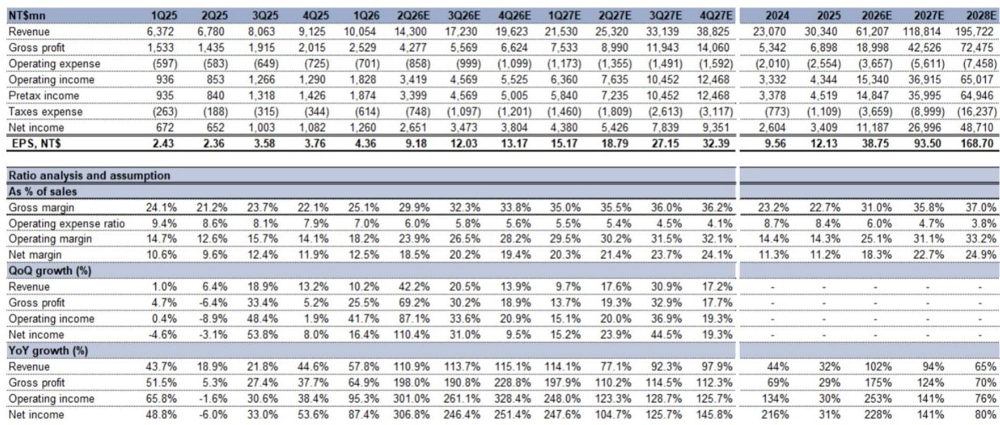
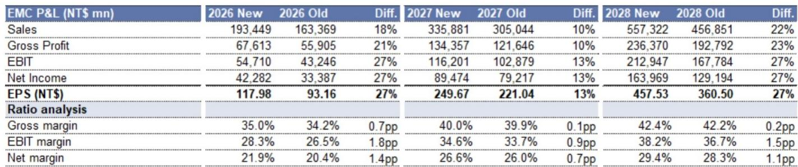
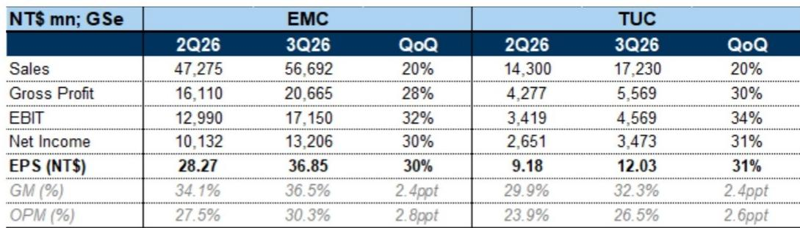

# 台湾CCL高端厂商盈利能力重启升势

AI服务器对高端铜箔基板（CCL）的需求，正在以每年弹性较高的速度增长，而供给端的扩张速度却只有需求的四分之一。最新报告的核心判断是：这种供需裂口不是短期错配，而是结构性持续到2028年的格局。这意味着，高端CCL供应商的定价逻辑正在发生根本性转变——从过去被动跟随原材料成本涨价，转向主动利用供应瓶颈获取溢价。

报告选取了台湾两家核心供应商EMC和TUC作为分析对象。预计从2026年第二季度开始，这两家公司将进入新一轮毛利率扩张周期，季度环比提升2至4个百分点以上。这一判断的背后，是AI客户对高品质CCL的强烈需求，已经让下游PCB厂商愿意接受涨价，并将成本转嫁给终端客户。

## 1. 高端CCL需求以较高年复合增速增长，而供给增速相对有限

报告更新了CCL行业模型，预计2025至2028年全球CCL市场总规模将从约370亿美元增长至570亿美元，年复合增速53%。但真正的驱动力集中在高端产品上：高端CCL需求同期年复合增速较高，而中低端CCL仅增长1%。

需求的主要来源是AI服务器和交换机，分别以较高和适中的年复合增速拉动。英伟达是其中较强的单一驱动力，其CCL需求年复合增速较高。这不仅仅是GPU出货量的增长，更关键的是单系统CCL价值量的跃升——从GB300到VR200，CCL的美元含量增加了3.5倍以上，原因是材料从M7+升级到M8+，单价提升50%以上，同时每块系统板还增加了额外的中板设计。

供给端则显得相对有限。报告预计，高端CCL产能扩张年复合增速仅为22%，远低于需求增速。结果是，整个2026至2028年，高端CCL市场将持续处于供不应求的状态。而低端CCL市场则因消费电子需求变化（智能手机和PC出货量预计在2026至2028年出现负增长或微增），产能利用率尚未饱和，供需格局截然不同。

> **观察：** 这张供需对比图（Exhibit 2）是整份报告最核心的支撑。较高的增速差，意味着高端CCL供应商在未来三年内几乎不用担心订单问题。真正值得关注的不是“能不能”，而是“能卖到什么价格”。

## 2. 定价权从成本驱动转向需求驱动，高端CCL涨价更可持续

报告区分了两种涨价逻辑。低端CCL的涨价主要来自原材料成本推动——E-glass价格在2026年上半年飙升了80%以上，因为供应商将产能转向更高价值的Low Dk玻璃纤维，导致普通E-glass严重短缺。这种涨价是成本驱动的，一旦原材料供应缓解（报告预计2026年第四季度E-glass短缺将逐步缓解），涨价动力就会减弱。

高端CCL则不同。涨价的核心驱动力是AI客户对高品质CCL的强烈需求，以及供应瓶颈的持续存在。报告认为，高端CCL供应商现在已经成为AI供应链中的关键瓶颈环节——玻璃纤维、铜箔等关键材料的分配权，实际上掌握在高端CCL厂商手中。下游PCB客户为了获得稳定的高品质CCL供应，愿意接受涨价，并将成本转嫁给终端客户。

报告预计，2026年下半年将启动第二轮高端CCL涨价，M7+等级CCL价格环比再涨10%至15%。这轮涨价不太可能遇到客户抵制，因为AI PCB客户普遍能够将额外成本向下游传导。

## 3. 毛利率从二季度开始进入新一轮扩张周期，三季度AI项目集中放量

报告对EMC和TUC的季度预测提供了具体的验证节点。2026年第二季度，两家公司的毛利率预计环比提升约4.7个百分点——EMC达到34.1%，TUC达到29.9%。推动力来自两个方面：一是M6及以下等级CCL涨价40%以上，加速产品组合改善；二是M7+等级CCL从4月起涨价10%至15%。

进入第三季度，毛利率预计再环比提升2.4个百分点。这个季度有几个关键AI项目集中放量：AWS Trainium 3的CCL出货量预计环比增长50%以上，英伟达Vera Rubin的CCL将从8月开始进入量产，谷歌TPU的CCL将从9月开始出货。报告预计，EMC和TUC第三季度的毛利率将分别比市场一致预期高出3.1和3.3个百分点，每股收益分别高出34%和21%。

> **观察：** 报告给出的季度毛利率路径（从1Q26的29.4%/25.1%到4Q26的37.4%/33.8%）是一个清晰的验证框架。如果实际数据连续两个季度接近或超过这个指引，说明高端CCL的定价权转移已经确认。反之，则需要重新评估供需格局的紧度。

## 4. 一个可复用的观察框架：关注CCL价值量而非出货量

对于跟踪AI供应链的读者，这份报告提供了一个值得借鉴的视角：在CCL领域，单系统价值量的提升比出货量的增长更重要。英伟达VR200的CCL价值量是GB300的3.5倍以上，主要来自材料升级和板层增加。同样，通用服务器从M6向M7等级CCL迁移，单价提升80%以上。

这意味着，即使AI服务器出货量增速节奏变化，只要CCL规格持续升级，高端CCL供应商的收入和利润仍可能保持增长。报告预计，高端CCL在全球CCL市场中的占比将从2025年的不到40%，提升至2028年的82%。这一结构性变化，比任何季度出货量数据都更能说明行业趋势。

For informational purposes only. Portions may be generated,translated,summarized,or edited with AI assistance based on source materials and may contain omissions or errors. Please verify independently. This is not investment,legal,tax,accounting,or other professional advice.

For informational purposes only. Portions may be generated,translated,summarized,or edited with AI assistance based on source materials and may contain omissions or errors. Please verify independently. This is not investment,legal,tax,accounting,or other professional advice.

