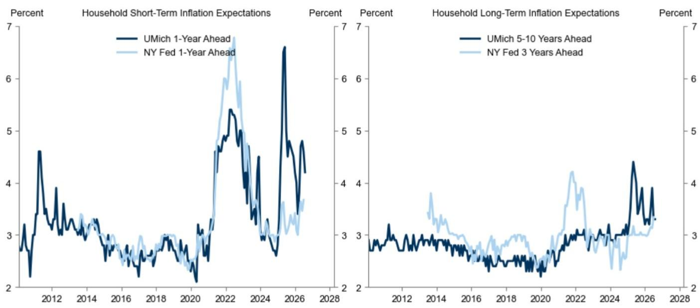

# 美国密歇根大学消费者信心指数上升；短期通胀预期下降

**核心观点**：密歇根大学7月初步报告显示，消费者信心指数增幅超预期。报告中的1年期通胀预期指标下降0.4个百分点至4.2%，5-10年期通胀预期指标持平于3.3%。

## 美国宏观环境概览

密歇根大学消费者信心指数 +1（1，+1）

## 关键数据

密歇根大学消费者信心指数（初步）7月为54.4，对比研究预期51.5，市场普遍预期51.0，前值49.5

密歇根大学1年期通胀预期（初步）7月为4.2%，对比市场普遍预期4.4%，前值4.6%

密歇根大学5-10年期通胀预期（初步）7月为3.3%，对比研究预期3.3%，市场普遍预期3.3%，前值3.3%

## 主要观点

1. 密歇根大学7月初步报告显示，消费者信心指数上升4.9点至54.4，高于预期。调查中的当前经济状况分项上升7.2点至54.9，消费者预期分项上升3.3点至54.0。密歇根大学指出，“如果近期汽油价格的下降趋势出现逆转，信心的上升势头可能难以持续”，并提到“本次调查的访谈时间为6月23日至7月13日，其中超过70%的访谈在7月7日美国对伊朗恢复打击行动及随后汽油价格上涨之前完成。”

2. 7月短期通胀预期有所下降。未来一年的通胀预期中值下降0.4个百分点至4.2%，低于市场普遍预期。未来5-10年的通胀预期持平于3.3%，符合预期。

Jan Hatzius  
+1(212)902-0394 | jan.hatzius@gs.com  
GS & Co. LLC

David Mericle
+1(212)357-2619 |
david.mericle@gs.com
GS & Co. LLC

Alec Phillips
+1(202)637-3746 | alec.phillips@gs.com
GS & Co. LLC

Ronnie Walker
+1(917)343-4543 |
ronnie.walker@gs.com
GS & Co. LLC

Manuel Abecasis
+1(212)902-8357 |
manuel.abecasis@gs.com
GS & Co. LLC

Elsie Peng
+1(212)357-3137 | elsie.peng@gs.com
GS & Co. LLC

## Pierfrancesco Mei

+1(212)902-8809 |
pierfrancesco.mei@gs.com
GS & Co. LLC

Jessica Rindels
+1(972)368-1516 |
jessica.rindels@gs.com
GS & Co. LLC

  
数据来源：GS全球研究，密歇根大学

  
数据来源：GS全球研究，密歇根大学

## 附录

## 合规声明

我们，Jan Hatzius、David Mericle、Alec Phillips、Ronnie Walker、Manuel Abecasis、Elsie Peng、Pierfrancesco Mei和Jessica Rindels，特此证明本报告中表达的所有观点准确反映了我们的个人观点，这些观点未受公司业务或客户关系因素的干扰。

除非另有说明，本报告封面所列人员均为GS全球研究部门的研究人员。

撰稿作者：Jan Hatzius GS & Co. LLC、David Mericle GS & Co. LLC、Alec Phillips GS & Co. LLC、Ronnie Walker GS & Co. LLC、Manuel Abecasis GS & Co. LLC、Elsie Peng GS & Co. LLC、Pierfrancesco Mei GS & Co. LLC、Jessica Rindels GS & Co. LLC。

除非另有说明，本报告撰稿作者披露中列出的个人均为GS全球研究部门的研究人员。

## 披露信息

## 监管披露

## 美国法律法规要求的披露

请参见上述针对本报告中提及公司的具体监管披露，以了解以下任何要求的披露信息：待定交易中的主承销商或联合主承销商；1%或其他所有权；特定服务的报酬；客户关系类型；前期管理/联合管理的公开发行；董事职位；对于权益证券，做市和/或专家角色。GS可能作为本金交易本报告中讨论的发行人债务证券（或相关衍生品）。

以下为额外要求的披露信息：所有权和重大利益冲突：GS政策禁止其研究人员、向研究人员汇报的专业人员及其家庭成员持有研究人员覆盖范围内任何公司的证券。研究人员薪酬：研究人员的部分薪酬基于GS的盈利能力，其中包括投行业务收入。研究人员作为高管或董事：GS政策通常禁止其研究人员、向研究人员汇报的人员或其家庭成员在研究人员覆盖范围内的任何公司担任高管、董事或顾问。非美国研究人员：非美国研究人员可能不是GS & Co. LLC的关联人员，因此可能不受FINRA规则2241或FINRA规则2242关于与目标公司沟通、公开露面以及交易研究人员所覆盖证券的限制。

## 美国以外司法管辖区法律法规要求的额外披露

以下为各司法管辖区要求的披露信息，除非已根据美国法律法规在上文做出说明。澳大利亚：GS Australia Pty Ltd及其关联公司并非澳大利亚《银行法》（1959年联邦）定义的授权存款机构，在澳大利亚不提供银行服务，也不从事银行业务。除非GS另有约定，本研究及其访问权限仅面向澳大利亚《公司法》定义的“批发客户”。在制作研究报告时，GS Australia全球研究部门成员可能参加作为研究对象的公司及其他实体举办的现场考察和其他会议。在某些情况下，如果GS Australia认为在特定情况下适当且合理，此类现场考察或会议的费用可能部分或全部由相关发行人承担。若本文档内容包含任何金融产品建议，则仅为一般性建议，由GS在未考虑客户目标、财务状况或需求的情况下编制。客户在依据此类建议采取行动前，应考虑该建议是否适合自身目标、财务状况和需求。GS Australia和New Zealand的某些利益披露以及GS澳大利亚卖方研究独立性政策声明副本可在以下网址获取：https://www.goldmansachs.com/disclosures/australia-new-zealand/index.html。巴西：有关CVM第20号决议的披露信息可在https://www.gs.com/worldwide/brazil/area/gir/index.html获取。在适用情况下，根据CVM第20号决议第20条定义，本研究报告内容的主要巴西注册研究人员为报告开头列出的第一作者，除非文本末尾另有说明。加拿大：此信息仅供您参考，在任何情况下均不应被视为GS & Co. LLC为在加拿大购买证券而进行的广告、要约或招揽。GS & Co. LLC未在加拿大任何司法管辖区注册为交易商，通常不被允许交易加拿大证券，并可能被禁止在加拿大某些司法管辖区销售某些证券和产品。如果您希望在加拿大交易任何加拿大证券或其他产品，请联系GS Group Inc.的关联公司GS Canada Inc.或其他注册的加拿大交易商。香港：可向GS (Asia) L.L.C.索取本研究中提及的覆盖公司证券的进一步信息。印度：可向GS (India) Securities Private Limited（研究分析师 - SEBI注册号INH000001493，地址：10th Floor, Ascent-Worli, Sudam Kalu Ahire Marg, Worli, Mumbai-400 025, India，企业识别号U74140MH2006FTC160634，电话+91 22 6616 9000，传真+91 22 6616 9001）获取本研究中提及的目标公司或公司的进一步信息。GS可能实益拥有本研究报告中提及的目标公司或公司1%或以上的证券（定义见印度《证券合同（监管）法》1956年第2(h)条）。SEBI的注册和NISM的认证绝不保证中介机构的业绩，也不向读者提供任何回报保证。GS (India) Securities Private Limited的合规官和读者投诉联系方式、年度合规审计报告副本以及其他相关信息和披露可在以下链接获取：https://www.goldmansachs.com/worldwide/india/research-analyst。日本：见下文。韩国：除非GS另有约定，本研究及其访问权限仅面向《金融服务和资本市场法》定义的“专业读者”。可向GS (Asia) L.L.C.首尔分行获取本研究中提及的目标公司或公司的进一步信息。新西兰：GS New Zealand Limited及其关联公司在新西兰既不是“注册银行”也不是“存款接受者”（定义见1989年《新西兰储备银行法》）。除非GS另有约定，本研究及其访问权限面向“批发客户”（定义见2008年《金融顾问法》）。GS Australia和New Zealand的某些利益披露副本可在以下网址获取：https://www.goldmansachs.com/disclosures/australia-new-zealand/index.html。俄罗斯：在俄罗斯联邦分发的研究报告不属于俄罗斯立法定义中的广告，而是信息和分析，其主要目的不是产品推广，也不提供俄罗斯立法关于评估活动意义上的评估。研究报告不构成俄罗斯法律法规定义的个人化研究建议，不针对特定客户，且未分析客户的财务状况、研究概况或风险概况。GS不对客户或任何其他人基于本研究报告可能做出的任何研究决策承担责任。新加坡：GS (Singapore) Pte.（公司编号：198602165W）受新加坡金融管理局监管，对本研究承担法律责任，如有任何与此研究相关的事宜，请联系该公司。台湾：此材料仅供参考，未经许可不得转载。读者应仔细考虑自身研究风险。研究结果由个人读者自行承担。英国：在英国被归类为零售客户（定义见金融行为监管局规则）的人士，应结合GS先前关于本研究中提及的覆盖公司的研究阅读本研究，并应参考GS International已发送给他们的风险警告。这些风险警告的副本以及本报告中使用的某些金融术语词汇表可向GS International索取。

欧盟和英国：有关欧盟委员会授权条例(EU) (2016/958)第6(2)条的披露信息（该条例补充了欧洲议会和理事会条例(EU) No 596/2014，包括该授权条例在英国脱离欧盟和欧洲经济区后转化为英国国内法律和法规的部分），涉及客观呈现研究建议或其他建议或暗示研究策略的技术安排的技术监管标准，以及披露特定利益或利益冲突迹象的信息，可在https://www.gs.com/disclosures/europeanpolicy.html获取，其中阐述了与研究相关的利益冲突管理欧洲政策。

日本：GS Japan Co., Ltd.是在关东财务局注册的金融工具交易商，注册号Kinsho 69，是日本证券业协会、日本金融期货协会、第二类金融工具公司协会和日本研究管理协会的会员。股票买卖需按与客户预先确定的佣金加消费税收取。有关日本证券交易所、日本证券业协会或日本证券金融公司要求的任何适用披露，请参见公司特定披露。

## 全球产品；分发实体

GS全球研究为GS客户在全球范围内制作和分发研究产品。GS全球各地办公室的研究人员对行业和公司以及宏观经济、货币、大宗商品和组合策略进行研究。本研究由GS Australia Pty Ltd（ABN 21 006 797 897）在澳大利亚分发；由GS do Brasil Corretora de Títulos e Valores Mobiliários S.A.在巴西分发；GS巴西公共沟通渠道：0800 727 5764和/或contatogoldmanbrasil@gs.com。工作日（节假日除外）上午9点至下午6点开放；由GS & Co. LLC在加拿大分发；由GS (Asia) L.L.C.在香港分发；由GS (India) Securities Private Ltd.在印度分发；由GS Japan Co., Ltd.在日本分发；由GS (Asia) L.L.C.首尔分行在韩国分发；由GS New Zealand Limited在新西兰分发；由OOO GS在俄罗斯分发；由GS (Singapore) Pte.（公司编号：198602165W）在新加坡分发；由GS & Co. LLC在美国分发。GS International已批准本研究在英国的分发。

GS International（“GSI”）由审慎监管局（“PRA”）授权，受金融行为监管局（“FCA”）和PRA监管，已批准本研究在英国的分发。

欧洲经济区：GS Bank Europe SE（“GSBE”）是在德国注册的信贷机构，在单一监管机制下受欧洲央行直接审慎监管，并在其他方面受德国联邦金融监管局（BaFin）和德意志联邦银行监管，在欧洲经济区内分发研究。

## 一般披露

本研究仅供我们的客户使用。除与GS相关的披露外，本研究基于我们认为可靠的当前公开信息，但我们不保证其准确或完整，也不应依赖于此。本文所含信息、观点、估计和预测截至本文日期，如有变更，恕不另行通知。我们力求适时更新我们的研究，但各种法规可能阻止我们这样做。除某些定期发布的行业报告外，大部分报告根据研究人员的判断不定期发布。

GS开展全球全方位、综合性的投行、研究管理和经纪业务。我们与全球研究覆盖的相当比例的公司存在投行和其他业务关系。GS & Co. LLC是美国经纪交易商，是SIPC成员（https://www.sipc.org）。

我们的销售人员、交易员和其他专业人员可能向客户和我们的自营交易部门提供口头或书面的市场评论或交易策略，这些评论或策略反映的观点可能与本研究表达的观点相反。我们的资产管理领域、自营交易部门和研究业务可能做出与本研究的建议或观点不一致的研究决策。

除非法规或GS政策另有禁止，我们及我们的关联公司、高管、董事和员工可能不时持有本研究提及的证券或衍生品的多头或空头头寸，作为本金进行交易，并买卖这些证券或衍生品。

在GS组织的会议上归因于第三方演讲者（包括来自GS其他部门的个人）的观点不一定反映全球研究的观点，也不是GS的官方观点。

本文引用的任何第三方，包括任何销售人员、交易员和其他专业人员或其家庭成员，可能持有与本研究命名研究人员表达的观点不一致的上述产品的头寸。

本研究侧重于跨市场、行业和板块的研究主题。它不试图区分我们描述的任何行业或板块内单个公司的前景或表现，也不提供对单个公司的分析。

本研究中与权益或信用证券或行业或板块内证券相关的任何交易建议反映了所讨论的研究主题，并非对任何此类证券的独立建议。

本研究不构成在任何司法管辖区出售或购买任何证券的要约或招揽，如果此类要约或招揽在该司法管辖区将是非法的。它不构成个人建议，也未考虑个别客户的特定研究目标、财务状况或需求。客户应考虑本研究中的任何建议或推荐是否适合其特定情况，并在适当时寻求专业建议，包括税务建议。本研究中提及的研究的价值和价格以及从中获得的收入可能会波动。过往表现并非未来表现的指引，未来回报不保证，可能发生原始资本损失。汇率波动可能对某些研究的价值或价格或从中获得的收入产生不利影响。

某些交易，包括涉及期货、期权和其他衍生品的交易，会产生重大风险，不适合所有读者。读者应审查当前的期权和期货披露文件，这些文件可从GS销售代表或https://www.theocc.com/about/publications/character-risks.jsp和https://www.goldmansachs.com/disclosures/cftc_fcm_disclosures获取。在需要多次买卖期权的期权策略（如价差策略）中，交易成本可能很高。将根据要求提供支持性文件。

全球研究提供的不同服务级别：GS全球研究向您提供的服务级别和类型可能与向GS内部和其他外部客户提供的服务有所不同，具体取决于多种因素，包括您个人对接收沟通频率和方式的偏好、您的风险状况和研究重点及视角（例如，市场范围、特定板块、长期、短期）、您与GS整体客户关系的规模和范围，以及法律和监管限制。例如，某些客户可能要求在发布特定证券的研究时收到通知，某些客户可能要求将研究人员基础分析中的特定数据通过数据推送或其他方式以电子形式交付给他们。研究人员基础研究观点的任何变更（例如，评级、目标价格或权益证券盈利预测的重大变化）都不会在通过电子方式向内部客户网站或通过其他必要方式广泛发布研究报告之前传达给任何客户，以便所有有权接收此类报告的客户都能收到。

所有研究报告同时通过电子方式发布到我们的内部客户网站，向所有客户分发并提供。并非所有研究内容都会重新分发给我们的客户或提供给第三方聚合商，GS也不对第三方聚合商重新分发我们的研究负责。对于与一个或多个证券、市场或资产类别相关的研究、模型或其他数据（包括相关服务），请联系您的GS代表或访问https://research.gs.com。

披露信息也可在https://www.gs.com/research/hedge.html或联系研究合规部门获取，地址：200 West Street, New York, NY 10282。

## © 2026 GS.

您仅可为自己使用而存储、展示、分析、修改、重新格式化及打印通过本服务获得的信息。未经GS明确书面同意，您不得转售或逆向工程此信息以计算或开发任何用于披露和/或营销的指数，或创建任何其他衍生作品或商业产品、数据或服务。未经GS明确书面同意，您不得以任何格式向任何第三方发布、传输或以其他方式复制此信息的全部或部分内容。前述限制包括但不限于使用、提取、下载或检索此信息的全部或部分内容来训练或微调机器学习或人工智能系统，或向任何此类系统提供或复制此信息的全部或部分内容作为提示或输入。
