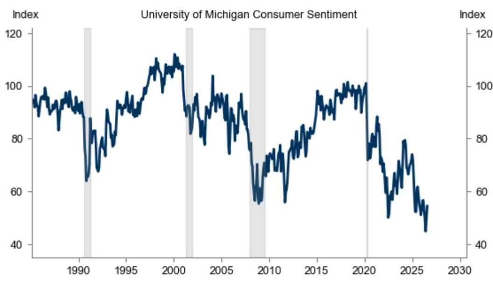

# 消费者信心正在回升，但7月数据显示基础脆弱，可能迅速逆转

密歇根大学7月初步消费者信心指数上升4.9点至54.4，显著超过市场普遍预期的51.0和前月的49.5。这是信心在连续数月下滑后首次出现有意义的改善，同时短期通胀预期也出现令人鼓舞的下降，回落0.4个百分点至4.2%。表面上看，这是政策制定者和市场参与者一直期待的数据：消费者悲观情绪减轻，并预期价格将趋于温和。

但仔细阅读报告的调查时间和内部构成就会发现，这种改善所依赖的基础比整体数字所显示的要薄弱得多。超过70%的调查回复是在7月7日之前收集的，而此后美国恢复对伊朗的打击行动引发了汽油价格的新一轮上涨。密歇根大学本身也警告称，如果近期汽油价格的下跌趋势逆转——而这一逆转已经开始——信心的上升势头可能难以持续。因此，该数据捕捉到的只是一个短暂的喘息窗口，而非消费者心理的持久转变。

对于观察者和企业战略制定者而言，7月报告提供了一个关于当前宏观环境的重要启示。汽油价格与消费者信心之间的联系仍然是家庭支出行为较强大的短期驱动因素。信心的改善在其覆盖的时期内是真实的，但它也是回顾性的，并且已经过时。问题不在于数据是否准确，而在于产生这些数据的条件是否仍然存在。它们已经不存在了。

---

## 4.9点的信心增长掩盖了现状与未来预期之间的严重分化

整体信心指数从49.5升至54.4，但内部构成揭示了一个更为微妙的故事。当前经济状况分项指数跃升7.2点至54.9，而消费者预期分项仅上升3.3点至54.0。这一差距之所以重要，是因为它表明消费者正在对他们今天看到的情况做出反应——油价下降、食品杂货账单略有减轻——而不是对经济走向形成真正乐观的看法。

预期是更具前瞻性的组成部分，也是在三到六个月的时间范围内往往与实际支出决策相关的部分。3.3点的改善并非微不足道，但其幅度还不到当前状况改善的一半。这种模式表明，家庭并非押注于持续复苏，他们只是在经历一段极端压力期后稍作喘息。当信心主要依靠当前状况改善时，它更容易逆转，因为这些状况可能在一夜之间发生变化——正如汽油价格已经发生的那样。

对企业的实际影响是直接的。任何收入依赖于消费者可自由支配支出的公司，都应将此信心改善视为战术性数据点，而非战略性信号。库存规划、营销支出和招聘决策不应仅根据这一单一数据向上调整。当前状况与预期之间的分化表明，在接下来几个月的数据确认趋势之前，应保持谨慎姿态。

---

## 一年期通胀预期下降0.4个百分点意义重大，但5-10年期指标仍停留在3.3%

短期通胀预期从4.6%降至4.2%，这一降幅超过了市场普遍预期的4.4%。这是整份报告中最令人鼓舞的数字。它表明消费者通胀焦虑的高峰可能已经过去，至少目前是这样。当家庭认为未来十二个月价格上涨将放缓时，他们不太可能进行恐慌性购买，不太可能要求先发制人的加薪，并且更有可能使储蓄和支出行为正常化。

然而，较长期通胀预期指标连续第三个月保持在3.3%。这是美联储最为关注的数字，因为它反映了家庭是否相信央行能够在整个经济周期内恢复价格稳定。3.3%的读数仍远高于美联储2%的目标，而且即使在短期预期改善的情况下它也没有变动，这揭示了消费者对任何去通胀的持久性存在深深的怀疑。

这给美联储带来了战略上的两难。如果短期预期继续下降而长期预期仍然高企，央行就不能在可信度方面宣称胜利。家庭基本上是在说：“我们认为明年价格上涨速度会放缓，但我们不相信整体通胀率会在未来五到十年内稳定在较低水平。”这不是对货币政策的信任投票。对于观察者而言，这意味着债券市场对今年晚些时候降息的定价可能过于乐观。美联储需要看到5-10年期指标明确降至3%以下，才能发出持久政策转向的信号。

---

## 调查时机意味着数据已经过时，汽油价格已经逆转

这是7月报告中在操作层面最重要的见解，如果只读标题很容易被忽略。调查于6月23日至7月13日期间进行，但超过70%的回复是在7月7日之前收集的。7月7日，美国恢复对伊朗的打击行动，汽油价格立即开始上涨。此日期之后收集的回复是少数。因此，信心的改善不成比例地偏向于打击行动前汽油价格下跌的时期。

密歇根大学在其评论中明确指出了这一风险，称“如果近期汽油价格的下跌趋势继续逆转，信心的上升势头可能难以持续”。这不是一个假设性的警告，而是对已经发生情况的陈述。推动信心改善的数据——较低的汽油价格——已经开始瓦解。下一次调查将于8月中旬进行，将更全面地反映打击行动后的环境，风险在于7月的涨幅可能部分或全部被逆转。

对于任何依赖实时或近实时数据的决策者而言，教训是应更重视最近的回复，而非调查平均值。密歇根大学在其底层数据中提供了回复日期的完整分布，分析人员应计算7月7日之后的单独信心估计值。如果该估计值明显低于54.4的整体数字，那么7月的数据应被视为统计上的异常，而非真正的改善。

---

## 解读未来三个月消费者数据的决策框架

7月报告提供了一个有用的模板，说明如何在波动的宏观环境中评估消费者信心数据。以下框架可应用于8月、9月和10月的数据发布，以判断是否正在发生真正的复苏，还是经济仍停留在低信心均衡状态。

首先，比较当前状况和预期两个组成部分。如果两者同步上升且幅度相似，则改善是广泛的，更有可能持续。如果当前状况以较大幅度领先预期，就像7月那样，则将改善视为战术性的且可能是暂时的。

第二，将5-10年期通胀预期指标与一年期指标分开跟踪。短期预期的下降是受欢迎的，但并非决定性的。只有当长期指标降至3.0%以下并至少连续两个月保持在该水平时，美联储和债券市场才会对通胀前景有信心。

第三，根据调查时间进行调整。密歇根大学报告了每次调查的日期范围，但由用户自行检查该窗口期内是否发生了重大宏观事件。如果在调查期间发生了重大政策变化、地缘政治事件或大宗商品价格冲击，整体数字就是两个不同时期的平均值。如果可能，对数据进行分解，或者至少对整体数字进行心理折扣。

第四，与汽油价格进行交叉验证。过去十二个月，零售汽油价格与消费者信心之间的相关性一直高于0.8。如果调查期间汽油价格上涨，任何信心改善都值得怀疑。如果汽油价格下跌，信心数据则更可信。

---

## 7月报告并未改变战略前景，但确实缩小了可能情景的范围

在此次数据发布之前，下半年消费者支出的可能结果范围非常广泛。7月报告并未大幅缩小这一范围，但它确实排除了一种极端情景：信心仍在自由落体且衰退即将来临的可能性。尽管基础脆弱，但改善表明消费者并未陷入下行螺旋。底部可能正在形成。

该报告没有做的是提供消费者信心V型复苏的证据。预期分项仍低于55，这一水平历史上与谨慎的家庭行为相关。长期通胀预期指标停留在3%以上。调查时机问题意味着下一次数据很容易逆转7月的涨幅。这些都不支持对消费类公司采取激进的看涨立场，也不支持支出模式迅速正常化。

对于企业战略制定者而言，适当的回应是维持7月报告之前已有的规划假设：假设未来几个月消费者信心将保持在45至55的区间，假设汽油价格波动将继续推动月度波动，并假设美联储在第四季度之前不会从通胀预期数据中获得足够清晰的信号来开始降息。7月报告是一个数据点，而非转折点。接下来的两次调查将决定它是复苏的开始，还是下一次下行前的暂时喘息。

*仅供参考。部分内容可能基于源材料通过AI辅助生成、翻译、总结或编辑，可能存在遗漏或错误。请独立核实。本文不构成专业建议。*

仅供参考。部分内容可能基于源材料通过AI辅助生成、翻译、总结或编辑，可能存在遗漏或错误。请独立核实。本文不构成专业建议。

