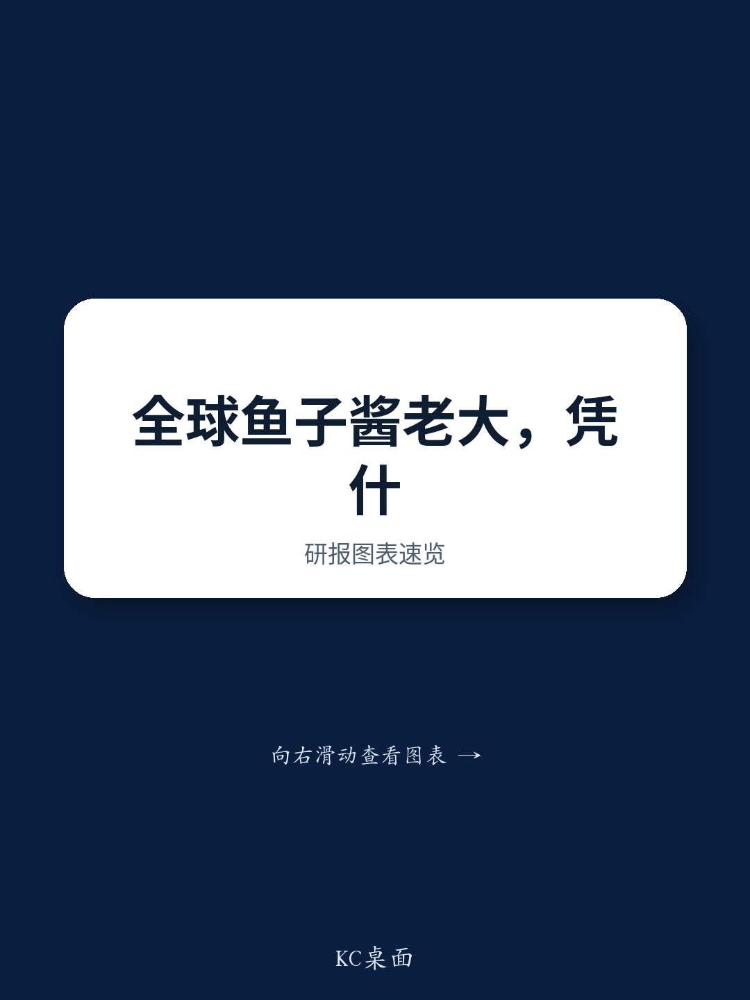

# Caviar’s Supply-Demand Paradox: Why Xunlong Sci-Tech’s 36% Global Share Creates a Rare Moated Growth Story

Global caviar production has grown 10-15% annually for five consecutive years, yet the world’s largest producer commands a 36% market share—nearly four times the volume of its nearest competitor. This is not a commodity business. It is a structurally constrained industry where biological time, not capital, determines who wins. Xunlong Sci-Tech, the Hangzhou-based operator of the world’s largest sturgeon aquaculture and caviar processing operation, has built an advantage that competitors cannot replicate in less than a decade. The company’s 2026 guidance of RMB 900 million in revenue and RMB 460 million in adjusted net profit—both up 15% year-on-year—rests on a foundation that most food producers lack: a 15,000-ton sturgeon inventory, over half of which are mature fish ready for harvest.

The timing matters because two forces are converging. Overseas demand is accelerating across both mature and emerging markets, while the domestic Chinese market—after a mid-2025 anti-graft campaign-induced slowdown—showed clear recovery signals in late the second quarter of 2026. Management sees stabilizing domestic sales in the second half of 2026, aided by easy year-ago comparisons. The strategic question for observers is not whether the company can grow—the numbers are explicit—but whether its advantages are durable enough to sustain margin expansion as it shifts from OEM volume to branded premium sales.

This article argues that Xunlong’s competitive position is defined by three interlocking moats: a biological inventory that creates a multi-year supply visibility no competitor can match, a technical efficiency advantage that nearly doubles industry-average yield rates, and a brand-building strategy that is deliberately paced to match market readiness. Each of these elements reinforces the others, creating a compound advantage that is difficult to isolate, let alone replicate.

## Sturgeon’s 7-to-15-Year Maturation Cycle Creates a Supply Barrier That Capital Alone Cannot Overcome

The most underappreciated structural feature of the caviar industry is not demand growth—it is the irreducible biological lead time. Sturgeon require seven to fifteen years to reach maturity, meaning any new entrant today cannot produce commercial volumes before the mid-2030s. Xunlong’s inventory of over 15,000 tons of sturgeon, with more than half classified as mature fish, represents a supply buffer that is effectively impossible to replicate through financial investment alone. The company targets 15% annual production growth over the next three to five years, a rate that is constrained only by its own biological assets, not by market demand or capital availability.

This lead time acts as a natural capacity moat. In most food industries, rising prices attract new supply within one to two growing seasons. In caviar, the lag is measured in decades. The consequence is that the demand-supply balance is structurally tight for the foreseeable future, and the company that already holds the mature inventory—Xunlong—is the primary beneficiary. The 36% global market share is not a static number; it is a dynamic position that strengthens with each passing year that competitors remain in the pre-harvest phase.

The implication for observers is that volume growth is predictable and low-risk. The company’s production plan is not dependent on external factors such as weather, disease outbreaks, or feed price volatility in the short term. It is a function of internal biological scheduling. The 17-18% egg yield rate versus the industry average of 10-12% further amplifies this advantage: every ton of sturgeon produces nearly 60% more caviar than a competitor’s equivalent fish. When combined with annual survival rates above 97% versus an industry range of 50-70%, the biological asset write-down risk is materially lower. This is not efficiency optimization; it is a structural cost advantage embedded in genetics and husbandry practice.

## The Overseas Market Is the Volume Engine, But the Brand Mix Shift Is the Margin Multiplier

Approximately 80% of Xunlong’s revenue comes from exports, and the majority of that remains OEM business—selling large-format standard products to intermediaries who repackage and label them for mature markets in Europe and the United States. This segment, which accounts for roughly 60% of export revenue, has been growing at around 20% year-on-year. The growth is resilient, and management noted that U.S. tariffs, which peaked at 185% and currently stand at 55%, are fully absorbed by importers. The company is also exploring overseas farming bases to hedge against policy risk, a prudent move that does not imply current disruption.

The strategic inflection point, however, lies in the branded mix. The proprietary Kaluga Queen brand contributes approximately 35% of total revenue, and management plans to raise this share. The logic is straightforward: OEM revenue carries lower margins and zero brand equity. Every percentage point shift toward branded sales improves the overall margin profile without requiring a step-change in volume. In emerging markets such as Southeast Asia and the Middle East, the company is working directly with local channels to build owned-brand distribution. These markets are less price-sensitive than mature European markets and more open to a premium Chinese brand narrative.

The risk is execution speed. Brand building in luxury food is a multi-year process that requires consistent quality, distribution relationships, and consumer education. Xunlong’s advantage is that it does not need to rush. The OEM business provides a reliable cash flow and volume base, while the branded business can be scaled at the pace of market absorption. The 15% revenue growth guidance for 2026 implies that the company is not sacrificing volume for margin; it is pursuing both simultaneously, with the branded mix acting as a long-term margin tailwind rather than a near-term volume constraint.

## Domestic China Is a Higher-Margin Bet on Early-Stage Premium Consumption Recovery

The domestic Chinese market contributes only about 20% of revenue, but management views it as a higher-margin brand-building opportunity. This is a deliberate strategic choice. In China, caviar is not a staple or a commodity; it is a luxury ingredient associated with high-end dining, gifting, and status signaling. The market is still in an early stage, and the anti-graft campaign in the second half of 2025 created a temporary demand pullback. By late the second quarter of 2026, however, management observed early signs of high-end consumption recovery, and expects stabilizing domestic sales in the second half of the year.

The company’s domestic strategy has two distinct retail formats. Large luxury boutiques in premium malls serve as flagship brand anchors, while smaller pop-up and concept stores function as lower-cost brand touchpoints. Monthly gross merchandise value per store ranges from approximately RMB 200,000 to over RMB 400,000, depending on size and location. The company plans to open 50 specialty stores within three years. This is not a mass-market distribution play; it is a controlled, high-margin retail expansion designed to build the Kaluga Queen brand in China’s most affluent consumer segments.

Equally notable is the introduction of “caviar-plus” products—caviar ice cream and caviar chocolates—targeting younger consumers. These products serve a dual purpose. They generate incremental revenue at higher margins than bulk caviar, and they function as a gateway: a consumer who tries caviar chocolate at a pop-up store may later purchase the core product. This approach mirrors what luxury brands in other categories have done to broaden their consumer base without diluting their core positioning. The risk is that the branded retail expansion is capital-intensive and requires real estate expertise that is not core to the company’s aquaculture heritage. The 50-store target is ambitious, and execution discipline will determine whether this becomes a margin-enhancing channel or a drag on returns.

## A Decision Framework for Evaluating Xunlong’s Risk-Reward Profile

For those assessing Xunlong, three variables determine the outcome: the pace of branded mix shift, the trajectory of domestic consumption recovery, and the stability of the tariff environment. These are not equally weighted. The branded mix shift is the most controllable variable, as it depends on internal execution. The domestic recovery is partially controllable through store expansion and marketing, but remains subject to macroeconomic and policy headwinds. Tariff risk is the least controllable, but management has already demonstrated that U.S. importers absorb the current 55% duty, and overseas farming options provide a structural hedge.

The most useful framework is to view Xunlong as a compound option. The base case—15% revenue growth, stable gross margins of 65-70%, and net margins of 45-50%—is supported by the OEM volume engine and biological supply visibility. The upside case depends on the branded mix exceeding 50% of revenue within three years, which would push net margins toward the upper end of the guided range or beyond, and on domestic retail achieving scale with store-level economics that match or exceed the high-margin export business. The downside case is a prolonged domestic consumption slowdown combined with a new tariff regime that cannot be passed through to importers, though the overseas farming hedge mitigates this risk.

The critical insight is that the company’s biological inventory is not just a supply advantage—it is a financial buffer. Sturgeon are living assets that appreciate in value as they age, and the company’s high survival rates and yield efficiency mean that the cost base is both predictable and low relative to peers. Even in a scenario where demand growth slows, the company can slow harvest rates and allow its inventory to continue maturing, effectively deferring revenue without destroying value. This optionality is rare in food production and is the single most important reason why Xunlong’s risk profile is asymmetric: the downside is limited by biological flexibility, while the upside is driven by structural demand growth and brand leverage.

*For informational purposes only. Portions may be generated, translated, summarized, or edited with AI assistance based on source materials and may contain omissions or errors. Please verify independently. This is not professional advice.*

For informational purposes only. Portions may be generated, translated, summarized, or edited with AI assistance based on source materials and may contain omissions or errors. Please verify independently. This is not professional advice.

