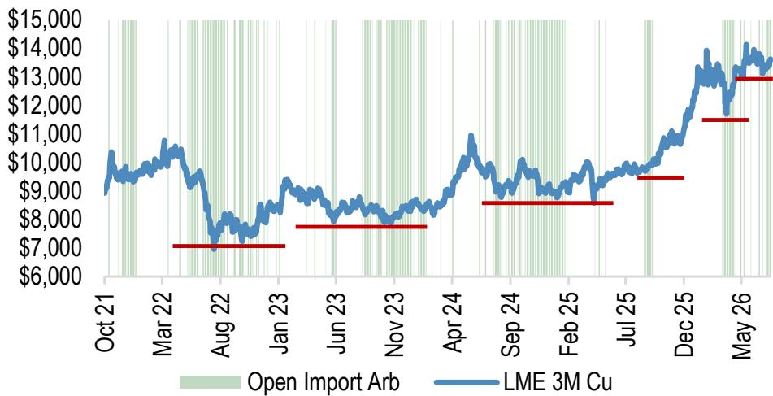

# 基础金属供需追踪

## 宏观环境观察：市场关注关税政策更新，中国持续采购铜

Extel - 2026

全球固定收益研究调查

点击参与投票

投票开放时间：7月6日 - 7月24日

请为JPM投票（5星）

全球大宗商品研究

## 铜：

- 中国铜需求指标受去年高基数效应影响出现变化……我们的消费加权终端使用指标显示，截至5M26，中国铜需求5月同比增速为-5%（图23）。建筑领域持续面临一定调整，而可再生能源装机在5月面临去年极高基数——2025年6月风电和太阳能装机固定电价政策调整前曾出现抢装。此外，电网投资也低于去年5月的异常高位，这与去年可再生能源大规模装机有关。不过，截至5月，年初至今电网投资仍同比增长约+13%，可再生能源和电网领域的强基数效应将从6月起逐步消退。

- 表观消费在精炼产量保持韧性和库存持续下降的背景下继续呈现分化走势。即使面对同样强劲的2025年基数，中国表观消费仍与潜在需求指标出现分化，5月录得8%的同比增长（5M26年初至今约+3%）（图24）。中国精炼铜产量仍维持在近1400万吨的高位（图43和图44），部分得益于稳定的废铜进口（图41），尽管截至5月铜精矿进口同比下降1%（图38）。在产量保持韧性的同时，5月精炼铜进口量为31.6万吨（接近2025年平均水平 - 图39），而显性铜库存继续下降，目前已降至五年区间低位（图31）。

- 在中国库存下降和LME注销仓单增加的背景下，美国以外地区的库存水平再次成为关注焦点。随着中国SHFE+保税库存降至14万吨以下（低于五年区间），中国现货溢价已推升至约95美元/吨，为2025年5月以来最高，中国进口套利窗口自7月初以来基本保持开放（图36）。在此背景下，本周迄今LME亚洲仓库铜注销仓单增加超过6.5万吨，使全球LME注册仓单库存回落至仅约13万吨，接近可能引发现货溢价急剧上升的临界低位。

Gregory C. Shearer
(44-20) 7134-8161
gregory.c.shearer@JPM.com
JPM Securities plc

- 市场仍在等待第232条审查的更新。我们认为，2026年下半年铜的关键驱动因素是政策而非基本面：即美国第232条铜关税审查后的框架/沟通（铜：我们前进的方向不需要平衡，2026年6月21日）。对于LME铜价而言，关税升级路径是最重要的因素，因为看涨与看跌结果之间的关键转折点在于任何沟通如何塑造市场对未来美国精炼铜阴极进口关税率的预期。虽然美国进口套利窗口保持开放，但美国月度精炼铜进口量已从此前高位回落（图33和图34）。升级机制的明确（我们的基准情景）意味着在关税生效或提高之前仍有动力将铜进口到美国，这对市场是积极因素，因为美国对金属的需求持续，中国被迫做出反应（以越来越高的价格满足其进口需求 - 图1），而由美国以外库存快速下降引发的市场紧张点风险仍然较高。另一方面，如果没有升级预期，即使立即宣布直接关税，对LME价格也是消极因素，因为这将导致美国进口套利窗口关闭和美国漫长的去库存周期，使中国重新获得定价权。

Ali A. Ibrahim
(44-20) 3493-6438
ali.ibrahim@JPM.com
JPM Securities plc

Ananyashree Gupta
(91-22) 6157 3627
ananyashree.gupta@jpmchase.com
JPM India Private Limited

<table><tr><td>基础金属供需追踪</td><td>1</td></tr><tr><td>全球需求指标</td><td>3</td></tr><tr><td>中国需求指标</td><td>5</td></tr><tr><td>铜</td><td>9</td></tr><tr><td>铝</td><td>16</td></tr><tr><td>锌</td><td>21</td></tr><tr><td>镍</td><td>25</td></tr><tr><td>JPM金属价格预测</td><td>28</td></tr></table>

图1：过去一年中国采购底线上移明显
LME 3个月铜价（美元/吨）与中国现货铜进口套利窗口

来源：LME，彭博财经，JPM大宗商品研究。*套利数据截至伦敦时间上午8:00。

## 铝：

- 中东生产开始漫长的复苏之路。EGA上周宣布重启其氧化铝精炼厂，该厂供应公司约50%的氧化铝需求，同时其Al Taweelah冶炼厂也已开始重启。截至7月初，冶炼厂超过20%的电解槽已清除冻结金属，约7%的电解槽已重新启动。这一初步重启进展快于我们最初的预期，但公司指出，热金属生产将逐步提升，仍可能需要长达一年时间才能达到事故前水平。

- 中国库存终于在出口增加的推动下出现下降，但中国半成品出口套利窗口现已再次关闭。自5月底以来，中国显性库存已下降约32万吨至约100万吨（图56）。这一下降是由于中国半成品出口增加（受价差激励以填补中东供应缺口）最终传导至供应链上游，导致中国铝锭库存出现更实质性的消耗（图60）。尽管如此，随着LME价格回落至约3,150美元/吨，这一出口套利窗口已再次关闭（图63）。最终，即使中东供应恢复且印尼产能扩张持续推进，我们仍认为2026年第三季度中国以外地区存在较大缺口，可能需要继续消耗中国库存，风险偏向于LME价格再次走高以重新打开出口套利窗口并弥合供应缺口，直到明年全球市场再次进入供应更充足的阶段。

## 锌：

- 等待中国出口套利窗口打开。中国继续吸收全球市场中的过剩精矿（图83）。5M26期间锌精矿进口同比增长9%，中国锌冶炼厂产量总体保持韧性，尽管近几个月略有减弱（图84），这显示了中国冶炼厂持续的需求，即使在国内需求面临一定调整且现货加工费为负导致利润承压的情况下（图81）。由于镀锌厂开工率仍低于五年均值（图87），中国国内锌库存继续徘徊在近期历史高位（图77）。中国以外地区，库存覆盖率相对较低（图76），我们仍预计未来几个月中国出口套利窗口将更实质性地打开（图86），随后金属将从中国流出，以缓解中国与海外锌供需之间的错位。

## 镍：

- 关注2026年下半年RKAB修订，随后今年晚些时候将开始新一轮配额周期。LME镍价在突破19,000美元/吨后，因有报道称印尼在7月修订窗口期间大幅增加RKAB矿石配额，现已回落至约17,000美元/吨。有趣的是，同期实际矿石和中间品价格（NPI和硫酸镍）保持相对稳定，表明LME的重新定价更具前瞻性（图91）。我们的印尼金属和采矿团队初步预计，政府将把RKAB许可增加3000-4000万吨至2.9-3亿吨湿吨（此前为2.6-2.7亿吨），主要增加褐铁矿，因为腐泥土供应仍然有限。总体而言，我们仍预计未来几年印尼RKAB政策将保持活跃和灵活，以努力维持平衡，继续捍卫和支持预期的价格结果（不高不低），并最大化税收收入。

## 全球需求指标

## 表1：全球金属月度价格变化热力图

百分比变化，环比与同比

<table><tr><td></td><td>全球金属价格热力图</td><td>2025年6月</td><td>2025年7月</td><td>2025年8月</td><td>2025年9月</td><td>2025年10月</td><td>2025年11月</td><td>2025年12月</td><td>2026年1月</td><td>2026年2月</td><td>2026年3月</td><td>2026年4月</td><td>2026年5月</td><td>2026年6月</td><td>2023年</td><td>2024年</td><td>2025年</td><td>2026年初至今</td></tr><tr><td rowspan="16">金属价格</td><td>LME铜</td><td>3.9%</td><td>-2.6%</td><td>3.0%</td><td>3.7%</td><td>6.0%</td><td>2.8%</td><td>11.0%</td><td>5.9%</td><td>1.4%</td><td>-9.3%</td><td>5.3%</td><td>5.0%</td><td>5.0%</td><td>2.2%</td><td>2.4%</td><td>41.7%</td><td>10.2%</td></tr><tr><td>LME铝</td><td>6.3%</td><td>-1.3%</td><td>2.0%</td><td>2.5%</td><td>7.6%</td><td>-0.6%</td><td>4.4%</td><td>5.0%</td><td>-0.1%</td><td>3.8%</td><td>0.2%</td><td>5.5%</td><td>5.5%</td><td>0.3%</td><td>7.0%</td><td>17.4%</td><td>6.5%</td></tr><tr><td>LME锌</td><td>5.0%</td><td>0.3%</td><td>2.1%</td><td>5.0%</td><td>3.2%</td><td>0.0%</td><td>2.0%</td><td>9.1%</td><td>-2.5%</td><td>-8.3%</td><td>4.2%</td><td>5.3%</td><td>5.3%</td><td>-10.6%</td><td>12.1%</td><td>4.7%</td><td>15.8%</td></tr><tr><td>LME镍</td><td>-0.1%</td><td>-1.8%</td><td>3.2%</td><td>-1.2%</td><td>-0.1%</td><td>-2.6%</td><td>12.3%</td><td>7.9%</td><td>-0.6%</td><td>-5.0%</td><td>13.8%</td><td>-2.1%</td><td>-2.1%</td><td>-44.7%</td><td>-7.7%</td><td>8.6%</td><td>0.6%</td></tr><tr><td>LME铅</td><td>4.4%</td><td>-3.6%</td><td>1.0%</td><td>-0.1%</td><td>1.4%</td><td>-1.8%</td><td>1.5%</td><td>-0.1%</td><td>-2.3%</td><td>-3.5%</td><td>2.8%</td><td>3.1%</td><td>3.1%</td><td>-9.8%</td><td>-5.6%</td><td>3.0%</td><td>-7.7%</td></tr><tr><td>LME锡</td><td>10.9%</td><td>-3.0%</td><td>7.1%</td><td>1.1%</td><td>1.9%</td><td>8.5%</td><td>3.6%</td><td>28.1%</td><td>11.1%</td><td>-23.4%</td><td>5.3%</td><td>12.6%</td><td>12.6%</td><td>2.4%</td><td>14.4%</td><td>39.4%</td><td>32.8%</td></tr><tr><td>LME钴现货</td><td>-1.1%</td><td>0.0%</td><td>0.0%</td><td>5.1%</td><td>39.3%</td><td>0.0%</td><td>9.9%</td><td>5.5%</td><td>0.1%</td><td>0.0%</td><td>0.0%</td><td>0.0%</td><td>0.0%</td><td>-44.3%</td><td>-15.4%</td><td>117.8%</td><td>5.6%</td></tr><tr><td>LME氢氧化锂</td><td>-3.2%</td><td>-2.1%</td><td>5.4%</td><td>11.9%</td><td>1.0%</td><td>5.8%</td><td>10.1%</td><td>62.0%</td><td>-4.3%</td><td>12.5%</td><td>3.5%</td><td>7.8%</td><td>7.8%</td><td>-80.4%</td><td>-42.9%</td><td>18.5%</td><td>73.0%</td></tr><tr><td>COMEX铜</td><td>7.5%</td><td>-13.4%</td><td>3.8%</td><td>7.5%</td><td>4.8%</td><td>1.9%</td><td>9.6%</td><td>4.3%</td><td>1.4%</td><td>-9.7%</td><td>5.6%</td><td>7.8%</td><td>7.8%</td><td>2.1%</td><td>3.5%</td><td>41.1%</td><td>12.0%</td></tr><tr><td>SHFE铜</td><td>2.4%</td><td>-1.9%</td><td>1.0%</td><td>5.1%</td><td>4.8%</td><td>0.0%</td><td>13.1%</td><td>8.3%</td><td>-4.2%</td><td>-7.8%</td><td>5.8%</td><td>3.6%</td><td>3.6%</td><td>4.4%</td><td>6.8%</td><td>33.7%</td><td>5.8%</td></tr><tr><td>SHFE铝</td><td>2.8%</td><td>-0.5%</td><td>0.6%</td><td>0.0%</td><td>2.5%</td><td>1.1%</td><td>5.6%</td><td>10.6%</td><td>-6.0%</td><td>0.1%</td><td>-1.3%</td><td>-0.5%</td><td>-0.5%</td><td>4.5%</td><td>1.0%</td><td>14.7%</td><td>2.1%</td></tr><tr><td>SHFE锌</td><td>-0.5%</td><td>-0.6%</td><td>-1.3%</td><td>-1.0%</td><td>2.0%</td><td>0.2%</td><td>4.1%</td><td>12.2%</td><td>-6.0%</td><td>-6.3%</td><td>0.4%</td><td>5.1%</td><td>5.1%</td><td>-9.5%</td><td>19.0%</td><td>-9.4%</td><td>6.1%</td></tr><tr><td>现货黄金</td><td>0.4%</td><td>-0.4%</td><td>4.8%</td><td>11.9%</td><td>3.7%</td><td>5.9%</td><td>1.9%</td><td>13.3%</td><td>7.9%</td><td>-15.2%</td><td>-1.1%</td><td>-1.7%</td><td>-1.7%</td><td>13.1%</td><td>27.2%</td><td>64.6%</td><td>-5.8%</td></tr><tr><td>现货白银</td><td>9.5%</td><td>1.7%</td><td>8.2%</td><td>17.4%</td><td>4.4%</td><td>16.0%</td><td>26.8%</td><td>18.9%</td><td>10.1%</td><td>-24.1%</td><td>-1.9%</td><td>2.1%</td><td>2.1%</td><td>-0.7%</td><td>21.5%</td><td>148.0%</td><td>-17.9%</td></tr><tr><td>现货铂金</td><td>28.5%</td><td>-5.0%</td><td>6.1%</td><td>14.9%</td><td>-0.1%</td><td>6.1%</td><td>23.3%</td><td>6.5%</td><td>7.9%</td><td>-18.5%</td><td>1.7%</td><td>-3.4%</td><td>-3.4%</td><td>-7.7%</td><td>-8.5%</td><td>127.0%</td><td>-20.4%</td></tr><tr><td>现货钯金</td><td>13.6%</td><td>8.3%</td><td>-7.9%</td><td>14.3%</td><td>14.1%</td><td>1.1%</td><td>11.4%</td><td>5.7%</td><td>4.4%</td><td>-19.4%</td><td>3.6%</td><td>-11.2%</td><td>-11.2%</td><td>-38.6%</td><td>-17.1%</td><td>77.5%</td><td>-19.2%</td></tr></table>

\*LME为3个月远期合约，钴除外为现货。氢氧化锂和SHFE价格为期货合约。价格截至2026年7月14日。来源：彭博财经

表2：各国制造业PMI

<table><tr><td></td><td></td><td>2025年1月</td><td>2025年2月</td><td>2025年3月</td><td>2025年4月</td><td>2025年5月</td><td>2025年6月</td><td>2025年7月</td><td>2025年8月</td><td>2025年9月</td><td>2025年10月</td><td>2025年11月</td><td>2025年12月</td><td>2026年1月</td><td>2026年2月</td><td>2026年3月</td><td>2026年4月</td><td>2026年5月</td></tr><tr><td rowspan="5">分组</td><td>JPM全球</td><td>50.1</td><td>50.6</td><td>50.3</td><td>49.8</td><td>49.5</td><td>50.4</td><td>49.7</td><td>50.9</td><td>50.7</td><td>50.7</td><td>50.5</td><td>50.4</td><td>50.9</td><td>51.8</td><td>51.3</td><td>52.6</td><td>52.7</td></tr><tr><td>发达市场</td><td>49.3</td><td>50.0</td><td>49.1</td><td>49.1</td><td>50.0</td><td>50.5</td><td>49.2</td><td>50.9</td><td>50.3</td><td>50.3</td><td>50.5</td><td>50.5</td><td>51.4</td><td>51.8</td><td>52.0</td><td>53.8</td><td>53.9</td></tr><tr><td>新兴市场</td><td>50.8</td><td>51.1</td><td>51.3</td><td>50.5</td><td>49.2</td><td>50.4</td><td>50.1</td><td>50.9</td><td>51.2</td><td>51.2</td><td>50.5</td><td>50.4</td><td>50.6</td><td>52.0</td><td>50.7</td><td>51.6</td><td>51.6</td></tr><tr><td>欧盟</td><td>46.7</td><td>47.8</td><td>48.6</td><td>49.1</td><td>49.2</td><td>49.2</td><td>49.6</td><td>50.4</td><td>49.7</td><td>49.7</td><td>49.5</td><td>48.8</td><td>49.5</td><td>50.5</td><td>51.3</td><td>52.0</td><td>51.4</td></tr><tr><td>欧元区</td><td>46.6</td><td>47.6</td><td>48.6</td><td>49.0</td><td>49.4</td><td>49.5</td><td>49.8</td><td>50.7</td><td>49.8</td><td>49.8</td><td>49.6</td><td>48.8</td><td>49.5</td><td>50.8</td><td>51.6</td><td>52.2</td><td>51.6</td></tr><tr><td rowspan="4">亚太</td><td>中国（财新/标普）</td><td>50.1</td><td>50.8</td><td>51.2</td><td>50.4</td><td>48.3</td><td>50.4</td><td>49.5</td><td>50.5</td><td>51.2</td><td>51.2</td><td>49.9</td><td>50.1</td><td>50.3</td><td>52.1</td><td>50.8</td><td>52.2</td><td>51.8</td></tr><tr><td>中国（官方PMI）</td><td>49.1</td><td>50.2</td><td>50.5</td><td>49.0</td><td>49.5</td><td>49.7</td><td>49.3</td><td>49.4</td><td>49.8</td><td>49.8</td><td>49.2</td><td>50.1</td><td>49.3</td><td>49.0</td><td>50.4</td><td>50.3</td><td>50.0</td></tr><tr><td>印度</td><td>57.7</td><td>56.3</td><td>58.1</td><td>58.2</td><td>57.6</td><td>58.4</td><td>59.1</td><td>59.3</td><td>57.7</td><td>57.7</td><td>56.6</td><td>55.0</td><td>55.4</td><td>56.9</td><td>53.9</td><td>54.7</td><td>55.0</td></tr><tr><td>日本</td><td>48.7</td><td>49.0</td><td>48.4</td><td>48.7</td><td>49.4</td><td>50.1</td><td>48.9</td><td>49.7</td><td>48.5</td><td>48.5</td><td>48.7</td><td>50.0</td><td>51.5</td><td>53.0</td><td>51.6</td><td>55.1</td><td>54.5</td></tr><tr><td rowspan="5">欧洲</td><td>法国</td><td>45.0</td><td>45.8</td><td>48.5</td><td>48.7</td><td>49.8</td><td>48.1</td><td>48.2</td><td>50.4</td><td>48.2</td><td>48.2</td><td>47.8</td><td>50.7</td><td>51.2</td><td>50.1</td><td>50.0</td><td>52.8</td><td>49.7</td></tr><tr><td>德国</td><td>45.0</td><td>46.5</td><td>48.3</td><td>48.4</td><td>48.3</td><td>49.0</td><td>49.1</td><td>49.8</td><td>49.5</td><td>49.5</td><td>48.2</td><td>47.0</td><td>49.1</td><td>50.9</td><td>52.2</td><td>51.4</td><td>50.1</td></tr><tr><td>意大利</td><td>46.3</td><td>47.4</td><td>46.6</td><td>49.3</td><td>49.2</td><td>48.4</td><td>49.8</td><td>50.4</td><td>49.0</td><td>49.0</td><td>50.6</td><td>47.9</td><td>48.1</td><td>50.6</td><td>51.3</td><td>52.1</td><td>52.9</td></tr><tr><td>西班牙</td><td>50.9</td><td>49.7</td><td>49.5</td><td>48.1</td><td>50.5</td><td>51.4</td><td>51.9</td><td>54.3</td><td>51.5</td><td>51.5</td><td>51.5</td><td>49.6</td><td>49.2</td><td>50.0</td><td>48.7</td><td>51.7</td><td>51.2</td></tr><tr><td>英国</td><td>48.3</td><td>46.9</td><td>44.9</td><td>45.4</td><td>46.4</td><td>47.7</td><td>48.0</td><td>47.0</td><td>46.2</td><td>46.2</td><td>50.2</td><td>50.6</td><td>51.8</td><td>51.7</td><td>51.0</td><td>53.7</td><td>53.9</td></tr><tr><td rowspan="4">美洲</td><td>加拿大</td><td>51.6</td><td>47.8</td><td>46.3</td><td>45.3</td><td>46.1</td><td>45.6</td><td>46.1</td><td>48.3</td><td>47.7</td><td>47.7</td><td>48.4</td><td>48.6</td><td>50.4</td><td>51.0</td><td>50.0</td><td>53.3</td><td>52.9</td></tr><tr><td>墨西哥</td><td>49.1</td><td>47.6</td><td>46.5</td><td>44.8</td><td>46.7</td><td>46.3</td><td>49.1</td><td>50.2</td><td>49.6</td><td>49.6</td><td>47.3</td><td>46.1</td><td>46.3</td><td>47.1</td><td>48.9</td><td>47.7</td><td>49.6</td></tr><tr><td>美国</td><td>51.2</td><td>52.7</td><td>50.2</td><td>50.2</td><td>52.0</td><td>52.9</td><td>49.8</td><td>53.0</td><td>52.0</td><td>52.0</td><td>52.2</td><td>51.8</td><td>52.4</td><td>51.6</td><td>52.3</td><td>54.5</td><td>55.1</td></tr><tr><td>美国ISM</td><td>50.5</td><td>50.0</td><td>48.9</td><td>48.8</td><td>48.6</td><td>49.0</td><td>48.4</td><td>48.9</td><td>48.9</td><td>48.9</td><td>48.0</td><td>47.9</td><td>52.6</td><td>52.4</td><td>52.7</td><td>52.7</td><td>54.0</td></tr></table>

来源：彭博财经

表3：全球轻型汽车产量增长
百分比变化

<table><tr><td>环比</td><td>2025年1季度</td><td>2025年2季度</td><td>2025年3季度</td><td>2025年4季度</td><td>2026年1季度</td><td>2026年2季度</td><td>2026年3季度</td><td>2026年4季度</td><td>2027年1季度</td><td>2027年2季度</td><td>2027年3季度</td><td>2027年4季度</td><td>2024年</td><td>2025年</td><td>2026年E</td><td>2027年F</td></tr><tr><td>欧洲</td><td>0.5%</td><td>2.4%</td><td>-13.4%</td><td>12.0%</td><td>1.5%</td><td>-1.7%</td><td>-12.3%</td><td>11.6%</td><td>0.2%</td><td>3.9%</td><td>-12.1%</td><td>10%</td><td></td><td></td><td></td><td></td></tr><tr><td>中国</td><td>-24.5%</td><td>8.0%</td><td>7.8%</td><td>17.1%</td><td>-32.2%</td><td>13.2%</td><td>8.9%</td><td>15.2%</td><td>-25.9%</td><td>17.1%</td><td>-8.2%</td><td>26%</td><td></td><td></td><td></td><td></td></tr><tr><td>日本/韩国</td><td>-5.4%</td><td>-0.4%</td><td>-3.3%</td><td>6.0%</td><td>0.0%</td><td>-3.3%</td><td>-4.9%</td><td>-0.9%</td><td>-0.4%</td><td>1.4%</td><td>-3.5%</td><td>6%</td><td></td><td></td><td></td><td></td></tr><tr><td>北美</td><td>4.2%</td><td>5.0%</td><td>0.3%</td><td>-9.9%</td><td>4.0%</td><td>4.8%</td><td>-0.8%</td><td>-9.3%</td><td
