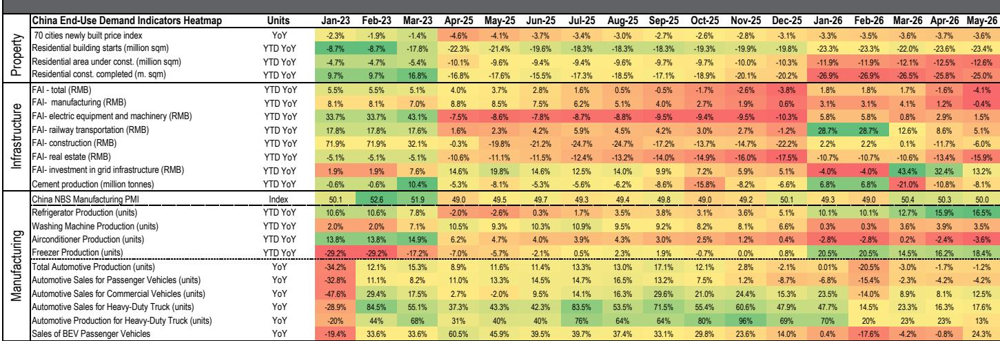
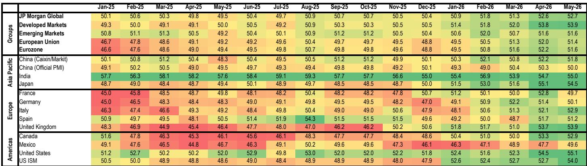
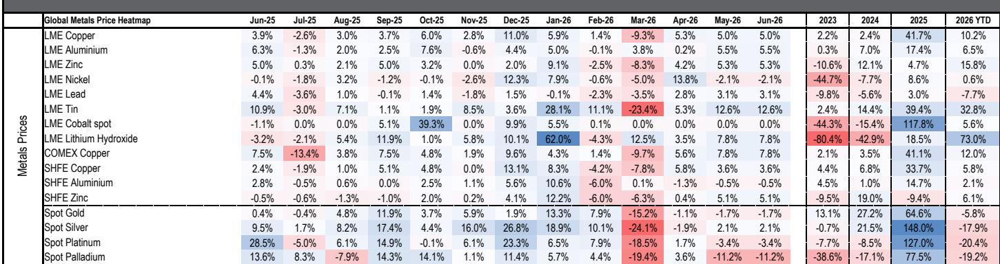

# 中国采购基准已显著上移：铜的真实故事不在需求，而在政策驱动的稀缺性

全球铜市场正接近一个关键转折点，而这与终端消费几乎无关。2026年5月，中国铜需求的消费加权终端指标在截至五个月的年内累计同比下降5%，原因是建筑活动收缩以及去年可再生能源装机热潮带来的极高基数效应。然而，同月中国表观铜消费同比增长8%，显性库存已降至五年最低水平。这种背离并非测量误差，而是市场特征——政策预期而非实际需求正在主导价格方向。

连接这些矛盾信号的机制是美国对第232条铜关税的审查。随着市场等待结果，2026年下半年LME铜价最重要的变量并非供需平衡，而是任何沟通如何塑造市场对未来美国精炼铜阴极进口关税税率的预期。该公告的结构将决定市场是经历由快速减少的非美国库存驱动的看涨挤压点，还是进入一个将定价权交还给中国的看跌去库存周期。

这种动态超越了铜本身。在整个基本金属板块——铝、锌和镍——同样的模式在重复：供应中断、政策干预和库存错位正在创造一系列不对称风险，使得情景规划比静态预测更有价值。对于战略买家而言，问题不再是需求将走向何方，而是哪个政策催化剂将首先打破当前的平衡。

## 表观消费的幻象：终端使用与库存数据之间的背离揭示了什么

整个报告中最具启发性的数据点是中国潜在铜需求指标与其表观消费之间日益扩大的鸿沟。截至2026年5月，消费加权终端指标同比下降5%，建筑领域显著疲软，可再生能源装机因去年关税前抢装潮的基数效应而大幅回落。电网投资虽然截至5月仍同比增长13%，但远低于2025年5月因同一可再生能源热潮而出现的异常高位。

在此背景下，5月表观消费同比增长8%，年初至今约增长3%。中国精炼铜产量接近1400万吨，受到稳定的废铜进口支撑，尽管铜精矿进口截至5月同比下降1%。5月精炼铜进口量为31.6万吨，接近2025年平均水平。显性库存继续下降，现已降至五年区间低点。

这种背离不可持续。它讲述了一个清晰的故事：中国购买铜并非因为其经济今天需要它，而是因为预期在更高关税制度下明天将需要它。开放的进口套利窗口——中国现货铜进口套利自7月初以来基本保持开放——证实中国买家愿意支付溢价以确保金属供应。中国溢价已推升至每吨95美元附近，为2025年5月以来最高。过去一年中，采购基准已显著上移，而这个基准是政策构建，而非需求信号。

对于市场参与者而言，其含义直接：任何依赖终端需求指标来预测铜价的人都在读错地图。真正的驱动力是库存轨迹，而该轨迹正由政策决策前的预期性购买所塑造，而该决策尚未做出。

## 政策挤压点：为何第232条审查是LME铜相对少见重要的催化剂

报告做出了一个刻意明确的区分：2026年下半年铜的关键催化剂是政策，而非基本面。对于LME铜价而言，升级就是一切。看涨与看跌结果之间最重要的转折点在于任何沟通如何塑造市场对未来美国精炼铜阴极进口关税税率的预期。

逻辑是精确的。在升级情景下——报告的基本假设——在关税生效或提高之前将铜进口到美国的激励仍然存在。这种美国对金属的拉动持续，中国被迫通过以越来越高的水平购买来满足其进口需求，而由快速减少的非美国库存驱动的非常看涨挤压点的风险仍然很高。LME亚洲仓库铜交割取消量已在一周内增加超过6.5万吨。LME全球注册仓单库存已回落至约13万吨，接近可能引发剧烈现货溢价时期的临界低水平。

看跌情景同样明确。如果审查未产生升级预期——即使立即宣布直接关税——结果对LME价格是看跌的。关闭的美国进口套利窗口将引发美国长期去库存周期，将定价权交还给中国。中国买家将不再需要竞争边际吨位，基准将下降。

这不是传统的供需分析。这是一个博弈论框架，其中价格路径完全取决于市场参与者如何解读单一政策信号。报告的贡献在于明确指出下一步的方向是二元的，且触发因素是沟通性的，而非物理性的。

## 铝的不对称复苏：中东中断创造了只有更高LME价格才能解决的时间套利问题

铝市场提供了一个不同但同样具有启发性的案例研究，展示了供应中断如何与库存动态和价格信号相互作用。阿联酋环球铝业已宣布重启其氧化铝精炼厂，该厂供应公司约50%的氧化铝需求，Al Taweelah冶炼厂也已开始重启。截至7月初，超过20%的电解槽中的冻结金属已被清除，约7%的电解槽已重启。这一初步进展比报告最初预期更快，但公司指出，铁水生产将逐步增加，仍可能需要长达一年时间才能达到事故前水平。

市场的反应具有启发性。自5月底以来，中国显性库存已减少约32万吨至约100万吨。这一减少是由中国半成品出口增加推动的，而出口增加则受到价差的激励，因为市场试图填补中东中断留下的供应缺口。然而，随着LME价格回落至每吨约3150美元，这一出口套利窗口再次关闭。

战略含义是一个时间套利问题。即使中东供应恢复且印尼产能扩张取得进展，报告指出2026年第三季度中国以外地区存在相当大的缺口，可能需继续消耗中国库存。这使风险偏向于LME价格再次走高，以重新打开出口套利窗口并弥合供应缺口，直到明年全球市场供应更加充足。

机制是清晰的：市场不能依赖线性复苏。它必须重新定价以重新激励金属从中国流向世界其他地区。对于铝买家而言，结论是当前价格可能尚未反映临时供应缺口的全部成本，下一步很可能向上，而非横盘。

## 锌的错位与镍的政策灵活性：同一逻辑在两个市场产生相反的价格信号

锌和镍说明了相同的分析框架——库存错位加政策干预——如何根据每个市场的具体机制产生不同的价格结果。

在锌方面，错位存在于中国与世界其他地区之间。中国继续吸收全球市场中的过剩精矿，2026年前五个月锌精矿进口同比增长9%。中国冶炼厂产量总体保持韧性，尽管略有减弱，这说明了即使在国内需求持续疲弱和负现货加工费挤压利润的情况下，冶炼厂仍有持续的生产意愿。由于镀锌厂开工率仍低于五年平均水平，中国国内锌库存继续徘徊在近期历史高位。中国以外地区，库存覆盖率仍然相对较低。

报告预计中国出口套利窗口将出现更实质性的打开，随后几个月将有金属从中国流出以缓解这种错位。逻辑是当前价差尚未反映再平衡的真实成本，套利窗口的扩大是最可能恢复均衡的机制。对于锌而言，下一步的方向是折扣的收窄，而非爆发式上涨。

镍则呈现不同情况。在突破每吨19000美元后，LME镍价已回落至约17000美元，原因是有关印尼在7月修订窗口期间大幅增加RKAB矿石配额的报道。初步假设是政府将RKAB许可增加3000-4000万湿吨至2.9-3亿吨，主要是褐铁矿，因为腐泥土供应仍然有限。

关键洞察是，同期实际矿石和中间品价格保持相对稳定，表明LME的重新定价是前瞻性的，而非反映当前现货市场状况。报告的印尼金属团队预计，未来几年RKAB政策将保持活跃和灵活，以维持平衡并捍卫理想的价格结果——既不太高也不太低——从而最大化税收收入。对于镍而言，政策信号是可控的稳定，而非升级。市场的任务是在印尼政府愿意容忍的区间内找到均衡价格。

## 政策驱动机制下的基本金属决策框架

对于战略买家和采购团队而言，这四种金属的共同点是传统需求预测已失去预测能力。在每种情况下，主导变量不是消费增长，而是政策信号与库存定位之间的相互作用。

报告提出的框架包含三个层次。首先，确定将打破当前库存均衡的政策催化剂。对于铜，是第232条审查。对于铝，是中东复苏的速度以及重新打开中国出口套利窗口所需的价格。对于锌，是出口套利窗口打开的时机。对于镍，是印尼的配额周期。

其次，评估政策信号是升级性的还是降级性的。升级创造购买激励并收紧库存。降级消除该激励并触发去库存。这种选择的二元性意味着情景规划比点预测更有用。

第三，确定市场是否已在定价预期结果。在铜方面，中国高企的采购基准和低LME库存表明一定程度的升级已被定价，但完整的挤压点尚未显现。在铝方面，近期的价格回落表明市场可能低估了供应恢复所需的时间。在锌方面，错位可见但尚未解决。在镍方面，市场正在对尚未完全实施的配额增加进行前瞻性调整定价。

统一的结论是，基本金属市场正进入一个政策沟通是主要价格驱动因素、而实物基本面是滞后指标的时期。对于任何涉足这些市场的人而言，最重要的分析任务不再是预测需求。而是解读政策信号，并为其创造的不对称性进行定位。

*仅供参考。部分内容可能基于源材料通过AI辅助生成、翻译、总结或编辑，可能存在遗漏或错误。请独立核实。本文不构成专业建议。*

仅供参考。部分内容可能基于源材料通过AI辅助生成、翻译、总结或编辑，可能存在遗漏或错误。请独立核实。本文不构成专业建议。

