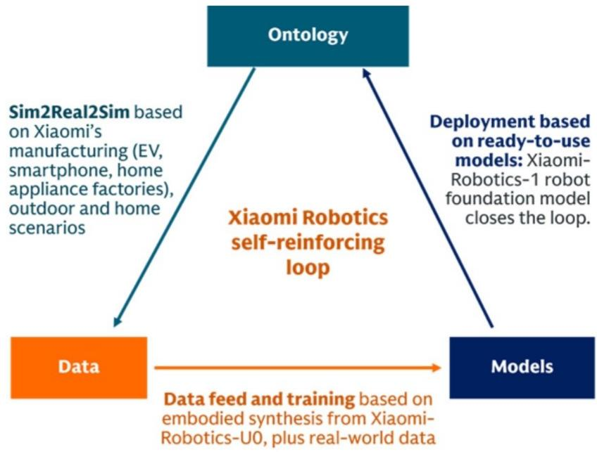
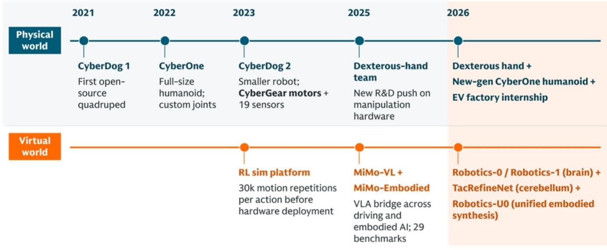
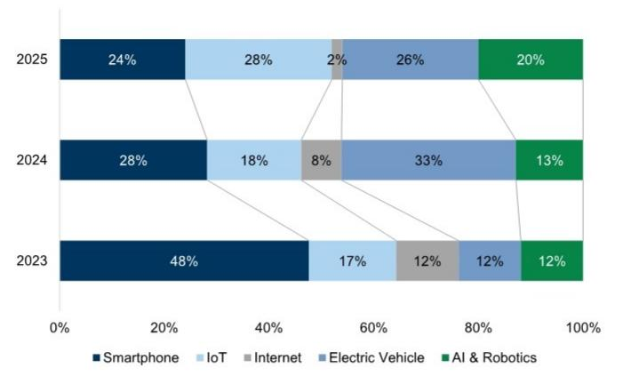
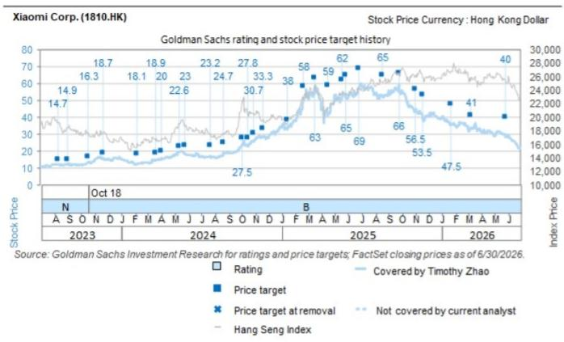

# Xiaomi Corp. (1810.HK)

Xiaomi Robotics: Integrating Hardware Ontologies, Data, and Models to Scale up

## What's new

We continue to see catalysts in EV and AI playing out in 3Q26 as we outlined in prior notes (Setting the scene for a catalyst-rich 3Q on Jun 24 and Sharpening the scene on Jul 10). Xiaomi Robotics on Jul 13-15 announced several achievements:

1) Humanoid deployment: Xiaomi humanoids have improved the task success rate to 98% at self-tapping nut loading stations by Jul, from 90%+ in Mar when they were initially deployed, which is just 1pp behind experienced human workers. From July, humanoids have started taking on new logistics tasks such as sorting flexible center console side covers and folding returnable boxes with a 90% success rate, and achieved long-duration continuous operations with flexible workpieces for the first time. Despite the apparent gap in speed and volume, this places Xiaomi alongside global leaders (e.g. Figure AI) in deploying humanoids to active automotive production lines.

## 2) Embodied data/scene synthesis: Xiaomi-Robotics-U0, a

38B-parameter unified generative model, is designed to synthesize high-fidelity robot trajectories and physical interaction scenarios and mitigate the bottleneck of real-world data scarcity. The model uniquely unifies text-to-image generation, any-to-image editing, multi-view embodied scene generation, embodied transfer, and embodied video generation into a single architecture, allowing autoregressive scaling across modalities while preserving the geometric integrity and perspective consistency. As per Xiaomi, Robotics-U0 outperforms GPT-Image-2 in embodied scene generation and embodied transfer, and ranks No.1 on WorldArena, a unified benchmark for embodied world models evaluation.

## 3) Robot foundation model: Xiaomi-Robotics-1, a

Vision-Language-Action (VLA) foundation model designed for end-to-end physical execution, was released as the cognitive and

physical control layer. The model features large-scale pre-training involving 100k hours of real-world robot operation trajectories and 10k hours of cross-ontology post-training, which demonstrates a clean scaling behavior in VLM, and enables cross-ontology adaptation i.e. bipedal, quad, dual-arm, or wheeled systems. The model achieves state-of-the-art (SOTA) across multiple benchmarks (Exhibit 4), outperforming baseline open-source models such as Pi-0.5.

## Implications

Robotics: We see Xiaomi has completed the initial integration of its robotics framework across ontology/body, data and models, which may lead to a self-reinforcing loop (Exhibit 1) toward general-purpose industrial and domestic automation. We believe Xiaomi has clear advantages in deployment scenarios including its own manufacturing factories and a vast home AIoT ecosystem. Real-world deployment failures are analyzed and fed back into the scene generative model to synthesize similar edge-case scenarios; this synthetic data retrains the core foundation model, which is then redeployed to the physical hardware.

That said, we believe there remains a gap between Xiaomi and global leaders in real-world execution (e.g. Figure03 models deployed at BMW Group Plant Spartanburg demonstrated fast speed for similar tasks) and model capabilities (e.g. with closed-source models such as Physical Intelligence's Pi-0.7, Figure's Helix 02, Optimus, and Gemini Robotics 1.5). Meanwhile, Xiaomi has not disclosed detailed architecture, such as cost structure, performance parameters, etc.

AI monetization: As mentioned in our prior note, physical intelligence including embodied AI as one of the three monetization paths within Xiaomi's AI strategy. We expect Xiaomi Robotics to focus on more structured to-B commercial scenarios over the next 3-5 years, e.g. massive humanoid deployment at Xiaomi's factories (smart EV, smartphone and home appliance) and its partner factories, which resembles Tesla's strategy for Optimus in our view.

Valuation: Post +24% share price performance QTD (vs. +3% for HSTECH) partially thanks to favorable flow, the current market cap implies 1) 15x 2026E P/E or 14x 12m-fwd P/E on Xiaomi core ex. smart EV, AI and other new initiatives; 2) 1.3x 2026E P/S on smart EV (vs. 0.75x as of Jun-end) driven by stronger sentiment on the upcoming SkyNomad launch, compared to 0.8x average P/S multiple of its domestic peers (BYD, Li Auto, XPeng and NIO); we believe there remains valuation upside for Xiaomi EV considering the faster revenue growth (GSe Xiaomi EV revenue 30%+ yoy in 2026E/27E vs. peer average mid-teen %), as well as potentially improved visibility into 2027E sales post the SkyNomad launch over the next month or so; 3) 0 value on AI, robotics and other new initiatives. 3Q26 may provide a potential turnaround opportunity from both narrative and financial perspectives, in our view.

Exhibit 1: We see Xiaomi has completed the initial integration of its robotics framework across ontology, data and models

  
Source: GS Global Investment Research

Exhibit 2: Xiaomi has entered the robotics industry since 2021  
Xiaomi Robotics milestones in 2026 by year

## Xiaomi Robotics milestones

2026 is the inflection point: Humanoids/dexterous hands, synthetic-data engines and robot foundation model start reinforcing each other

  
Source: Company data, Data compiled by GS Global Investment Research

## Exhibit 3: Xiaomi Robotics has achieved early-stage integration of hardware ontology, data and models. Xiaomi Robotics milestones in 2026 by month

## Xiaomi Robotics milestones

2026 month-by-month: Integration of hardware ontology, data and models  
  
Source: Company data, Data compiled by GS Global Investment Research

Exhibit 4: Xiaomi-Robotics-1 achieves SOTA across multiple benchmarks e.g. RoboCasa and RoboDojo

<table><tr><td colspan="5">RoboCasa365</td><td colspan="5">RoboDojo-Sim</td></tr><tr><td>Rank</td><td>Company/Institute</td><td>Model</td><td>Release date</td><td>Score</td><td>Rank</td><td>Company/Institute</td><td>Model</td><td>Release date</td><td>Score</td></tr><tr><td>1</td><td>Xiaomi</td><td>Xiaomi-Robotics-1</td><td>Jul-26</td><td>57.4</td><td>1</td><td>Xiaomi</td><td>Xiaomi-Robotics-1</td><td>Jul-26</td><td>20.1</td></tr><tr><td>2</td><td>Alibaba</td><td>ABot-M0.6</td><td>Feb-26</td><td>46.6</td><td>2</td><td>Tencent</td><td>Hy-Embodied-0.5-VLA</td><td>Jun-26</td><td>13.1</td></tr><tr><td>3</td><td>Alibaba</td><td>ABot-M0.5</td><td>Feb-26</td><td>40.3</td><td>3</td><td>HKUST &amp; THU</td><td>Spatial Forcing</td><td>Oct-25</td><td>12.4</td></tr><tr><td>4</td><td>RLWRLD</td><td>RLDX-1</td><td>May-26</td><td>36.0</td><td>4</td><td>Physical Intelligence</td><td>π0.5</td><td>Apr-25</td><td>11.4</td></tr><tr><td>5</td><td>World Agents</td><td>WorldDreamer</td><td>Jun-26</td><td>35.3</td><td>5</td><td>AIR &amp; THU</td><td>X-VLA</td><td>Oct-25</td><td>10.1</td></tr><tr><td>6</td><td>Nvidia</td><td>GR00T N1.5</td><td>Mar-25</td><td>23.9</td><td>6</td><td>THU, PKU &amp; Xiaomi</td><td>X-WAM</td><td>May-26</td><td>7.7</td></tr><tr><td>7</td><td>Nvidia</td><td>GR00T N1.6</td><td>Mar-25</td><td>21.9</td><td>7</td><td>Xiaomi</td><td>Xiaomi-Robotics-0</td><td>Feb-26</td><td>6.9</td></tr><tr><td>8</td><td>GigaWorld</td><td>GigaWorld-Policy 0.1</td><td>Mar-26</td><td>20.7</td><td>8</td><td>starVLA &amp; HKUST</td><td>StarVLA</td><td>Apr-26</td><td>6.4</td></tr><tr><td>9</td><td>Physical Intelligence</td><td>π0.5</td><td>Apr-25</td><td>16.9</td><td>9</td><td>GigaWorld</td><td>GigaWorld-Policy 0</td><td>Dec-25</td><td>6.2</td></tr><tr><td>10</td><td>Physical Intelligence</td><td>π0</td><td>Oct-24</td><td>14.8</td><td>10</td><td>Galaxea</td><td>GalaxeaVLA (G0)</td><td>Sep-25</td><td>5.8</td></tr></table>

Source: Company data, Data compiled by GS Global Investment Research

Exhibit 5: Analyst questions at earnings calls have being shifting away from smartphone to EV and new initiatives

  
Source: AlphaSense, Data compiled by GS Global Investment Research

## Research Thesis - Xiaomi Corp.

We see Xiaomi, which is the world's #3 smartphone brand and leading consumer AIoT/NEV platform, as still in the early stages of a multi-year ecosystem expansion against the backdrop of its “Human x Car x Home” strategy. In the longer term, we believe Xiaomi’s robust balance sheet, strong capabilities in ecosystem integration, and cost advantages owing to scale and deep involvement in the EV supply chain will increase its competitiveness and appeal in EVs, and that Xiaomi is well positioned to build one of the largest consumer physical intelligence ecosystems globally leveraging its interconnected consumer terminals.

## Price Target Risks and Methodology - Xiaomi Corp.

Our 12-month target price of HK\$40, based on a SOTP valuation methodology: 1) 16x target 12m-fwd EV/NOPAT on Xiaomi core; 2) DCF-based valuation for Xiaomi EV of US\$42bn (12% WACC and 3% TGR); 3) a 10% holdco discount. Key downside risks: 1) More intense competition and weaker market share gains within the global smartphone industry. 2) Higher GPM pressure on the smartphone/EV business. 3) Below-expected execution on Xiaomi brand premiumization and the EV business. 4) Intensifying geopolitical risks and regulatory uncertainties. 5) Softer macro environment and weaker smartphone/IoT demand. 6) FX fluctuation.

## Disclosure Appendix

## Reg AC

I, Timothy Zhao, hereby certify that all of the views expressed in this report accurately reflect my personal views about the subject company or companies and its or their securities. I also certify that no part of my compensation was, is or will be, directly or indirectly, related to the specific recommendations or views expressed in this report.

Unless otherwise stated, the individuals listed on the cover page of this report are analysts in GS' Global Investment Research division.

Contributing Authors: Timothy Zhao GS (Asia) L.L.C., Ronald Keung, CFA GS (Asia) L.L.C., Eunice Liu GS (Asia) L.L.C..

Unless otherwise stated, the individuals listed in the Contributing Authors disclosure of this report are analysts in GS' Global Investment Research division.

## GS Factor Profile

The GS Factor Profile provides investment context for a stock by comparing key attributes to the market (i.e. our universe of rated stocks) and its sector peers. The four key attributes depicted are: Growth, Financial Returns, Multiple (e.g. valuation) and Integrated (a composite of Growth, Financial Returns and Multiple). Growth, Financial Returns and Multiple are calculated by using normalized ranks for specific metrics for each stock. The normalized ranks for the metrics are then averaged and converted into percentiles for the relevant attribute. The precise calculation of each metric may vary depending on the fiscal year, industry and region, but the standard approach is as follows:

Growth is based on a stock's forward-looking sales growth, EBITDA growth and EPS growth (for financial stocks, only EPS and sales growth), with a higher percentile indicating a higher growth company. Financial Returns is based on a stock's forward-looking ROE, ROCE and CROCI (for financial stocks, only ROE), with a higher percentile indicating a company with higher financial returns. Multiple is based on a stock's forward-looking P/E, P/B, price/dividend (P/D), EV/EBITDA, EV/FCF and EV/Debt Adjusted Cash Flow (DACF) (for financial stocks, only P/E, P/B and P/D), with a higher percentile indicating a stock trading at a higher multiple. The Integrated percentile is calculated as the average of the Growth percentile, Financial Returns percentile and (100% - Multiple percentile).

Financial Returns and Multiple use the GS analyst forecasts at the fiscal year-end at least three quarters in the future. Growth uses inputs for the fiscal year at least seven quarters in the future compared with the year at least three quarters in the future (on a per-share basis for all metrics).

For a more detailed description of how we calculate the GS Factor Profile, please contact your GS representative.

## M&A Rank

Across our global coverage, we examine stocks using an M&A framework, considering both qualitative factors and quantitative factors (which may vary across sectors and regions) to incorporate the potential that certain companies could be acquired. We then assign a M&A rank as a means of scoring companies under our rated coverage from 1 to 3, with 1 representing high (30%-50%) probability of the company becoming an acquisition target, 2 representing medium (15%-30%) probability and 3 representing low (0%-15%) probability. For companies ranked 1 or 2, in line with our standard departmental guidelines we incorporate an M&A component into our target price. M&A rank of 3 is considered immaterial and therefore does not factor into our price target, and may or may not be discussed in research.

## Quantum

Quantum is GS' proprietary database providing access to detailed financial statement histories, forecasts and ratios. It can be used for in-depth analysis of a single company, or to make comparisons between companies in different sectors and markets.

## Disclosures

The rating(s) for Xiaomi Corp. is/are relative to the other companies in its/their coverage universe: Autohome Inc. (ADR), Autohome Inc. (H), Beijing Sinnet Technology Co Ltd., East Buy, GDS Holdings (ADR), GDS Holdings (H), KE Holdings (ADR), KE Holdings (H), Kanzhun Ltd. (ADR), Kanzhun Ltd. (H), Kingsoft Cloud, Ming Yuan Cloud, New Oriental Education & Technology (ADR), New Oriental Education & Technology (H), Offcn Education Technology, Range Intelligent, SUNeVision Holdings, Shanghai Athub, TAL Education Group, Tuhu Car Inc., Tuya, VNET Group, Weibo Corp. (ADR), Weibo Corp. (H), Weimob, Xiaomi Corp.

## Company-specific regulatory disclosures

The following disclosures relate to relationships between The GS Group, Inc. (with its affiliates, “GS”) and companies covered by GS Global Investment Research and referred to in this research.

GS has received compensation for investment banking services in the past 12 months: Xiaomi Corp. (HK\$27.50)

GS expects to receive or intends to seek compensation for investment banking services in the next 3 months: Xiaomi Corp. (HK\$27.50)

GS has received compensation for non-investment banking services during the past 12 months: Xiaomi Corp. (HK\$27.50)

GS had an investment banking services client relationship during the past 12 months with: Xiaomi Corp. (HK\$27.50)

GS had a non-investment banking securities-related services client relationship during the past 12 months with: Xiaomi Corp. (HK\$27.50)

GS had a non-securities services client relationship during the past 12 months with: Xiaomi Corp. (HK\$27.50)

GS makes a market in the securities or derivatives thereof: Xiaomi Corp. (HK\$27.50)

## Distribution of ratings/investment banking relationships

GS Investment Research global Equity coverage universe

<table><tr><td rowspan="2"></td><td colspan="3">Rating Distribution</td><td colspan="3">Investment Banking Relationships</td></tr><tr><td>Buy</td><td>Hold</td><td>Sell</td><td>Buy</td><td>Hold</td><td>Sell</td></tr><tr><td>Global</td><td>50%</td><td>34%</td><td>16%</td><td>65%</td><td>59%</td><td>43%</td></tr></table>

As of July 1, 2026, GS Global Investment Research had investment ratings on 3,104 equity securities. GS assigns stocks as Buys and Sells on various regional Investment Lists; stocks not so assigned are deemed Neutral. Such assignments equate to Buy, Hold and Sell for the purposes of the above disclosure required by the FINRA Rules. See ‘Ratings, Coverage universe and related definitions’ below. The Investment Banking Relationships chart reflects the percentage of subject companies within each rating category for whom GS has provided investment banking services within the previous twelve months.

## Price target and rating history chart(s)

  
The price targets shown should be considered in the context of all prior published GS, which may or may not have included price targets, as well as developments relating to the company, its industry and financial markets.

## Target price history table(s)   Xiaomi Corp. (1810.HK)

<table><tr><td>Date of report</td><td>Target price (HK$)</td><td>Closing price (HK$)</td></tr><tr><td>26-May-26</td><td>40.00</td><td>29.76</td></tr><tr><td>09-Mar-26</td><td>41.00</td><td>33.68</td></tr><tr><td>23-Jan-26</td><td>47.50</td><td>36.24</td></tr><tr><td>18-Nov-25</td><td>53.50</td><td>40.78</td></tr><tr><td>01-Nov-25</td><td>56.50</td><td>43.20</td></tr><tr><td>25-Sep-25</td><td>66.00</td><td>59.45</td></tr><tr><td>19-Aug-25</td><td>65.00</td><td>52.40</td></tr><tr><td>26-Jun-25</td><td>69.00</td><td>56.90</td></tr><tr><td>27-May-25</td><td>65.00</td><td>51.55</td></tr><tr><td>18-May-25</td><td>62.00</td><td>51.00</td></tr><tr><td>16-Apr-25</td><td>59.00</td><td>41.25</td></tr><tr><td>18-Mar-25</td><td>63.00</td><td>57.65</td></tr><tr><td>20-Feb-25</td><td>58.00</td><td>49.15</td></tr><tr><td>14-Jan-25</td><td>38.00</td><td>33.75</td></tr><tr><td>18-Nov-24</td><td>33.30</td><td>28.80</td></tr><tr><td>29-Oct-24</td><td>30.70</td><td>25.85</td></tr><tr><td>15-Oct-24</td><td>27.80</td><td>23.00</td></tr><tr><td>03-Oct-24</td><td>27.50</td><td>24.05</td></tr><tr><td>21-Aug-24</td><td>24.70</td><td>17.52</td></tr><tr><td>21-Jul-24</td><td>23.20</td><td>16.52</td></tr><tr><td>24-May-24</td><td>23.00</td><td>18.30</td></tr><tr><td>12-May-24</td><td>22.60</td><td>19.40</td></tr><tr><td>01-Apr-24</td><td>20.00</td><td>14.94</td></tr><tr><td>19-Mar-24</td><td>18.90</td><td>14.86</td></tr><tr><td>06-Feb-24</td><td>18.10</td><td>12.90</td></tr><tr><td>20-Nov-23</td><td>18.70</td><td>16.18</td></tr><tr><td>18-Oct-23</td><td>16.30</td><td>13.18</td></tr><tr><td>31-Aug-23</td><td>14.90</td><td>12.36</td></tr><tr><td>09-Aug-23</td><td>14.70</td><td>12.14</td></tr></table>

Price targets shown in table(s) are unadjusted for corporate actions.

## Regulatory disclosures

## Disclosures required by United States laws and regulations

See company-specific regulatory disclosures above for any of the following disclosures required as to companies referred to in this report: manager or co-manager in a pending transaction; 1% or other ownership; compensation for certain services; types of client relationships; managed/co-managed public offerings in prior periods; directorships; for equity securities, market making and/or specialist role. GS trades or may trade as a principal in debt securities (or in related derivatives) of issuers discussed in this report.

The following are additional required disclosures: Ownership and material conflicts of interest: GS policy prohibits its analysts, professionals reporting to analysts and members of their households from owning securities of any company in the analyst's area of coverage. Analyst compensation: Analysts are paid in part based on the profitability of GS, which includes investment banking revenues. Analyst as officer or director: GS policy generally prohibits its analysts, persons reporting to analysts or members of their households from serving as an officer, director or advisor of any company in the analyst's area of coverage. Non-U.S. Analysts: Non-U.S. analysts may not be associated persons of GS & Co. LLC and therefore may not be subject to FINRA Rule 2241 or FINRA Rule 2242 restrictions on communications with a subject company, public appearances and trading in securities covered by the analysts.

## Additional disclosures required under the laws and regulations of jurisdictions other than the United States

The following disclosures are those required by the jurisdiction indicated, except to the extent already made above pursuant to United States laws and regulations. Australia: GS Australia Pty Ltd and its affiliates are not authorised deposit-taking institutions (as that term is defined in the Banking Act 1959 (Cth)) in Australia and do not provide banking services, nor carry on a banking business, in Australia. This research, and any access to it, is intended only for “wholesale clients” within the meaning of the Australian Corporations Act, unless otherwise agreed by GS. In producing research reports, members of Global Investment Research of GS Australia may attend site visits and other meetings hosted by the companies and other entities which are the subject of its research reports. In some instances the costs of such site visits or meetings may be met in part or in whole by the issuers concerned if GS Australia considers it is appropriate and reasonable in the specific circumstances relating to the site visit or meeting. To the extent that the contents of this document contains any financial product advice, it is general advice only and has been prepared by GS without taking into account a client’s objectives, financial situation or needs. A client should, before acting on any such advice, consider the appropriateness of the advice having regard to the client’s own objectives, financial situation and needs. A copy of certain GS Australia and New Zealand disclosure of interests and a copy of GS’ Australian Sell-Side Research Independence Policy Statement are available at: https://www.goldmansachs.com/disclosures/australia-new-zealand/index.html. Brazil: Disclosure information in relation to CVM Resolution n. 20 is available at https://www.gs.com/worldwide/brazil/area/gir/index.html. Where applicable, the Brazil-registered analyst primarily responsible for the content of this research report, as defined in Article 20 of CVM Resolution n. 20, is the first author named at the beginning of this report, unless indicated otherwise at the end of the text. Canada: This information is being provided to you for information purposes only and is not, and under no circumstances should be construed as, an advertisement, offering or solicitation by GS & Co. LLC for purchasers of securities in Canada to trade in any Canadian security. GS & Co. LLC is not registered as a dealer in any jurisdiction in Canada under applicable Canadian securities laws and generally is not permitted to trade in Canadian securities and may be prohibited from selling certain securities and products in certain jurisdictions in Canada. If you wish to trade in any Canadian securities or other products in Canada please contact GS Canada Inc., an affiliate of The GS Group Inc., or another registered Canadian dealer. Hong Kong: Further information on the securities of covered companies referred to in this research may be obtained on request from GS (Asia) L.L.C. India: Further information on the subject company or companies referred to in this research may be obtained from GS (India) Securities Private Limited, Research Analyst – SEBI Registration Number INH000001493, 10th Floor, Ascent-Worli, Sudam Kalu Ahire Marg, Worli, Mumbai-400 025, India, Corporate Identity Number U74140MH2006FTC160634, Phone +91 22 6616 9000, Fax +91 22 6616 9001. GS may beneficially own 1% or more of the securities (as such term is defined in clause 2 (h) the Indian Securities Contracts (Regulation) Act, 1956) of the subject company or companies referred to in this research report. Registration granted by SEBI and certification from NISM in no way guarantee performance of the intermediary or provide any assurance of returns to investors. GS (India) Securities Private Limited compliance officer and investor grievance contact details, a copy of the annual compliance audit report and other relevant information and disclosures can be found at this link:

https://www.goldmansachs.com/worldwide/india/research-analyst. Japan: See below. Korea: This research, and any access to it, is intended only for “professional investors” within the meaning of the Financial Services and Capital Markets Act, unless otherwise agreed by GS. Further information on the subject company or companies referred to in this research may be obtained from GS (Asia) L.L.C., Seoul Branch. New Zealand: GS New Zealand Limited and its affiliates are neither “registered banks” nor “deposit takers” (as defined in the Reserve Bank of New Zealand Act 1989) in New Zealand. This research, and any access to it, is intended for “wholesale clients” (as defined in the Financial Advisers Act 2008) unless otherwise agreed by GS. A copy of certain GS Australia and New Zealand disclosure of interests is available at: https://www.goldmansachs.com/disclosures/australia-new-zealand/index.html. Russia: Research reports distributed in the Russian Federation are not advertising as defined in the Russian legislation, but are information and analysis not having product promotion as their main purpose and do not provide appraisal within the meaning of the Russian legislation on appraisal activity. Research reports do not constitute a personalized investment recommendation as defined in Russian laws and regulations, are not addressed to a specific client, and are prepared without analyzing the financial circumstances, investment profiles or risk profiles of clients. GS assumes no responsibility for any investment decisions that may be taken by a client or any other person based on this research report. Singapore: GS (Singapore) Pte. (Company Number: 198602165W), which is regulated by the Monetary Authority of Singapore, accepts legal responsibility for this research, and should be contacted with respect to any matters arising from, or in connection with, this research. Taiwan: This material is for reference only and must not be reprinted without permission. Investors should carefully consider their own investment risk. Investment results are the responsibility of the individual investor. United Kingdom: Persons who would be categorized as retail clients in the United Kingdom, as such term is defined in the rules of the Financial Conduct Authority, should read this research in conjunction with prior GS on the covered companies referred to herein and should refer to the risk warnings that have been sent to them by GS International. A copy of these risks warnings, and a glossary of certain financial terms used in this report, are available from GS International on request.

European Union and United Kingdom: Disclosure information in relation to Article 6 (2) of the European Commission Delegated Regulation (EU) (2016/958) supplementing Regulation (EU) No 596/2014 of the European Parliament and of the Council (including as that Delegated Regulation is implemented into United Kingdom domestic law and regulation following the United Kingdom's departure from the European Union and the European Economic Area) with regard to regulatory technical standards for the technical arrangements for objective presentation of investment recommendations or other information recommending or suggesting an investment strategy and for disclosure of particular interests or indications of conflicts of interest is available at https://www.gs.com/disclosures/europeanpolicy.html which states the European Policy for Managing Conflicts of Interest in Connection with Investment Research.

Japan: GS Japan Co., Ltd. is a Financial Instrument Dealer registered with the Kanto Financial Bureau under registration number Kinsho 69, and a member of Japan Securities Dealers Association, Financial Futures Association of Japan Type II Financial Instruments Firms Association, and Investment Management Association of Japan. Sales and purchase of equities are subject to commission pre-determined with clients plus consumption tax. See company-specific disclosures as to any applicable disclosures required by Japanese stock exchanges, the Japanese Securities Dealers Association or the Japanese Securities Finance Company.

## Ratings, coverage universe and related definitions

Buy (B), Neutral (N), Sell (S) Analysts recommend stocks as Buys or Sells for inclusion on various regional Investment Lists. Being assigned a Buy or Sell on an Investment List is determined by a stock's total return potential relative to its coverage universe. Any stock not assigned as a Buy or a Sell on an Investment List with an active rating (i.e., a stock that is not Rating Suspended, Not Rated, Early-Stage Biotech, Coverage Suspended or Not Covered), is deemed Neutral. Each region manages Regional Conviction Lists, which are selected from Buy rated stocks on the respective region's Investment Lists and represent investment recommendations focused on the size of the total return potential and/or the likelihood of the realization of the return across their respective areas of coverage. The addition or removal of stocks from such Conviction Lists are managed by the Investment Review Committee or other designated committee in each respective region and do not represent a change in the analysts' investment rating for such stocks.

Total return potential represents the upside or downside differential between the current share price and the price target, including all paid or anticipated dividends, expected during the time horizon associated with the price target. Price targets are required for all covered stocks. The total return potential, price target and associated time horizon are stated in each report adding or reiterating an Investment List membership.

Coverage Universe: A list of all stocks in each coverage universe is available by primary analyst, stock and coverage universe at https://www.gs.com/research/hedge.html.

Not Rated (NR). The investment rating, target price and earnings estimates (where relevant) are removed pursuant to GS policy when GS is acting in an advisory capacity in a merger or in a strategic transaction involving this company, when there are legal, regulatory or policy constraints due to GS' involvement in a transaction, and in certain other circumstances. Early-Stage Biotech (ES). An investment rating and a target price are not assigned pursuant to GS policy when this company has neither a drug, treatment or medical device that has passed a Phase II clinical trial nor a license to distribute a post-Phase II drug, treatment or medical device. Rating Suspended (RS). GS has suspended the investment rating and price target for this stock, because there is not a sufficient fundamental basis for determining an investment rating or target price. The previous investment rating and target price, if any, are no longer in effect for this stock and should not be relied upon. Coverage Suspended (CS). GS has suspended coverage of this company. Not Covered (NC). GS does not cover this company.

## Global product; distributing entities

GS Global Investment Research produces and distributes research products for clients of GS on a global basis. Analysts based in GS offices around the world produce research on industries and companies, and research on macroeconomics, currencies, commodities and portfolio strategy. This research is disseminated in Australia by GS Australia Pty Ltd (ABN 21 006 797 897); in Brazil by GS do Brasil Corretora de Títulos e Valores Mobiliários S.A.; Public Communication Channel GS Brazil: 0800 727 5764 and / or contatogoldmanbrasil@gs.com. Available Weekdays (except holidays), from 9am to 6pm. Canal de Comunicação com o Público GS Brasil: 0800 727 5764 e/ou contatogoldmanbrasil@gs.com. Horário de funcionamento: segunda-feira à sexta-feira (exceto feriados), das 9h às 18h; in Canada by GS & Co. LLC; in Hong Kong by GS (Asia) L.L.C.; in India by GS (India) Securities Private Ltd.; in Japan by GS Japan Co., Ltd.; in the Republic of Korea by GS (Asia) L.L.C., Seoul Branch; in New Zealand by GS New Zealand Limited; in Russia by OOO GS; in Singapore by GS (Singapore) Pte. (Company Number: 198602165W); and in the United States of America by GS & Co. LLC. GS International has approved this research in connection with its distribution in the United Kingdom.

GS International (“GSI”), authorised by the Prudential Regulation Authority (“PRA”) and regulated by the Financial Conduct Authority (“FCA”) and the PRA, has approved this research in connection with its distribution in the United Kingdom.

European Economic Area: GS Bank Europe SE ("GSBE") is a credit institution incorporated in Germany and, within the Single Supervisory Mechanism, subject to direct prudential supervision by the European Central Bank and in other respects supervised by German Federal Financial Supervisory Authority (Bundesanstalt für Finanzdienstleistungsaufsicht, BaFin) and Deutsche Bundesbank and disseminates research within the European Economic Area.

## General disclosures

This research is for our clients only. Other than disclosures relating to GS, this research is based on current public information that we consider reliable, but we do not represent it is accurate or complete, and it should not be relied on as such. The information, opinions, estimates and forecasts contained herein are as of the date hereof and are subject to change without prior notification. We seek to update our research as appropriate, but various regulations may prevent us from doing so. Other than certain industry reports published on a periodic basis, the large majority of reports are published at irregular intervals as appropriate in the analyst's judgment.

GS conducts a global full-service, integrated investment banking, investment management, and brokerage business. We have
